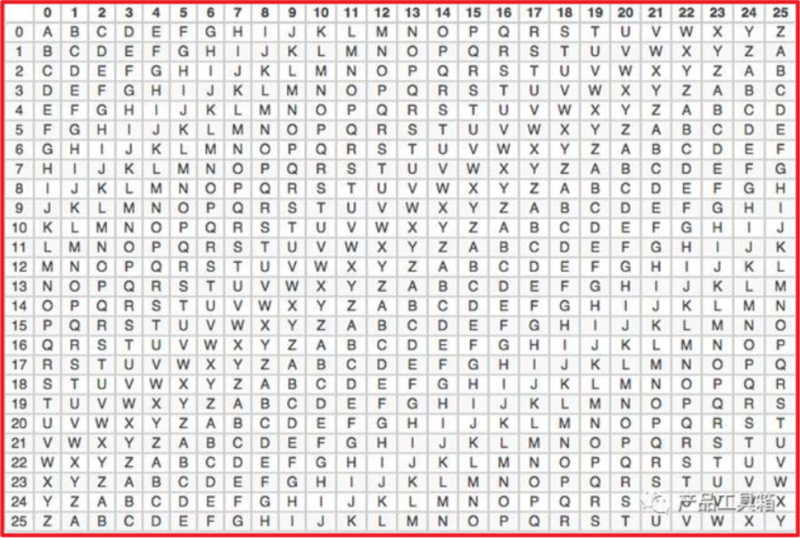
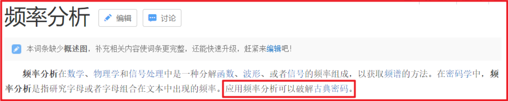
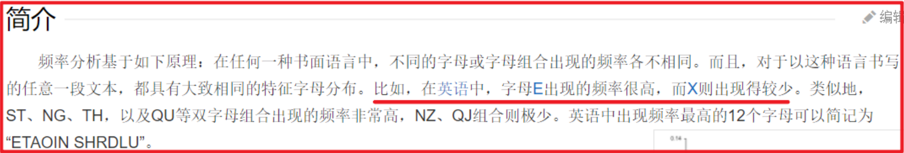
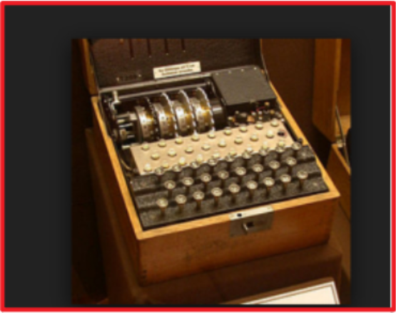

# 古典密码学

## 密码学基本概念

密码学是网络安全、信息安全、区块链等产品的基础，常见的非对称加密、对称加密、散列函数等，都属于密码学范畴。

## 古典密码学

### 替换法

替换法很好理解，就是 **用固定的信息将原文替换成无法直接阅读的密文信息**。

例如将 `b` 替换成 `w` ，`e` 替换成 `p` ，这样 `bee` 单词就变换成了 `wpp`，不知道替换规则的人就无法阅读出原文的含义。

替换法有 **单表替换** 和 **多表替换** 两种形式。

单表替换即只有一张原文密文对照表单，发送者和接收者用这张表单来加密解密。

多表替换即有多张原文密文对照表单，不同字母可以用不同表单的内容替换。

### 移位法

移位法就是 **将原文中的所有字母都在字母表上向后（或向前）按照一个固定数目进行偏移后得出密文**，典型的移位法应用有“恺撒密码”。

例如约定好向后移动 2 位 `（abcde - cdefg）`，这样 `bee` 单词就变换成了 `dgg` 。

同理替换法，移位法也可以采用多表移位的方式，典型的多表案例是“维尼吉亚密码”（又译维热纳尔密码），属于多表密码的一种形式。

### 古典密码破解方式

古典密码虽然很简单，但是在密码史上是使用的最久的加密方式，直到“概率论”的数学方法被发现，古典密码就被破解了。

英文单词中字母出现的频率是不同的，e 以 12.702% 的百分比占比最高，z 只占到 0.074%，感兴趣的可以去百科查字母频率详细统计数据。如果密文数量足够大，仅仅采用频度分析法就可以破解单表的替换法或移位法。

多表的替换法或移位法虽然难度高一些，但如果数据量足够大的话，也是可以破解的。以维尼吉亚密码算法为例，破解方法就是先找出密文中完全相同的字母串，猜测密钥长度，得到密钥长度后再把同组的密文放在一起，使用频率分析法破解。

## 近代密码学

古典密码的安全性受到了威胁，外加使用便利性较低，到了工业化时代，近现代密码被广泛应用。

恩尼格玛机是二战时期纳粹德国使用的加密机器，后被英国破译，参与破译的人员有被称为计算机科学之父、人工智能之父的图灵。

恩尼格玛机使用的加密方式本质上还是移位和替代，只不过因为密码表种类极多，破解难度高，同时加密解密机器化，使用便捷，因而在二战时期得以使用。

## 现代密码学

### 散列函数

散列函数，也称杂凑函数、摘要函数或哈希函数，**可将任意长度的消息经过运算，变成固定长度数值**，常见的有 `MD5`、`SHA-1`、`SHA256`，多应用在文件校验，数字签名中。

MD5 可以将任意长度的原文生成一个 128 位（16 字节）的哈希值

SHA-1 可以将任意长度的原文生成一个 160 位（20 字节）的哈希值

### 对称密码

对称密码 **应用了相同的加密密钥和解密密钥**。对称密码分为：序列密码 (流密码)，分组密码 (块密码) 两种。流密码是对信息流中的每一个元素（一个字母或一个比特）作为基本的处理单元进行加密，块密码是先对信息流分块，再对每一块分别加密。

例如原文为 1234567890，流加密即先对 1 进行加密，再对 2 进行加密，再对 3 进行加密…… 最后拼接成密文；块加密先分成不同的块，如 1234 成块，5678 成块，90XX(XX 为补位数字) 成块，再分别对不同块进行加密，最后拼接成密文。前文提到的古典密码学加密方法，都属于流加密。

### 非对称密码

对称密码的密钥安全极其重要，加密者和解密者需要提前协商密钥，并各自确保密钥的安全性，一但密钥泄露，即使算法是安全的也无法保障原文信息的私密性。

在实际的使用中，远程的提前协商密钥不容易实现，即使协商好，在远程传输过程中也容易被他人获取，因此非对称密钥此时就凸显出了优势。

非对称密码有两支密钥，公钥（publickey）和私钥（privatekey），加密和解密运算使用的密钥不同。**用公钥对原文进行加密后，需要由私钥进行解密**；**用私钥对原文进行加密后（此时一般称为签名），需要由公钥进行解密（此时一般称为验签）**。公钥可以公开的，大家使用公钥对信息进行加密，再发送给私钥的持有者，私钥持有者使用私钥对信息进行解密，获得信息原文。因为私钥只有单一人持有，因此不用担心被他人解密获取信息原文。
