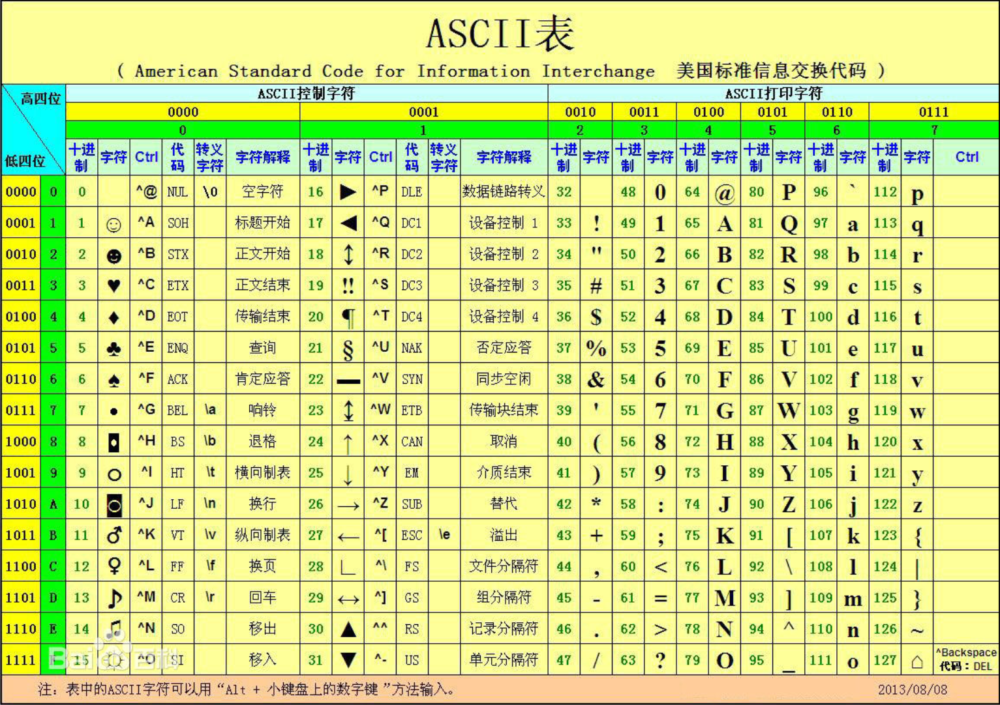

# ASCII 编码

## ASCII 编码

ASCII（American Standard Code for Information Interchange，美国信息交换标准代码）是基于拉丁字母的一套电脑编码系统，主要用于显示现代英语和其他西欧语言。它是现今最通用的单字节编码系统，并等同于国际标准 ISO/IEC 646。



## 字符转换成 ascii 码

```java
public class AsciiDemo {
    public static void main(String[] args) {
        char a = 'A';
        int b = a;
        // 打印 ascii 码
        System.out.println(b); // 65
    }
}
```

## 字符串转换成 ascii 码

```java
public class AsciiDemo {
    public static void main(String[] args) {
        String a = "AaZ";
        // 获取 ascii 码，需要把字符串转成字符
        char[] chars = a.toCharArray();
        for (char c : chars) {
            int asciiCode = c;
            System.out.println(asciiCode); // 65、97、90
        }
    }
}
```
