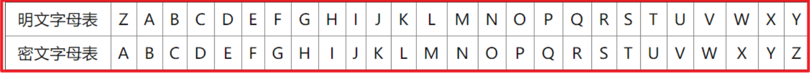
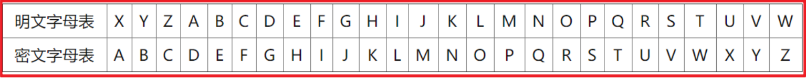
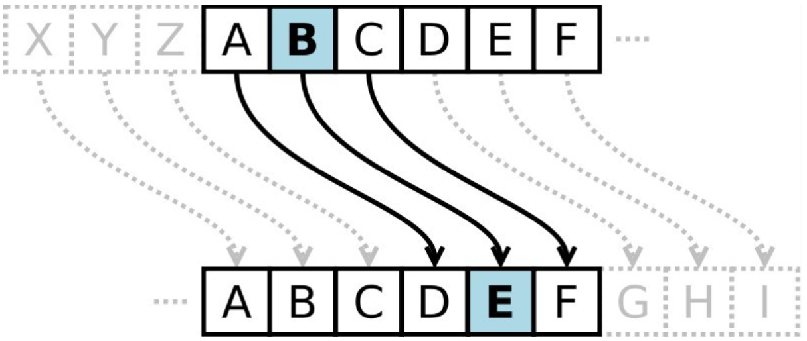

# 凯撒加密

## 中国古代加密

看一个小故事，看看古人如何加密和解密：

公元 683 年，唐中宗即位。随后，武则天废唐中宗，立第四子李旦为皇帝，但朝政大事均由她自己专断。

裴炎、徐敬业和骆宾王等人对此非常不满。徐敬业聚兵十万，在江苏扬州起兵。裴炎做内应，欲以拆字手段为其传递秘密信息。后因有人告密，裴炎被捕，未发出的密信落到武则天手中。这封密信上只有“青鹅”二字，群臣对此大惑不解。

武则天破解了“青鹅”的秘密：“青”字拆开来就是“十二月”，而“鹅”字拆开来就是“我自与”。密信的意思是让徐敬业、骆宾王等率兵于十二月进发，裴炎在内部接应。“青鹅”破译后，裴炎被杀。接着，武则天派兵击败了徐敬业和骆宾王。


## 外国古代加密

在密码学中，恺撒密码是一种最简单且最广为人知的加密技术。

凯撒密码最早由古罗马军事统帅盖乌斯 · 尤利乌斯 · 凯撒在军队中用来传递加密信息，故称凯撒密码。这是一种 ` 位移加密方式 `，只对 26 个字母进行位移替换加密，规则简单，容易破解。

下面是位移 1 次的对比：



将明文字母表向后移动 1 位，A 变成了 B，B 变成了 C……，Z 变成了 A。

同理，若将明文字母表向后移动 3 位：



则 A 变成了 D，B 变成了 E……，Z 变成了 C。

字母表最多可以移动 25 位。凯撒密码的明文字母表向后或向前移动都是可以的，通常表述为向后移动，如果要向前移动 1 位，则等同于向后移动 25 位，位移选择为 25 即可。

它是一种替换加密的技术，明文中的所有字母都在字母表上向后（或向前）按照一个固定数目进行偏移后被替换成密文。

例如，当偏移量是 3 的时候，所有的字母 A 将被替换成 D，B 变成 E，以此类推。

这个加密方法是以恺撒的名字命名的，当年恺撒曾用此方法与其将军们进行联系。

恺撒密码通常被作为其他更复杂的加密方法中的一个步骤。



**简单来说就是当秘钥为 n，其中一个待加密字符 ch，加密之后的字符为 ch+n，当 ch+n 超过’z’时，回到’a’计数。**

## 凯撒加密和解密

```java
public class Caesar {
    public static void main(String[] args) {
        String old = "Hello Java";
        int key = 3;
        String s = encrypt(old, key);
        System.out.println("凯撒加密是：" + s);
        String s1 = decrypt(s, key);
        System.out.println("凯撒解密是：" + s1);
    }

    /**
     * 凯撒解密
     *
     * @param s
     * @param key
     * @return
     */
    public static String decrypt(String s, int key) {
        char[] chars = s.toCharArray();
        StringBuilder sb = new StringBuilder();
        for (char c : chars) {
            char c2 = (char) ((int) c - key);
            sb.append(c2);
        }
        return sb.toString();
    }

    /**
     * 凯撒加密
     *
     * @param old
     * @param key
     * @return
     */
    //ctrl+alt+m 抽取方法快捷键
    public static String encrypt(String old, int key) {
        char[] chars = old.toCharArray();
        StringBuilder sb = new StringBuilder();
        for (char c : chars) {
            char c2 = (char) ((int) c + key);
            sb.append(c2);
        }
        return sb.toString();
    }
}
```
