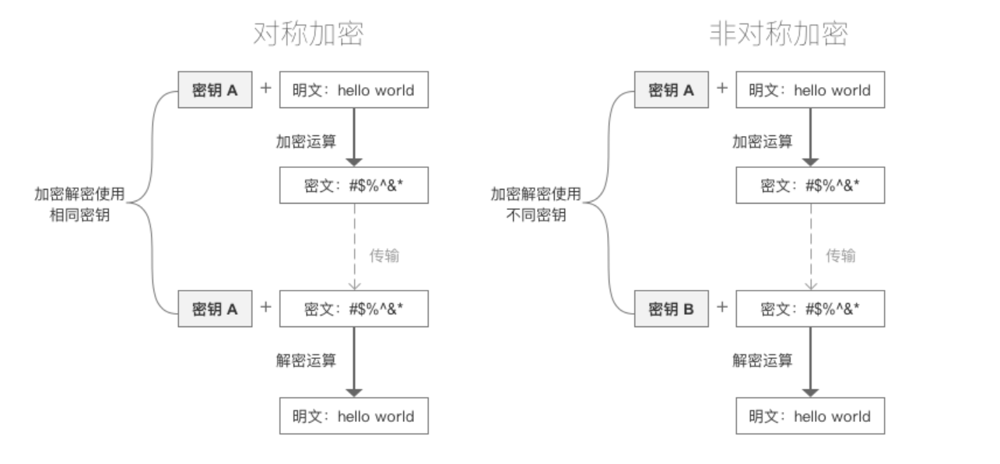

# 常见加密方式



## 对称加密

- 采用单钥密码系统的加密方法，` 同一个密钥可以同时用作信息的加密和解密 `，这种加密方法称为对称加密，也称为单密钥加密。

- 常见加密算法
  - DES : Data Encryption Standard，即数据加密标准，是一种使用密钥加密的块算法，1977 年被美国联邦政府的国家标准局确定为联邦资料处理标准（FIPS），并授权在非密级政府通信中使用，随后该算法在国际上广泛流传开来。
  - AES : Advanced Encryption Standard，高级加密标准 . 在密码学中又称 Rijndael 加密法，是美国联邦政府采用的一种区块加密标准。这个标准用来替代原先的 DES，已经被多方分析且广为全世界所使用。

- 特点
  - 加密速度快，可以加密大文件
  - 密文可逆，一旦密钥文件泄漏，就会导致数据暴露
  - 加密后编码表找不到对应字符，出现乱码
  - 一般结合 Base64 使用

## DES 加密解密

```java
public class Des {
    public static void main(String[] args) throws Exception {
        // 等待加密内容
        String value = "硅谷";
        // 密钥
        String key = "12345678";//key 一定要 8 位
        // 算法
        String algorithm = "DES";
        // 加密类型
        // 加密模式：ECB,CBC(需要向量)
        // 填充模式：NoPadding(不填充),PKCS5Padding(补足)
        //NoPadding 要求加密内容一定是 8 位的倍数
        String transformation = "DES/CBC/PKCS5Padding";
        String encode = desEncode(value, key, algorithm, transformation);
        System.out.println(encode);
        System.out.println(desDecode(encode, key, algorithm, transformation));
    }

    /**
     * des 加密
     *
     * @param value
     * @param key
     * @param algorithm
     * @param transformation
     * @return
     * @throws NoSuchAlgorithmException
     * @throws NoSuchPaddingException
     * @throws InvalidKeyException
     * @throws IllegalBlockSizeException
     * @throws BadPaddingException
     */
    private static String desEncode(String value, String key, String algorithm, String transformation) throws NoSuchAlgorithmException, NoSuchPaddingException, InvalidKeyException, IllegalBlockSizeException, BadPaddingException, InvalidAlgorithmParameterException {
        // 创建加密对象 jdk 自带 transformation: 参数表示使用什么类型加密
        Cipher cipher = Cipher.getInstance(transformation);
        // 创建加密规则
        // 第一个参数表示：密钥，key 的字节数组
        // 第二个参数表示：算法
        SecretKeySpec secretKeySpec = new SecretKeySpec(key.getBytes(), algorithm);

        //CBC 模式 iv 向量
        IvParameterSpec iv = new IvParameterSpec(key.getBytes());
        // 加密初始化
        // 第一个参数：表示模式，有加密模式和解密模式
        // 第二个参数：表示秘钥规则
        cipher.init(Cipher.ENCRYPT_MODE, secretKeySpec, iv);
        // 调用加密方法
        byte[] bytes = cipher.doFinal(value.getBytes(StandardCharsets.UTF_8));
        // 出现乱码的情况
        //System.out.println(new String(bytes));
        // 调用 base64 转码
        return Base64.encodeBase64String(bytes);
    }

    /**
     * des 解密
     *
     * @param value
     * @param key
     * @param algorithm
     * @param transformation
     * @return
     */
    private static String desDecode(String value, String key, String algorithm, String transformation) throws NoSuchPaddingException, NoSuchAlgorithmException, InvalidKeyException, IllegalBlockSizeException, BadPaddingException, InvalidAlgorithmParameterException {
        // 创建加密对象 jdk 自带 transformation: 参数表示使用什么类型加密
        Cipher cipher = Cipher.getInstance(transformation);
        SecretKeySpec secretKeySpec = new SecretKeySpec(key.getBytes(), algorithm);
        //CBC 模式 iv 向量
        IvParameterSpec iv = new IvParameterSpec(key.getBytes());
        cipher.init(Cipher.DECRYPT_MODE, secretKeySpec, iv);
        byte[] bytes = cipher.doFinal(Base64.decodeBase64(value));
        return new String(bytes);
    }
}
```

## Base64

```sh
Base64 是网络上最常见的用于传输 8Bit 字节码的可读性编码算法之一
可读性编码算法不是为了保护数据的安全性，而是为了可读性
可读性编码不改变信息内容，只改变信息内容的表现形式
所谓 Base64，即是说在编码过程中使用了 64 种字符：大写 A 到 Z、小写 a 到 z、数字 0 到 9、“+” 和 “/”
Base58 是 Bitcoin(比特币) 中使用的一种编码方式，主要用于产生 Bitcoin 的钱包地址
相比 Base64，Base58 不使用数字 "0"，字母大写 "O"，字母大写 "I"，和字母小写 "i"，以及 "+" 和 "/" 符号
```

## AES 加密解密

```java
public class Aes {
    public static void main(String[] args) throws Exception {
        // 等待加密内容
        String value = "硅谷";
        // 密钥
        String key = "1234567812345678";//key 一定要 8 位
        // 算法
        String algorithm = "AES";
        // 加密类型
        String transformation = "AES";
        String encode = aesEncode(value, key, algorithm, transformation);
        System.out.println(encode);
        System.out.println(aesDecode(encode, key, algorithm, transformation));
    }

    /**
     * des 加密
     *
     * @param value          原文
     * @param key            密钥
     * @param algorithm      算法
     * @param transformation 类型
     * @return
     * @throws NoSuchAlgorithmException
     * @throws NoSuchPaddingException
     * @throws InvalidKeyException
     * @throws IllegalBlockSizeException
     * @throws BadPaddingException
     */
    private static String aesEncode(String value, String key, String algorithm, String transformation) throws NoSuchAlgorithmException, NoSuchPaddingException, InvalidKeyException, IllegalBlockSizeException, BadPaddingException {
        // 创建加密对象 jdk 自带 transformation: 参数表示使用什么类型加密
        Cipher cipher = Cipher.getInstance(transformation);
        // 创建加密规则
        // 第一个参数表示：密钥，key 的字节数组
        // 第二个参数表示：算法
        SecretKeySpec secretKeySpec = new SecretKeySpec(key.getBytes(), algorithm);
        // 加密初始化
        // 第一个参数：表示模式，有加密模式和解密模式
        // 第二个参数：表示秘钥规则
        cipher.init(Cipher.ENCRYPT_MODE, secretKeySpec);
        // 调用加密方法
        byte[] bytes = cipher.doFinal(value.getBytes(StandardCharsets.UTF_8));
        // 出现乱码的情况
        //System.out.println(new String(bytes));
        // 调用 base64 转码
        return Base64.encodeBase64String(bytes);
    }

    /**
     * des 解密
     *
     * @param value
     * @param key
     * @param algorithm
     * @param transformation
     * @return
     */
    private static String aesDecode(String value, String key, String algorithm, String transformation) throws NoSuchPaddingException, NoSuchAlgorithmException, InvalidKeyException, IllegalBlockSizeException, BadPaddingException {
        // 创建加密对象 jdk 自带 transformation: 参数表示使用什么类型加密
        Cipher cipher = Cipher.getInstance(transformation);
        SecretKeySpec secretKeySpec = new SecretKeySpec(key.getBytes(), algorithm);
        cipher.init(Cipher.DECRYPT_MODE, secretKeySpec);
        byte[] bytes = new byte[0];
        bytes = cipher.doFinal(Base64.decodeBase64(value));
        return new String(bytes);
    }
}
```
