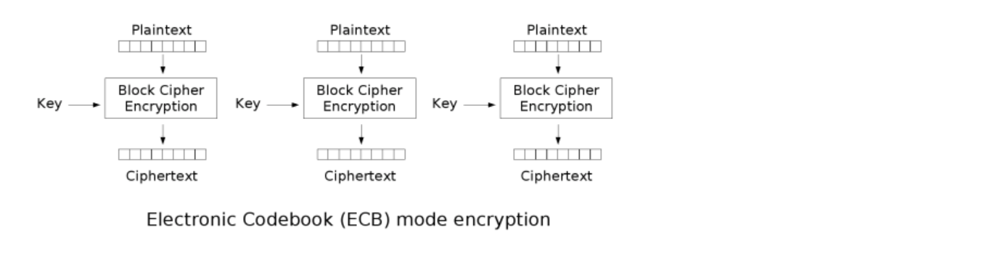
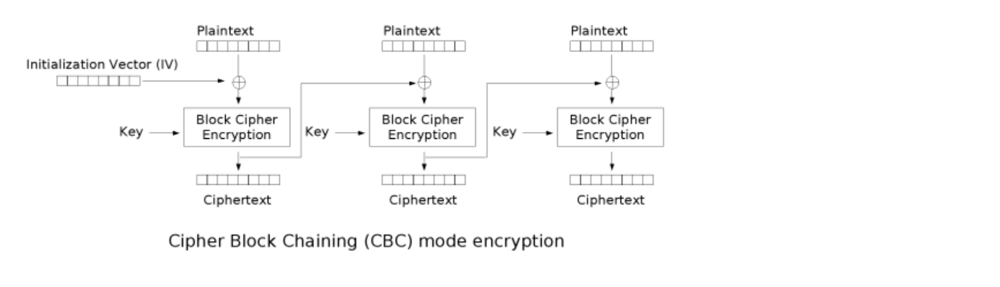

# 加密模式

## ECB

ECB : Electronic codebook, 电子密码本。需要加密的消息按照块密码的块大小被分为数个块，并对每个块进行独立加密。

- 优点 : 可以并行处理数据
- 缺点 : 同样的原文生成同样的密文，不能很好的保护数据

## CBC

CBC : Cipher-block chaining, 密码块链接。每个明文块先与前一个密文块进行异或后，再进行加密。在这种方法中，每个密文块都依赖于它前面的所有明文块

- 优点 : 同样的原文生成的密文不一样
- 缺点 : 串行处理数据
