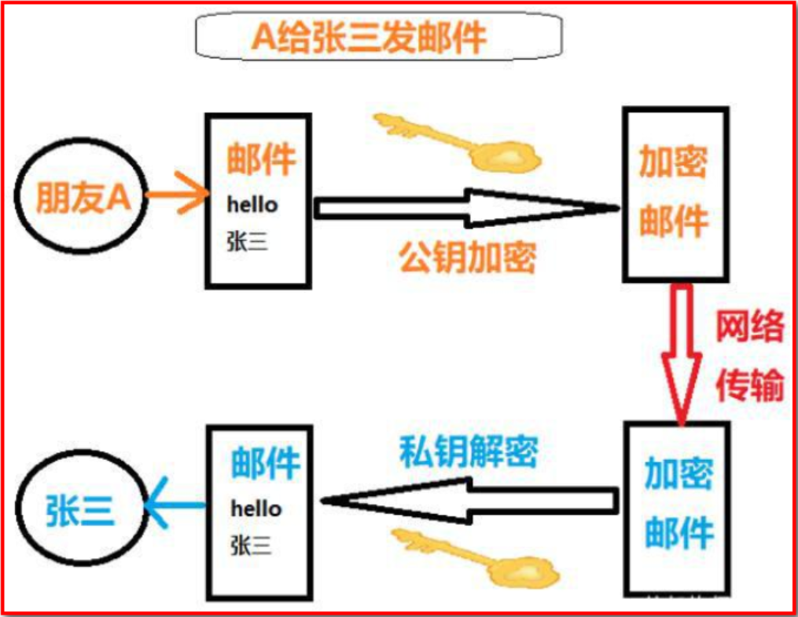
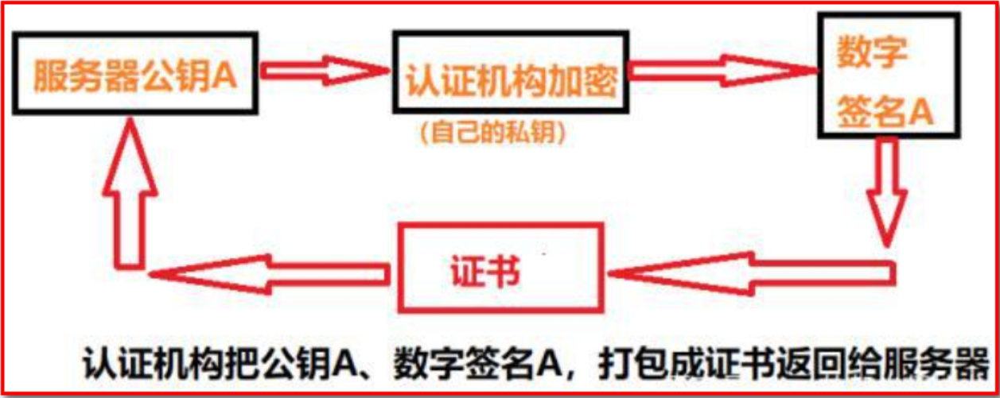
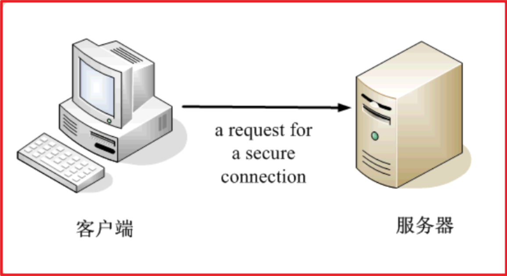
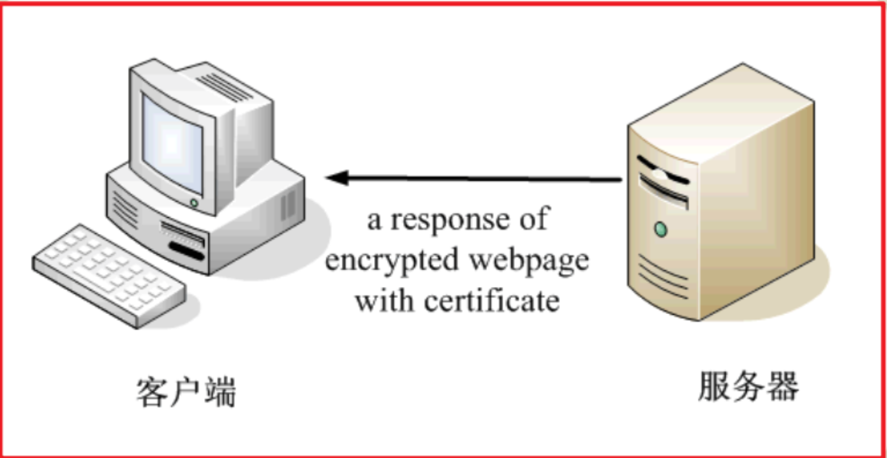
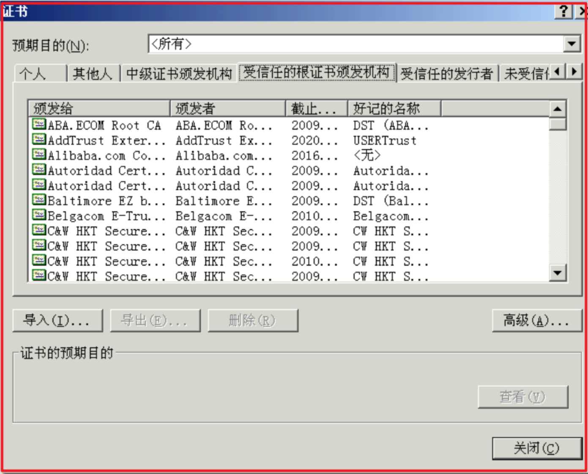
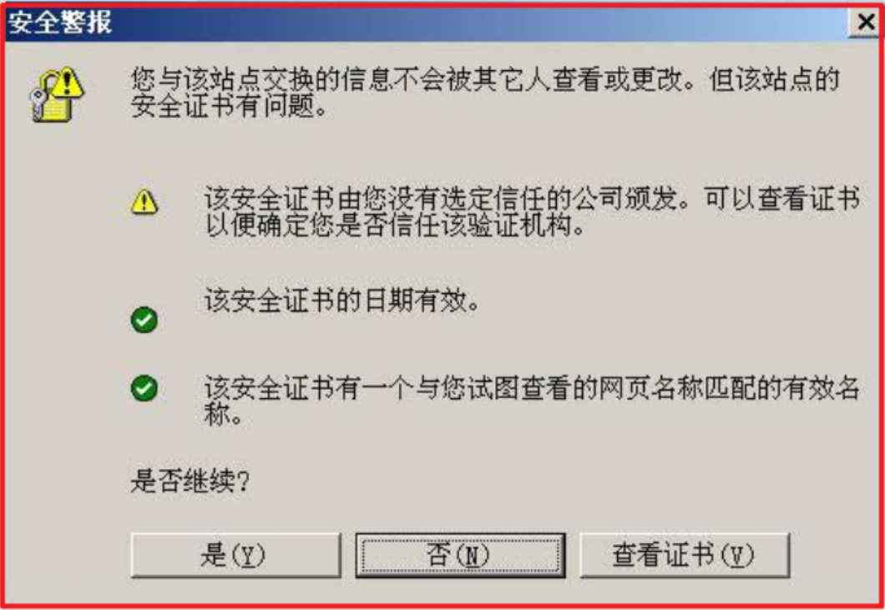
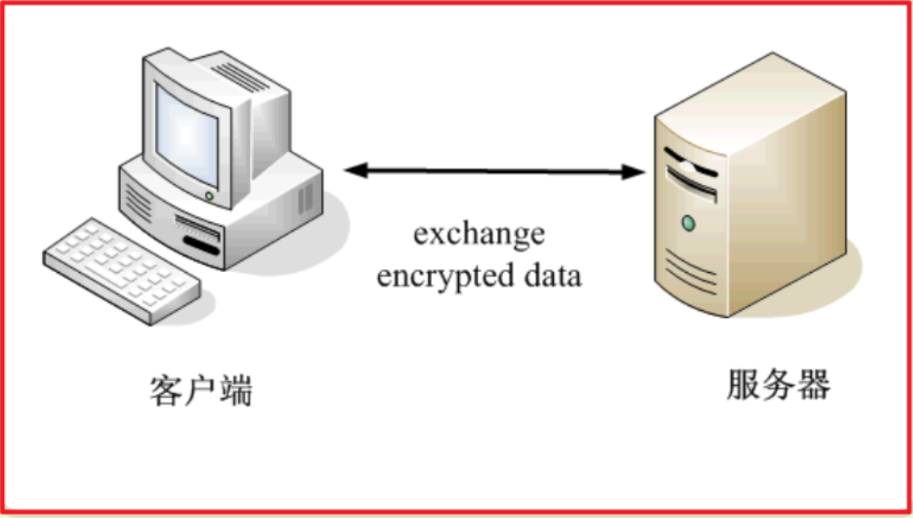

# 数字签名

数字签名（又称公钥数字签名）是只有信息的发送者才能产生的别人无法伪造的一段数字串，这段数字串同时也是对信息的发送者发送信息真实性的一个有效证明。它是一种类似写在纸上的普通的物理签名，但是使用了公钥加密领域的技术来实现的，用于鉴别数字信息的方法。一套数字签名通常定义两种互补的运算，一个用于签名，另一个用于验证。**数字签名是非对称密钥加密技术与数字摘要技术的应用。**

## 简单认识

相信我们都写过信，在写信的时候落款处总是要留下自己的名字，用来表示写信的人是谁。我们签的这个字就是生活中的签名：

而数字签名呢？其实也是同样的道理，他的含义是：在网络中传输数据时候，给数据添加一个数字签名，表示是谁发的数据，而且还能证明数据没有被篡改。

OK，数字签名的主要作用就是保证了数据的有效性（验证是谁发的）和完整性（证明信息没有被篡改）。下面我们就来好好地看一下他的底层实现原理是什么样子的。

## 基本原理

为了理解得清楚，我们通过案例一步一步来讲解。话说张三有俩好哥们 A、B。由于工作原因，张三和 AB 写邮件的时候为了安全都需要加密。于是张三想到了数字签名：

整个思路是这个样子的：

第一步：加密采用非对称加密，张三有三把钥匙，两把公钥，送给朋友。一把私钥留给自己。

第二步：A 或者 B 写邮件给张三：A 先用公钥对邮件加密，然后张三收到邮件之后使用私钥解密。

第三步：张三写邮件给 A 或者 B：

（1）张三写完邮件，先用 hash 函数生成邮件的摘要，附着在文章上面，这就完成了数字签名，然后张三再使用私钥加密。就可以把邮件发出去了。

（2）A 或者是 B 收到邮件之后，先把数字签名取下来，然后使用自己的公钥解密即可。这时候取下来的数字签名中的摘要若和张三的一致，那就认为是张三发来的，再对信件本身使用 Hash 函数，将得到的结果，与上一步得到的摘要进行对比。如果两者一致，就证明这封信未被修改过。

上面的流程我们使用一张图来演示一下：

首先把公钥送给朋友 A 和 B：



还有就是最后一个比较麻烦的，张三给 A 或者 B 发邮件：


## 数字证书

上面提到我们对签名进行验证时，需要用到公钥。如果公钥是伪造的，那我们无法验证数字签名了，也就根本不可能从数字签名确定对方的合法性了。这时候证书就闪亮登场了。

如果不理解证书的作用，我们可以举一个例子，比如说我们的毕业证书，任何公司都会承认。为什么会承认？因为那是国家发得，大家都信任国家。也就是说只要是国家的认证机构，我们都信任它是合法的。



## 网页加密

> 实例：https 协议，这个协议主要用于网页加密。

首先，客户端向服务器发出加密请求。



服务器用自己的私钥加密网页以后，连同本身的数字证书，一起发送给客户端。



客户端（浏览器）的“证书管理器”，有“受信任的根证书颁发机构”列表。客户端会根据这张列表，查看解开数字证书的公钥是否在列表之内。



如果数字证书记载的网址，与你正在浏览的网址不一致，就说明这张证书可能被冒用，浏览器会发出警告。


如果这张数字证书不是由受信任的机构颁发的，浏览器会发出另一种警告。



如果数字证书是可靠的，客户端就可以使用证书中的服务器公钥，对信息进行加密，然后与服务器交换加密信息。



## 代码实现

```java
package com.cryptography.cryptography.signature;


import com.sun.org.apache.xerces.internal.impl.dv.util.Base64;

import java.io.BufferedReader;
import java.io.FileReader;
import java.security.PrivateKey;
import java.security.PublicKey;
import java.security.Signature;
import java.util.Properties;

import static com.cryptography.cryptography.rsa.Rsa.getPrivateKey;
import static com.cryptography.cryptography.rsa.Rsa.getPublicKey;

/**
 * Created by Jinmunan
 * 2022/3/4
 * 14:59
 */
public class SignatureDemo {
    public static void main(String[] args) throws Exception {
        Properties properties = new Properties();
        BufferedReader br = new BufferedReader(new FileReader("Rsa.properties"));
        properties.load(br);
        // 获得公钥和私钥
        PrivateKey privateKey = getPrivateKey(properties.getProperty("privateKey"), "RSA");
        PublicKey publicKey = getPublicKey(properties.getProperty("publicKey"), "RSA");

        String key = "123";
        // 获取数字签名
        String signature = getSignature(key, "sha256withrsa", privateKey);
        System.out.println(signature);

        boolean b = verifySignature(key, "sha256withrsa", publicKey, signature);
        System.out.println("校验的结果是：" + b);

    }

    /**
     * 生成数字签名
     *
     * @param key           原文
     * @param sha256withrsa 算法
     * @param privateKey    私钥签名
     * @return
     */
    private static String getSignature(String key, String algorithm, PrivateKey privateKey) throws Exception {
        // 获取签名对象
        Signature instance = Signature.getInstance(algorithm);
        // 初始化声明
        instance.initSign(privateKey);
        // 传入原文
        instance.update(key.getBytes());
        // 开始签名
        byte[] sign = instance.sign();
        // 使用 base 编码
        return Base64.encode(sign);
    }

    /**
     * 校验签名
     *
     * @param input          : 原文
     * @param algorithm      : 算法
     * @param publicKey      : 公钥
     * @param signaturedData : 签名
     * @return : 数据是否被篡改
     * @throws Exception
     */
    private static boolean verifySignature(String input, String algorithm, PublicKey publicKey, String signaturedData) throws Exception {
        // 获取签名对象
        Signature signature = Signature.getInstance(algorithm);
        // 初始化签名
        signature.initVerify(publicKey);
        // 传入原文
        signature.update(input.getBytes());
        // 校验数据
        return signature.verify(Base64.decode(signaturedData));

    }
}
```
