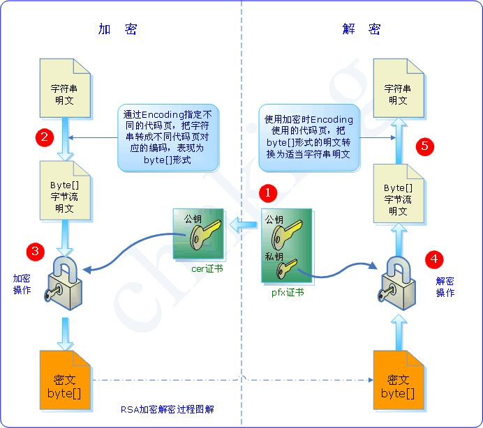
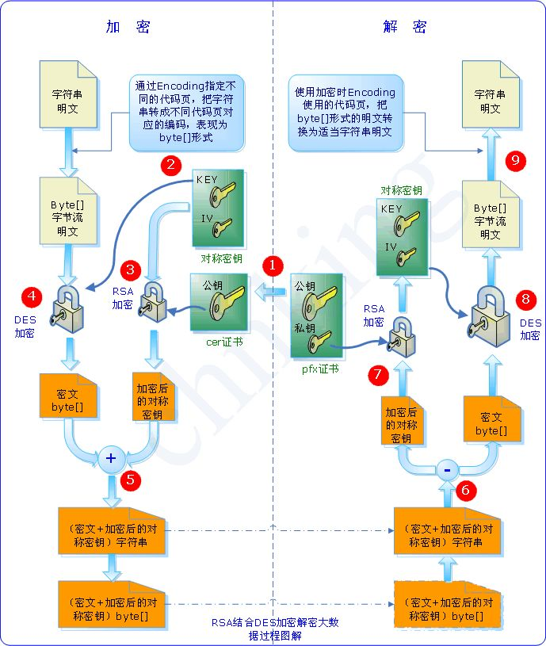
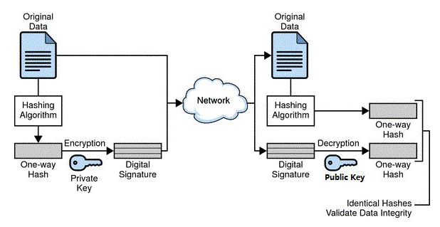
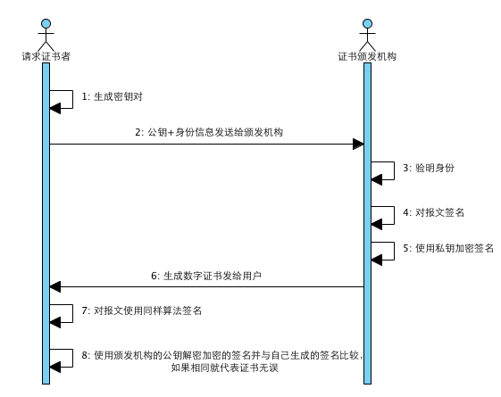

# RSA 非对称加密增强学习

> [阮一峰的笔记](https://www.ruanyifeng.com/blog/2011/08/what_is_a_digital_signature.html)

## RSA 加密解密过程图解

## RSA 结合 DES 加密解密过程图解

## 数字签名

我一直搞不懂数字签名和数字摘要的区别。

我认为数字签名就是对数字摘要进行私钥签名，公钥验签。

最原始的 RSA 是对明文进行加解密，效率很低，如果只对数字摘要签名，效率就会很高

## 数字证书

