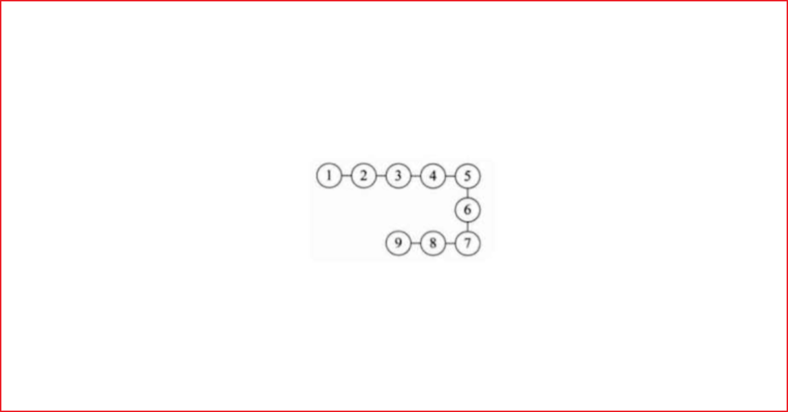
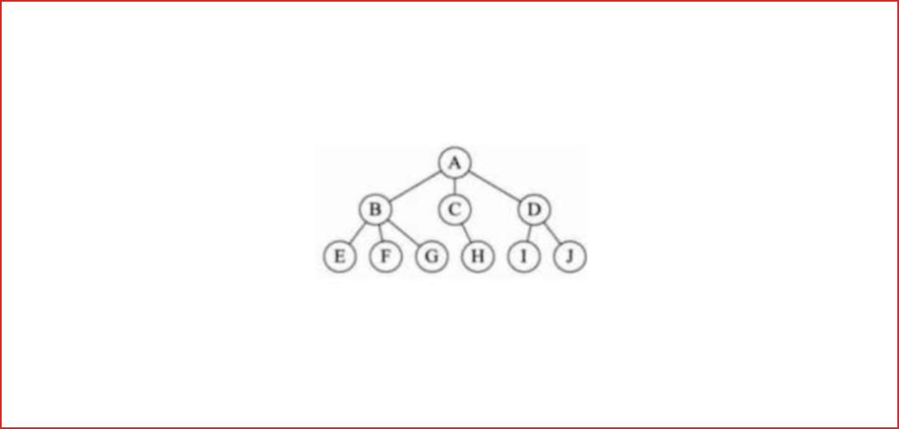

# 数据结构和算法概述

## 数据结构和算法的关系

数据 data 结构 (structure) 是一门研究组织数据方式的学科，有了编程语言也就有了数据结构，学好数据结构可以编写出更加漂亮，更加有效率的代码。

要学习好数据结构就要多多考虑如何将生活中遇到的问题，用程序去实现解决。

**程序 = 数据结构 + 算法**

数据结构是算法的基础，换言之，想要学好算法，需要把数据结构学到位。

## 看几个实际编程中遇到的问题

字符串替换问题

五子棋程序问题

丢手帕问题等等

## 线性结构和非线性结构

数据结构包括：**线性结构**和**非线性结构**。

### 线性结构

线性结构作为最常用的数据结构，其特点是数据元素之间**存在一对一的线性关系**

线性结构有两种不同的存储结构，即顺序存储结构 (数组) 和链式存储结构 (链表)
- 顺序存储的**线性表**称为**顺序表**，顺序表中的**存储元素是连续的**
- 链式存储的**线性表**称为**链表**，链表中的**存储元素不一定是连续的**，元素节点中存放数据元素以及相邻元素的地址信息

线性结构常见的有：**数组、队列、链表和栈**

### 非线性结构

非线性结构包括：**二维数组，多维数组，广义表，树结构，图结构**
