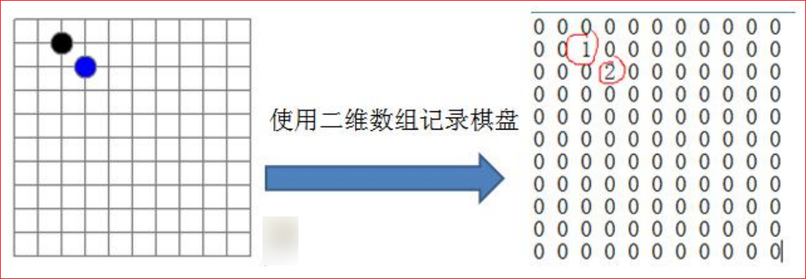
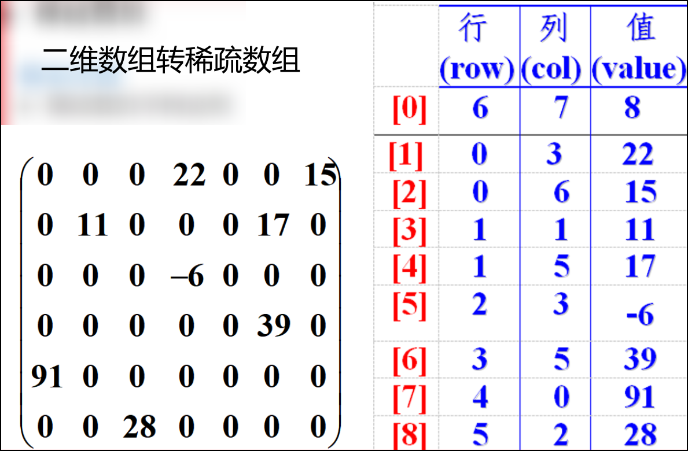
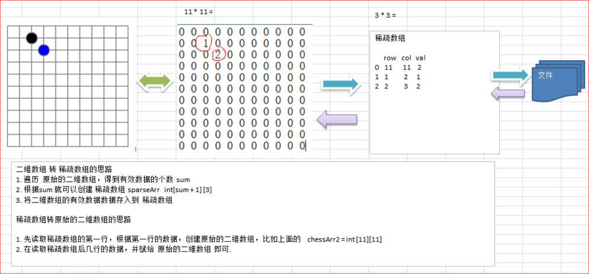

# 稀疏数组

## 实际需求

编写的五子棋程序中，有**存盘退出**和**续上盘**的功能。

我们首先能想到的就是使用一个**二维数组**，如下图所示

- 0：表示没有棋子
- 1：表示黑棋
- 2：表示白棋

❔因为该二维数组的很多值是默认值 0，因此记录了很多没有意义的数据。



## 基本介绍

当一个数组中**大部分元素为 0，或者为同一个值的数组**时，可以使用**稀疏数组**来保存该数组。

稀疏数组的处理方法是：

1) 记录数组一共有**几行几列**，**有多少个不同的值**
2) 把具有**不同值的元素**的**行列及值**记录在一个**小规模的数组**中，从而缩小程序的规模

稀疏数组举例说明



## 应用实例

1) 使用稀疏数组，来保留类似前面的二维数组 (棋盘、地图等等)
2) 把稀疏数组存盘，并且可以从新恢复原来的二维数组数

## 稀疏数组与二维数组互转思路分析



### 二维数组转稀疏数组思路

1. 遍历原始的二维数组，得到有效个数 sum
2. 根据 sum 创建**稀疏数组** `sparseArr = int[sum + 1][3]`
3. 将二维数据的有效数据存入到稀疏数组中（从第 2 行开始存储）
4. 最后将棋盘大小和有效个数写入第一行

### 稀疏数组转原始二维数组思路

1. 读取第一行数据，根据棋盘大小，创建原始的二维数组 `chessArr = int [11][11]`
2. 从第二行开始，将有效数据还原到原始数组中

## 代码实现

```java
/**
 * @title: SparseArray
 * @date: 2023/4/27 12:11
 * @author: zhongnan
 * @description: 稀疏数组
 * 需求：编写五子棋程序中的存盘退出和续上盘功能，存储越小越好
 *      1、二维数组转换成稀疏数组
 *      2、稀疏数组转换成二维数组
 *      3、稀疏数组保存到硬盘中
 *      4、从硬盘中读取稀疏数组
 */
public class SparseArray {
    public static void main(String[] args) {
        // 创建二维数组 11 * 11
        // 0:表示没有棋子 1:表示黑子 2:表示白子
        int[][] chessArray = new int[11][11];
        chessArray[1][2] = 1;
        chessArray[2][3] = 2;
        chessArray[4][5] = 2;

        System.out.println("原始棋盘数组为：");
        printChessArray(chessArray);

        // 转换成稀疏数组
        int[][] sparseChessArray = toSparseChessArray(chessArray);
        System.out.println("稀疏棋盘数组为：");
        printChessArray(sparseChessArray);

        // 将稀疏数组保存到文件中
        writeSparseChessArray(sparseChessArray);

        // 从文件中将稀疏数组读取回来
        int[][] sparseChessArray2 = readSparseChessArray();
        System.out.println("从文件中将稀疏数组读取：");
        printChessArray(sparseChessArray2);

        // 将稀疏数组恢复成原始的二维数组
        int[][] originalArray = toOriginalChessArray(sparseChessArray2);
        System.out.println("将稀疏数组恢复成原始的二维数组：");
        printChessArray(originalArray);

    }

    /**
     * 读取稀疏数组
     *
     * @date: 2023/4/27 13:03
     * @author: zhongnan
     * @param
     * @return 稀疏数组
     */
    private static int[][] readSparseChessArray() {
        BufferedReader br = null;
        int[][] sparseChessArray = null;
        try {
            // 初始化稀疏数组长度
            br = new BufferedReader(new FileReader("sparseChess.txt"));
            int count = 0;
            while (br.readLine() != null) {
                count++;
            }
            System.out.printf("读取到稀疏数组：一共 %S 行", count);
            System.out.println();

            sparseChessArray = new int[count][3];

            // 重新读取行数
            br = new BufferedReader(new FileReader("sparseChess.txt"));
            String line;
            int i = 0;
            while ((line = br.readLine()) != null) {
                // line.split(" ") 返回值是 String[] 将其转换成 int[]
                sparseChessArray[i++] = Arrays.stream(line.split(" ")).mapToInt(Integer::parseInt).toArray();
            }
        } catch (IOException e) {
            e.printStackTrace();
        } finally {
            try {
                if (br != null) {
                    br.close();
                }
            } catch (IOException e) {
                e.printStackTrace();
            }
        }
        return sparseChessArray;
    }

    /**
     * 保存稀疏数组
     *
     * @date: 2023/4/27 12:53
     * @author: zhongnan
     * @param sparseChessArray 稀疏数组
     * @return
     */
    private static void writeSparseChessArray(int[][] sparseChessArray) {
        BufferedWriter bw = null;

        try {
            bw = new BufferedWriter(new FileWriter("sparseChess.txt"));
            for (int[] ints : sparseChessArray) {
                bw.write(ints[0] + " " + ints[1] + " " + ints[2]);
                // 读取一行换一行
                bw.newLine();
            }
        } catch (IOException e) {
            e.printStackTrace();
        } finally {
            try {
                if (bw != null) {
                    bw.flush();
                    bw.close();
                }
            } catch (IOException e) {
                e.printStackTrace();
            }
        }
    }


    /**
     * 将稀疏数组转换为原始数组
     *
     *      * 先读取稀疏数组的第一行，根据第一行的数据，创建原始的二维数组，比如上面的  chessArr2 = int [11][11]
     *      * 在读取稀疏数组后几行的数据，并赋给原始的二维数组即可
     * @date: 2023/4/27 12:34
     * @author: zhongnan
     * @param sparseChessArray 稀疏数组
     * @return 原始数组
     */
    private static int[][] toOriginalChessArray(int[][] sparseChessArray) {
        //先读取稀疏数组的第一行，根据第一行的数据，创建原始的二维数组
        int[][] originalChessArray = new int[sparseChessArray[0][0]][sparseChessArray[0][1]];

        //再读取稀疏数组后几行的数据 (从第二行开始)，并赋给原始的二维数组即可
        for (int i = 1; i < sparseChessArray.length; i++) {
            originalChessArray[sparseChessArray[i][0]][sparseChessArray[i][1]] = sparseChessArray[i][2];
        }
        return originalChessArray;
    }

    /**
     * 二维数组转换成稀疏数组
     *      1、先遍历二维数组得到非 0 数据的个数
     *
     * @date: 2023/4/27 12:31
     * @author: zhongnan
     * @param chessArray 原始二维数组
     * @return {@link int[][]} 转换的稀疏数组
     */
    private static int[][] toSparseChessArray(int[][] chessArray) {
        // 先遍历二维数组得到非 0 数据的个数
        int sum = 0;
        for (int i = 0; i < 11; i++) {
            for (int j = 0; j < 11; j++) {
                if (chessArray[i][j] != 0) {
                    sum++;
                }
            }
        }

        // 创建稀疏数组
        int[][] sparseChessArray = new int[sum + 1][3];
        sparseChessArray[0][0] = 11;
        sparseChessArray[0][1] = 11;
        sparseChessArray[0][2] = sum;

        // 遍历二维数组，将非 0 的值存放到 sparseChessArray 中
        // count 用于记录是第几个非 0 数据
        int count = 0;
        for (int i = 0; i < 11; i++) {
            for (int j = 0; j < 11; j++) {
                if (chessArray[i][j] != 0) {
                    count++;
                    sparseChessArray[count][0] = i; // 第几行
                    sparseChessArray[count][1] = j; // 第几列
                    sparseChessArray[count][2] = chessArray[i][j]; // 值
                }
            }
        }

        return sparseChessArray;
    }

    /**
     * 打印数组
     *
     * @date: 2023/4/27 12:39
     * @author: zhongnan
     * @param chessArray 二维数组
     * @return
     */
    public static void printChessArray(int[][] chessArray) {
        for (int[] row : chessArray) {
            for (int data : row) {
                System.out.printf("%d\t", data);
            }
            System.out.println("");
        }
    }
}
```

