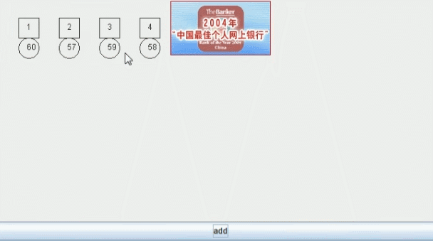
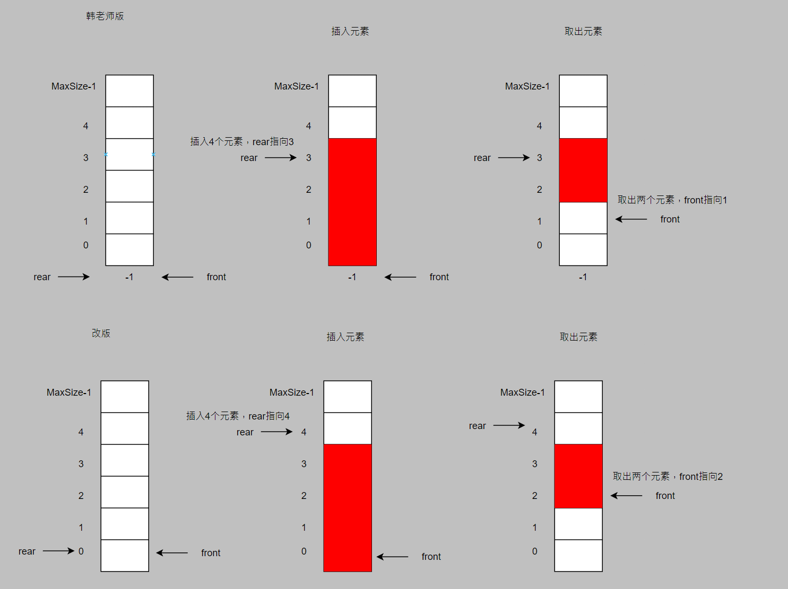
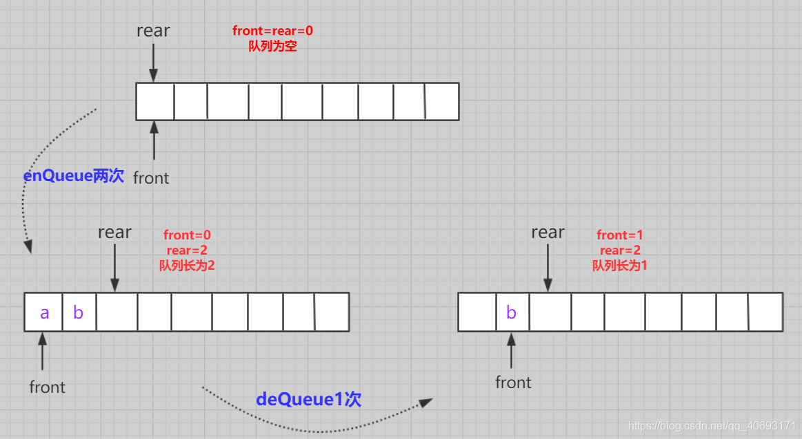
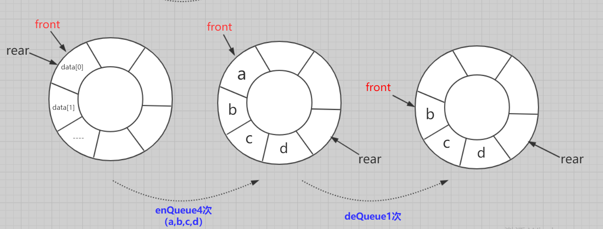
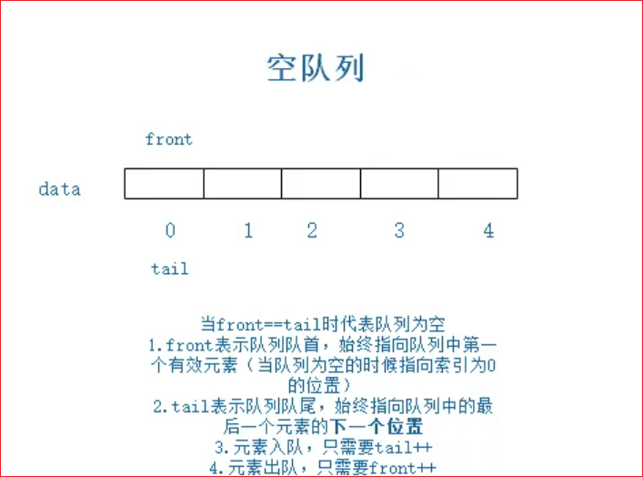
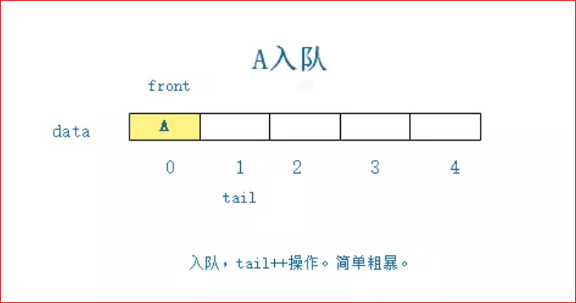
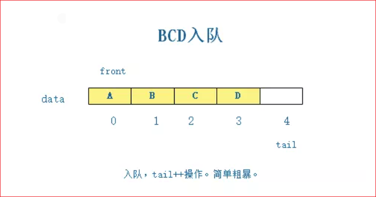
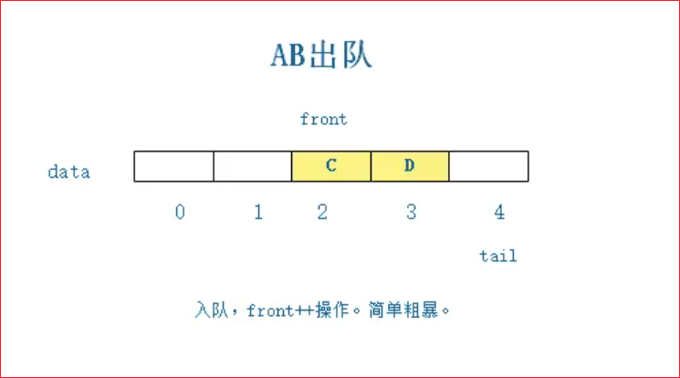
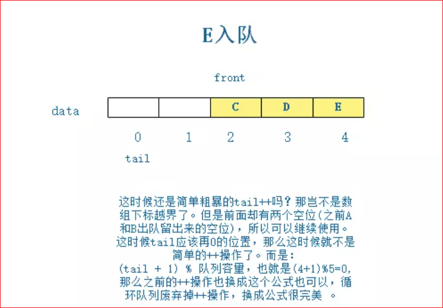
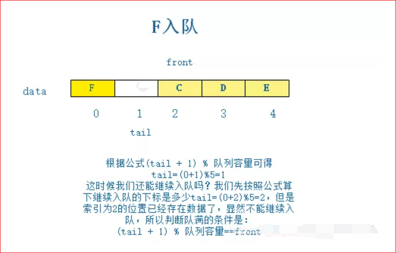

# 队列

::: info 提示

在韩老师的笔记上补充：https://www.cnblogs.com/bigsai/p/11363071.html

:::

## 一个使用场景

银行办理业务的排队叫号



## 队列介绍

队列：是一个**有序列表**，可以用**数组**或**链表**实现。

特点：遵循**先入先出**原则。即：先存入的数据，先取出。

队列本身是有序列表，若使用数组的结构来存储队列的数据，则队列数组的声明如下图, 其中 maxSize 是该队列的最大容量。

因为队列的输出、输入是分别从前后端来处理，因此需要两个变量 front 及 rear 分别记录队列前后端的下标，front 会随着数据输出而改变，而 rear 则是随着数据输入而改变





- 初始化：数组的front和rear都指向0
- 入队：`队不满`，`数组不越界`，先队尾位置传值，再队尾下标+1
- 出队：`队不空`，先取队头位置元素，再队头+1，

但是很容易发现问题，`每个空间域只能利用一次`。造成`空间`极度`浪费`。并且非常容易`越界`！

### 代码实现

::: tabs#ArrayQueue

@tab ArrayQueue 韩老师版

```java
/**
 * @title: ArrayQueue
 * @date: 2023/4/27 16:33
 * @author: zhongnan
 * @description: 数组模拟队列
 */
public class ArrayQueue {
    private int maxSize;//队列最大容量
    private int front;//队列头
    private int rear;//队列尾
    private int[] arr;//数组模拟队列

    public ArrayQueue(int arrMaxSize) {
        maxSize = arrMaxSize;
        arr = new int[maxSize];
        front = -1;//指向队列的第一个数据的前一个位置
        rear = -1;//指向队列的尾的数据 (包含队列尾)
    }

    //判断队列是否满
    public boolean isFull() {
        return rear == maxSize - 1;
    }

    //判断队列是否空
    public boolean isEmpty() {
        return rear == front;
    }

    //添加数据到队列
    public void addQueue(int n) {
        if (isFull()) {
            System.out.println("队列满，不能加入数据~");
            return;
        }
        rear++;
        arr[rear] = n;
    }

    //获取队列的数据
    public int getQueue() {
        if (isEmpty()) {
            throw new RuntimeException("队列空，不能取数据~");
        }
        front++;
        return arr[front];
    }

    //显示队列的所有数据
    public void showQueue() {
        if (isEmpty()) {
            System.out.println("队列为空，没有数据~");
            return;
        }
        for (int i = 0; i < arr.length; i++) {
            System.out.printf("arr[%d]=%d\n", i, arr[i]);
        }
    }

    //显示队列的头数据
    public int headQueue() {
        if (isEmpty()) {
            throw new RuntimeException("队列空，不能取数据~");
        }
        //front 指向前一个数据
        return arr[front + 1];
    }
}
```

@tab 我的改版

```java
/**
 * @title: ArrayQueue
 * @date: 2023/4/27 16:33
 * @author: zhongnan
 * @description: 数组模拟队列
 */
public class ArrayQueue {
    private int maxSize;//队列最大容量
    private int front;//队列头
    private int rear;//队列尾
    private int[] arr;//数组模拟队列

    public ArrayQueue(int arrMaxSize) {
        maxSize = arrMaxSize;
        arr = new int[maxSize];
        front = 0;//指向队列的第一个数据的前一个位置
        rear = 0;//指向队列的尾的数据 (包含队列尾)
    }

    //判断队列是否满
    public boolean isFull() {
        return rear == maxSize;
    }

    //判断队列是否空
    public boolean isEmpty() {
        return rear == front;
    }

    //添加数据到队列
    public void addQueue(int n) {
        if (isFull()) {
            System.out.println("队列满，不能加入数据~");
            return;
        }
        arr[rear++] = n;
    }

    //获取队列的数据
    public int getQueue() {
        if (isEmpty()) {
            throw new RuntimeException("队列空，不能取数据~");
        }
        return arr[front++];
    }

    //显示队列的所有数据
    public void showQueue() {
        if (isEmpty()) {
            System.out.println("队列为空，没有数据~");
            return;
        }
        for (int i = 0; i < arr.length; i++) {
            System.out.printf("arr[%d]=%d\n", i, arr[i]);
        }
    }

    //显示队列的头数据
    public int headQueue() {
        if (isEmpty()) {
            throw new RuntimeException("队列空，不能取数据~");
        }
        //front 指向前一个数据
        return arr[front];
    }
}

```

:::

```java
public class ArrayQueueApp {
    public static void main(String[] args) {
        ArrayQueue queue = new ArrayQueue(3);
        char key = ' ';
        Scanner scanner = new Scanner(System.in);
        boolean loop = true;
        //输出一个菜单
        while (loop) {
            System.out.println("s(show):显示队列 ::: a(add):添加数据到队列 ::: g(get):从队列取出数据 ::: h(head):查看队列头的数据 ::: e(exit):退出程序");
            key = scanner.next().charAt(0);//接收一个字符
            switch (key) {
                case 's':
                    queue.showQueue();
                    break;
                case 'a':
                    System.out.println("输入一个数");
                    int val = scanner.nextInt();
                    queue.addQueue(val);
                    break;
                case 'g':
                    try {
                        int res = queue.getQueue();
                        System.out.printf("取出的数据时%d\n", res);
                    } catch (Exception e) {
                        System.out.println(e.getMessage());
                    }
                    break;
                case 'h':
                    try {
                        int res = queue.headQueue();
                        System.out.printf("队列的头数据是%d\n", res);
                    } catch (Exception e) {
                        System.out.println(e.getMessage());
                    }
                    break;
                case 'e':
                    scanner.close();
                    System.exit(0);
                default:
                    break;
            }
        }
    }
}
```

### 结果演示

```java
s(show):显示队列 ::: a(add):添加数据到队列 ::: g(get):从队列取出数据 ::: h(head):查看队列头的数据 ::: e(exit):退出程序
s
队列为空，没有数据~
s(show):显示队列 ::: a(add):添加数据到队列 ::: g(get):从队列取出数据 ::: h(head):查看队列头的数据 ::: e(exit):退出程序
a
输入一个数
1
s(show):显示队列 ::: a(add):添加数据到队列 ::: g(get):从队列取出数据 ::: h(head):查看队列头的数据 ::: e(exit):退出程序
s
arr[0]=1
arr[1]=0
arr[2]=0
s(show):显示队列 ::: a(add):添加数据到队列 ::: g(get):从队列取出数据 ::: h(head):查看队列头的数据 ::: e(exit):退出程序
a
输入一个数
2
s(show):显示队列 ::: a(add):添加数据到队列 ::: g(get):从队列取出数据 ::: h(head):查看队列头的数据 ::: e(exit):退出程序
a
输入一个数
3
s(show):显示队列 ::: a(add):添加数据到队列 ::: g(get):从队列取出数据 ::: h(head):查看队列头的数据 ::: e(exit):退出程序
s
arr[0]=1
arr[1]=2
arr[2]=3
s(show):显示队列 ::: a(add):添加数据到队列 ::: g(get):从队列取出数据 ::: h(head):查看队列头的数据 ::: e(exit):退出程序
g
取出的数据时1
s(show):显示队列 ::: a(add):添加数据到队列 ::: g(get):从队列取出数据 ::: h(head):查看队列头的数据 ::: e(exit):退出程序
s
arr[0]=1
arr[1]=2
arr[2]=3
s(show):显示队列 ::: a(add):添加数据到队列 ::: g(get):从队列取出数据 ::: h(head):查看队列头的数据 ::: e(exit):退出程序
h
队列的头数据是2
s(show):显示队列 ::: a(add):添加数据到队列 ::: g(get):从队列取出数据 ::: h(head):查看队列头的数据 ::: e(exit):退出程序
g
取出的数据时2
s(show):显示队列 ::: a(add):添加数据到队列 ::: g(get):从队列取出数据 ::: h(head):查看队列头的数据 ::: e(exit):退出程序
h
队列的头数据是3
s(show):显示队列 ::: a(add):添加数据到队列 ::: g(get):从队列取出数据 ::: h(head):查看队列头的数据 ::: e(exit):退出程序
g
取出的数据时3
s(show):显示队列 ::: a(add):添加数据到队列 ::: g(get):从队列取出数据 ::: h(head):查看队列头的数据 ::: e(exit):退出程序
h
队列空，不能取数据~
s(show):显示队列 ::: a(add):添加数据到队列 ::: g(get):从队列取出数据 ::: h(head):查看队列头的数据 ::: e(exit):退出程序
s
队列为空，没有数据~
s(show):显示队列 ::: a(add):添加数据到队列 ::: g(get):从队列取出数据 ::: h(head):查看队列头的数据 ::: e(exit):退出程序
s
队列为空，没有数据~
s(show):显示队列 ::: a(add):添加数据到队列 ::: g(get):从队列取出数据 ::: h(head):查看队列头的数据 ::: e(exit):退出程序
a
输入一个数
1
队列满，不能加入数据~
s(show):显示队列 ::: a(add):添加数据到队列 ::: g(get):从队列取出数据 ::: h(head):查看队列头的数据 ::: e(exit):退出程序
g
队列空，不能取数据~
s(show):显示队列 ::: a(add):添加数据到队列 ::: g(get):从队列取出数据 ::: h(head):查看队列头的数据 ::: e(exit):退出程序
h
队列空，不能取数据~
s(show):显示队列 ::: a(add):添加数据到队列 ::: g(get):从队列取出数据 ::: h(head):查看队列头的数据 ::: e(exit):退出程序
s
队列为空，没有数据~
s(show):显示队列 ::: a(add):添加数据到队列 ::: g(get):从队列取出数据 ::: h(head):查看队列头的数据 ::: e(exit):退出程序
s
队列为空，没有数据~
s(show):显示队列 ::: a(add):添加数据到队列 ::: g(get):从队列取出数据 ::: h(head):查看队列头的数据 ::: e(exit):退出程序
```

## 环形队列

对前面的数组模拟队列的优化，充分利用数组。因此将数组看做是一个环形的。(通过取模的方式来实现即可)

- 初始化：数组的front和rear都指向0=
- 入队：队不满，先给队尾位置传值，再`rear=(rear + 1) % maxsize;`
- 出队：队不空，先取队头位置元素，`front=(front + 1)%maxsize;`
- 是否为空：`return rear == front;`
- 有效个数：`return (rear+maxsize-front)%maxsize;`



### 环形队列图解






> 其实这里环形队列已经满了









front =2 

tail = 1

maxsize = 5

front = 0？

tail 有效个数 < = maxsize-1

front - 0  = front 就是front要退回0的位置

tail>front = tail - front = 有效个数

tail<front = tail + maxsize - front = 有效个数

因为有效个数永远是小于maxszie的，因此对有效个数取模还是有效个数

tail>front = （tail - front) % maxsize  = 有效个数

tail<front =  (tail + maxsize - front) % maxszie = 有效个数

被除数÷除数=商...余数

(被除数+n*除数)÷除数=(n+商)...余数

根据公式可得：

（tail - front + n*maxsize) % maxsize= 有效个数


再理解:

因为队列是先进先出的，因此逻辑上可以理解为 tail 永远 > front，只不过 tail 被取余了，在真实空间上小于 front

n 表示取余次数，也可以理解为循环次数

tail + n(maxsize) - front + n(maxsize) = 有效个数

tail + n(maxsize) - front + (n-1)(maxsize) = 有效个数

(tail - front) = 有效个数

(tail - front + maxsize) = 有效个数




## CircleArrayQueue

```java
package com.cj.queue;

/**
 * Created by ZhongNan
 * 2023/4/1
 * 15:42
 */
public class CircleArrayQueue {
    private int maxSize; // 表示数组的最大容量
    //front 变量的含义做一个调整：front 就指向队列的第一个元素，也就是说 arr[front] 就是队列的第一个元素
    //front 的初始值 = 0
    private int front;
    //rear 变量的含义做一个调整：rear 指向队列的最后一个元素的后一个位置。因为希望空出一个空间做为约定。
    //rear 的初始值 = 0
    private int rear; // 队列尾
    private int[] arr; // 该数据用于存放数据，模拟队列

    public CircleArray(int arrMaxSize) {
        maxSize = arrMaxSize;
        arr = new int[maxSize];
    }

    // 判断队列是否满
    public boolean isFull() {
        return (rear + 1) % maxSize == front;
    }

    // 判断队列是否为空
    public boolean isEmpty() {
        return rear == front;
    }

    // 添加数据到队列
    public void addQueue(int n) {
        // 判断队列是否满
        if (isFull()) {
            System.out.println("队列满，不能加入数据~");
            return;
        }
        //直接将数据加入
        arr[rear] = n;
        //将 rear 后移，这里必须考虑取模
        rear = (rear + 1) % maxSize;
        System.out.println("rear ==" + rear);
    }

    // 获取队列的数据，出队列
    public int getQueue() {
        // 判断队列是否空
        if (isEmpty()) {
            // 通过抛出异常
            throw new RuntimeException("队列空，不能取数据");
        }
        // 这里需要分析出 front 是指向队列的第一个元素
        // 1. 先把 front 对应的值保留到一个临时变量
        // 2. 将 front 后移，考虑取模
        // 3. 将临时保存的变量返回
        int value = arr[front];
        front = (front + 1) % maxSize;
        return value;

    }

    // 显示队列的所有数据
    public void showQueue() {
        // 遍历
        if (isEmpty()) {
            System.out.println("队列空的，没有数据~~");
            return;
        }
        // 思路：从 front 开始遍历，遍历多少个元素
        // 动脑筋
        for (int i = front; i < front + size(); i++) {
            System.out.printf("arr[%d]=%d\n", i % maxSize, arr[i % maxSize]);
        }
    }

    // 求出当前队列有效数据的个数
    public int size() {
        // rear = 2
        // front = 1
        // maxSize = 3
        return (rear + maxSize - front) % maxSize;
    }

    // 显示队列的头数据，注意不是取出数据
    public int headQueue() {
        // 判断
        if (isEmpty()) {
            throw new RuntimeException("队列空的，没有数据~~");
        }
        return arr[front];
    }
}
```

