# 链表

## 链表 (Linked List) 介绍

链表是有序的列表，但是它在内存中是存储如下

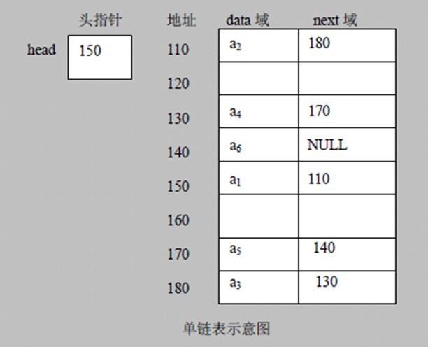

1) 链表是以节点的方式来存储，是链式存储
2) 每个节点包含 data 域，next 域：指向下一个节点
3) 如图：发现链表的各个节点不一定是连续存储
4) 链表分带头节点的链表和没有头节点的链表，根据实际的需求来确定

单链表逻辑线性结构示意图如下

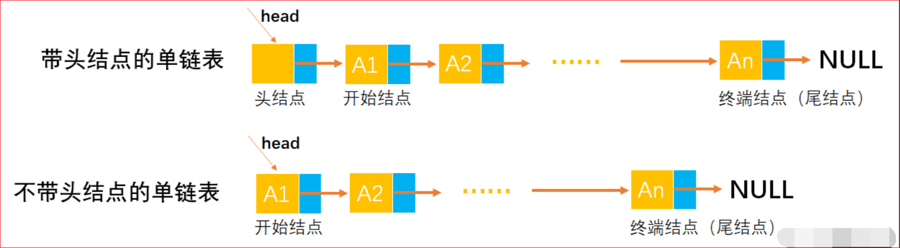

## 单链表的应用实例

使用带 head 头的单向链表实现 –水浒英雄排行榜管理完成对英雄人物的增删改查操作。

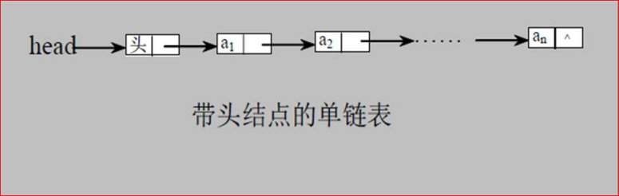

### 添加节点

> 在添加英雄时，直接添加到链表的尾部

思路分析示意图：

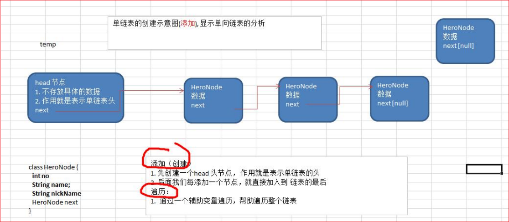

### 添加节点并且排序

> 在添加英雄时，根据排名将英雄插入到指定位置 (如果有这个排名，则添加失败，并给出提示)

思路的分析示意图：【temp 下一个节点】就是新插入的下一个节点，【temp】的【下一个节点】就是新插入的节点

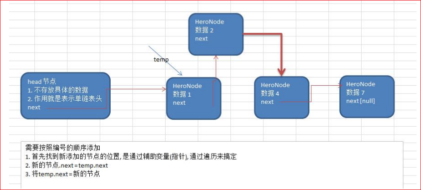

### 修改节点功能

1. 先通过遍历找到该节点
2. 给该节点赋新值

### 删除节点

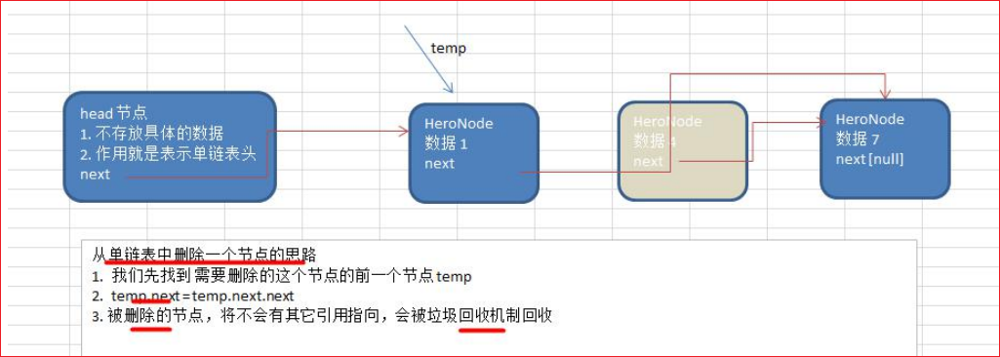

### HeroNode

```java
package com.cj.linkedlist;

/**
 * Created by ZhongNan
 * 2023/4/2
 * 8:29
 */
// 定义 HeroNode，每个 HeroNode 对象就是一个节点
public class HeroNode {
    public int no;
    public String name;
    public String nickname;
    public HeroNode next;

    // 构造器
    public HeroNode(int no, String name, String nickname) {
        this.no = no;
        this.name = name;
        this.nickname = nickname;
    }

    @Override
    public String toString() {
        return "HeroNode{" +
                "no=" + no +
                ", name='" + name + '\'' +
                ", nickname='" + nickname + '\'' +
                ", next=" + next +
                '}';
    }

    // 不展示 next 节点
    public String toString2() {
        return "HeroNode{" +
                "no=" + no +
                ", name='" + name + '\'' +
                ", nickname='" + nickname + '\'' +
                '}';
    }
}
```

### SingleLinkedList

```java
package com.cj.linkedlist;

/**
 * Created by ZhongNan
 * 2023/4/2
 * 8:28
 */
// 定义 SingleLinkedList 管理我们的英雄
public class SingleLinkedList {
    // 先初始化一个头节点，头节点不要动，不存放具体的数据
    private HeroNode head = new HeroNode(0, "", "");

    // 返回头节点
    public HeroNode getHead() {
        return head;
    }

    // 添加节点到单向链表
    // 思路，当不考虑编号顺序时
    // 1. 找到当前链表的最后节点
    // 2. 将最后这个节点的 next 指向新的节点
    public void add(HeroNode heroNode) {
        //因为 head 节点不能动，因此我们需要一个辅助遍历 temp
        HeroNode temp = head;
        //遍历链表，找到最后
        while (true) {
            //找到链表的最后
            if (temp.next == null) {//
                break;
            }
            //如果没有找到最后，将将 temp 后移
            temp = temp.next;
        }
        //当退出 while 循环时，temp 就指向了链表的最后
        //将最后这个节点的 next 指向 新的节点
        temp.next = heroNode;
        //System.out.println("temp = " + temp.toString());
    }

    // 第二种方式在添加英雄时，根据排名将英雄插入到指定位置
    // (如果有这个排名，则添加失败，并给出提示)
    public void addByOrder(HeroNode heroNode) {
        // 因为 head 节点不能动，因此我们需要一个辅助遍历 temp
        HeroNode temp = head;
        boolean flag = false; // flag 标志添加的编号是否存在，默认为 false
        // 遍历链表，找到最后
        while (true) {
            if (temp.next == null) {
                // 说明 temp 已经在链表的最后，需要插入节点
                break;
            }
            if (temp.next.no > heroNode.no) {
                // 如果 temp.no=0，则排名永远<0，永远在后面直接插入
                // 需要跳过 no=0 的情况
                // 如果 temp 节点是 0 下一个节点是 5 > 新插入的节点 3，则需要在 temp 和 temp.next 中间插入
                break;
            } else if (temp.next.no == heroNode.no) {
                // 需要跳过 no=0 的情况
                // 如果 temp 节点是 0 下一个节点是 5 == 新插入的节点 5，则不能插入
                // 如果下一个节点的排名等于下一个
                // 说明希望添加的 heroNode 的编号已然存在
                flag = true; // 说明编号存在
                break;
            }
            temp = temp.next; // 后移，遍历当前链表
        }
        //判断 flag 的值
        if (flag) { //不能添加，说明编号存在
            System.out.printf("准备插入的英雄的编号 %d 已经存在了，不能加入\n", heroNode.no);
        } else {
            // 插入到链表中，temp 的后面，将 null 值赋值给最后一个节点
            // 【temp 下一个节点】就是新插入的下一个节点，【temp】的【下一个节点】就是新插入的节点
            // 就是将 temp 和 temp 下一个节点掰开，将新节点插入
            heroNode.next = temp.next;
            temp.next = heroNode;
        }
        //System.out.println("temp = " + temp.toString());
    }

    // 修改节点的信息，根据 no 编号来修改，即 no 编号不能改。
    // 1. 根据 newHeroNode 的 no 来修改即可
    public void update(HeroNode newHeroNode) {
        // 找到需要修改的节点，根据 no 编号
        // 定义一个辅助变量
        HeroNode temp = head;
        boolean flag = false; // 表示是否找到该节点
        while (true) {
            if (temp.next == null) {
                break; //已经遍历完链表
            }
            if (temp.next.no == newHeroNode.no) {
                //找到
                flag = true;
                break;
            }
            temp = temp.next;
        }
        // 根据 flag 判断是否找到要修改的节点
        if (flag) {
            temp.next.name = newHeroNode.name;
            temp.next.nickname = newHeroNode.nickname;
        } else { // 没有找到
            System.out.printf("没有找到 编号 %d 的节点，不能修改\n", newHeroNode.no);
        }
    }

    // 删除节点
    // 1. head 不能动，因此我们需要一个 temp 辅助节点找到待删除节点的前一个节点
    // 2. 说明我们在比较时，是 temp.next.no 和  需要删除的节点的 no 比较
    public void del(int no) {
        HeroNode temp = head;
        boolean flag = false; // 标志是否找到待删除节点的
        while (true) {
            if (temp.next == null) { //已经到链表的最后
                break;
            }
            if (temp.next.no == no) {
                //找到的待删除节点的前一个节点 temp
                flag = true;
                break;
            }
            temp = temp.next; //temp 后移，遍历
        }
        //判断 flag
        if (flag) { //找到
            //可以删除
            temp.next = temp.next.next;
        } else {
            System.out.printf("要删除的 %d 节点不存在\n", no);
        }
    }

    // 显示链表 [遍历]
    public void list() {
        // 忽略了头节点的存在
        // 判断链表是否为空
        if (head.next == null) {
            System.out.println("链表为空");
            return;
        }
        // 因为头节点，不能动，因此我们需要一个辅助变量来遍历
        HeroNode temp = head.next;
        while (true) {
            //判断是否到链表最后
            if (temp == null) {
                break;
            }
            //输出节点的信息
            //System.out.println("原来链表的情况~~~");
            //System.out.println(temp);
            //System.out.println("重写后的 toString~~~");
            System.out.println(temp.toString2());
            //将 temp 后移，一定小心
            temp = temp.next;
        }
    }
}
```

### SingleLinkedListApp

```java
package com.cj.linkedlist;

import java.util.Stack;

/**
 * Created by ZhongNan
 * 2023/4/2
 * 8:27
 */
public class SingleLinkedListApp {
    public static void main(String[] args) {
        // 进行测试
        // 先创建节点
        HeroNode hero1 = new HeroNode(1, "宋江", "及时雨");
        HeroNode hero2 = new HeroNode(2, "卢俊义", "玉麒麟");
        HeroNode hero3 = new HeroNode(3, "吴用", "智多星");
        HeroNode hero4 = new HeroNode(4, "林冲", "豹子头");
        // 创建要给链表
        SingleLinkedList singleLinkedList = new SingleLinkedList();

        // 加入
        //singleLinkedList.add(hero1);
        //singleLinkedList.add(hero4);
        //singleLinkedList.add(hero3);
        //singleLinkedList.add(hero2);

        // 加入 排序
        singleLinkedList.addByOrder(hero1);
        singleLinkedList.addByOrder(hero3);
        singleLinkedList.addByOrder(hero4);
        singleLinkedList.addByOrder(hero2);


        //singleLinkedList.list();

        // 测试修改节点的代码
        //HeroNode newHeroNode = new HeroNode(3, "吴用用", "智多星~~");
        //singleLinkedList.update(newHeroNode);
        //System.out.println("------------------------");
        //singleLinkedList.list();

        // 测试删除节点的代码
        //singleLinkedList.del(0);
        //System.out.println("------------------------");
        //singleLinkedList.list();
        //System.out.println("------------------------");
        //System.out.println("单链表节点个数" + getLength(singleLinkedList.getHead()));
        //System.out.println("------------------------");
        //System.out.println("获取倒数第 K 个 node" + getLastIndexNode(singleLinkedList.getHead(), 2));
        //System.out.println("------------------------");
        //System.out.println("------------方式一：反转打印------------");
        //reverseList(singleLinkedList.getHead());
        //singleLinkedList.list();
        //System.out.println("-----------方式二：栈打印-------------");
        //reversePrint(singleLinkedList.getHead());

        HeroNode head1 = new HeroNode(1, "", "");
        HeroNode head2 = new HeroNode(2, "", "");
        HeroNode node3 = new HeroNode(3, "", "");
        HeroNode node4 = new HeroNode(4, "", "");
        HeroNode node5 = new HeroNode(5, "", "");
        HeroNode node6 = new HeroNode(6, "", "");
        HeroNode node7 = new HeroNode(7, "", "");

        head1.next = node3;
        node3.next = node5;
        node5.next = node7;
        node7.next = null;

        head2.next = node4;
        node4.next = node6;
        node6.next = null;

        System.out.println(head1.toString());
        System.out.println(head2.toString());
        HeroNode heroNode = mergeTwoLists(head1, head2);
        System.out.println(heroNode.toString());
    }

    /**
     * @param head 链表的头节点
     * @return 返回的就是有效节点的个数
     */
    public static int getLength(HeroNode head) {
        if (head.next == null) {
            return 0;
        }
        int length = 0;
        // 定义一个辅助的变量，这里我们没有统计头节点
        HeroNode temp = head.next;
        while (temp != null) {
            length++;
            temp = temp.next; //遍历
        }
        return length;
    }

    // 查找单链表中的倒数第 k 个结点
    // 编写一个方法，接收 head 节点，同时接收一个 index ,index 表示是倒数第 index 个节点
    // 先把链表从头到尾遍历，得到链表的总的长度 getLength
    // 得到 size 后，我们从链表的第一个开始遍历 (size-index) 个，就可以得到
    // 如果找到了，则返回该节点，否则返回 null
    public static HeroNode getLastIndexNode(HeroNode head, int index) {
        if (head.next == null) {
            return null;
        }
        int size = getLength(head);
        if (index <= 0 || index > size) {
            return null;
        }
        HeroNode temp = head.next;
        for (int i = 0; i < (size - index); i++) {
            temp = temp.next;
        }
        return temp;
    }

    //将单链表反转
    public static void reverseList(HeroNode head) {
        // 如果当前链表为空，或者只有一个节点，无需反转，直接返回
        if (head.next == null || head.next.next == null) {
            return;
        }

        //定义一个辅助的指针 (变量)，帮助我们遍历原来的链表
        HeroNode temp = head.next;
        HeroNode next = null;// 指向当前节点 [temp] 的下一个节点
        HeroNode reverseNode = new HeroNode(0, "", "");
        // 遍历原来的链表，每遍历一个节点，就将其取出，并放在新的链表 reverseHead 的最前端
        while (temp != null) {
            // next 是临时变量，用于保存截断后的后面数据
            next = temp.next;
            // 临时变量 temp 后边连接 reverseNode.next
            temp.next = reverseNode.next;//将 temp 的下一个节点指向新的链表的最前端
            // null => 宋江 + null => 卢 + 宋江 + null => 吴 + 卢 + 宋江 + null => 林 + 吴 + 卢 + 宋江 + null
            reverseNode.next = temp; //将 temp 连接到新的链表上
            temp = next; // 最后 next 变成 null
        }
        System.out.println("反转链表" + reverseNode.next);
        // 重新给原先的对象
        head.next = reverseNode.next;
    }

    // 可以利用栈这个数据结构，将各个节点压入到栈中，然后利用栈的先进后出的特点，就实现了逆序打印的效果
    public static void reversePrint(HeroNode head) {
        if (head.next == null) {
            return; //空链表，不能打印
        }
        // 创建要给一个栈，将各个节点压入栈
        Stack<HeroNode> stack = new Stack<HeroNode>();
        HeroNode temp = head.next;
        // 将链表的所有节点压入栈
        while (temp != null) {
            stack.push(temp);
            temp = temp.next; //cur 后移，这样就可以压入下一个节点
        }
        // 将栈中的节点进行打印，pop 出栈
        while (stack.size() > 0) {
            System.out.println(stack.pop().toString2()); //stack 的特点是先进后出
        }
    }

    public static HeroNode mergeTwoLists(HeroNode l1, HeroNode l2) {
        HeroNode preHead = new HeroNode(0, "", "");

        HeroNode temp = preHead;
        while (l1 != null && l2 != null) {
            if (l1.no <= l2.no) {
                temp.next = l1;
                System.out.println("temp=======?"+ temp.toString());
                l1 = l1.next;
            } else {
                temp.next = l2;
                System.out.println("temp=======!!!"+ temp.toString());
                l2 = l2.next;
            }
            temp = temp.next;
            System.out.println("temp==>" + temp.toString());

        }
        // 合并后 l1 和 l2 最多只有一个还未被合并完，我们直接将链表末尾指向未合并完的链表即可
        temp.next = l1 == null ? l2 : l1;
        //System.out.println(temp.equals(preHead));
        return temp.next;
    }

}
```

### 新浪面试题

> 求单链表中有效节点的个数

```java
/**
 *
 * @param head 链表的头节点
 * @return 返回的就是有效节点的个数
 */
public static int getLength(HeroNode head) {
    if (head.next == null) {
        return 0;
    }
    int length = 0;
    // 定义一个辅助的变量，这里我们没有统计头节点
    HeroNode temp = head.next;
    while (temp != null) {
        length++;
        temp = temp.next; //遍历
    }
    return length;
}
```

> 查找单链表中的倒数第 k 个结点

```java
// 查找单链表中的倒数第 k 个结点
// 编写一个方法，接收 head 节点，同时接收一个 index ,index 表示是倒数第 index 个节点
// 先把链表从头到尾遍历，得到链表的总的长度 getLength
// 得到 size 后，我们从链表的第一个开始遍历 (size-index) 个，就可以得到
// 如果找到了，则返回该节点，否则返回 null
public static HeroNode getLastIndexNode(HeroNode head, int index) {
    if (head.next == null) {
        return null;
    }
    int size = getLength(head);
    if (index <= 0 || index > size) {
        return null;
    }
    HeroNode temp = head.next;
    for (int i = 0; i < (size - index); i++) {
        temp = temp.next;
    }
    return temp;
}
```

### 百度面试题

> 从尾到头打印单链表

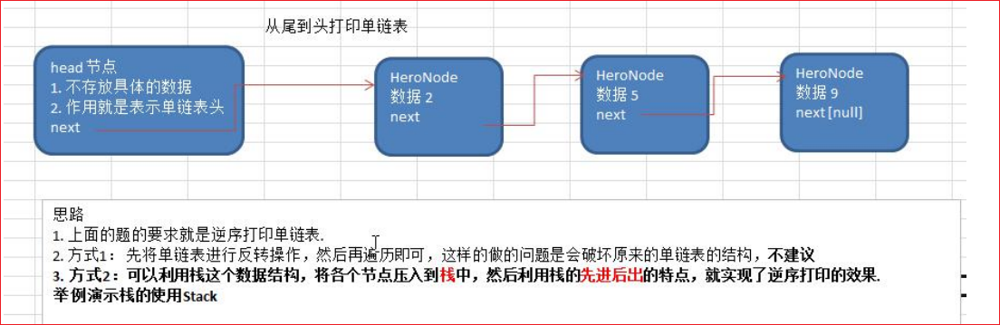

```java
// 可以利用栈这个数据结构，将各个节点压入到栈中，然后利用栈的先进后出的特点，就实现了逆序打印的效果
public static void reversePrint(HeroNode head) {
    if (head.next == null) {
        return; //空链表，不能打印
    }
    // 创建要给一个栈，将各个节点压入栈
    Stack<HeroNode> stack = new Stack<HeroNode>();
    HeroNode temp = head.next;
    // 将链表的所有节点压入栈
    while (temp != null) {
        stack.push(temp);
        temp = temp.next; //cur 后移，这样就可以压入下一个节点
    }
    // 将栈中的节点进行打印，pop 出栈
    while (stack.size() > 0) {
        System.out.println(stack.pop().toString2()); //stack 的特点是先进后出
    }
}
```

### 腾讯面试题

> 单链表的反转

#### 实现效果

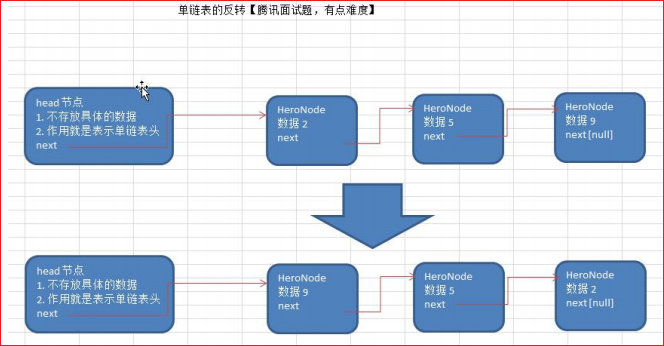

#### 思路分析

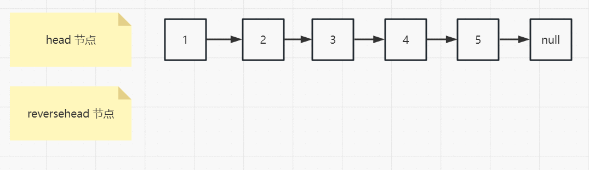

#### 流程分析

##### ①第一步

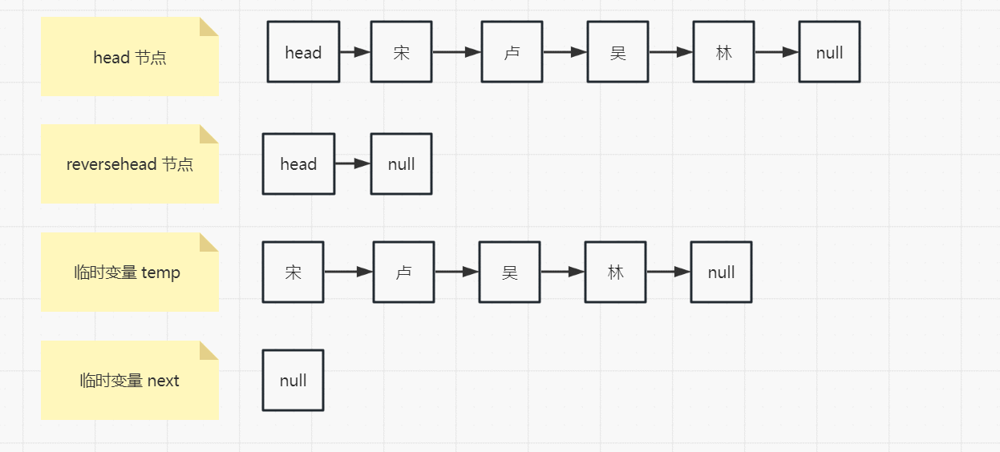

##### ②第二步

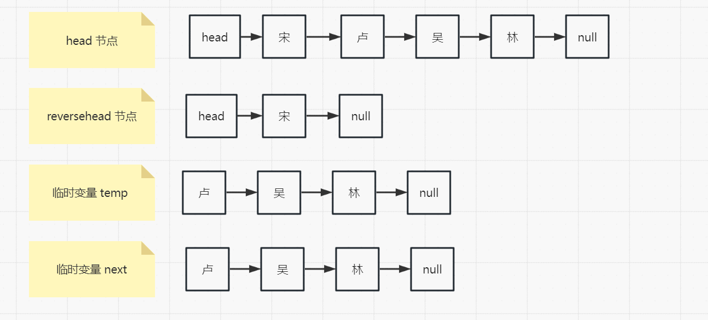

##### ③第三步

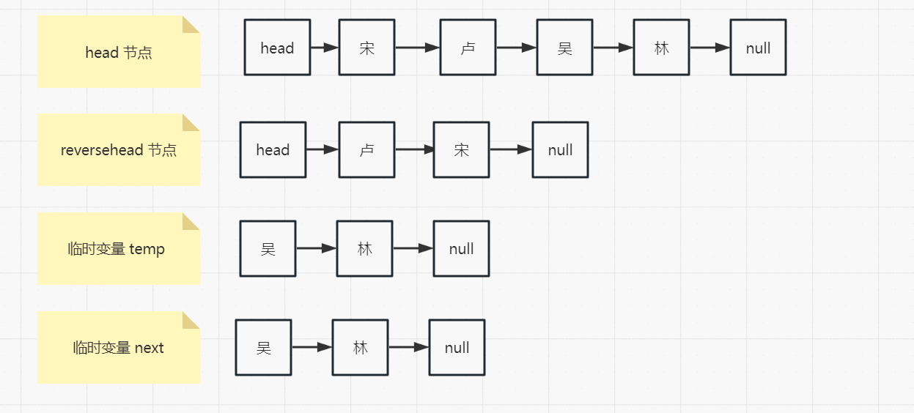

##### ④第四步

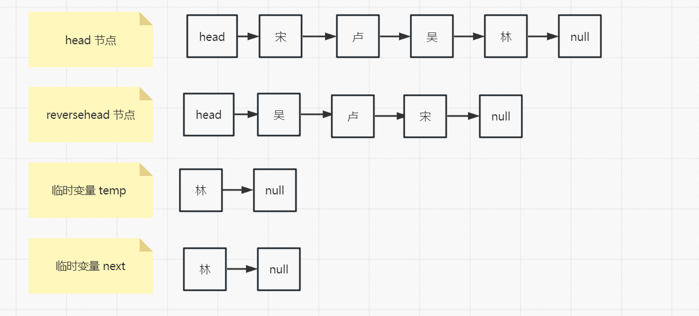

##### ⑤第五步

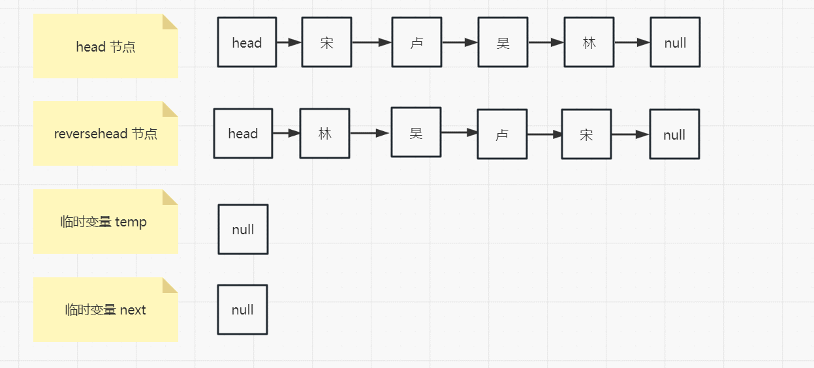

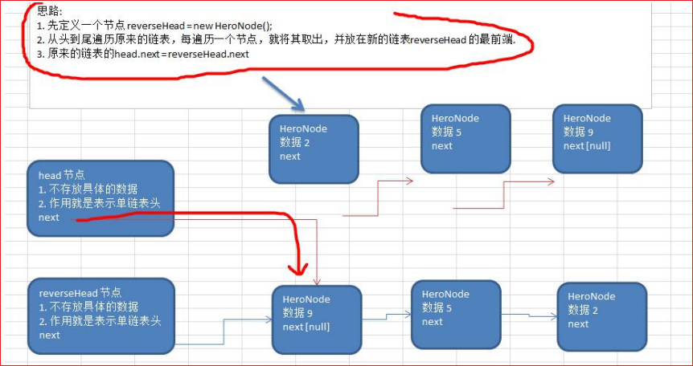

```java
//将单链表反转
public static void reverseList(HeroNode head) {
    // 如果当前链表为空，或者只有一个节点，无需反转，直接返回
    if (head.next == null || head.next.next == null) {
        return;
    }

    //定义一个辅助的指针 (变量)，帮助我们遍历原来的链表
    HeroNode temp = head.next;
    HeroNode next = null;// 指向当前节点 [temp] 的下一个节点
    HeroNode reverseNode = new HeroNode(0, "", "");
    // 遍历原来的链表，每遍历一个节点，就将其取出，并放在新的链表 reverseHead 的最前端
    while (temp != null) {
        // next 是临时变量，用于保存截断后的后面数据
        next = temp.next;
        // 临时变量 temp 后边连接 reverseNode.next
        temp.next = reverseNode.next;//将 temp 的下一个节点指向新的链表的最前端
        // null => 宋江 + null => 卢 + 宋江 + null => 吴 + 卢 + 宋江 + null => 林 + 吴 + 卢 + 宋江 + null
        reverseNode.next = temp; //将 temp 连接到新的链表上
        temp = next; // 最后 next 变成 null
    }
    System.out.println("反转链表" + reverseNode.next);
    // 重新给原先的对象
    head.next = reverseNode.next;
}
```

### 面试题合并链表

> 合并两个有序的单链表，合并之后的链表依然有序
>
> [合并两个有序链表](https://leetcode.cn/problems/merge-two-sorted-lists/)

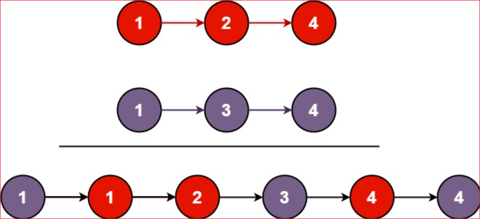

#### 流程分析

我们可以用迭代的方法来实现上述算法。当 l1 和 l2 都不是空链表时，判断 l1 和 l2 哪一个链表的头节点的值更小，将较小值的节点添加到结果里，当一个节点被添加到结果里之后，将对应链表中的节点向后移一位。

首先，我们设定一个哨兵节点 prehead，这可以在最后让我们比较容易地返回合并后的链表。我们维护一个 prev 指针，我们需要做的是调整它的 next 指针。然后，我们重复以下过程，直到 l1 或者 l2 指向了 null：如果 l1 当前节点的值小于等于 l2，我们就把 l1 当前的节点接在 prev 节点的后面同时将 l1 指针往后移一位。否则，我们对 l2 做同样的操作。不管我们将哪一个元素接在了后面，我们都需要把 prev 向后移一位。

在循环终止的时候，l1 和 l2 至多有一个是非空的。由于输入的两个链表都是有序的，所以不管哪个链表是非空的，它包含的所有元素都比前面已经合并链表中的所有元素都要大。这意味着我们只需要简单地将非空链表接在合并链表的后面，并返回合并链表即可。

下图展示了 1->4->5 和 1->2->3->6 两个链表迭代合并的过程：

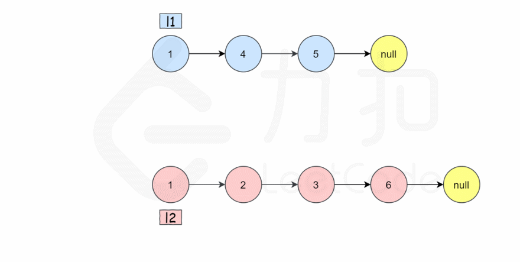

```java
public static HeroNode mergeTwoLists(HeroNode l1, HeroNode l2) {
    HeroNode preHead = new HeroNode(0, "", "");

    HeroNode temp = preHead;
    while (l1 != null && l2 != null) {
        if (l1.no <= l2.no) {
            temp.next = l1;
            System.out.println("temp=======?"+ temp.toString());
            l1 = l1.next;
        } else {
            temp.next = l2;
            System.out.println("temp=======!!!"+ temp.toString());
            l2 = l2.next;
        }
        temp = temp.next;
        System.out.println("temp==>" + temp.toString());

    }
    // 合并后 l1 和 l2 最多只有一个还未被合并完，我们直接将链表末尾指向未合并完的链表即可
    temp.next = l1 == null ? l2 : l1;
    //System.out.println(temp.equals(preHead));
    return temp.next;
}
```

## 双向链表应用实例

双向链表的操作分析和实现

使用带 head 头的双向链表实现 –水浒英雄排行榜

 管理单向链表的缺点分析：

1) 单向链表，查找的方向只能是一个方向，而双向链表可以向前或者向后查找。
2) 单向链表不能自我删除，需要靠辅助节点，而双向链表，则可以自我删除，所以前面我们单链表删除

时节点，总是找到 temp,temp 是待删除节点的前一个节点 (认真体会). 

3) 分析了双向链表如何完成遍历，添加，修改和删除的思路


## 单向环形链表应用场景

## 单向环形链表介绍

## Josephu 问题

## Josephu 问题的代码实现

