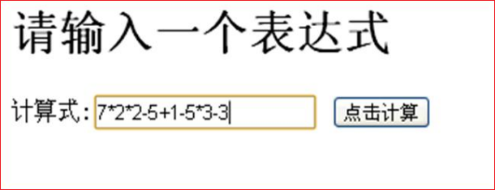
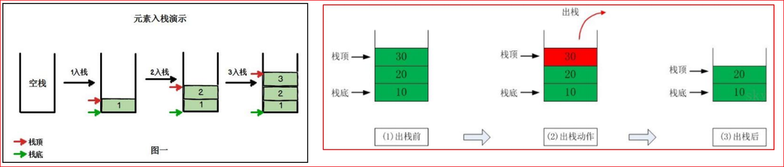
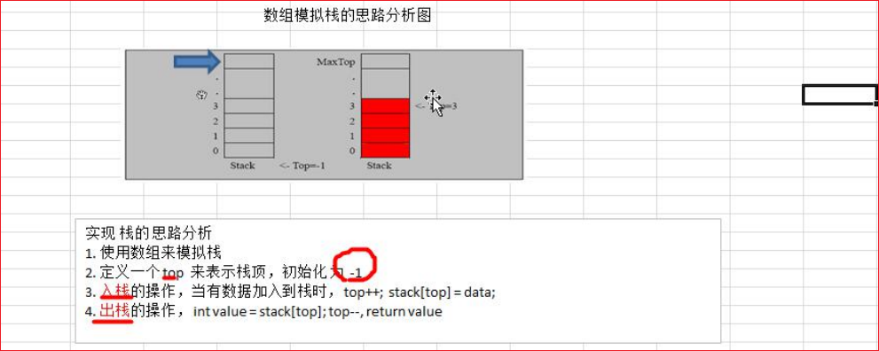
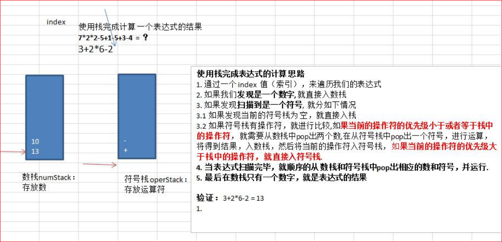

# 栈

## 栈的一个实际需求

请输入一个表达式

计算式：`[7*2*2-5+1-5+3-3]` 点击计算



计算机底层是如何运算得到结果的？

## 栈的介绍

1. 栈的英文为 (stack)
2. 栈是一个**先入后出**(FILO-First In Last Out) 的有序列表
3. 栈 (stack) 是限制线性表中元素的插入和删除只能在线性表的同一端进行的一种特殊线性表。允许插入和删除的一端，为变化的一端，称为栈顶 (Top)，另一端为固定的一端，称为栈底 (Bottom)
4. 根据栈的定义可知，最先放入栈中元素在栈底，最后放入的元素在栈顶，而删除元素刚好相反，最后放入的元素最先删除，最先放入的元素最后删除
5. 图解方式说明出栈 (pop) 和入栈 (push) 的概念



## 栈的应用场景

1. 子程序的调用：在跳往子程序前，会先将下个指令的地址存到堆栈中，直到子程序执行完后再将地址取出，以回到原来的程序中。
2. 处理递归调用：和子程序的调用类似，只是除了储存下一个指令的地址外，也将参数、区域变量等数据存入堆栈中。
3. 表达式的转换[中缀表达式转后缀表达式]与求值 (实际解决)。
4. 二叉树的遍历。
5. 图形的深度优先 (depth 一 first) 搜索法。

## 栈的快速入门

1. 用数组模拟栈的使用，由于栈是一种有序列表，当然可以使用数组的结构来储存栈的数据内容，下面我们就用数组模拟栈的出栈，入栈等操作。

2) 实现思路分析，并画出示意图



### ArrayStack

```java
package com.cj;

import java.util.Arrays;

/**
 * Created by ZhongNan
 * 2023/4/2
 * 15:29
 */
//定义一个 ArrayStack 表示栈
public class ArrayStack {
    private int maxSize; // 栈的大小
    private int[] stack; // 数组，数组模拟栈，数据就放在该数组
    private int top = -1;// top 表示栈顶，初始化为 -1

    //构造器
    public ArrayStack(int maxSize) {
        this.maxSize = maxSize;
        stack = new int[this.maxSize];
    }

    //栈满
    public boolean isFull() {
        return top == maxSize - 1;
    }

    //栈空
    public boolean isEmpty() {
        return top == -1;
    }

    //入栈-push
    public void push(int value) {
        //先判断栈是否满
        if (isFull()) {
            System.out.println("栈满");
            return;
        }
        top++;
        stack[top] = value;
    }

    //出栈-pop, 将栈顶的数据返回
    public int pop() {
        //先判断栈是否空
        if (isEmpty()) {
            //抛出异常
            throw new RuntimeException("栈空，没有数据~");
        }
        int value = stack[top];
        top--;
        return value;
    }

    //显示栈的情况 [遍历栈]，遍历时，需要从栈顶开始显示数据
    public void list() {
        if (isEmpty()) {
            System.out.println("栈空，没有数据~~");
            return;
        }
        //需要从栈顶开始显示数据
        for (int i = top; i >= 0; i--) {
            System.out.printf("stack[%d]=%d\n", i, stack[i]);
        }
    }

    @Override
    public String toString() {
        return "ArrayStack{" +
                ", stack=" + Arrays.toString(stack) +
                ", top=" + top +
                '}';
    }
}
```

### ArrayStackApp

```java
package com.cj;

/**
 * Created by ZhongNan
 * 2023/4/2
 * 15:28
 */

import java.util.Scanner;

public class ArrayStackApp {

    public static void main(String[] args) {
        //测试一下 ArrayStack 是否正确
        //先创建一个 ArrayStack 对象->表示栈
        ArrayStack stack = new ArrayStack(4);
        String key = "";
        boolean loop = true; //控制是否退出菜单
        Scanner scanner = new Scanner(System.in);

        while (loop) {
            System.out.println("show: 表示显示栈");
            System.out.println("exit: 退出程序");
            System.out.println("push: 表示添加数据到栈 (入栈)");
            System.out.println("pop: 表示从栈取出数据 (出栈)");
            System.out.println("请输入你的选择");
            key = scanner.next();
            switch (key) {
                case "show":
                    stack.list();
                    break;
                case "push":
                    System.out.println("请输入一个数");
                    int value = scanner.nextInt();
                    stack.push(value);
                    break;
                case "pop":
                    try {
                        int res = stack.pop();
                        System.out.printf("出栈的数据是 %d\n", res);
                        System.out.println(stack);
                    } catch (Exception e) {
                        // TODO: handle exception
                        System.out.println(e.getMessage());
                    }
                    break;
                case "exit":
                    scanner.close();
                    loop = false;
                    break;
                default:
                    break;
            }
        }

        System.out.println("程序退出~~~");
    }
}
```

## 栈实现综合计算器



### ArrayStack2

```java
package com.cj;

/**
 * Created by ZhongNan
 * 2023/4/2
 * 15:39
 */
//先创建一个栈，直接使用前面创建好
//定义一个 ArrayStack2 表示栈，需要扩展功能
public class ArrayStack2 {
    private int maxSize; // 栈的大小
    private int[] stack; // 数组，数组模拟栈，数据就放在该数组
    private int top = -1;// top 表示栈顶，初始化为 -1

    //构造器
    public ArrayStack2(int maxSize) {
        this.maxSize = maxSize;
        stack = new int[this.maxSize];
    }

    //增加一个方法，可以返回当前栈顶的值，但是不是真正的 pop
    public int peek() {
        return stack[top];
    }

    //栈满
    public boolean isFull() {
        return top == maxSize - 1;
    }

    //栈空
    public boolean isEmpty() {
        return top == -1;
    }

    //入栈-push
    public void push(int value) {
        //先判断栈是否满
        if (isFull()) {
            System.out.println("栈满");
            return;
        }
        top++;
        stack[top] = value;
    }

    //出栈-pop, 将栈顶的数据返回
    public int pop() {
        //先判断栈是否空
        if (isEmpty()) {
            //抛出异常
            throw new RuntimeException("栈空，没有数据~");
        }
        int value = stack[top];
        top--;
        return value;
    }

    //显示栈的情况 [遍历栈]，遍历时，需要从栈顶开始显示数据
    public void list() {
        if (isEmpty()) {
            System.out.println("栈空，没有数据~~");
            return;
        }
        //需要从栈顶开始显示数据
        for (int i = top; i >= 0; i--) {
            System.out.printf("stack[%d]=%d\n", i, stack[i]);
        }
    }

    //返回运算符的优先级，优先级是程序员来确定，优先级使用数字表示
    //数字越大，则优先级就越高。
    public int priority(int oper) {
        if (oper == '*' || oper == '/') {
            return 1;
        } else if (oper == '+' || oper == '-') {
            return 0;
        } else {
            return -1; // 假定目前的表达式只有 +, - , * , /
        }
    }

    //判断是不是一个运算符
    public boolean isOper(char val) {
        return val == '+' || val == '-' || val == '*' || val == '/';
    }

    //计算方法
    public int cal(int num1, int num2, int oper) {
        int res = 0; // res 用于存放计算的结果
        switch (oper) {
            case '+':
                res = num1 + num2;
                break;
            case '-':
                res = num2 - num1;// 注意顺序
                break;
            case '*':
                res = num1 * num2;
                break;
            case '/':
                res = num2 / num1;
                break;
            default:
                break;
        }
        return res;
    }
}
```

### Calculator

```java
package com.cj;

/**
 * Created by ZhongNan
 * 2023/4/2
 * 15:39
 */
public class Calculator {

    public static void main(String[] args) {
        //根据前面老师思路，完成表达式的运算
        String expression = "7*2*2-5+1*5+3-4"; //如何处理多位数的问题？
        char ch1 = '*';
        System.out.println((int)ch1);
        System.out.println((char) expression.substring(1, 2).charAt(0));
        //创建两个栈，数栈，一个符号栈
        ArrayStack2 numStack = new ArrayStack2(10);
        ArrayStack2 operStack = new ArrayStack2(10);
        //定义需要的相关变量
        int index = 0;//用于扫描
        int num1 = 0;
        int num2 = 0;
        int oper = 0;
        int res = 0;
        char ch = ' '; //将每次扫描得到 char 保存到 ch
        String keepNum = ""; //用于拼接 多位数
        //开始 while 循环的扫描 expression
        while (true) {
            //依次得到 expression 的每一个字符
            ch = expression.substring(index, index + 1).charAt(0);
            //判断 ch 是什么，然后做相应的处理
            if (operStack.isOper(ch)) {//如果是运算符
                //判断当前的符号栈是否为空
                if (!operStack.isEmpty()) {
                    //如果符号栈有操作符，就进行比较，如果当前的操作符的优先级小于或者等于栈中的操作符，就需要从数栈中 pop 出两个数，
                    //在从符号栈中 pop 出一个符号，进行运算，将得到结果，入数栈，然后将当前的操作符入符号栈
                    if (operStack.priority(ch) <= operStack.priority(operStack.peek())) {
                        num1 = numStack.pop();
                        num2 = numStack.pop();
                        oper = operStack.pop();
                        res = numStack.cal(num1, num2, oper);
                        //把运算的结果如数栈
                        numStack.push(res);
                        System.out.println("res 的变化" + res);
                        //然后将当前的操作符入符号栈
                        operStack.push(ch);
                        System.out.println("ch===>" + ch + "\t===operStack === > " + operStack);
                    } else {
                        //如果当前的操作符的优先级大于栈中的操作符，就直接入符号栈。
                        operStack.push(ch);
                    }
                } else {
                    //如果为空直接入符号栈..
                    operStack.push(ch); // 1 + 3
                    System.out.println("ch======================" + ch);
                    System.out.println(operStack);
                }
            } else { //如果是数，则直接入数栈

                //numStack.push(ch - 48); //? "1+3" '1' => 1
                //分析思路
                //1. 当处理多位数时，不能发现是一个数就立即入栈，因为他可能是多位数
                //2. 在处理数，需要向 expression 的表达式的 index 后再看一位，如果是数就进行扫描，如果是符号才入栈
                //3. 因此我们需要定义一个变量 字符串，用于拼接

                //处理多位数
                keepNum += ch;

                //如果 ch 已经是 expression 的最后一位，就直接入栈
                if (index == expression.length() - 1) {
                    numStack.push(Integer.parseInt(keepNum));
                } else {

                    //判断下一个字符是不是数字，如果是数字，就继续扫描，如果是运算符，则入栈
                    //注意是看后一位，不是 index++
                    if (operStack.isOper(expression.substring(index + 1, index + 2).charAt(0))) {
                        //如果后一位是运算符，则入栈 keepNum = "1" 或者 "123"
                        numStack.push(Integer.parseInt(keepNum));
                        //重要的!!!!!!, keepNum 清空
                        keepNum = "";

                    }
                }
            }
            //让 index + 1, 并判断是否扫描到 expression 最后。
            index++;
            if (index >= expression.length()) {
                break;
            }
        }

        //当表达式扫描完毕，就顺序的从数栈和符号栈中 pop 出相应的数和符号，并运行。
        while (true) {
            //如果符号栈为空，则计算到最后的结果，数栈中只有一个数字【结果】
            if (operStack.isEmpty()) {
                break;
            }
            num1 = numStack.pop();
            num2 = numStack.pop();
            oper = operStack.pop();
            res = numStack.cal(num1, num2, oper);
            numStack.push(res);//入栈
        }
        //将数栈的最后数，pop 出，就是结果
        int res2 = numStack.pop();
        System.out.println(numStack.toString());
        System.out.println(operStack.toString());
        System.out.printf("表达式 %s = %d", expression, res2);
    }

}
```


## 逆波兰计算器

## 逆波兰计算器完整版

