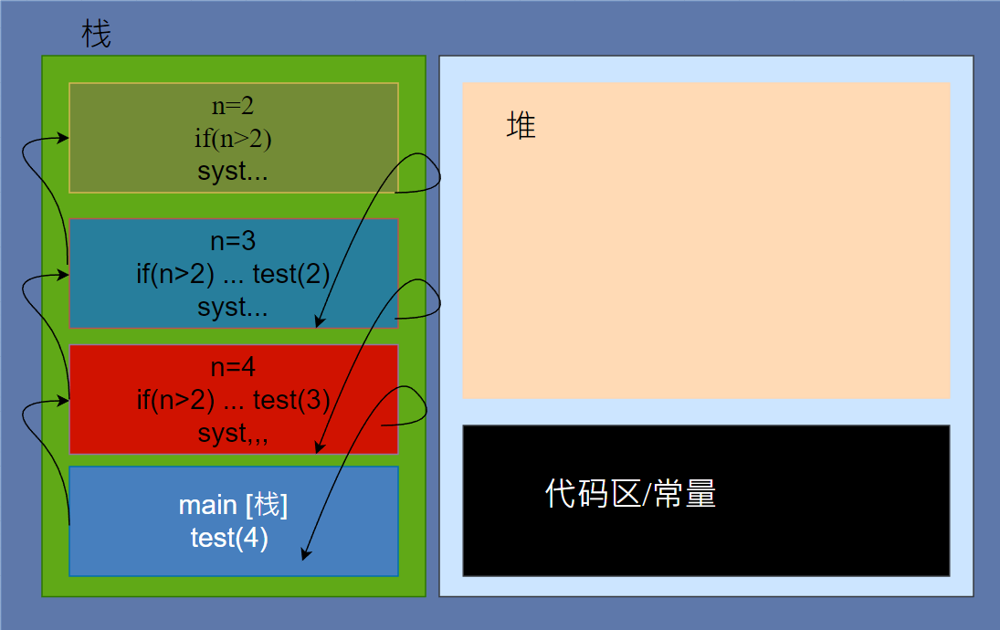
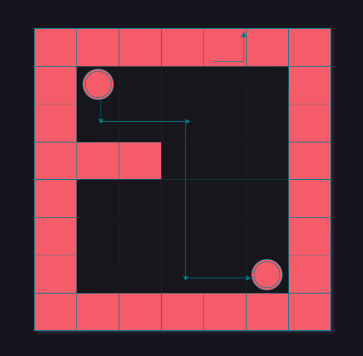
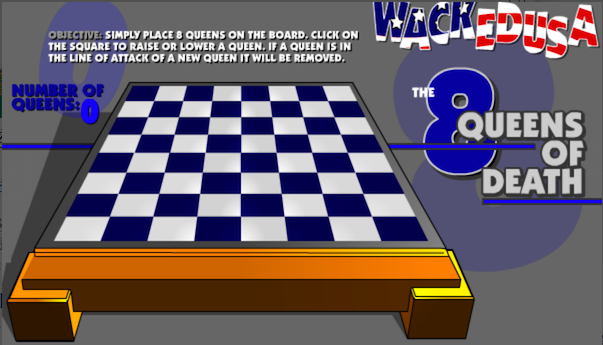
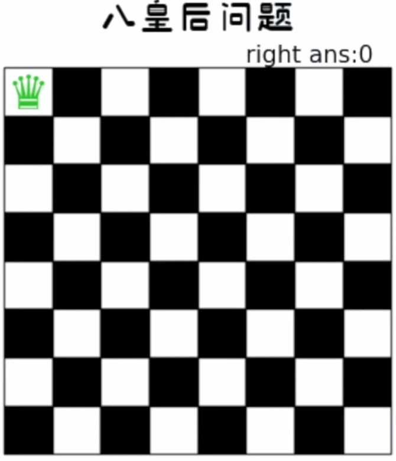
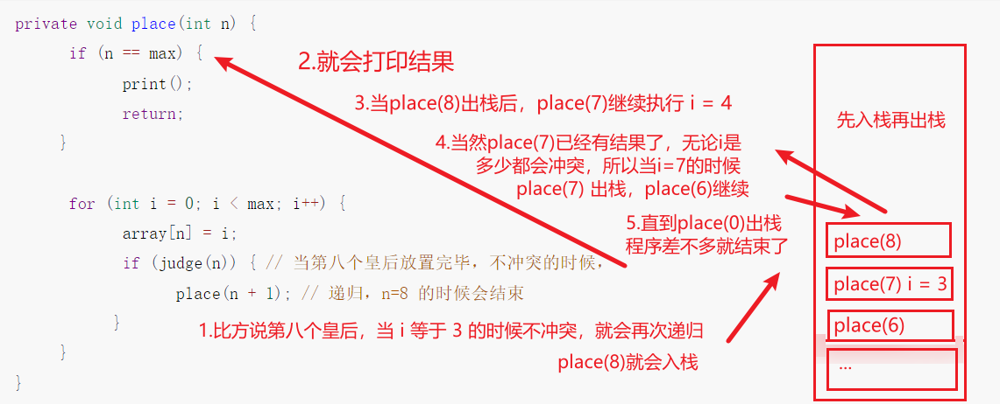

# 递归算法

## 递归的概念

**递归就是方法自己调用自己**，每次调用时**传入不同的变量**。递归有助于编程者解决复杂的问题，同时可以让代码变得简洁。

## ✨递归调用机制

### 📣打印问题

```java
public class RecursionTest {
    public static void main(String[] args) {
        // 打印问题
        test(4);
    }

    public static void test(int n) {
        if (n > 2) {
            test(n - 1);
        }
        System.out.println("n=" + n);
    }
}

//n=2
//n=3
//n=4
```

递归调用规则

- 当程序机行到一个方法时，就会开辟一个独立的空间（栈）
- 每个空间的数据（局部变量），是独立的



### 📣阶乘问题

```java
public class RecursionTest {
    public static void main(String[] args) {
        // 阶乘问题
        System.out.println(factorial(4));
    }


    // 阶乘问题 4！4*3*2*1... fn(n) = fn(n-1)*n
    public static int factorial(int n) {
        if (n == 1) {
            return 1;
        } else {
            return factorial(n - 1) * n; 
        }
    }
}
```

## 递归能解决什么样的问题

- 各种数学问题如：8 皇后问题，汉诺塔，阶乘问题，迷宫问题，球和篮子的问题 (google 编程大赛)
- 各种算法中也会使用到递归，比如快排，归并排序，二分查找，分治算法等
- 将用栈解决的问题，递归代码比较简洁

## 递归需要遵守的重要规则

1. 执行一个方法时，就创建一个新的受保护的独立空间 (栈空间)
2. 方法的局部变量是独立的，不会相互影响，比如 n 变量
3. 如果方法中使用的是引用类型变量 (比如数组)，就会共享该引用类型的数据
4. 递归**必须向退出递归的条件逼近**，否则就是无限递归，出现 `StackOverflowError`
5. 当一个方法执行完毕，或者遇到 return，就会返回，**遵守谁调用，就将结果返回给谁**，同时当方法执行完毕或者返回时，该方法也就执行完毕

## 🚩递归 - 迷宫回溯问题

### 迷宫问题



### 代码实现

```java
public class MiGong {
    public static void main(String[] args) {
        //创建一个二维数组 8*7
        int[][] map = new int[8][7];
        //使用 1 表示墙
        //上下墙
        for (int i = 0; i < 7; i++) {
            map[0][i] = 1;
            map[7][i] = 1;
        }

        //左右墙
        for (int i = 0; i < 8; i++) {
            map[i][0] = 1;
            map[i][6] = 1;
        }

        //设置挡板，1 表示
        map[3][1] = 1;
        map[3][2] = 1;
        //测试回溯现象
        map[1][2] = 1;
        map[2][2] = 1;


        // 打印地图
        for (int i = 0; i < 8; i++) {
            for (int j = 0; j < 7; j++) {
                System.out.print(map[i][j] + "  ");
            }
            System.out.println();
        }

        //使用递归回溯给小球找路
        //setWay(map, 1, 1);
        setWay2(map, 1, 1);

        System.out.println("小球走过，并标识过的 地图的情况");
        for (int i = 0; i < 8; i++) {
            for (int j = 0; j < 7; j++) {
                System.out.print(map[i][j] + "  ");
            }
            System.out.println();
        }
    }


    /**
     * 走出迷宫的方法：设定一个走的策略 下 右 上 左
     * 约定：
     *      如果小球能到 map[6][5] 位置，则说明通路找到
     *      当 map[i][j] 为 0 表示该点没有走过、当为 1 表示墙、2 表示通路可以走、3 表示该点已经走过，但是走不通
     * @date: 2023/4/24 14:47
     * @author: zhongnan
     * @param map       表示地图
     * @param i         i,j 表示从地图的哪个位置开始出发 (1,1)
     * @param j         i,j 表示从地图的哪个位置开始出发 (1,1)
     */
    public static boolean setWay(int[][] map, int i, int j) {
        // 设置为 2 就说明可以走通
        if (map[6][5] == 2) {
            return true;
        } else {
            // 0 表示这个点没有被走过
            if (map[i][j] == 0) {
                // 设定一个走的策略 下 右 上 左
                map[i][j] = 2; // 初始点，假设可以走通别的点
                if (setWay(map, i + 1, j)) {  // 向下走
                    return true;
                } else if (setWay(map, i, j + 1)) { // 向右走
                    return true;
                } else if (setWay(map, i - 1, j)) { // 向上走
                    return true;
                } else if (setWay(map, i, j - 1)) { // 向左走
                    return true;
                } else {
                    // 都走不通 说明是死路
                    map[i][j] = 3;
                    return false;
                }
            } else {
                // 有可能是 1,2,3
                return false;
            }
        }
    }

    /**
     * 走出迷宫的方法：策略不同 右 下 左 上
     * 约定：
     *      如果小球能到 map[6][5] 位置，则说明通路找到
     *      当 map[i][j] 为 0 表示该点没有走过、当为 1 表示墙、2 表示通路可以走、3 表示该点已经走过，但是走不通
     * @date: 2023/4/24 14:47
     * @author: zhongnan
     * @param map       表示地图
     * @param i         i,j 表示从地图的哪个位置开始出发 (1,1)
     * @param j         i,j 表示从地图的哪个位置开始出发 (1,1)
     */
    public static boolean setWay2(int[][] map, int i, int j) {
        // 设置为 2 就说明可以走通
        if (map[6][5] == 2) {
            return true;
        } else {
            // 0 表示这个点没有被走过
            // 如果走过来就不等于 0
            if (map[i][j] == 0) {
                // 设定一个走的策略 右 下 左 上
                map[i][j] = 2; // 初始点，假设可以走通别的点
                if (setWay2(map, i, j + 1)) {  // 向右走
                    return true;
                } else if (setWay2(map, i + 1, j)) { // 向下走
                    return true;
                } else if (setWay2(map, i, j - 1)) { // 向左走
                    return true;
                } else if (setWay2(map, i - 1, j)) { // 向上走
                    return true;
                } else {
                    // 都走不通 说明是死路
                    map[i][j] = 3;
                    return false;
                }
            } else {
                // 有可能是 1,2,3
                return false;
            }
        }
    }
}
```

### 对迷宫问题的讨论

- 小球得到的路径，和程序员设置的**找路策略**有关即：找路的上下左右的顺序相关
- 再得到小球路径时，可以先使用 (下右上左)，再改成 (**右下左上**)，看看路径是不是有变化
- 测试回溯现象
- **思考**: 如何求出最短路径？

## 🚩递归 - 八皇后问题（回溯算法）

### 八皇后问题

八皇后问题，是一个古老而著名的问题，是 **回溯算法** 的典型案例。

该问题是国际西洋棋棋手马克斯·贝瑟尔于 1848 年提出：在 8×8 格的国际象棋上摆放八个皇后，使其不能互相攻击，即：任意两个皇后都不能处于同一行、同一列或同一斜线上，问有多少种摆法。



使用回溯算法，高斯认为有 **76 种方案**。1854 年在柏林的象棋杂志上不同的作者发表了 40 种不同的解，后来有人用图论的方法解出 **92 种结果**。计算机发明后，有多种计算机语言可以解决此问题。

### 思路分析

找出八皇后有多少种摆法，其实就是**暴力穷举**，思路如下：

1. 第一个皇后先放第一行第一列
2. 第二个皇后放在第二行第一列，然后判断是否符合规则，如果不符合规则，则继续放在第 2 列，依次把所有列都放完，找到一个合适的列（某一遍）
3. 继续第 3 个皇后，直到 8 个皇后都放到了棋盘上，并且没有违反规则，就算一个解答
4. 当得到一个正确解时，在栈回退到上一个栈时，就会开始回溯，即将第一个皇后放在第一列的所有正确解全部拿到
5. 然后回头继续第一个皇后放第二列，后面继续循环执行前面 4 步

理论上应该创建一个二维数组来表示棋盘，但是实际上可以通过算法，用一个一维数组即可解决问题。 `arr[8] = {0 , 4, 7, 5, 2, 6, 1, 3}`，这个是存储结果，数组下标表示第几行，对应的值则为在那一列上摆放着。

### 过程演示



### 代码实现

```java
/**
 * @title: Queue8
 * @date: 2023/4/24 16:20
 * @author: zhongnan
 * @description: 八皇后算法
 * 规则：在 8×8 格的国际象棋上摆放八个皇后，使其不能互相攻击，即：任意两个皇后 都不能处于同一行、同一列或同一斜线上，问有多少种摆法。
 * 使用一维数组模拟，下标表示棋盘是哪一行的，值表示皇后的位置
 */
public class Queue8 {

    // 共有八个皇后
    int max = 8;

    // 测试递归了几次
    static int num = 0;
    // 测试冲突了几次
    static int judgeCount = 0;

    /**
     * 存放皇后的数组
     * 下标表示棋盘是哪一行的
     * 值表示皇后的位置
     *
     */
    int[] array = new int[max];

    int count = 0; // 统计有多少个结果

    public static void main(String[] args) {
        Queue8 queue8 = new Queue8();
        queue8.place(0);
        System.out.printf("一共递归了 %S 次", num);
        System.out.printf("一共判断冲突的次数%d次", judgeCount);

    }

    /**
     * 放置第 n 行皇后
     * 特别注意：每一次递归时，进入到 place 中都有 for(int i = 0; i < max; i++)，因此会有回溯
     * @date: 2023/4/27 17:16
     * @author: zhongnan
     * @param n n 表示行数
     * @return
     */
    private void place(int n) {
        num++;
        // n = 8，那么表示 8 个皇后已经放完了
        // 表示找到了一个正确的结果，打印这个结果，并返回
        // 直接拦截，就不再放置了
        if (n == max) {
            count++;
            print();
            return;
        }

        // 举例：0,2.4,1,3,7,0,0
        // 当 7 还不能匹配时，循环退出，返回上一个循环，也就是 3 + 1 = 4
        // 开始暴力对比，从该行的第一列开始尝试放置皇后，直到与前面所放置的不冲突
        for (int i = 0; i < max; i++) { // 0-7
            // 在该行的第 i 列上放置一个皇后
            array[n] = i;
            /**
             *      Q  *  *  *  *  *  *  *
             *      *  Q  *  *  *  *  *  *
             *      *  *  *  *  *  *  *  *
             *      *  *  *  *  *  *  *  *
             *      *  *  *  *  *  *  *  *
             *      *  *  *  *  *  *  *  *
             *      *  *  *  *  *  *  *  *
             *      *  *  *  *  *  *  *  *
             */
            if (judge(n)) { // 通过下标判断是否冲突
                // 如果不冲突，则表示该行的皇后放置没有问题
                // 开始进入下一行的皇后放置
                place(n + 1); // 递归，n=8 的时候会结束
            }
            // 如果冲突，这里什么也不做
            // 因为是从第一列开始放置，如果冲突，则尝试放置到第 2 列上，直到放置成功
        }
    }

    /**
     * 判定要放置的这一个皇后，和前面已经摆放的位置是否冲突
     * @param n                 皇后在哪行
     * @return {@link boolean}  是否冲突
     * 解释：
     *      Math.abs(n - i) == Math.abs(array[n] - array[i])
     *
     *      1、arr[0] = 1 arr[1] = 1 冲突
     *      Q  *  *  *  *  *  *  *
     *      Q  *  *  *  *  *  *  *
     *      *  *  *  *  *  *  *  *
     *      *  *  *  *  *  *  *  *
     *      *  *  *  *  *  *  *  *
     *      *  *  *  *  *  *  *  *
     *      *  *  *  *  *  *  *  *
     *      *  *  *  *  *  *  *  *
     *
     *      2、arr[0] = 1 arr[1] = 2  冲突
     *      Math.abs(1 - 0) 表示行数的差距，也就是高度
     *      Math.abs(array[1] - array[0]) 表示列数的差距，也就是跨度
     *      当高度和跨度相等的时候就是等腰直角三角形，∟，说明在同一条斜线上
     *      Math.abs(1 - 0) == Math.abs(array[n] - array[i])
     *      Q  *  *  *  *  *  *  *  *
     *      *  Q  *  *  *  *  *  *  *
     *      *  *  *  *  *  *  *  *  *
     *      *  *  *  *  *  *  *  *  *
     *      *  *  *  *  *  *  *  *  *
     *      *  *  *  *  *  *  *  *  *
     *      *  *  *  *  *  *  *  *  *
     *      *  *  *  *  *  *  *  *  *
     */
    private boolean judge(int n) {
        judgeCount++;
        for (int i = 0; i < n; i++) {
            // 冲突 如果他们的摆放位置一样，说明是在同一列，或者是同一斜线
            if (array[i] == array[n] || Math.abs(n - i) == Math.abs(array[n] - array[i])) {
                return false;
            }
        }
        return true;
    }

    /**
     * 打印皇后的位置
     */
    private void print() {
        System.out.printf("第 %02d 个结果：", count);
        for (int j : array) {
            System.out.print(j + " ");
        }
        System.out.println();
    }
}
```

```java
第 01 个结果 ：0 4 7 5 2 6 1 3 
第 02 个结果 ：0 5 7 2 6 3 1 4 
第 03 个结果 ：0 6 3 5 7 1 4 2 
第 04 个结果 ：0 6 4 7 1 3 5 2 
第 05 个结果 ：1 3 5 7 2 0 6 4 
第 06 个结果 ：1 4 6 0 2 7 5 3 
第 07 个结果 ：1 4 6 3 0 7 5 2 
第 08 个结果 ：1 5 0 6 3 7 2 4 
第 09 个结果 ：1 5 7 2 0 3 6 4 
第 10 个结果 ：1 6 2 5 7 4 0 3 
第 11 个结果 ：1 6 4 7 0 3 5 2 
第 12 个结果 ：1 7 5 0 2 4 6 3 
第 13 个结果 ：2 0 6 4 7 1 3 5 
第 14 个结果 ：2 4 1 7 0 6 3 5 
第 15 个结果 ：2 4 1 7 5 3 6 0 
第 16 个结果 ：2 4 6 0 3 1 7 5 
第 17 个结果 ：2 4 7 3 0 6 1 5 
第 18 个结果 ：2 5 1 4 7 0 6 3 
第 19 个结果 ：2 5 1 6 0 3 7 4 
第 20 个结果 ：2 5 1 6 4 0 7 3 
第 21 个结果 ：2 5 3 0 7 4 6 1 
第 22 个结果 ：2 5 3 1 7 4 6 0 
第 23 个结果 ：2 5 7 0 3 6 4 1 
第 24 个结果 ：2 5 7 0 4 6 1 3 
第 25 个结果 ：2 5 7 1 3 0 6 4 
第 26 个结果 ：2 6 1 7 4 0 3 5 
第 27 个结果 ：2 6 1 7 5 3 0 4 
第 28 个结果 ：2 7 3 6 0 5 1 4 
第 29 个结果 ：3 0 4 7 1 6 2 5 
第 30 个结果 ：3 0 4 7 5 2 6 1 
第 31 个结果 ：3 1 4 7 5 0 2 6 
第 32 个结果 ：3 1 6 2 5 7 0 4 
第 33 个结果 ：3 1 6 2 5 7 4 0 
第 34 个结果 ：3 1 6 4 0 7 5 2 
第 35 个结果 ：3 1 7 4 6 0 2 5 
第 36 个结果 ：3 1 7 5 0 2 4 6 
第 37 个结果 ：3 5 0 4 1 7 2 6 
第 38 个结果 ：3 5 7 1 6 0 2 4 
第 39 个结果 ：3 5 7 2 0 6 4 1 
第 40 个结果 ：3 6 0 7 4 1 5 2 
第 41 个结果 ：3 6 2 7 1 4 0 5 
第 42 个结果 ：3 6 4 1 5 0 2 7 
第 43 个结果 ：3 6 4 2 0 5 7 1 
第 44 个结果 ：3 7 0 2 5 1 6 4 
第 45 个结果 ：3 7 0 4 6 1 5 2 
第 46 个结果 ：3 7 4 2 0 6 1 5 
第 47 个结果 ：4 0 3 5 7 1 6 2 
第 48 个结果 ：4 0 7 3 1 6 2 5 
第 49 个结果 ：4 0 7 5 2 6 1 3 
第 50 个结果 ：4 1 3 5 7 2 0 6 
第 51 个结果 ：4 1 3 6 2 7 5 0 
第 52 个结果 ：4 1 5 0 6 3 7 2 
第 53 个结果 ：4 1 7 0 3 6 2 5 
第 54 个结果 ：4 2 0 5 7 1 3 6 
第 55 个结果 ：4 2 0 6 1 7 5 3 
第 56 个结果 ：4 2 7 3 6 0 5 1 
第 57 个结果 ：4 6 0 2 7 5 3 1 
第 58 个结果 ：4 6 0 3 1 7 5 2 
第 59 个结果 ：4 6 1 3 7 0 2 5 
第 60 个结果 ：4 6 1 5 2 0 3 7 
第 61 个结果 ：4 6 1 5 2 0 7 3 
第 62 个结果 ：4 6 3 0 2 7 5 1 
第 63 个结果 ：4 7 3 0 2 5 1 6 
第 64 个结果 ：4 7 3 0 6 1 5 2 
第 65 个结果 ：5 0 4 1 7 2 6 3 
第 66 个结果 ：5 1 6 0 2 4 7 3 
第 67 个结果 ：5 1 6 0 3 7 4 2 
第 68 个结果 ：5 2 0 6 4 7 1 3 
第 69 个结果 ：5 2 0 7 3 1 6 4 
第 70 个结果 ：5 2 0 7 4 1 3 6 
第 71 个结果 ：5 2 4 6 0 3 1 7 
第 72 个结果 ：5 2 4 7 0 3 1 6 
第 73 个结果 ：5 2 6 1 3 7 0 4 
第 74 个结果 ：5 2 6 1 7 4 0 3 
第 75 个结果 ：5 2 6 3 0 7 1 4 
第 76 个结果 ：5 3 0 4 7 1 6 2 
第 77 个结果 ：5 3 1 7 4 6 0 2 
第 78 个结果 ：5 3 6 0 2 4 1 7 
第 79 个结果 ：5 3 6 0 7 1 4 2 
第 80 个结果 ：5 7 1 3 0 6 4 2 
第 81 个结果 ：6 0 2 7 5 3 1 4 
第 82 个结果 ：6 1 3 0 7 4 2 5 
第 83 个结果 ：6 1 5 2 0 3 7 4 
第 84 个结果 ：6 2 0 5 7 4 1 3 
第 85 个结果 ：6 2 7 1 4 0 5 3 
第 86 个结果 ：6 3 1 4 7 0 2 5 
第 87 个结果 ：6 3 1 7 5 0 2 4 
第 88 个结果 ：6 4 2 0 5 7 1 3 
第 89 个结果 ：7 1 3 0 6 4 2 5 
第 90 个结果 ：7 1 4 2 0 6 3 5 
第 91 个结果 ：7 2 0 5 1 4 6 3 
第 92 个结果 ：7 3 0 2 5 1 6 4 
一共递归了 2057 次一共判断冲突的次数15720次
```

✨一定要理解它这个**回溯**机制，比如拿其中这个来分析

```java
第 06 个结果 ：1 4 6 0 2 7 5 3 
```



## 小结

- 重点 1：判定是否在棋盘是符合规则：是否是同一列、同一行、同一斜列
- 重点 2：递归的回溯流程，一定要明白是怎么回溯的
