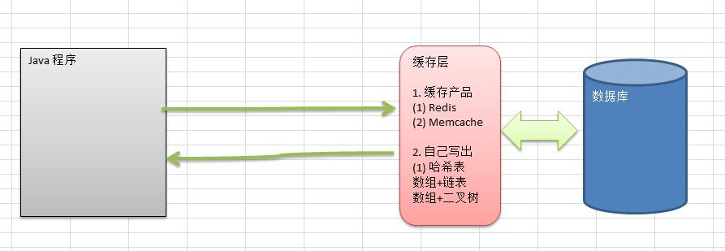
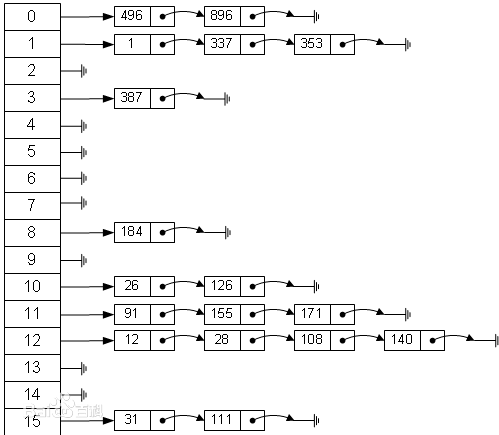
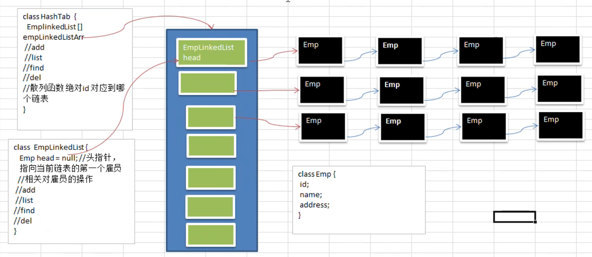

# 哈希表

哈希表是一种数据结构，不是算法

## Google 上机题场景

有一个公司，当有新的员工来报道时，要求将该员工的信息加入 (id，性别，年龄，住址...)，当输入该员工的 id 时，要求查找到该员工的**所有信息**。

要求：不使用数据库、尽量节省内存、速度越快越好。

那么这道题，就可以使用哈希表

## 基本介绍

散列表（Hash table），也叫哈希表。是根据**关键码值（key value）**而直接进行访问的数据结构。

也就是说，它**通过关键码值映射到表中的一个位置来访问记录**，以加快查找的速度。这个映射函数叫做**散列函数**，存放记录的数组叫做**散列表** 。

它的由来如下图所述：



在早些年代，没有缓存产品出现，或者在某些场景中使用缓存产品太重了，就自己写缓存实现：

- 哈希表 + 链表
- 数组 + 二叉树

哈希表在内存中的结构就如下图所示：



如上所述：

1. 左侧有 16 个元素的数组（可以用数组实现），就是一个表

2. 该表中存放的是一个链表

3. 通过**散列函数**，计算出一个位置，然后在把数据存储到这个链表上

   比如上面有 16 个，可以计算出散列值后，再取模。 `111 % 16` ，就定位在了某一个元素位置上。

## 代码实现

现在来实现上面的「Google 上机题」，要求：

- 不使用数据库，速度越快越好

- 添加时，保证按照 id 从低到高插入？课外思考：**如果 ID 不是从低到高插入**，但要求各条链表仍是从低到高，怎么解决？

- 使用**链表**来实现哈希表，该链表不带表头。即：链表的第一个节点就存放雇员信息

- 思路分析并画出示意图

- 代码实现：增、删、改、查，显示所有员工，按 ID 查询

思路分析图如下：



- HashTab：哈希表，也就是上图蓝色区块

  要实现 add、list、find、del 函数，至少还需要**散列函数**，用来决定 id 对应到哪个链表

- EmpLinkedList：链表

  对相关雇员的操作

### 相关代码

```java
/**
 * @title: HashTable
 * @date: 2023/4/27 22:57
 * @author: zhongnan
 * @description: 自定义 hash 表
 * 增、删、改、查，显示所有员工，按 ID 查询
 */
public class HashTableTest {
    public static void main(String[] args) {

        //创建哈希表
        HashTable hashTable = new HashTable(7);

        // 菜单
        String key = "";
        Scanner scanner = new Scanner(System.in);
        while (true) {
            System.out.print("add(a): 添加雇员 ::: list(l): 显示雇员 ::: find(f): 查找雇员 ::: del(d): 删除雇员 ::: exit(e): 退出系统");
            key = scanner.next();
            switch (key) {
                case "a":
                    System.out.println("输入 id");
                    int id = scanner.nextInt();
                    System.out.println("输入名字");
                    String name = scanner.next();
                    //创建雇员节点 node
                    Emp emp = new Emp(id, name);
                    hashTable.add(emp);
                    break;
                case "l":
                    hashTable.list();
                    break;
                case "f":
                    System.out.println("请输入要查找的 id");
                    id = scanner.nextInt();
                    hashTable.findEmpById(id);
                    break;
                case "d":
                    System.out.println("请输入要删除的 id");
                    id = scanner.nextInt();
                    hashTable.delEmpById(id);
                    break;
                case "e":
                    scanner.close();
                    System.exit(0);
                default:
                    break;
            }
        }
    }
}

/**
 * 定义一个 hash 表
 * hash 表的定义，再这里是数组 + 链表组成的数据结构叫链表
 */
class HashTable {

    // 链表数组，表示这个数组中存的都是 EmpLinkedList
    private EmpLinkedList[] empLinkedListArray;

    // 哈希表的长度
    private int size;

    // 构造器
    public HashTable(int size) {
        this.size = size;
        // 初始化数组
        this.empLinkedListArray = new EmpLinkedList[size];
        // 这里要特别注意，初始化数组后，数组中每个值其实都是 null，还需要为每个值初始化一个空的链表
        for (int i = 0; i < size; i++) {
            empLinkedListArray[i] = new EmpLinkedList();
        }
    }

    /**
     * 添加雇员节点
     * @param emp 节点
     * @return
     */
    public void add(Emp emp) {
        // 对员工 id 进行取模，hash
        int hashVal = hash(emp.id);
        // 将员工添加到对应的数组索引下的链表中
        empLinkedListArray[hashVal].add(emp);
    }

    /**
     * 遍历所有的链表，遍历 hashtable
     */
    public void list() {
        for (int i = 0; i < size; i++) {
            empLinkedListArray[i].list(i);
        }
    }

    /**
     * 根据id查询雇员
     * @param id 节点id
     * @return
     */
    public void findEmpById(int id) {
        // 先对id使用hash查询到存储的索引
        int index = hash(id);
        Emp emp = empLinkedListArray[index].findEmpById(id);
        // 有可能没有找到
        if (emp != null) {//找到
            System.out.printf("在第%d条链表中找到雇员 id = %d\n", index, id);
        } else {
            System.out.println("在哈希表中，没有找到该雇员~~~");
        }
    }

    /**
     * 根据id删除雇员id
     * @param id 雇员id
     * @return
     */
    public void delEmpById(int id) {
        // 先对id使用hash查询到存储的索引
        int index = hash(id);
        Emp emp = empLinkedListArray[index].delEmpById(id);
        if (emp == null) {
            System.out.printf("在第 %d 条链表中未找到 id = %d 的雇员，删除失败! \n", index, id);
        } else {
            System.out.printf("在第 %d 条链表中找到 id = %d 的雇员, name = %s ,删除成功! \n", index, id, emp.name);
        }
    }

    /**
     * 自定义散列函数，简单取模
     * @param id 通过id取模
     * @return {@link int}
     */
    private int hash(int id) {
        return id % size;
    }
}

/**
 * 定义一个雇员链表
 */
class EmpLinkedList {

    // 定义一个头节点
    // 这里头直接保存元素，和普通的链表不同，普通链表的头是空的
    private Emp head;

    /**
     * 添加一个雇员节点
     * @param emp 雇员节点
     * @return
     */
    public void add(Emp emp) {
        if (head == null) {
            head = emp;
            return;
        }

        // 定义一个辅助变量来操作，如果直接使用 head 变量操作，会改变 head 的值
        // 如果直接对 head 操作，那么 head 就会变成一个尾节点，就不是头结点了
        // 辅助变量和 head 变量指向的是同一个对象，因此通过辅助变量找到最后的节点，
        // 再添加新的节点，就等于给 head 节点的最后节点添加值，而不会改变 head 的值
        // 此处 emp 是一个 node 节点，可能比较难以理解
        Emp current = head;
        while (true) {
            if (current.next == null) {
                break;
            }
            current = current.next;
        }
        current.next = emp;
    }

    /**
     * 打印链表
     * @param no 链表编号，即数组的索引
     * @return
     */
    public void list(int no) {
        if (head == null) {
            System.out.println(no + "号链表为空");
            return;
        }
        // 辅助指针
        Emp current = head;
        // 打印链表
        System.out.print(no + "号链表：");
        while (true) {
            System.out.printf(" => id=%d name=%s ", current.id, current.name);
            if (current.next == null) {
                break;
            }
            current = current.next;
        }
        System.out.println(""); // 换行
    }

    /**
     * 根据id查找雇员
     * @param id 节点id
     * @return {@link Emp}
     */
    public Emp findEmpById(int id) {
        if (head == null) {
            System.out.println("链表为空");
            return null;
        }

        // 辅助指针
        Emp current = head;

        while (true) {
            // 找到了,当前current指向的就是要找的雇员
            if (current.id == id) {
                break;
            }
            // 如果当前节点的下一个节点是空
            if (current.next == null) {
                current = null;
                break;
            }
            // 没找到
            current = current.next;
        }
        return current;
    }

    /**
     * 根据id删除雇员,如果删除成功，返回删除成功的元素，如果删除失败就返回null
     * 前后指针法
     * @param id 节点id
     * @return {@link Emp}
     */
    public Emp delEmpById(int id) {
        if (head == null) {
            System.out.println("链表为空");
            return null;
        }

        // 辅助指针
        Emp current = head;
        Emp previous = head;

        while (true) {
            // 找到了,当前current指向的就是要找的雇员
            if (current.id == id) {
                break;
            }
            // 找下一个
            if (current.next == null) {
                current = null;
                break;
            }
            // 标记上一个雇员
            previous = current;
            // 没找到,找下一个
            current = current.next;
        }
        // 没有找到
        if (current == null) {
            return null;
        }
        // 如果找到的是头节点
        if (current == head) {
            head = null;
            return current;
        }
        // 如果已经找到目标元素，从它的上一个雇员节点中删掉自己
        previous.next = current.next;
        return current;
    }
}

/**
 * 雇员节点，node
 */
class Emp {
    public int id;
    public String name;
    public Emp next; // 下一个指针，相当于 hasChildren

    public Emp(int id, String name) {
        this.id = id;
        this.name = name;
    }
}
```

### 测试输出

```java
add(a): 添加雇员 ::: list(l): 显示雇员 ::: find(f): 查找雇员 ::: del(d): 删除雇员 ::: exit(e): 退出系统a
输入 id
1
输入名字
1
add(a): 添加雇员 ::: list(l): 显示雇员 ::: find(f): 查找雇员 ::: del(d): 删除雇员 ::: exit(e): 退出系统a
输入 id
2
输入名字
2
add(a): 添加雇员 ::: list(l): 显示雇员 ::: find(f): 查找雇员 ::: del(d): 删除雇员 ::: exit(e): 退出系统l
0号链表为空
1号链表： => id=1 name=1 
2号链表： => id=2 name=2 
3号链表为空
4号链表为空
5号链表为空
6号链表为空
add(a): 添加雇员 ::: list(l): 显示雇员 ::: find(f): 查找雇员 ::: del(d): 删除雇员 ::: exit(e): 退出系统a
输入 id
8
输入名字
8
add(a): 添加雇员 ::: list(l): 显示雇员 ::: find(f): 查找雇员 ::: del(d): 删除雇员 ::: exit(e): 退出系统l
0号链表为空
1号链表： => id=1 name=1  => id=8 name=8 
2号链表： => id=2 name=2 
3号链表为空
4号链表为空
5号链表为空
6号链表为空
add(a): 添加雇员 ::: list(l): 显示雇员 ::: find(f): 查找雇员 ::: del(d): 删除雇员 ::: exit(e): 退出系统f
请输入要查找的 id
8
在第1条链表中找到雇员 id = 8
add(a): 添加雇员 ::: list(l): 显示雇员 ::: find(f): 查找雇员 ::: del(d): 删除雇员 ::: exit(e): 退出系统d
请输入要删除的 id
8
在第 1 条链表中找到 id = 8 的雇员, name = 8 ,删除成功! 
add(a): 添加雇员 ::: list(l): 显示雇员 ::: find(f): 查找雇员 ::: del(d): 删除雇员 ::: exit(e): 退出系统l
0号链表为空
1号链表： => id=1 name=1 
2号链表： => id=2 name=2 
3号链表为空
4号链表为空
5号链表为空
6号链表为空
add(a): 添加雇员 ::: list(l): 显示雇员 ::: find(f): 查找雇员 ::: del(d): 删除雇员 ::: exit(e): 退出系统e
```

