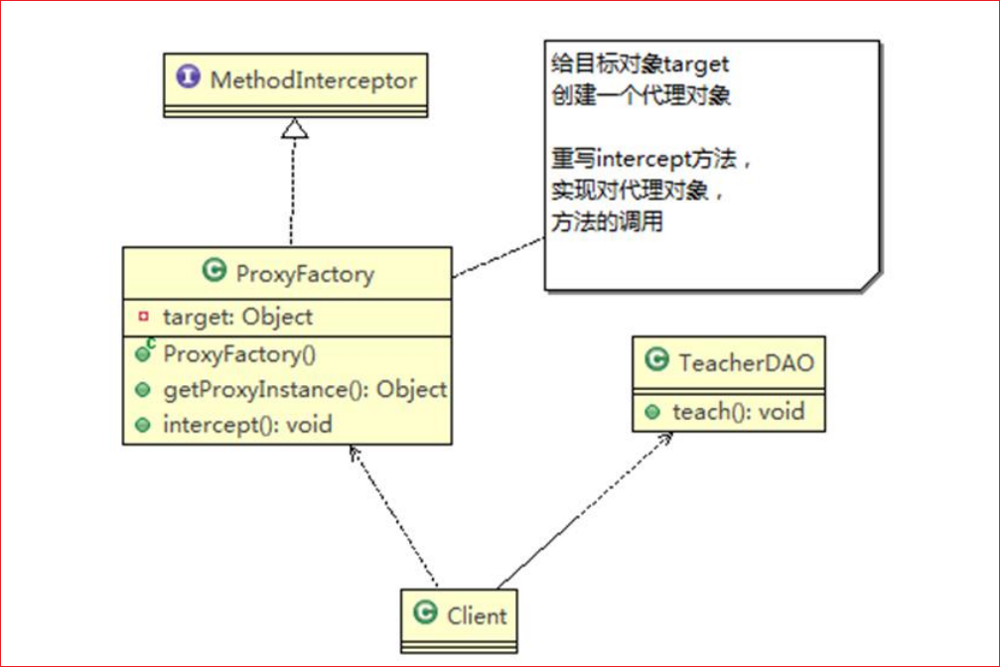
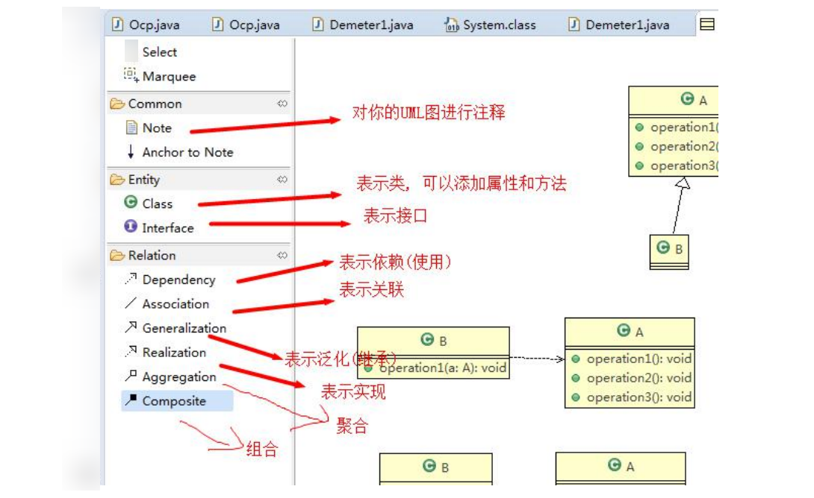
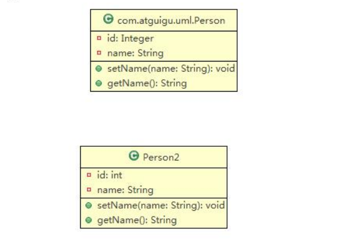
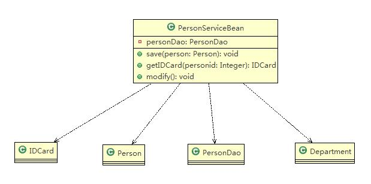
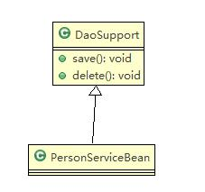
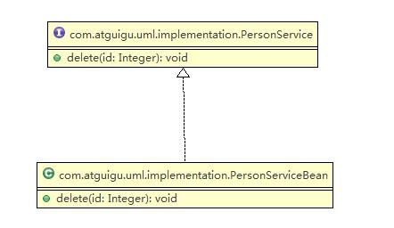
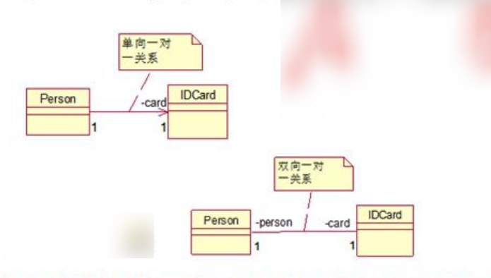
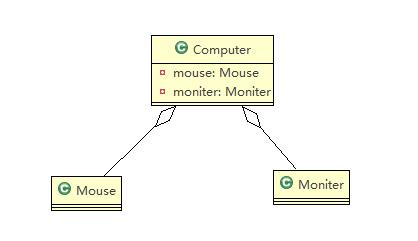
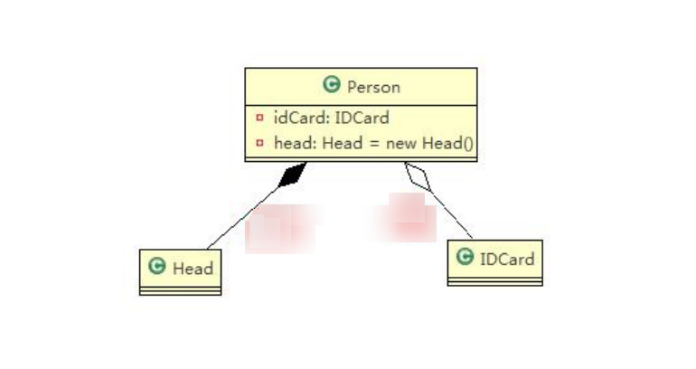
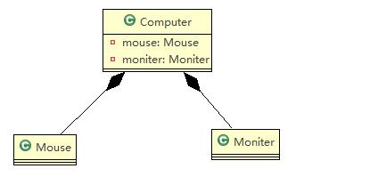

# UML 类图

## UML 基本介绍

1) UML——Unified modeling language UML (统一建模语言)，是一种用于软件系统分析和设计的语言工具，它用于帮助软件开发人员进行思考和记录思路的结果

2) UML 本身是一套符号的规定，就像数学符号和化学符号一样，这些符号用于描述软件模型中的各个元素和他们之间的关系，比如类、接口、实现、泛化、依赖、组合、聚合等
3) 使用 UML 来建模，常用的工具有 Rational Rose , 也可以使用一些插件来建模





## UML 图

画 UML 图与写文章差不多，都是把自己的思想描述给别人看，关键在于思路和条理，UML 图分类：

- 用例图 (use case)
- 静态结构图：类图、对象图、包图、组件图、部署图
- 动态行为图：交互图（时序图与协作图）、状态图、活动图

说明：

- 类图是描述类与类之间的关系的，是 UML 图中最核心的
- 在讲解设计模式时，我们必然会使用类图，为了让学员们能够把设计模式学到位，需要先给大家讲解类图
- 温馨提示：如果已经掌握 UML 类图的学员，可以直接听设计模式的章节

## UML 类图

- 用于描述系统中的类 (对象) 本身的组成和类 (对象) 之间的各种静态关系。
- 类之间的关系：依赖、泛化（继承）、实现、关联、聚合与组合。

```java
public class Person {
    private Integer id;
    private String name;

    public void setName(String name) {
        this.name = name;
    }

    public String getName() {
        return name;
    }
}
```



## 类图—依赖关系（Dependence）

只要是在类中用到了对方，那么他们之间就存在依赖关系。如果没有对方，连编绎都通过不了

```java
public class PersonServiceBean {
    private PersonDao personDao;

    public void save(Person person) {
    }

    public IDCard getIDCard(Integer personid) {
        return null;
    }

    public void modify() {
        Department department = new Department();
    }
}

public class PersonDao{}
public class IDCard{}
public class Person{}
public class Department{}


```



- 类中用到了对方
- 类的成员属性
- 方法的返回类型
- 方法接收的参数类型
- 方法中使用到

## 类图—泛化关系 (generalization）

泛化关系实际上就是继承关系，他是依赖关系的特例

```java
public abstract class DaoSupport{
	public void save(Object entity){
	}
	public void delete(Object id){
	}
}

public class PersonServiceBean extends DaoSupport {}
```



- 泛化关系实际上就是继承关系
- 如果 A 类继承了 B 类，我们就说 A 和 B 存在泛化关系

## 类图—实现关系（Implementation）

实现关系实际上就是 A 类实现 B 接口，他是依赖关系的特例

```java
public interface PersonService {
	public void delete(Integer id);
}
public class PersonServiceBean implements PersonService{
	@Override
	public void delete(Integer id) {
		System.out.println("delete..");
	}
}
```



## 类图—关联关系（Association）

- 关联关系实际上就是类与类之间的联系，他是依赖关系的特例
- 关联具有导航性：即双向关系或单向关系
- 关系具有多重性：如“1”（表示有且仅有一个)，“0...”（表示 0 个或者多个）
- “0,1”(表示 0 个或者一个)，“n.m”(表示 n 到 m 个都可以)，“m...*”（表示至少 m 个)

```java
// 单向一对一关系
public class Person{
    private IDCard card;
}
public class IDCard{}

// 双向一对一关系
public class Person
	private IDCard card;
}
public class IDCard{
	private Person person
}
```



## 类图—聚合关系（Aggregation）

聚合关系（Aggregation）表示的是整体和部分的关系，整体与部分可以分开。聚合关系是关联关系的特例，所以他具有关联的导航性与多重性

如：一台电脑由键盘 (keyboard)、显示器 (monitor)，鼠标等组成；组成电脑的各个配件是可以从电脑上分离出来的，使用带空心菱形的实线来表示

```java
public class Computer {
    private Mouse mouse;
    private Monitor monitor;

    public void setMouse(Mouse mouse) {
        this.mouse = mouse;
    }

    public void setMonitor(Monitor monitor) {
        this.monitor = monitor;
    }
}

public class Monitor {}

public class Monitor {}
```



## 类图—组合关系（Composition）

组合关系：也是整体与部分的关系，但是整体与部分不可以分开。

再看一个案例：在程序中我们定义实体：Person 与 IDCard、Head, 那么 Head 和 Person 就是 组合，IDCard 和 Person 就是聚合。

但是如果在程序中 Person 实体中定义了对 IDCard 进行级联删除，即删除 Person 时连同 IDCard 一起删除，那么 IDCard 和 Person 就是组合了

```java
public class Person{
    private IDCard card;
    private Head head = new Head();
}
public class IDCard{}
public class Head{}
```



```java
public class Computer {
    private Mouse mouse = new Mouse(); //鼠标可以和 computer 不能分离
    private Monitor monitor = new Monitor();//显示器可以和 Computer 不能分离

    public void setMouse(Mouse mouse) {
        this.mouse = mouse;
    }

    public void setMonitor(Monitor monitor) {
        this.monitor = monitor;
    }
}
    
public void setMoniter(Moniter moniter) {
    this.moniter = moniter;
    }
}

public class Mouse {}

public class Moniter {}
```


