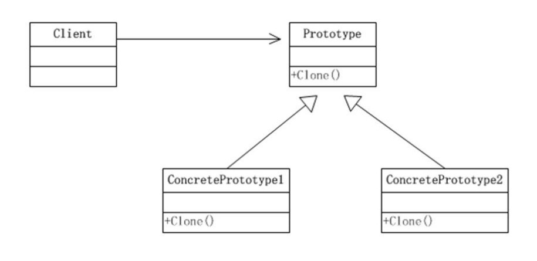
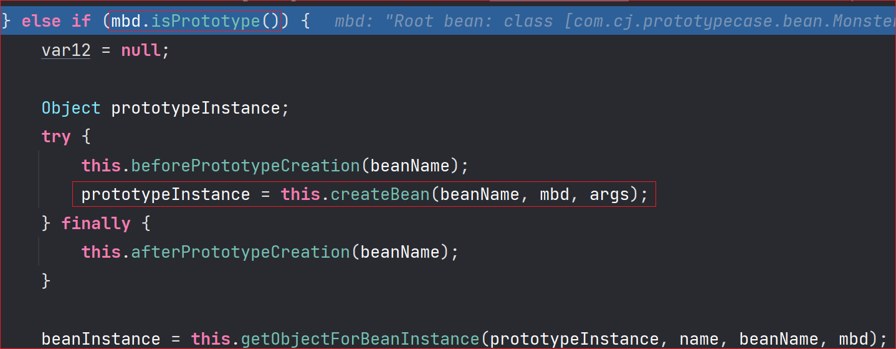
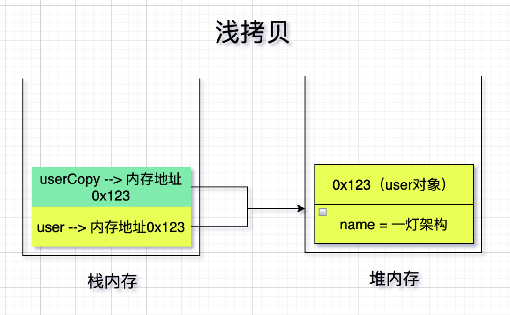
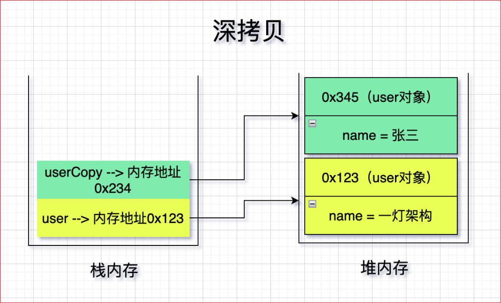

# 原型模式

> [https://refactoringguru.cn/design-patterns/prototype](https://refactoringguru.cn/design-patterns/prototype)

## 克隆羊问题

现在有一只羊 tom，姓名为：tom, 年龄为：1，颜色为：白色，请编写程序创建和 tom 羊 属性完全相同的 10 只羊。

## 传统方式解决克隆羊问题

### 思路分析


```java
public class Client {
    public static void main(String[] args) {
        Sheep sheep = new Sheep("tom", 1, 白色");

        Sheep sheep2 = new Sheep(sheep.getName(), sheep.getAge(), sheep.getColor());
        Sheep sheep3 = new Sheep(sheep.getName(), sheep.getAge(), sheep.getColor());
        Sheep sheep4 = new Sheep(sheep.getName(), sheep.getAge(), sheep.getColor());
        Sheep sheep5 = new Sheep(sheep.getName(), sheep.getAge(), sheep.getColor());

        System.out.println(sheep);
        System.out.println(sheep2);
        System.out.println(sheep3);
        System.out.println(sheep4);
        System.out.println(sheep5);
    }
}
```

## 传统的方式的优缺点

1) 优点是比较好理解，简单易操作
2) 在创建新的对象时，总是需要重新获取原始对象的属性，如果创建的对象比较复杂时，效率较低
3) 总是需要重新初始化对象，而不是动态地获得对象运行时的状态，不够灵活
4) 并非所有对象都能通过这种方式进行复制，因为有些对象可能拥有私有成员变量，它们在对象本身以外是不可见的。

### 改进的思路分析

思路：Java 中 Object 类是所有类的根类，Object 类提供了一个 clone() 方法，该方法可以将一个 Java 对象复制一份，但是需要实现 clone 的 Java 类必须要实现一个接口 Cloneable，该接口表示该类能够复制且具有复制的能力 => 原型模式

## 原型模式 - 基本介绍

- 原型模式 (Prototype 模式) 是指：用原型实例指定创建对象的种类，并且通过拷贝这些原型，创建新的对象
- 原型模式是一种创建型设计模式，允许一个对象再创建另外一个可定制的对象，无需知道如何创建的细节
- 工作原理是：通过将一个原型对象传给那个要发动创建的对象，这个要发动创建的对象通过请求原型对象拷贝它们自己来实施创建，即 `对象.clone()`

- 形象的理解：孙大圣拔出猴毛，变出其它孙大圣

## 原型模式原理结构图-uml 类图



## ✨原型模式的角色及职责

- Prototype : 原型类，声明一个克隆自己的接口
- ConcretePrototype: 具体的原型类，实现一个克隆自己的操作
- Client: 让一个原型对象克隆自己，从而创建一个新的对象 (属性一样）

## 原型模式解决克隆羊问题的应用实例

使用原型模式改进传统方式，让程序具有更高的效率和扩展性。

### Sheep

```java
package com.cj.prototype02;

public class Sheep implements Cloneable {
    private String name;
    private int age;
    private String color;
    private String address = "123";
    public Sheep friend; // 是对象，克隆是会如何处理，默认是浅拷贝

    public Sheep(String name, int age, String color) {
        super();
        this.name = name;
        this.age = age;
        this.color = color;
    }

    public String getName() {
        return name;
    }

    public void setName(String name) {
        this.name = name;
    }

    public int getAge() {
        return age;
    }

    public void setAge(int age) {
        this.age = age;
    }

    public String getColor() {
        return color;
    }

    public void setColor(String color) {
        this.color = color;
    }

    @Override
    public String toString() {
        return "Sheep [name=" + name + ", age=" + age + ", color=" + color + ", address=" + address + "]";
    }

    @Override
    protected Object clone() {
        Sheep sheep = null;
        try {
            sheep = (Sheep) super.clone();
        } catch (Exception e) {
            System.out.println(e.getMessage());
        }
        return sheep;
    }
}
```

### Client

```java
public class Client {
    public static void main(String[] args) throws CloneNotSupportedException {
        System.out.println("原型模式完成对象的创建");
        Sheep sheep = new Sheep("tom", 1, "白色");

        Sheep friend = new Sheep("jack", 2, "黑色");
        sheep.friend = friend;

        Sheep sheep2 = (Sheep) sheep.clone(); //克隆
        Sheep sheep3 = (Sheep) sheep.clone(); //克隆
        Sheep sheep4 = (Sheep) sheep.clone(); //克隆
        Sheep sheep5 = (Sheep) sheep.clone(); //克隆


        System.out.println(sheep);
        System.out.println(sheep2);
        System.out.println(sheep3);
        System.out.println(sheep4);
        System.out.println(sheep5);

        System.out.println(sheep == sheep2);
        System.out.println(sheep.equals(sheep2));

        System.out.println("sheep2 =" + sheep2 + sheep2.hashCode() + "sheep2.friend=" + sheep2.friend.hashCode());
        System.out.println("sheep3 =" + sheep3 + sheep3.hashCode() + "sheep3.friend=" + sheep3.friend.hashCode());
        System.out.println("sheep4 =" + sheep4 + sheep4.hashCode() + "sheep4.friend=" + sheep4.friend.hashCode());
        System.out.println("sheep5 =" + sheep5 + sheep5.hashCode() + "sheep5.friend=" + sheep5.friend.hashCode());

        sheep5.friend.setName("bob");
        sheep5.setName("kim");
        System.out.println("----------------------------------------------------------------------------------");
        System.out.println("sheep2 =" + sheep2 + sheep2.hashCode() + "sheep2.friend=" + sheep2);
        System.out.println("sheep3 =" + sheep3 + sheep3.hashCode() + "sheep3.friend=" + sheep3);
        System.out.println("sheep4 =" + sheep4 + sheep4.hashCode() + "sheep4.friend=" + sheep4);
        System.out.println("sheep5 =" + sheep5 + sheep5.hashCode() + "sheep5.friend=" + sheep5);

    }
}
```

## 原型模式在 Spring 框架中源码分析

Spring 中原型 bean 的创建，就是原型模式的应用

### Monster

```java
public class Monster {

    private Integer id = 10;
    private String nickname = "牛魔王";
    private String skill = "芭蕉扇";

    public Monster() {
        System.out.println("monster 创建..");
    }

    public Monster(Integer id, String nickname, String skill) {
        //System.out.println("Integer id, String nickname, String skill 被调用");
        this.id = id;
        this.nickname = nickname;
        this.skill = skill;
    }

    public Monster(String nickname, String skill, Integer id) {
        this.id = id;
        this.nickname = nickname;
        this.skill = skill;
    }

    public Integer getId() {
        return id;
    }

    public void setId(Integer id) {
        this.id = id;
    }

    public String getNickname() {
        return nickname;
    }

    public void setNickname(String nickname) {
        this.nickname = nickname;
    }

    public String getSkill() {
        return skill;
    }

    public void setSkill(String skill) {
        this.skill = skill;
    }

    @Override
    public String toString() {
        return "Monster [id=" + id + ", nickname=" + nickname + ", skill="
                + skill + "]";
    }
}
```

### ProtoType

```java
public class ProtoType {
    public static void main(String[] args) {
        ApplicationContext applicationContext = new ClassPathXmlApplicationContext("beans.xml");
        // 获取 monster[通过 id 获取 monster]
        Object bean = applicationContext.getBean("id01");
        System.out.println("bean" + bean); // 输出 "牛魔王" .....

        Object bean2 = applicationContext.getBean("id01");

        System.out.println("bean2" + bean2); //输出 "牛魔王" .....

        System.out.println(bean == bean2); // false
        System.out.println(bean.equals(bean2)); // false
        System.out.println(bean.hashCode() == bean.hashCode()); // true
    }
}
```

### beans.xml

```xml
<?xml version="1.0" encoding="UTF-8"?>
<beans xmlns="http://www.springframework.org/schema/beans"
       xmlns:xsi="http://www.w3.org/2001/XMLSchema-instance"
       xmlns:p="http://www.springframework.org/schema/p"
       xmlns:util="http://www.springframework.org/schema/util"
       xmlns:context="http://www.springframework.org/schema/context"
       xsi:schemaLocation="http://www.springframework.org/schema/beans http://www.springframework.org/schema/beans/spring-beans.xsd
		http://www.springframework.org/schema/util http://www.springframework.org/schema/util/spring-util-4.0.xsd
		http://www.springframework.org/schema/context http://www.springframework.org/schema/context/spring-context-4.0.xsd">


    <!-- 这里我们的 scope="prototype" 即 原型模式来创建 -->
    <bean id="id01" class="com.cj.prototypecase.bean.Monster" scope="prototype"/>

</beans>
```



## 浅拷贝和深拷贝

浅拷贝：在拷贝一个对象时，复制基本数据类型的成员变量，但对引用数据类型的成员变量只进行引用的传递（复制其地址引用），并不会创建一个新的对象。简单地说就是被拷贝对象和浅拷贝得到的新对象，它们的引用数据类型的成员变量指向同一个内存地址。



深拷贝：在拷贝一个对象时，除了复制基本数据类型的成员变量，对引用数据类型的成员变量进行拷贝时，会创建一个新的对象来保存引用类型的成员变量。简单地说就是被拷贝对象和深拷贝得到的新对象，它们的引用数据类型的成员变量指向不同的内存地址。



### 浅拷贝的介绍

- 对于数据类型是基本数据类型的成员变量，浅拷贝会直接进行值传递，也就是将该属性值复制一份给新的对象。
- 对于数据类型是引用数据类型的成员变量，比如说成员变量是某个数组、某个类的对象等，那么浅拷贝会进行引用传递，也就是只是将该成员变量的引用值（内存地址）复制一份给新的对象。因为**实际上两个对象的该成员变量都指向同一个实例**。在这种情况下，在一个对象中修改该成员变量会影响到另一个对象的该成员变量值

- 前面我们克隆羊就是浅拷贝
- 浅拷贝是使用默认的 clone() 方法来实现 `sheep = (Sheep) super.clone();`

### 深拷贝的介绍

- 复制对象的所有基本数据类型的成员变量值
- 为所有引用数据类型的成员变量申请存储空间，并复制每个引用数据类型成员变量所引用的对象，直到该对象可达的所有对象。也就是说，对象进行深拷贝要对整个对象 (包括对象的引用类型) 进行拷贝

- 深拷贝实现方式 1：重写 clone 方法来实现深拷贝
- 深拷贝实现方式 2：通过对象序列化实现深拷贝 (推荐)

## 深拷贝应用实例

> 深拷贝有很多工具类实现，不需要使用原生方式实现，知道原理即可
>
> [Java 中对象拷贝有哪些好用的工具类？（建议收藏）](https://juejin.cn/post/7051166519811637278)

### DeepCloneableTarget

```java
public class DeepCloneableTarget implements Serializable, Cloneable {

    /**
     *
     */
    private static final long serialVersionUID = 1L;

    private String cloneName;

    private String cloneClass;

    //构造器
    public DeepCloneableTarget(String cloneName, String cloneClass) {
        this.cloneName = cloneName;
        this.cloneClass = cloneClass;
    }

    //因为该类的属性，都是 String , 因此我们这里使用默认的 clone 完成即可
    @Override
    protected Object clone() throws CloneNotSupportedException {
        return super.clone();
    }
}
```

### DeepProtoType

```
public class DeepProtoType implements Serializable, Cloneable {

    public String name; //String 属性
    public DeepCloneableTarget deepCloneableTarget;// 引用类型

    public DeepProtoType() {
        super();
    }

   //深拷贝 - 方式 1 使用 clone 方法
    @Override
    protected Object clone() throws CloneNotSupportedException {
        //这里完成对基本数据类型 (属性) 和 String 的克隆
        DeepProtoType deepProtoType = (DeepProtoType) super.clone();
        //对引用类型的属性，进行单独处理
        deepProtoType.deepCloneableTarget = (DeepCloneableTarget) deepCloneableTarget.clone();
        return deepProtoType;
    }

    //深拷贝 - 方式 2 通过对象的序列化实现 (推荐)

    public Object deepClone() {

        //创建流对象
        ByteArrayOutputStream bos = null;
        ObjectOutputStream oos = null;
        ByteArrayInputStream bis = null;
        ObjectInputStream ois = null;

        try {

            //序列化
            bos = new ByteArrayOutputStream();
            oos = new ObjectOutputStream(bos);
            oos.writeObject(this); //当前这个对象以对象流的方式输出

            //反序列化
            bis = new ByteArrayInputStream(bos.toByteArray());
            ois = new ObjectInputStream(bis);
            DeepProtoType copyObj = (DeepProtoType) ois.readObject();

            return copyObj;

        } catch (Exception e) {
            e.printStackTrace();
            return null;
        } finally {
            //关闭流
            try {
                bos.close();
                oos.close();
                bis.close();
                ois.close();
            } catch (Exception e2) {
                System.out.println(e2.getMessage());
            }
        }
    }
}
```

### Client

```java
public class Client {

    public static void main(String[] args) throws Exception {
        DeepProtoType p = new DeepProtoType();
        p.name = "宋江";
        p.deepCloneableTarget = new DeepCloneableTarget("大牛", "小牛");

        //方式 1 完成深拷贝

//		DeepProtoType p2 = (DeepProtoType) p.clone();
//
//		System.out.println("p.name=" + p.name + "p.deepCloneableTarget=" + p.deepCloneableTarget.hashCode());
//		System.out.println("p2.name=" + p.name + "p2.deepCloneableTarget=" + p2.deepCloneableTarget.hashCode());

        //方式 2 完成深拷贝
        DeepProtoType p2 = (DeepProtoType) p.deepClone();

        System.out.println("p.name=" + p.name + "p.deepCloneableTarget=" + p.deepCloneableTarget.hashCode());
        System.out.println("p2.name=" + p.name + "p2.deepCloneableTarget=" + p2.deepCloneableTarget.hashCode());
    }
}
```

## 原型模式的注意事项和细节

- 创建新的对象比较复杂时，可以利用原型模式简化对象的创建过程，同时也能够提高效率
- 不用重新初始化对象，而是动态地获得对象运行时的状态
- 如果原始对象发生变化 (增加或者减少属性)，其它克隆对象的也会发生相应的变化，无需修改代码
- 在实现深克隆的时候可能需要比较复杂的代码
- 缺点：需要为每一个类配备一个克隆方法，这对全新的类来说不是很难，但对已有的类进行改造时，需要修改其源代码，违背了 ocp 原则，这点请同学们注意

## 拓展阅读

[Java 浅拷贝和深拷贝 (一文足矣)，及 String 类型的坑。](https://blog.csdn.net/q258523454/article/details/88942478)

阿里有一道这样的面试题：一个实现 Cloneable 的类中，clone() 后的 String 类型数据，是深拷贝还是浅拷？

这个问题，如果换做是基本数据类型，相信你一下就脱口而出；但 String 是非基本类型。

String 类型有点特殊，它本身没有实现 Cloneable 接口，故根本无法克隆，只能传递引用（注意：Java 只有值传递，只是这里传递是原来引用地址值）。在 clone() 后，克隆后的对象开始也是指向的原来引用地址值，但是一旦 String 的值发生改变（String 作为不可更改的类——immutable class，在 new 赋值的时候，会创建了一个新的对象）就改变了克隆后对象指向的地址，让它指向了一个新的 String 地址，，不会影响原对象的指向和值，原来的 String 对象还是指向的它自己的的地址。这样 String 在拷贝的时候就表现出了深拷贝的特点。
