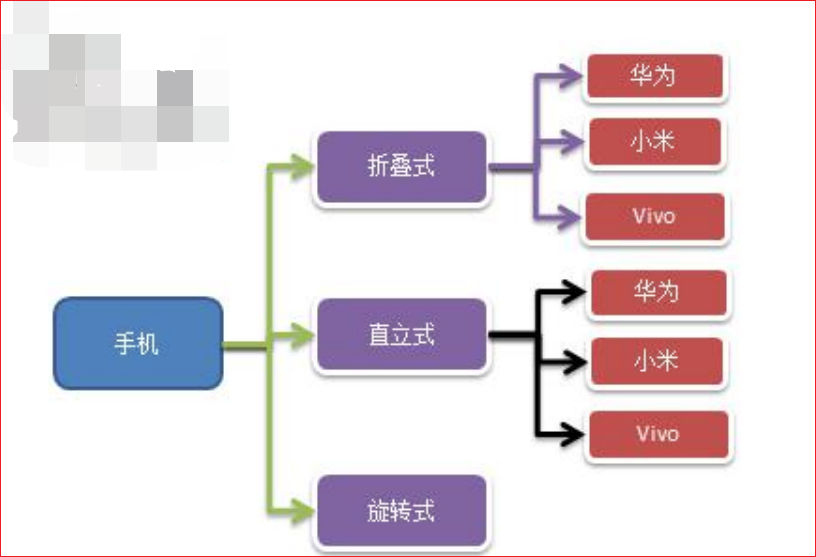
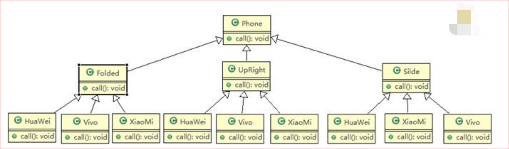
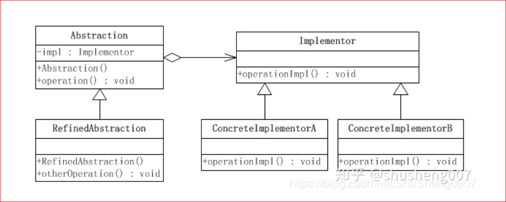
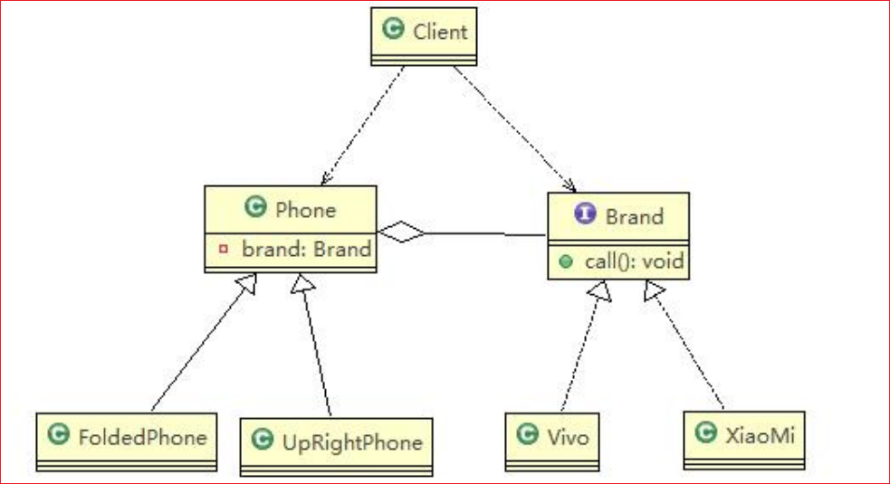
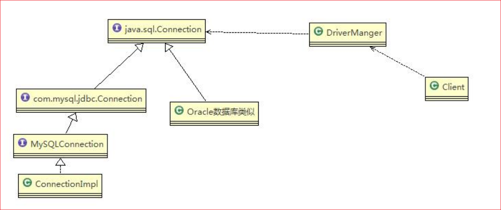

# 桥接模式

> [秒懂设计模式之桥接模式（Bridge Pattern）](https://zhuanlan.zhihu.com/p/58903776)
>
> [桥接](https://www.liaoxuefeng.com/wiki/1252599548343744/1281319266943009)

## 手机操作问题

现在对不同手机类型的不同品牌实现操作编程（比如：开机、关机、上网，打电话等），如图

## 传统方案解决手机操作问题

## 传统方案解决手机操作问题分析

1) 扩展性问题（类爆炸），如果我们再增加手机的样式（旋转式），就需要增加各个品牌手机的类，同样如果我们增加一个手机品牌，也要在各个手机样式类下增加

2) 违反了单一职责原则，当我们增加手机样式时，要同时增加所有品牌的手机，这样增加了代码维护成本 

## 桥接模式 (BRIDGE)-基本介绍

1) 桥接模式 (Bridge 模式) 是指：将实现与抽象放在两个不同的类层次中，使两个层次可以独立改变
2) 是一种结构型设计模式
3) Bridge 模式基于类的最小设计原则，通过使用封装、聚合及继承等行为让不同的类承担不同的职责。它的主要特点是把抽象 (Abstraction) 与行为实现 (Implementation) 分离开来，从而可以保持各部分的独立性以及应对他们的

## 功能扩展桥接模式 (BRIDGE)-原理类图

## ✨桥接模式的角色及职责

1) **抽象化 (Abstraction) 角色**：抽象化给出的定义，并保存一个对实现化对象的引用。
2) **修正抽象化 (RefinedAbstraction) 角色**：扩展抽象化角色，改变和修正父类对抽象化的定义。
3) **实现化 (Implementor) 角色**：这个角色给出实现化角色的接口，但不给出具体的实现。必须指出的是，这个接口不一定和抽象化角色的接口定义相同，实际上，这两个接口可以非常不一样。实现化角色应当只给出底层操作，而抽象化角色应当只给出基于底层操作的更高一层的操作。
4) **具体实现化 (ConcreteImplementor) 角色**：这个角色给出实现化角色接口的具体实现。

## 桥接模式解决手机操作问题

使用桥接模式改进传统方式，让程序具有搞好的扩展性，利用程序维护

1) 应用实例说明 (和前面要求一样)
2) 使用桥接模式对应的类图

## 桥接模式在 JDBC 的源码剖析

Jdbc 的 Driver 接口，如果从桥接模式来看，Driver 就是一个接口，下面可以有 MySQL 的 Driver，Oracle 的 Driver，这些就可以当做实现接口类。

## 桥接模式的注意事项和细节

1) 实现了抽象和实现部分的分离，从而极大的提供了系统的灵活性，让抽象部分和实现部分独立开来，这有助于系统进行分层设计，从而产生更好的结构化系统

2) 对于系统的高层部分，只需要知道抽象部分和实现部分的接口就可以了，其它的部分由具体业务来完成
3) 桥接模式替代多层继承方案，可以减少子类的个数，降低系统的管理和维护成本
4) 桥接模式的引入增加了系统的理解和设计难度，由于聚合关联关系建立在抽象层，要求开发者针对抽象进行设计和编程

5) 桥接模式要求正确识别出系统中两个独立变化的维度 (抽象、和实现)，因此其使用范围有一定的局限性，即需要有这样的应用场景

## 常见的应用场景

1) JDBC 驱动程序
2) 银行转账系统
   1) 转账分类：网上转账，柜台转账，AMT 转账
   2) 转账用户类型：普通用户，银卡用户，金卡用户.. 
3) 消息管理
   1) 消息类型：即时消息，延时消息
   2) 消息分类：手机短信，邮件消息，QQ 消息
