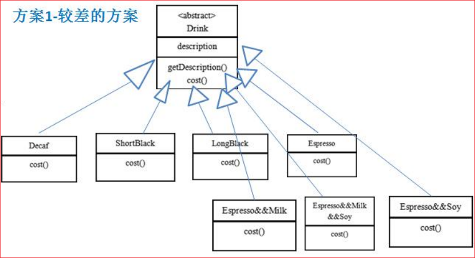
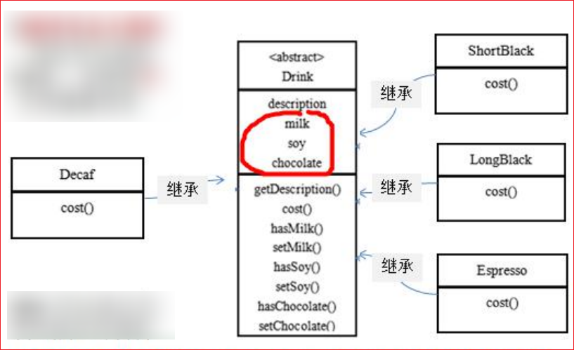
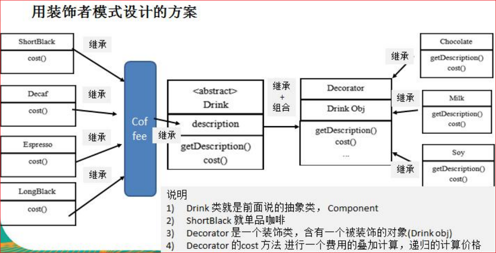
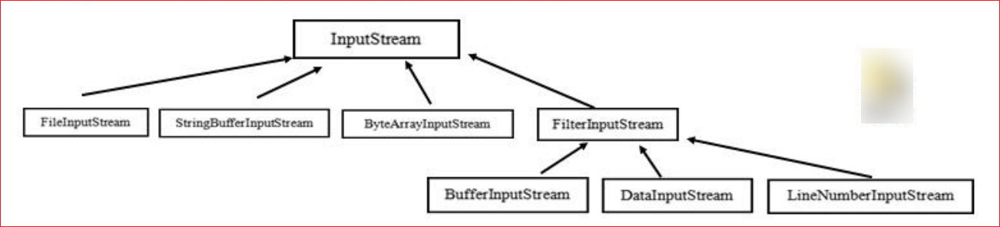

# 装饰者模式

## 星巴克咖啡订单项目

1) 咖啡种类/单品咖啡：Espresso(意大利浓咖啡)、ShortBlack、LongBlack(美式咖啡)、Decaf(无因咖啡)
2) 调料：Milk、Soy(豆浆)、Chocolate
3) 要求在扩展新的咖啡种类时，具有良好的扩展性、改动方便、维护方便
4) 使用 oo 的来计算不同种类咖啡的费用：客户可以点单品咖啡，也可以单品咖啡 + 调料组合

## 方案一



1) Drink 是一个抽象类，表示饮料
2) description 就是对咖啡的描述，比如咖啡的名字
3) cost() 方法就是计算费用，Drink 类中做成一个抽象方法
4) Decaf 就是单品咖啡，继承 Drink，并实现 cost
5) Espress && Milk 就是单品咖啡 + 调料，这个组合很多
6) 问题：这样设计，会有很多类，当我们增加一个单品咖啡，或者一个新的调料，类的数量就会倍增，就会出现类爆炸

## 方案二

将调料内置到 Drink 类，这样就不会造成类数量过多。从而提高项目的维护性



1) 方案 2 可以控制类的数量，不至于造成很多的类
2) 在增加或者删除调料种类时，代码的维护量很大

## 装饰者模式定义

装饰者模式：动态的将新功能附加到对象上。在对象功能扩展方面，它比继承更有弹性，装饰者模式也体现了开闭原则 (ocp)

## ✨装饰者模式的角色及职责

1) 装饰者模式就像打包一个快递

   主体：比如：陶瓷、衣服 (Component) // 被装饰者

   包装：比如：报纸填充、塑料泡沫、纸板、木板 (Decorator)

2) Component 主体：比如类似前面的 Drink

3) ConcreteComponent 和 Decorator

   ConcreteComponent：具体的主体，比如前面的各个单品咖啡

   Decorator: 装饰者，比如各调料

在如图的 Component 与 ConcreteComponent 之间，如果 ConcreteComponent 类很多，还可以设计一个缓冲层，将共有的部分提取出来，抽象层一个类。

## 装饰者模式解决星巴克咖啡订单



## 装饰者模式在 JDK 应用的源码分析

Java 的 IO 结构，FilterInputStream 就是一个装饰者



```java
public class Decorator {
    public static void main(String[] args) throws Exception {
        /*1. InputStream 是抽象类，类似我们前面讲的 Drink
        2. FileInputStream 是 InputStream 子类，类似我们前面的 DeCaf, LongBlack
        3. FilterInputStream 是 InputStream 子类：类似我们前面 的 Decorator 修饰者
        4. DataInputStream 是 FilterInputStream 子类，具体的修饰者，类似前面的 Milk, Soy 等
        5. FilterInputStream 类 有 protected volatile InputStream in; 即含被装饰者
        6. 分析得出在 jdk 的 io 体系中，就是使用装饰者模式*/
        DataInputStream dis = new DataInputStream(new FileInputStream("d:\\abc.txt"));
        System.out.println(dis.read());
        dis.close();
    }
}
```

