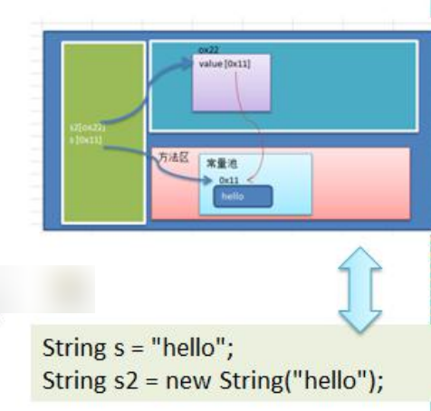
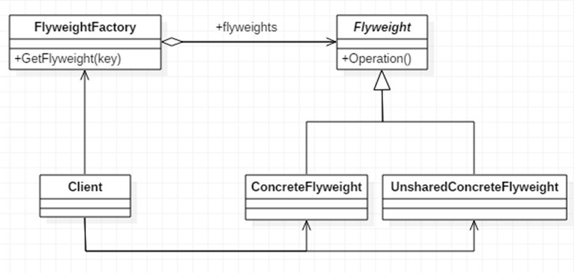
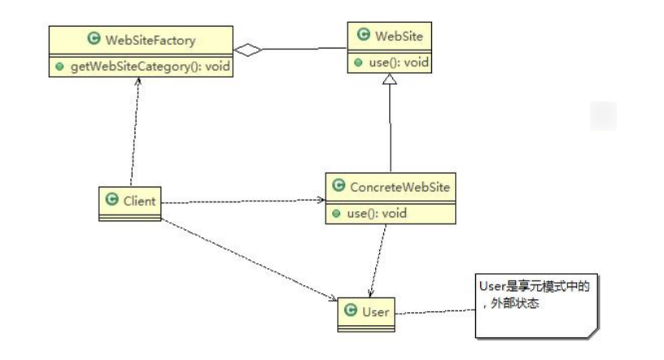

# 享元模式

## 展示网站项目需求

小型的外包项目，给客户 A 做一个产品展示网站，客户 A 的朋友感觉效果不错，也希望做这样的产品展示网站，但是要求都有些不同：

- 有客户要求以新闻的形式发布
- 有客户人要求以博客的形式发布
- 有客户希望以微信公众号的形式发布

## 传统方案解决网站展现项目

- 直接复制粘贴一份，然后根据客户不同要求，进行定制修改

- 给每个网站租用一个空间

- 方案设计示意图

  

## 传统方案解决网站展现项目 - 问题分析

- 需要的网站结构相似度很高，而且都不是高访问量网站，如果分成多个虚拟空间来处理，相当于一个相同网站的实例对象很多，造成服务器的资源浪费
- 解决思路：整合到一个网站中，共享其相关的代码和数据，对于硬盘、内存、CPU、数据库空间等服务器资源都可以达成共享，减少服务器资源
- 对于代码来说，由于是一份实例，维护和扩展都更加容易
- 上面的解决思路就可以使用 享元模式 来解决

##  享元模式基本介绍

- 享元模式（Flyweight Pattern）也叫 蝇量模式：运用共享技术有效地支持大量细粒度的对象
- 常用于系统底层开发，解决系统的性能问题。像数据库连接池，里面都是创建好的连接对象，在这些连接对象中有我们需要的则直接拿来用，避免重新创建，如果没有我们需要的，则创建一个
- 享元模式能够解决重复对象的内存浪费的问题，当系统中有大量相似对象，需要缓冲池时。不需总是创建新对象，可以从缓冲池里拿。这样可以降低系统内存，同时提高效率
- 享元模式经典的应用场景就是池技术了，String 常量池、数据库连接池、缓冲池等等都是享元模式的应用，享元模式是池技术的重要实现方式

## 享元模式的原理类图

## ✨模式的角色及职责

- FlyWeight 是抽象的享元角色，他是产品的抽象类，同时定义出对象的外部状态和内部状态 (后面介绍) 的接口或实现
- ConcreteFlyWeight 是具体的享元角色，是具体的产品类，实现抽象角色定义相关业务
- UnSharedConcreteFlyWeight 是不可共享的角色，一般不会出现在享元工厂。
- FlyWeightFactory 享元工厂类，用于构建一个池容器 (集合)，同时提供从池中获取对象方法

## 内部状态和外部状态

比如围棋、五子棋、跳棋，它们都有大量的棋子对象，围棋和五子棋只有黑白两色，跳棋颜色多一点，所以棋子颜色就是棋子的内部状态；而各个棋子之间的差别就是位置的不同，当我们落子后，落子颜色是定的，但位置是变化的，所以棋子坐标就是棋子的外部状态

- 享元模式提出了两个要求：细粒度和共享对象。这里就涉及到内部状态和外部状态了，即将对象的信息分为两个部分：内部状态和外部状态
- **内部状态**指对象共享出来的信息，**存储在享元对象内部且不会随环境的改变而改**变
- 外部状态指对象得以依赖的一个标记**，是**随环境改变而改变的、不可共享的状**态。
- 举个例子：围棋理论上有 361 个空位可以放棋子，每盘棋都有可能有两三百个棋子对象产生，因为内存空间有限，一台服务器很难支持更多的玩家玩围棋游戏，如果用享元模式来处理棋子，那么棋子对象就可以减少到只有两个实例，这样就很好的解决了对象的开销问题

## 享元模式解决网站展现项目

使用享元模式完成，前面提出的网站外包问题

### 思路分析和图解

### 代码实现

## 享元模式的注意事项和细节

- 在享元模式这样理解，“享”就表示共享，“元”表示对象
- 系统中有大量对象，这些对象消耗大量内存，并且对象的状态大部分可以外部化时，我们就可以考虑选用享元模式
- 用唯一标识码判断，如果在内存中有，则返回这个唯一标识码所标识的对象，用 HashMap/HashTable 存储
- 享元模式大大减少了对象的创建，降低了程序内存的占用，提高效率
- 享元模式提高了**系统的复杂度**。需要分离出**内部状态和外部状态**，而外部状态具有固化特性，不应该随着内部状态的改变而改变，这是我们使用享元模式需要注意的地方。
- 使用享元模式时，注意划分内部状态和外部状态，并且需要有一个工厂类加以控制。
- 享元模式经典的应用场景是需要缓冲池的场景，比如 String 常量池、数据库连接池
