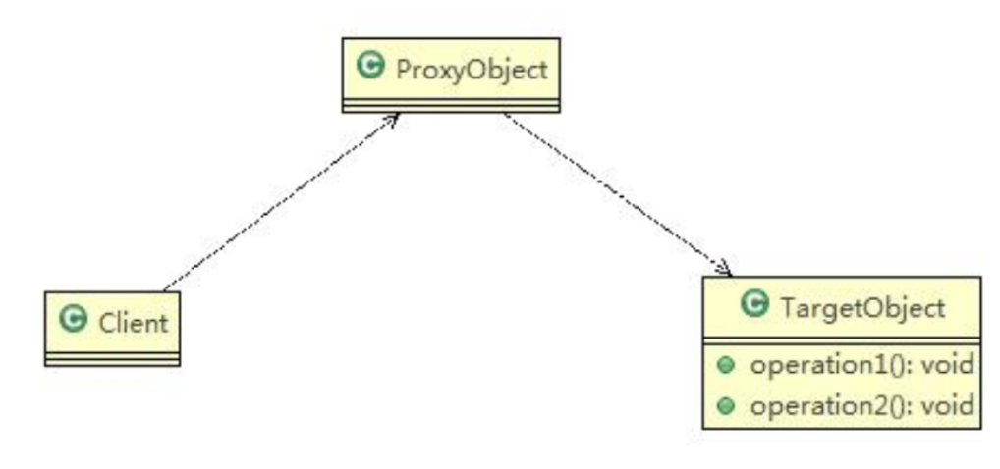
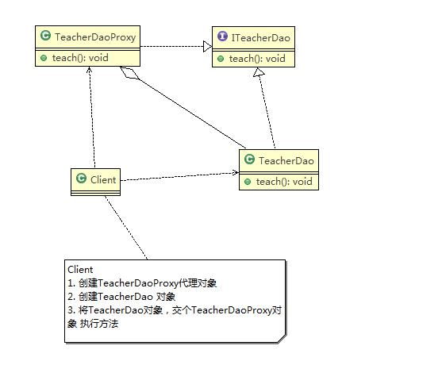
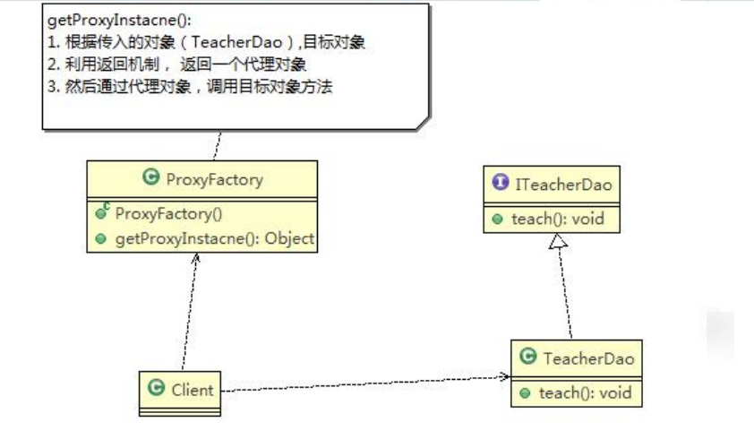
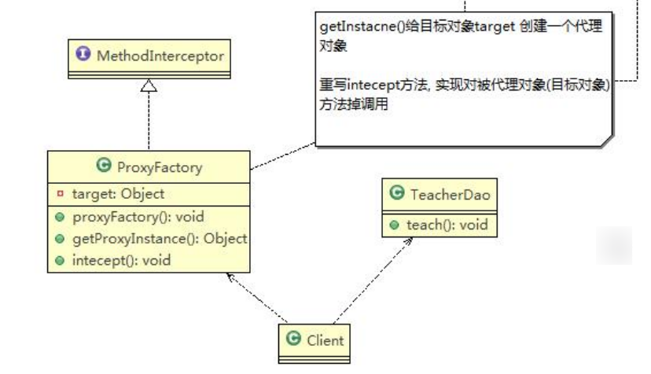

# 代理模式 (Proxy)

## 代理模式的基本介绍

- 代理模式：为一个对象提供一个替身，以控制对这个对象的访问。即通过代理对象访问目标对象。这样做的好处是：可以在目标对象实现的基础上，增强额外的功能操作，即扩展目标对象的功能。
- 被代理的对象可以是远程对象、创建开销大的对象或需要安全控制的对象
- 代理模式有不同的形式，主要有三种 **静态代理**、**动态代理** (JDK 代理、接口代理) 和 **Cglib** **代理** (可以在内存动态的创建对象，而不需要实现接口，他是属于动态代理的范畴) 。
- 代理模式示意图

## 静态代理

### 静态代码模式的基本介绍

静态代理在使用时，需要定义接口或者父类，被代理对象 (即目标对象) 与代理对象一起实现相同的接口或者是继承相同父类

### 应用实例

- 定义一个接口:ITeacherDao
- 目标对象 TeacherDAO 实现接口 ITeacherDAO
- 使用静态代理方式，就需要在代理对象 TeacherDAOProxy 中也实现 ITeacherDAO
- 调用的时候通过调用代理对象的方法来调用目标对象。
- 特别提醒：代理对象与目标对象要实现相同的接口，然后通过调用相同的方法来调用目标对象的方法

### 思路分析图解

#### 代码实现

### 静态代理优缺点

- 优点：在不修改目标对象的功能前提下，能通过代理对象对目标功能扩展
- 缺点：因为代理对象需要与目标对象实现一样的接口，所以会有很多代理类
- 一旦接口增加方法，目标对象与代理对象都要维护

## 动态代理

### 动态代理模式的基本介绍

- 代理对象，不需要实现接口，但是目标对象要实现接口，否则不能用动态代理
- 代理对象的生成，是利用 JDK 的 API，动态的在内存中构建代理对象
- 动态代理也叫做：JDK 代理、接口代理

### JDK 中生成代理对象的 API

- 代理类所在包:java.lang.reflect.Proxy
- JDK 实现代理只需要使用 **newProxyInstance** 方法，但是该方法需要接收三个参数，完整的写法是：`static Object newProxyInstance(ClassLoader loader, Class<?>[] interfaces,InvocationHandler h)`

### 动态代理应用实例

将前面的静态代理改进成动态代理模式 (即：JDK 代理模式)

思路图解

### JDK 动态代理代码实现

## Cglib 代理

### Cglib 代理模式的基本介绍

- 静态代理和 JDK 代理模式都要求目标对象是实现一个接口，但是有时候目标对象只是一个**单独的对象**,并没**有实现任何的接口**,这个时候可使用目标对象子类来实现代理 - 这就是 **Cglib** **代理**
- Cglib 代理也叫作**子类代理****,**它是在内存中构建一个子类对象从而实现对目标对象功能扩展，有些书也将 Cglib 代理归属到动态代理。
- Cglib 是一个强大的高性能的代码生成包，它可以在运行期扩展 java 类与实现 java 接口。它广泛的被许多 AOP 的框架使用，例如 Spring AOP，实现方法拦截
- 在 AOP 编程中如何选择代理模式
  - 目标对象需要实现接口，用 JDK 代理
  - 目标对象不需要实现接口，用 Cglib 代理

- Cglib 包的底层是通过使用字节码处理框架 ASM 来转换字节码并生成新的类

### Cglib 代理模式实现步骤

- 需要引入 cglib 的 jar 文件
- 在内存中动态构建子类，注意代理的类不能为 final，否则报错`java.lang.IllegalArgumentException:`
- 目标对象的方法如果为 final/static,那么就不会被拦截,即不会执行目标对象额外的业务方法. 

### Cglib 代理模式应用实例

将前面的案例用 Cglib 代理模式实现

思路图解

### Cglib 代理代码实现

## 几种常见的代理模式介绍— 几种变体

- 防火墙代理
  - 内网通过代理穿透防火墙，实现对公网的访问。

- 缓存代理
  - 比如：当请求图片文件等资源时，先到缓存代理取，如果取到资源则 ok，如果取不到资源，再到公网或者数据库取，然后缓存。尚硅谷 Java 设计模式

- 远程代理
  - 远程对象的本地代表，通过它可以把远程对象当本地对象来调用。远程代理通过网络和真正的远程对象沟通信息。

- 同步代理
  - 主要使用在多线程编程中，完成多线程间同步工作

