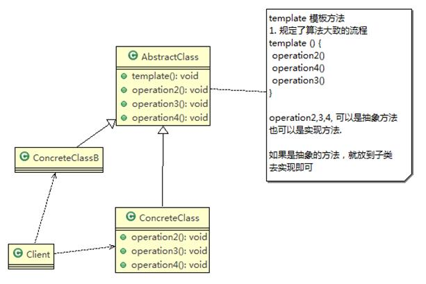
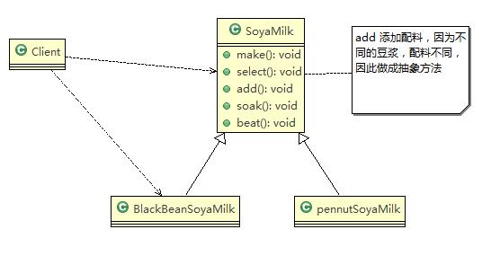
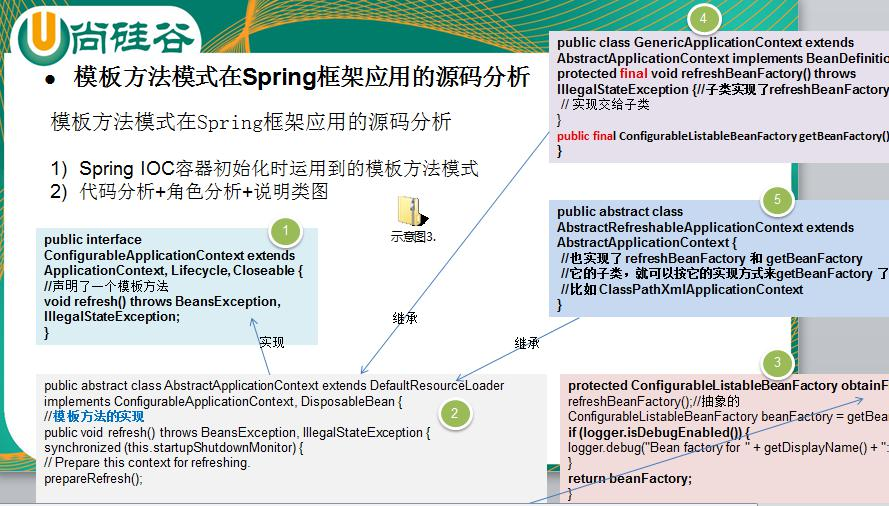

# 模板方法模式

## 豆浆制作问题

- 制作豆浆的流程 选材--->添加配料--->浸泡--->放到豆浆机打碎
- 通过添加不同的配料，可以制作出不同口味的豆浆
- 选材、浸泡和放到豆浆机打碎这几个步骤对于制作每种口味的豆浆都是一样的
- 请使用模板方法模式完成 (说明：因为模板方法模式，比较简单，很容易就想到这个方案，因此就直接使用，不再使用传统的方案来引出模板方法模式)

## 模板方法模式基本介绍

- 模板方法模式（Template Method Pattern），又叫模板模式 (Template Pattern)，在一个抽象类公开定义了执行它的方法的模板。它的子类可以按需要重写方法实现，但调用将以抽象类中定义的方式进行。
- 简单说，模板方法模式 定义一个操作中的算法的骨架，而将一些步骤延迟到子类中，使得子类可以不改变一个算法的结构，就可以重定义该算法的某些特定步骤
- 这种类型的设计模式属于行为型模式。

## 模板方法模式原理类图

### 模板方法模式的原理类图

## ✨模板方法模式的角色及职责

- AbstractClass 抽象类，类中实现了模板方法 (template)，定义了算法的骨架，具体子类需要去实现 其它的抽象方法 operationr2,3,4
- ConcreteClass 实现抽象方法 operationr2,3,4, 以完成算法中特点子类的步骤

## 模板方法模式解决豆浆制作问题

编写制作豆浆的程序，说明如下：

制作豆浆的流程 选材--->添加配料--->浸泡--->放到豆浆机打碎

通过添加不同的配料，可以制作出不同口味的豆浆

选材、浸泡和放到豆浆机打碎这几个步骤对于制作每种口味的豆浆都是一样的 (红豆、花生豆浆。。。)

### 思路分析和图解

### 代码实现

## 模板方法模式的钩子方法

- 在模板方法模式的**父类**中，我们可以**定义一个方法**，它**默认不做任何事**，子类可以视情况要不要覆盖它，该方法称为“钩子”。
- 还是用上面做豆浆的例子来讲解，比如，我们还希望**制作纯豆浆**，**不添加任何的配料**，请使用钩子方法对前面的模板方法进行改造

## 模板方法模式在 Spring 框架应用的源码分析

- Spring IOC 容器初始化时运用到的模板方法模式
- 代码分析 + 角色分析 + 说明类图

针对源码的类图 (说明层次关系) 

##  模板方法模式的注意事项和细节

- 基本思想是：算法只存在于一个地方，也就是在父类中，容易修改。需要修改算法时，只要修改父类的模板方法或者已经实现的某些步骤，子类就会继承这些修改
- 实现了最大化代码复用。父类的模板方法和已实现的某些步骤会被子类继承而直接使用。
- 既统一了算法，也提供了很大的灵活性。父类的模板方法确保了算法的结构保持不变，同时由子类提供部分步骤的实现。
- 该模式的不足之处：每一个不同的实现都需要一个子类实现，导致类的个数增加，使得系统更加庞大
- 一般模板方法都加上 final 关键字，防止子类重写模板方法。
- 模板方法模式使用场景：当要完成在某个过程，该过程要执行一系列步骤，这一系列的步骤基本相同，但其个别步骤在实现时 可能不同，通常考虑用模板方法模式来处理
