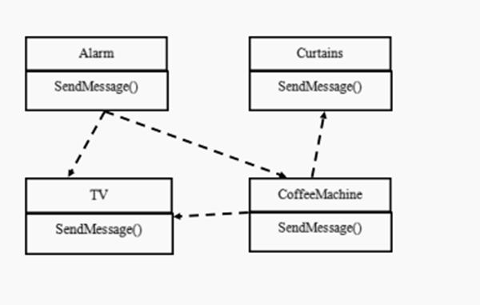
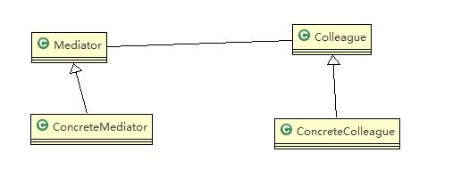
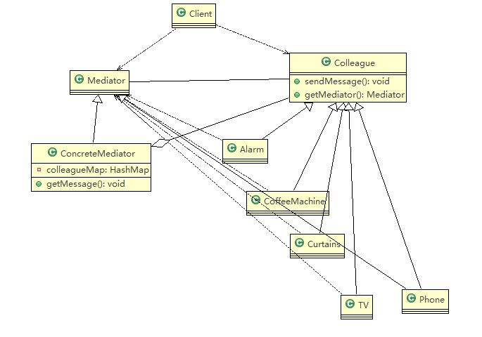

# 中介者模式

## 智能家庭项目

智能家庭项目：

- 智能家庭包括各种设备，闹钟、咖啡机、电视机、窗帘 等
- 主人要看电视时，各个设备可以协同工作，自动完成看电视的准备工作，比如流程为：闹铃响起->咖啡机开始做咖啡->窗帘自动落下->电视机开始播放

## 传统方案解决智能家庭管理问题

## 传统的方式的问题分析

- 当各电器对象有多种状态改变时，相互之间的调用关系会比较复杂
- 各个**电器对象彼此联系，你中有我，我中有你，不利于松耦合**. 
- 各个电器对象之间所传递的消息 (参数)，容易混乱
- 当系统增加一个新的电器对象时，或者执行流程改变时，代码的可维护性、扩展性都不理想 考虑中介者模式

## 中介者模式基本介绍

- 中介者中介者模式（Mediator Pattern），用一个**中介对象来封装一系列的对象交互**。中介者使各个对象不需要显式地相互引用，从而使其**耦合松散**，而且可以独立地改变它们之间的交互

- 中介者模式属于行为型模式，使代码易于维护
- 比如 MVC 模式，C（Controller 控制器）是 M（Model 模型）和 V（View 视图）的中介者，在前后端交互时起到了中间人的作用

## 中介者模式的原理类图

对原理类图的说明 - 即 (中介者模式的角色及职责)

- Mediator 就是抽象中介者，定义了同事对象到中介者对象的接口
- Colleague 是抽象同事类
- ConcreteMediator 具体的中介者对象，实现抽象方法，他需要知道所有的具体的同事类，即以一个集合来管理 HashMap，并接受某个同事对象消息，完成相应的任务
- ConcreteColleague 具体的同事类，会有很多，每个同事只知道自己的行为，而不了解其他同事类的行为 (方法)，但是他们都依赖中介者对象

## 中介者模式应用实例 - 智能家庭管理

> 完成前面的智能家庭的项目，使用中介者模式

思路分析和图解 (类图)

## 中介者模式代码实现

。。。

## 中介者模式的注意事项和细节

- 多个类相互耦合，会形成网状结构，使用中介者模式将网状结构分离为星型结构，进行解耦
- 减少类间依赖，降低了耦合，符合迪米特原则
- 中介者承担了较多的责任，一旦中介者出现了问题，整个系统就会受到影**响
- 如果设计不当，中介者对象本身变得过于复杂，这点在实际使用时，要特别注意

