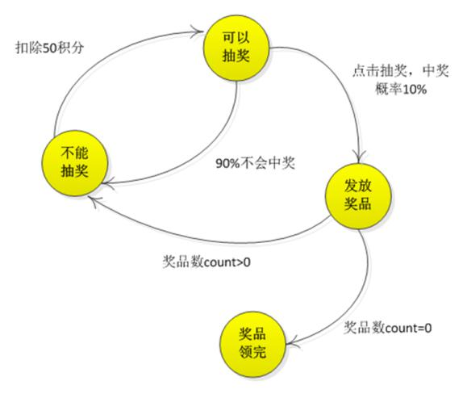
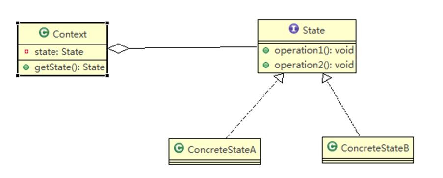
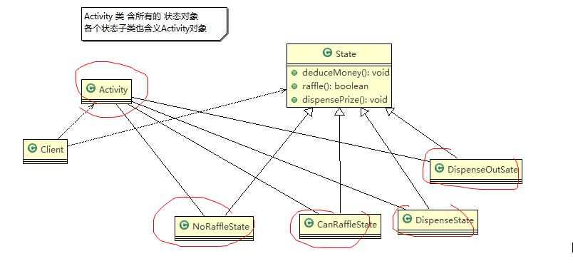
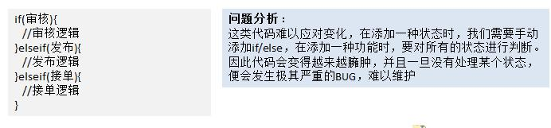

# 状态模式

## APP 抽奖需求

请编写程序完成 APP 抽奖活动 具体要求如下：

- 假如每参加一次这个活动要扣除用户 50 积分，中奖概率是 10%
- 奖品数量固定，抽完就不能抽奖
- 活动有四个状态：可以抽奖、不能抽奖、发放奖品和奖品领完
- 活动的四个状态转换关系图 (右图)

## 状态模式基本介绍

- 状态模式（**State Pattern**）：它主要用来解决对象在多种状态转换时，需要对外输出不同的行为的问题。状态和行为是一一对应的，状态之间可以相互转换
- 当一个**对象的内在状态改变时，允许改变其行为**，这个对象看起来像是改变了其类

## 状态模式的原理类图

## ✨状态模式的角色及职责

1) Context 类为环境角色，用于维护 State 实例，这个实例定义当前状态
2) State 是抽象状态角色，定义一个接口封装与 Context 的一个特点接口相关行为
3) ConcreteState 具体的状态角色，每个子类实现一个与 Context 的一个状态相关行为

## 状态模式解决 APP 抽奖问题

完成 APP 抽奖活动项目，使用状态模式。

思路分析和图解

- 定义出一个接口叫状态接口，每个状态都实现它。
- 接口有扣除积分方法、抽奖方法、发放奖品方法

## ✨状态模式代码演示

## 状态模式在实际项目 - 借贷平台 源码剖析

借贷平台的订单，有审核 - 发布 - 抢单 等等 步骤，随着操作的不同，会改变订单的状态，项目中的这个模块实

现就会使用到状态模式

2) 通常通过 if/else 判断订单的状态，从而实现不同的逻辑，伪代码如下

使用状态模式完成 借贷平台项目的审核模块 [设计 + 代码]

## 状态模式的注意事项和细节

1) 代码有很强的**可读性**。状态模式将每个状态的行为封装到对应的一个类中
2) **方便维护**。将容易产生问题的 if-else 语句删除了，如果把每个状态的行为都放到一个类中，每次调用方法时都

要判断当前是什么状态，不但会产出很多 if-else 语句，而且容易出错

3) 符合“开闭原则”。容易增删状态
4) 会产生很多类。每个状态都要一个对应的类，当状态过多时会产生很多类，加大维护难度
5) 应用场景：当一个事件或者对象有很多种状态，状态之间会相互转换，对不同的状态要求有不同的行为的时候，

可以考虑使用状态模式
