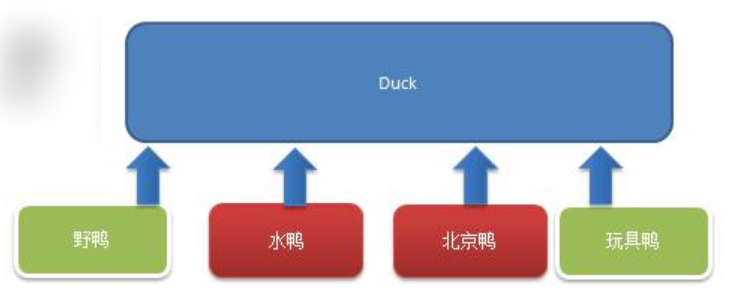
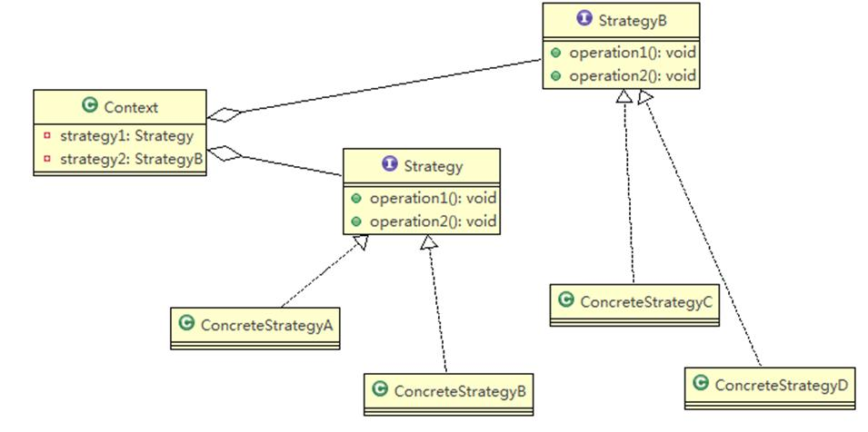
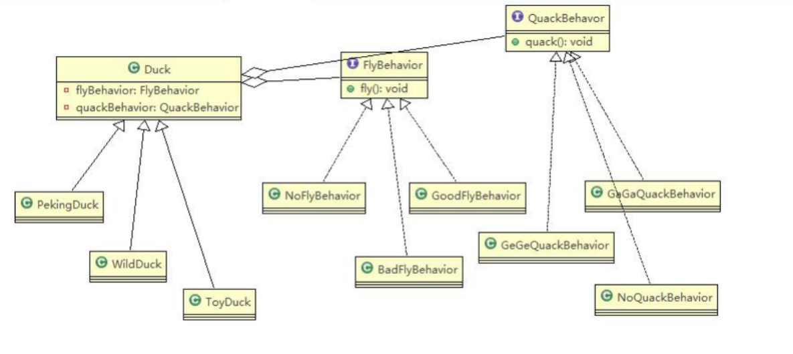
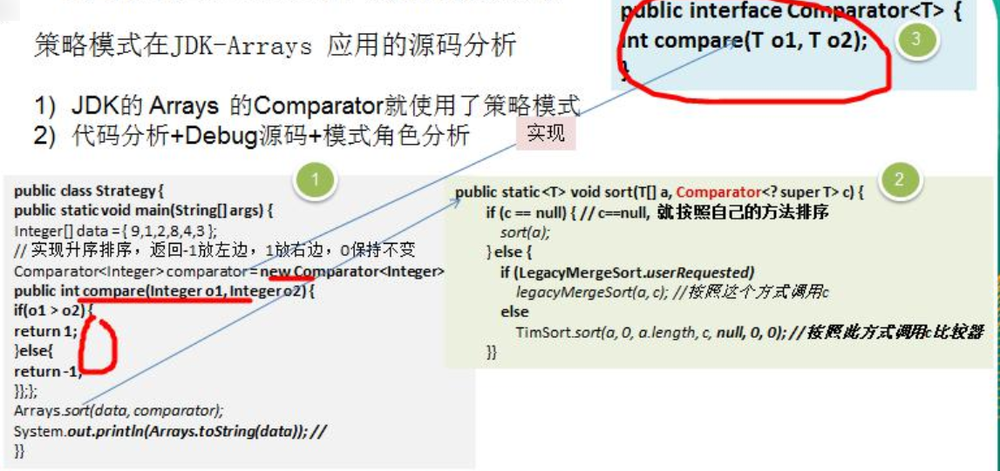

# 策略模式

## 编写鸭子项目需求

- 有各种鸭子 (比如野鸭、北京鸭、水鸭等，鸭子有各种行为，比如叫、飞行等)
- 显示鸭子的信息

## 传统方案解决鸭子问题的分析和代码实现



## 代码实现

略

## 传统的方式实现的问题分析和解决方案

- 其它鸭子，都继承了 Duck 类，所以 fly 让所有子类都会飞了，这是不正确的
- 上面说的 1 的问题，其实是继承带来的问题：对类的局部改动，尤其超类的局部改动，会影响其他部分。会有溢出效应
- 为了改进 1 问题，我们可以通过覆盖 fly 方法来解决 => **覆盖**解决
- 问题又来了，如果我们有一个玩具鸭子 ToyDuck, 这样就需要 **ToyDuck** **去覆盖** **Duck** **的所有实现的方法**

## 策略模式基本介绍

- 策略模式（Strategy Pattern）中，定义**算法族（策略组）**，分别封装起来，让他们之间可以互相替换，此模式让**算法的变化**独立于**使用算法的客**户
- 这算法体现了几个设计原则，第一、把变化的代码从不变的代码中分离出来；第二、针对接口编程而不是具体类（定义了策略接口）；第三、多用组合/聚合，少用继承（客户通过组合方式使用策略）

## 策略模式的原理类图

> 我的理解：将对象的属性接口化，像组件一样，要什么属性，就实现属性接口并且设置进来



说明：从上图可以看到，客户 context 有成员变量 strategy 或者其他的策略接口，至于需要使用到哪个策略，我们可以在构造器中指定

## ✨策略模式的角色及职责

- Strategy 策略对象

## 策略模式解决鸭子问题

1) 应用实例要求

编写程序完成前面的鸭子项目，要求使用策略模式

2) 思路分析 (类图)

策略模式：分别封装行为接口，实现算法族，超类里放行为接口对象，在子类里具体设定行为对象。原则就是：分离变化部分，封装接口，基于接口编程各种功能。此模式让行为的变化独立于算法的使用者



### 策略模式代码实现

### 鸭子抽象类

```java
public abstract class Duck {

    // 属性，策略接口
    FlyBehavior flyBehavior;
    // 其它属性<->策略接口
    QuackBehavior quackBehavior;

    public Duck() {

    }

    public abstract void display();// 显示鸭子信息

    public void quack() {
        System.out.println("鸭子嘎嘎叫~~");
    }

    public void swim() {
        System.out.println("鸭子会游泳~~");
    }

    public void fly() {

        // 改进
        if (flyBehavior != null) {
            flyBehavior.fly();
        }
    }

    public void setFlyBehavior(FlyBehavior flyBehavior) {
        this.flyBehavior = flyBehavior;
    }

    public void setQuackBehavior(QuackBehavior quackBehavior) {
        this.quackBehavior = quackBehavior;
    }

}
```

### 飞行策略和叫声策略接口

```java
public interface FlyBehavior {
    void fly(); // 子类具体实现
}
```

```java
public interface QuackBehavior {
	void quack();// 子类实现
}
```

### 飞行策略和叫声策略实现类组件

```java
public class GoodFlyBehavior implements FlyBehavior {

	@Override
	public void fly() {
		System.out.println("飞翔技术高超~~~");
	}

}
```

```java
public class NoFlyBehavior implements FlyBehavior{

	@Override
	public void fly() {
		System.out.println(" 不会飞翔 ");
	}
}
```

```java
public class BadFlyBehavior implements FlyBehavior {

    @Override
    public void fly() {
        System.out.println(" 飞翔技术一般 ");
    }

}
```

### 鸭子实体类

```java
public class PekingDuck extends Duck {

	// 假如北京鸭可以飞翔，但是飞翔技术一般
	public PekingDuck() {
		flyBehavior = new BadFlyBehavior();
		
	}
	
	@Override
	public void display() {
		System.out.println("~~北京鸭~~~");
	}
}
```

```java
public class ToyDuck extends Duck{

	public ToyDuck() {
		flyBehavior = new NoFlyBehavior();
	}

	@Override
	public void display() {
		System.out.println("玩具鸭");
	}

	//需要重写父类的所有方法
	public void quack() {
		System.out.println("玩具鸭不能叫~~");
	}

	public void swim() {
		System.out.println("玩具鸭不会游泳~~");
	}

}
```

```java
public class WildDuck extends Duck {

	//构造器，传入 FlyBehavior 的对象
	public WildDuck() {
		flyBehavior = new GoodFlyBehavior();
	}
	
	@Override
	public void display() {
		System.out.println(" 这是野鸭 ");
	}
}

```

### 客户端

```java
public class Client {

    public static void main(String[] args) {
        WildDuck wildDuck = new WildDuck();
        wildDuck.fly();

        ToyDuck toyDuck = new ToyDuck();
        toyDuck.fly();

        PekingDuck pekingDuck = new PekingDuck();
        pekingDuck.fly();

        // 动态改变某个对象的行为，北京鸭 不能飞
        pekingDuck.setFlyBehavior(new NoFlyBehavior());
        System.out.println("北京鸭的实际飞翔能力");
        pekingDuck.fly();
    }

}
```

## 策略模式在 JDK-Arrays 应用的源码分析

- JDK 的 Arrays 的 Comparator 就使用了策略模式
- 代码分析 + Debug 源码 + 模式角色分析



```java
public static <T> void sort(T[] a, Comparator<? super T> c) {
    if (c == null) { // 没有策略，安装自己的方法排序
        sort(a);
    } else {
        if (LegacyMergeSort.userRequested) 
            legacyMergeSort(a, c); // 有策略，按照策略方式调用
        else
            TimSort.sort(a, 0, a.length, c, null, 0, 0);
    }
}
```

## 策略模式的注意事项和细节

- 策略模式的关键是：分析项目中变化部分与不变部分=
- 策略模式的核心思想是：多用组合/聚合 少用继承；用行为类组合，而不是行为的继承。更有弹性
- 体现了“对修改关闭，对扩展开放”原则，客户端增加行为不用修改原有代码，只要添加一种策略（或者行为）即可，避免了使用多重转移语句（if..else if..else)
- 提供了可以替换继承关系的办法：策略模式将算法封装在独立的 Strategy 类中使得你可以独立于其 Context 改变它，使它易于切换、易于理解、易于扩展
- **需要注意的是**：每添加一个策略就要增加一个类，当策略过多是会导致类数目庞大
