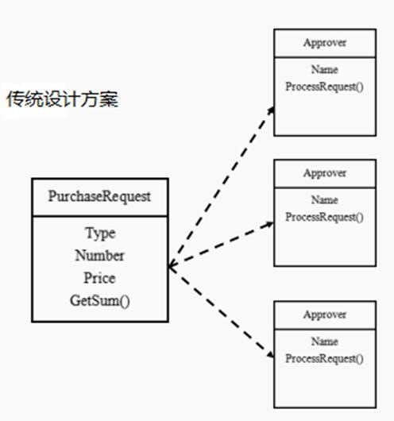
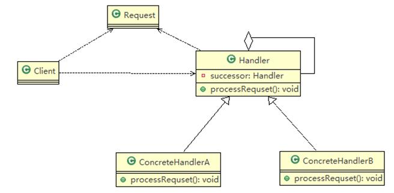
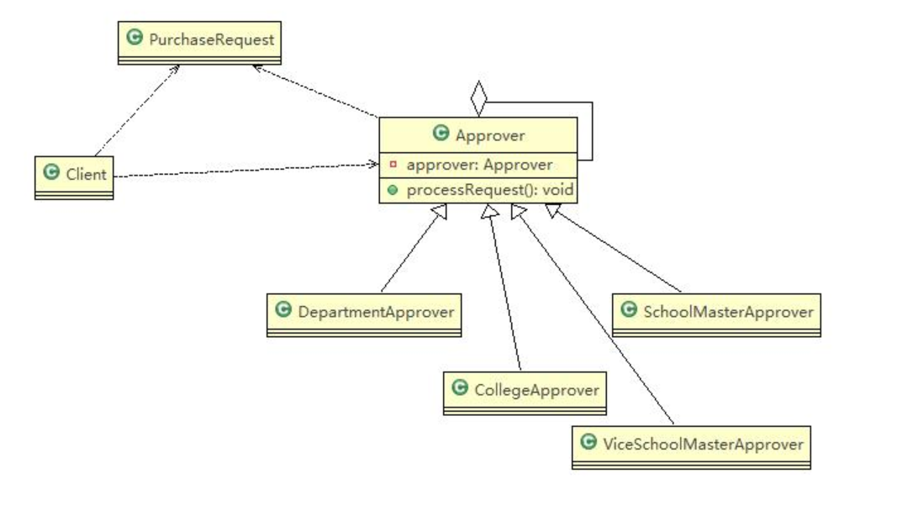
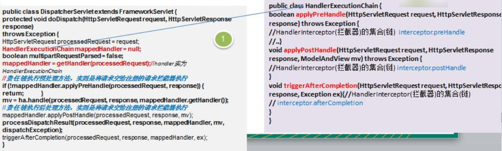

# 职责链模式

## OA 系统采购审批需求

> 学校 OA 系统的采购审批项目：需求是采购员采购教学器材
>
> 1) 如果金额 小于等于 5000, 由教学主任审批（\0<=x<=5000）
>
> 2) 如果金额 小于等于 10000, 由院长审批 (5000<x<=10000)
> 3) 如果金额 小于等于 30000, 由副校长审批 (10000<x<=30000)
> 4) 如果金额 超过 30000 以上，有校长审批 (30000<x)
>
> 请设计程序完成采购审批项目

## 传统方案解决 OA 系统采购审批



## 传统方案解决 OA 系统采购审批问题分析

- 传统方式是：接收到一个采购请求后，根据采购金额来调用对应的 Approver (审批人) 完成审批。
- 传统方式的问题分析：客户端这里会使用到分支判断 (比如 switch) 来对不同的采购请求处理，这样就存在。如下问题 (1) 如果各个级别的人员审批金额发生变化，在客户端的也需要变化 (2) 客户端必须明确的知道有多少个审批级别和访问
- 这样对一个采购请求进行处理和 Approver (审批人) 就存在强耦合关系，不利于代码的扩展和维护
- 解决方案 -> **职责链**模式

## 职责链模式基本介绍

- 职责链模式（Chain of Responsibility Pattern）, 又叫责任链模式，为请求创建了一个接收者对象的链 (简单示意图)。这种模式对请求的发送者和接收者进行解耦。
- 职责链模式通常每个接收者都包含对另一个接收者的引用。如果一个对象不能处理该请求，那么它会把相同的请求传给下一个接收者，依此类推。
- 这种类型的设计模式属于行为型模式

## 职责链模式的原理类图



## ✨职责链模式的角色及职责

1) Handler: 抽象的处理者，定义了一个处理请求的接口，同时含义另外 Handler
2) ConcreteHandlerA , B 是具体的处理者，处理它自己负责的请求，可以访问它的后继者 (即下一个处理者), 如果可以处理当前请求，则处理，否则就将该请求交个后继者去处理，从而形成一个职责链

3) Request，含义很多属性，表示一个请求

## 职责链模式解决 OA 系统采购审批

> 编写程序完成学校 OA 系统的采购审批项目：需求
>
> 采购员采购教学器材
>
> - 如果金额 小于等于 5000, 由教学主任审批
> - 如果金额 小于等于 10000, 由院长审批
> - 如果金额 小于等于 30000, 由副校长审批
> - 如果金额 超过 30000 以上，有校长审批



### ✨职责链模式代码实现

#### Handler 抽象的处理者

```java
// 审批处理者的抽象
public abstract class AppRover { // 审批处理者

    AppRover appRover;  // 下一个处理者
    String name; // 名字

    public AppRover(String name) {
        this.name = name;
    }

    // 下一个处理者
    public void setAppRover(AppRover appRover) {
        this.appRover = appRover;
    }

    // 处理审批请求的方法，得到一个请求，处理是子类完成，因此该方法做成抽象
    public abstract void processRequest(PurchaseRequest purchaseRequest);

}

```

#### ConcreteHandler 是具体的处理者

```java
// 教学主任
public class DepartmentAppRover extends AppRover {

    public DepartmentAppRover(String name) {
        super(name);
    }

    @Override
    public void processRequest(PurchaseRequest purchaseRequest) {
        if (purchaseRequest.getPrice() <= 5000) {
            System.out.println(" 请求编号 id= " + purchaseRequest.getId() + " 被 " + this.name + " 处理");
        } else {
            appRover.processRequest(purchaseRequest);
        }
    }
}
```

```java
// 院长
public class CollegeAppRover extends AppRover {

    public CollegeAppRover(String name) {
        super(name);
    }

    @Override
    public void processRequest(PurchaseRequest purchaseRequest) {
        if (purchaseRequest.getPrice() > 5000 && purchaseRequest.getPrice() <= 10000) {
            System.out.println(" 请求编号 id= " + purchaseRequest.getId() + " 被 " + this.name + " 处理");
        } else {
            appRover.processRequest(purchaseRequest);
        }
    }
}
```

```java
// 副校长
public class ViceSchoolMasterAppRover extends AppRover {

    public ViceSchoolMasterAppRover(String name) {
        super(name);
    }

    @Override
    public void processRequest(PurchaseRequest purchaseRequest) {
        if (purchaseRequest.getPrice() > 10000 && purchaseRequest.getPrice() <= 30000) {
            System.out.println(" 请求编号 id= " + purchaseRequest.getId() + " 被 " + this.name + " 处理");
        } else {
            appRover.processRequest(purchaseRequest);
        }
    }
}
```

```java
// 校长
public class SchoolMasterAppRover extends AppRover {

    public SchoolMasterAppRover(String name) {
        super(name);
    }

    @Override
    public void processRequest(PurchaseRequest purchaseRequest) {
        if (purchaseRequest.getPrice() > 30000) {
            System.out.println(" 请求编号 id= " + purchaseRequest.getId() + " 被 " + this.name + " 处理");
        } else {
            appRover.processRequest(purchaseRequest);
        }
    }
}
```

#### Request 请求

```java
// 请求类
public class PurchaseRequest {

    private int type = 0; // 请求类型
    private float price = 0.0f; // 请求金额
    private int id = 0;

    // 构造器
    public PurchaseRequest(int type, float price, int id) {
        this.type = type;
        this.price = price;
        this.id = id;
    }

    public int getType() {
        return type;
    }

    public float getPrice() {
        return price;
    }

    public int getId() {
        return id;
    }
}
```

#### 客户端执行调用

```java
public class Client {

    public static void main(String[] args) {
        // 采购请求
        PurchaseRequest purchaseRequest = new PurchaseRequest(1, 1000, 1);

        // 创建审批处理者
        DepartmentAppRover departmentAppRover = new DepartmentAppRover("教学主任黄忠");
        CollegeAppRover collegeAppRover = new CollegeAppRover("院长李信");
        ViceSchoolMasterAppRover viceSchoolMasterAppRover = new ViceSchoolMasterAppRover("副校长张飞");
        SchoolMasterAppRover schoolMasterAppRover = new SchoolMasterAppRover("校长刘备");

        // 形成链式结构，设置下一个处理者
        departmentAppRover.setAppRover(collegeAppRover);
        collegeAppRover.setAppRover(viceSchoolMasterAppRover);
        viceSchoolMasterAppRover.setAppRover(schoolMasterAppRover);
        schoolMasterAppRover.setAppRover(departmentAppRover);

        collegeAppRover.processRequest(purchaseRequest);
        //viceSchoolMasterAppRover.processRequest(purchaseRequest);
    }
}
```

## 职责链模式在 SpringMVC 框架应用的源码分析

- `SpringMVC` 中 `HandlerExecutionChain` 类就使用到职责链模式
- SpringMVC 请求流程简图
- 代码分析+Debug 源码 + 说明



```java
protected void doDispatch (HttpServletRequest request, HttpServletResponse response) throws Exception {
            HandlerExecutionChain mappedHandler = null;
            mappedHandler = getHandler(processedRequest);
            if (!mappedHandler.applyPreHandle(processedRequest, response)) {
                return;
            }
           //当上面的 applyPreHandle 返回 false 时，继续向下执行到
            mappedHandler.applyPostHandle(processedRequest, response, mv);
}
 
//调用拦截器的 interceptor.preHandle
boolean applyPreHandle (HttpServletRequest request, HttpServletResponse response) {
    HandlerInterceptor[] interceptors = getInterceptors();
    if (!ObjectUtils.isEmpty(interceptors)) {
        for (int i = 0; i < interceptors.length; i++) {
            HandlerInterceptor interceptor = interceptors[i];
            if (!interceptor.preHandle(request, response, this.handler)) {
                triggerAfterCompletion(request, response, null);
                return false;
            }
            this.interceptorIndex = i;
        }
    }
    return true;
}

void triggerAfterCompletion (HttpServletRequest request, HttpServletResponse response,Exception ex){
     HandlerInterceptor interceptor = interceptors[i];
     try {
         interceptor.afterCompletion(request, response, this.handler, ex);
     }
 }
        
//调用拦截器的 interceptor.postHandle
void applyPostHandle (HttpServletRequest request, HttpServletResponse response, @Nullable ModelAndView mv){
    HandlerInterceptor interceptor = interceptors[i];
    interceptor.postHandle(request, response, this.handler, mv);
}
```

### 源码总结

- springmvc 请求的流程图中，执行了拦截器相关方法 interceptor.preHandler 等等
- 在处理 SpringMvc 请求时，使用到职责链模式还使用到适配器模式
- HandlerExecutionChain 主要负责的是请求拦截器的执行和请求处理，但是他本身不处理请求，只是将请求分配给链上注册处理器执行，这是职责链实现方式，减少职责链本身与处理逻辑之间的耦合，规范了处理流程
- HandlerExecutionChain 维护了 HandlerInterceptor 的集合，可以向其中注册相应的拦截器。

## 职责链模式的注意事项和细节

- 将请求和处理分开，实现解耦，提高系统的灵活性
- 简化了对象，使对象不需要知道链的结构
- 性能会受到影响，特别是在**链比较长的时候**，因此需控制链中最大节点数量，一般通过在 Handler 中设置一个最大节点数量，在 setNext() 方法中判断是否已经超过阀值，超过则不允许该链建立，避免出现超长链无意识地破坏系统性能
- 调试不方便。采用了类似递归的方式，调试时逻辑可能比较复杂
- 最佳应用场景：有多个对象可以处理同一个请求时，比如：多级请求、请假/加薪等审批流程、Java Web 中 Tomcat 对 Encoding 的处理、拦截器
