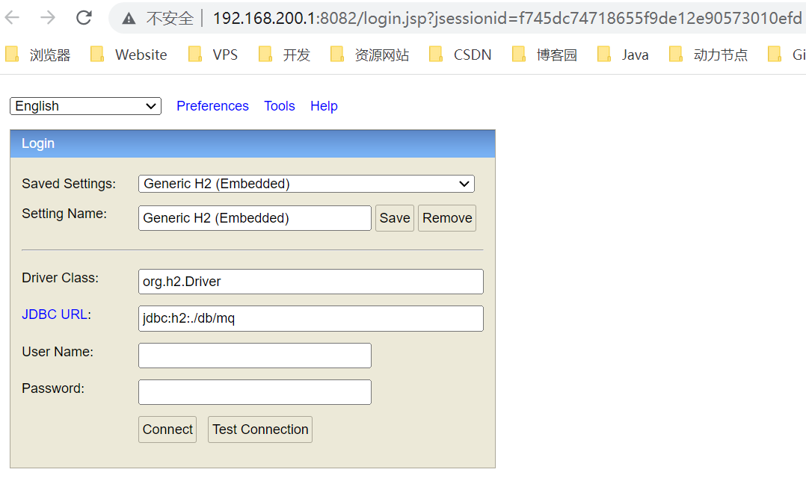

# H2 数据库使用指南

## 介绍

H2数据库是一种基于Java的嵌入式数据库，它具有轻量级、高性能、易于使用和部署等优点。以下是H2数据库的使用教程：

## 使用流程

1. 下载并安装H2数据库

   在[官网](https://www.h2database.com/html/download.html)下载H2数据库的最新版本，然后按照安装程序的提示进行安装。安装过程中需要选择安装目录和创建数据库文件的路径。

2. 启动H2数据库

   启动H2数据库需要使用命令行工具，打开命令行工具并进入H2数据库的安装目录`D:\Dev\H2\bin`。然后输入以下命令启动H2数据库：

   ```sh
   java -jar h2-2.1.214.jar
   ```

   

3. 连接到H2数据库

   启动H2数据库后，可以在浏览器中输入以下URL连接到H2数据库的控制台：

   ```sh
   http://localhost:8082/
   ```

   在控制台中，需要输入以下信息连接到H2数据库：

   ```sh
   JDBC URL：jdbc:h2:~/test
   用户名：sa
   密码：（留空）
   ```

   

## springboot整合

### 引入jar包

```xml
<!-- h2 数据库-->
<dependency>
    <groupId>com.h2database</groupId>
    <artifactId>h2</artifactId>
    <version>2.1.210</version>
    <scope>compile</scope>
</dependency>
```

### 配置文件

```
spring:
  # web 访问 h2  localhost:xxxx\h2
  h2:
    console:
      settings:
        web-allow-others: true
      path: /h2
      enabled: true
  jpa:
    show-sql:true
    hibernate:
      ddl-auto: update
  datasource:
    driver-class-name: org.h2.Driver
    url: jdbc:h2:file:./db/mq;AUTO_SERVER=TRUE
    username: sa
    password: 123456
    #    driver-class-name: com.mysql.cj.jdbc.Driver
    #    username: root
    #    password: root
    #    type: com.alibaba.druid.pool.DruidDataSource
    #    url: jdbc:mysql://localhost:3307/springcloud_rabbitmq?useUnicode=true&characterEncoding=utf-8&allowMultiQueries=true&serverTimezone=GMT%2B8
```

### IDEA 连接 H2 数据库出现的问题

有时候IDEA 连接 H2 数据库侧边栏会显示不出来，出现以下报错

`[42S02][42102] org.h2.jdbc.JdbcSQLSyntaxErrorException: Table "CATALOGS" not found; SQL statement: select CATALOG_NAME from INFORMATION_SCHEMA.CATALOGS [42102-206]`

原因是当你连接 H2 数据库的时候，IDEA 尝试使用

`SELECT CATALOG_NAME FROM INFORMATION_SCHEMA.CATALOGS`

查询 H2 中的表，但是很遗憾的是，H2 新版本不再支持该语句。因此，如果出现该问题，我们的手段便是：通过添加`OLD_INFORMATION_SCHEMA=TRUE` 到URL来解决


