# MySQL 高级篇

[尚硅谷 -2022 版 MySQL](https://www.bilibili.com/video/BV1VM4y1w7Qk/?spm_id_from=333.337.search-card.all.click&vd_source=65e8ed62ff65aeec2427f9b6c8523b9b)

---

> 数据库对象

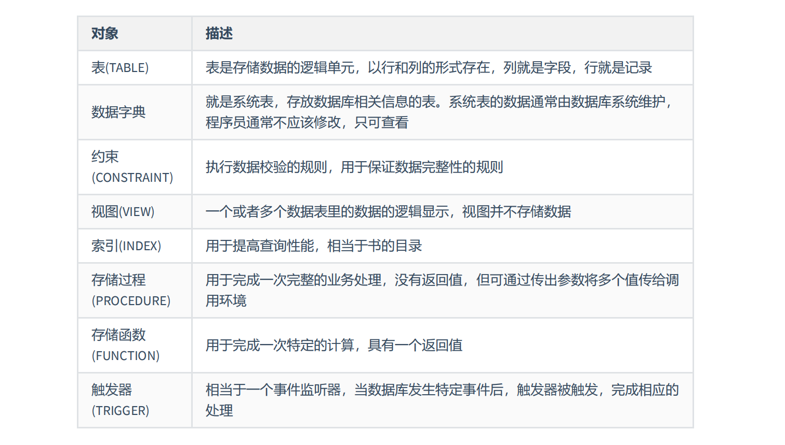

## 视图

> 视图是一个或者多个数据表里的数的逻辑，视图并不存储数据，只是对数据的引用

### 视图的特点

- 视图是一种虚拟表，本身是不具有数据的，视图建立在已有表的基础上，视图赖以建立的表称为基表
- 视图的创建和删除与基表无关，视图的数据的增删改与基表有关
- 视图一般使用在大型项目上，为了简化查询，控制数据的访问

### 创建视图

```mysql
CREATE OR REPLACE VIEW test_view (ename) 
AS 
SELECT ename FROM emp;
```

### 查看视图

```mysql
-- 查看视图信息（显示数据表的存储引擎、版本、数据行数和数据大小等） 
SHOW TABLE STATUS LIKE 'test_view'
-- 查看视图的详细定义信息
SHOW CREATE VIEW test_view;
```

> 示例

```mysql
-- 查看视图信息（显示数据表的存储引擎、版本、数据行数和数据大小等） 
SHOW TABLE STATUS LIKE 'vu_emp2';
-- 查看视图的详细定义信息
SHOW CREATE VIEW vu_emp2;
```

### 视图无法更新

- 视图存在多种情况导致无法更新

- 视图主要作用是查询，而不是增删改

### 修改视图

```mysql
ALTER VIEW test_view 
AS
SELECT * from dept;
```

### 删除视图

```mysql
DROP VIEW IF EXISTS test_view;
```

## 存储过程

>存储过程是一组经过预先编译的 SQL 语句的封装
>

### 创建存储过程

```mysql
DELIMITER //
CREATE PROCEDURE test_procedure () 
BEGIN
	SELECT * FROM emp;
END //
DELIMITER;
```

### 设置新的结束标记

```mysql
-- 设置新的结束标记//
DELIMITER //
CREATE PROCEDURE test_procedure () 
BEGIN
	SELECT * FROM emp;
END //
-- 重新设置回来原先的结束标签，避免与sql弄混
DELIMITER;
```

### 存储过程调用

```mysql
call test_procedure();
```

### 参数 OUT

```mysql
DELIMITER //
CREATE PROCEDURE test_out ( OUT ms DOUBLE ) 
BEGIN
SELECT MIN(salary) INTO ms FROM emp;
END // 
DELIMITER;
call test_out(@ms);
select @ms;
```

### 参数 IN

```mysql
DELIMITER //
CREATE PROCEDURE test_in (IN empname VARCHAR (20)) 
BEGIN
	SELECT salary FROM emp WHERE ename = empname;
END // 
DELIMITER;
call test_in('小白龙');
-- 定义变量调用
SET @ename := '小白龙';
CALL test_in(@ename);
```

### 参数 INOUT

```mysql
DELIMITER //
CREATE PROCEDURE test_inout (INOUT empname VARCHAR (20)) 
BEGIN
	SELECT ename INTO empname FROM emp WHERE id = ( SELECT id FROM emp WHERE ename = empname );
END // 
DELIMITER;
set @empname := '小白龙';
call test_inout(@empname);
select @empname
```

## 存储函数

### 创建存储函数

```mysql
DELIMITER //
CREATE FUNCTION test_function () 
RETURNS VARCHAR ( 25 )
BEGIN
	RETURN (SELECT ename FROM emp WHERE id = '1001');
END // 
DELIMITER;
select test_function();
```

### 调用存储函数

```mysql
SELECT test_function();
```

## 变量

> 变量分为`系统变量`以及`用户变量`

### 系统变量

> 系统变量又分为全局变量和会话变量

```mysql
-- 查看所有全局变量 
SHOW GLOBAL VARIABLES;

-- 查看所有会话变量 
SHOW SESSION VARIABLES;

-- 查看指定的系统变量
SELECT @@global.变量名;

-- 查看指定的会话变量
SELECT @@session.变量名;
```

### 用户变量

> 用户变量又分为`会话用户变量`和`局部用户变量`

#### 会话用户变量

```mysql
SET @num = 1;
SET @num := 2;
SELECT @num := COUNT(*) FROM emp; 
SELECT COUNT(*) into @num FROM emp; 
select @num
```

#### 局部用户变量

> 使用 DECLARE 声明在存储过程或存储函数中

```mysql
DELIMITER //
CREATE PROCEDURE add_value () 
BEGIN
	#局部变量
	DECLARE m INT DEFAULT 1;
	DECLARE n INT DEFAULT 3;
	DECLARE SUM INT;
	SET SUM = m + n;
	SELECT SUM;
END // 
DELIMITER;
CALL add_value();
```

#### 用户变量总结

|              | 作用域                | 定义位置             | 语法                     |
| ------------ | --------------------- | -------------------- | ------------------------ |
| 会话用户变量 | 当前会话              | 会话的任何地方       | 加@符号，不用指定类型    |
| 局部变量     | 定义它的 BEGIN END 中 | BEGIN END 的第一句话 | 一般不用加@,需要指定类型 |

## 流程控制

### 顺序结构

> 从上往下依次执行

### 分支结构

#### IF 分支

```mysql
DELIMITER //
CREATE PROCEDURE test_if ( IN i INT ) BEGIN
	IF i > 0 THEN
		SELECT  'i > 0';
    ELSE
		SELECT 'i <= 0';
	END IF;
END // 
DELIMITER;
CALL test_if (0);
```

#### CASE 分支

```mysql
-- 方式一
DELIMITER //
CREATE PROCEDURE test_case (in i INT) BEGIN 
    CASE i 
        WHEN 1 THEN
        SELECT 'val is 1';
        WHEN 2 THEN
        SELECT 'val is 2';
        ELSE 
        SELECT 'val is not 1 or 2';
    END CASE;
END // 
DELIMITER;
CALL test_case (1);

-- 方式二
DELIMITER //
CREATE PROCEDURE test_case2 (in i INT) BEGIN 
    CASE  
        WHEN i = 1 THEN
        SELECT 'val is 1';
        WHEN i = 2 THEN
        SELECT 'val is 2';
        ELSE 
        SELECT 'val is not 1 or 2';
    END CASE;
END // 
DELIMITER;
CALL test_case2 (1);
```

### 循环结构

#### LOOP 循环

```mysql
DELIMITER //
CREATE PROCEDURE test_loop()
BEGIN
DECLARE i INT DEFAULT 1; 
	loop_label : LOOP 
		SET i = i + 1; 
		IF i >= 10 THEN
		LEAVE loop_label;
		END IF;
	END LOOP loop_label;
SELECT i;
END //
DELIMITER ;
CALL test_loop();
```

#### WHILE 循环

```mysql
DELIMITER //
CREATE PROCEDURE test_while () BEGIN
DECLARE i INT DEFAULT 0;
    WHILE i < 10 
    DO SET i = i + 1;
    END WHILE;
SELECT i;
END // 
DELIMITER;
CALL test_while();
```

#### REPEAT 循环

```mysql
DELIMITER //
CREATE PROCEDURE test_repeat () BEGIN 
DECLARE i INT DEFAULT 0; 

    REPEAT 
        SET i = i + 1; 
        UNTIL i >= 10 
    END REPEAT;

SELECT i;
	
END // 
DELIMITER;
CALL test_repeat ();
```

### 跳转语句 LEAVE

> break

```mysql
DELIMITER //
CREATE PROCEDURE test_leave (IN num INT) 
begin_label : BEGIN
	IF num <= 0 THEN
			LEAVE begin_label;
	ELSEIF num = 1 THEN
		SELECT AVG( salary ) FROM emp;
	ELSEIF num = 2 THEN
		SELECT MIN( salary ) FROM emp;
	ELSE 
	  SELECT MAX( salary ) FROM emp;
	END IF;
	SELECT COUNT(*) FROM emp;
END // 
DELIMITER;
call test_leave(0);
```

### 跳转语句 ITERATE

>continue

```mysql

DELIMITER //
CREATE PROCEDURE test_iterate()
BEGIN
	DECLARE num INT DEFAULT 0;
	loop_label:LOOP
		SET num = num + 1;
		IF num < 10 
			THEN ITERATE loop_label; 
		ELSEIF num > 15 
			THEN LEAVE loop_label;
		END IF;
		SELECT '1';
	END LOOP;
END // 
DELIMITER;
```

## 游标

> 游标就是操作查询出来的结果集的数据

```mysql
-- 函数的功能可以实现累加薪资最高的几个员工的薪资值，直到薪资总和达到limit_total_salary参数的值，返回累加的人数给total_count
DELIMITER //
CREATE PROCEDURE test_cursor ( IN limit_total_salary DOUBLE, OUT total_count INT ) 
BEGIN
	DECLARE
		sum_salary DOUBLE DEFAULT 0;#记录累加的总工资
	DECLARE
		cursor_salary DOUBLE DEFAULT 0;#记录某一个工资值
	DECLARE
		emp_count INT DEFAULT 0;#记录循环个数 
	#定义游标
	DECLARE
		emp_cursor CURSOR FOR SELECT salary FROM emp ORDER BY salary DESC;
		#打开游标
	OPEN emp_cursor;
	REPEAT
		#使用游标（从游标中获取数据）
		FETCH emp_cursor INTO cursor_salary;
		SET sum_salary = sum_salary + cursor_salary;
		SET emp_count = emp_count + 1;
		UNTIL sum_salary >= limit_total_salary 
	END REPEAT;

	SET total_count = emp_count;
	#关闭游标
	CLOSE emp_cursor;

END // 
DELIMITER;
call test_cursor(110000,@total_count);
SELECT @total_count;
```

## 触发器

> 和事务相关，比如手动修改数据时，修改某条数据会自动触发触发器，修改另一条相关的数据，保证事务的完整性

### 创建触发器

```mysql
CREATE TABLE test_trigger ( id INT PRIMARY KEY AUTO_INCREMENT, t_note VARCHAR ( 30 ) );
CREATE TABLE test_trigger_log ( id INT PRIMARY KEY AUTO_INCREMENT, t_log VARCHAR ( 30 ) );
-- 每当插入表test_trigger时，向test_trigger_log插入一条触发器
DELIMITER //
CREATE TRIGGER test_trigger 
BEFORE INSERT ON test_trigger 
FOR EACH ROW
BEGIN
	INSERT INTO test_trigger_log ( t_log ) VALUES ( 'before_insert' );
END //
DELIMITER;

insert into test_trigger (t_note) values ('触发器')
select * from test_trigger_log
```

### 删除触发器

```mysql
DROP TRIGGER IF EXISTS test_trigger;
```

### 查询触发器

```mysql
SELECT * FROM information_schema.TRIGGERS;
```

## MySQL8.0 新特性

### 窗口函数

> 窗口函数类似于分组函数，但仍然展示全部数据
>
> 语法：窗口函数 () OVER (PARTITION BY 要分组的字段名 ORDER BY 升序还是降序)
>
> - OVER 表示窗口函数的范围
> - PARTITION BY 表示要分组的字段

#### 窗口函数示例

> MySQL5.7 做法

```mysql
-- 在计算这个网站在每个城市的销售总额、在全国的销售总额、每个区的销售额占所在城市销售额中的比率，以及占总销售额中的比率
CREATE TABLE sales ( 
    id INT PRIMARY KEY AUTO_INCREMENT,
    city VARCHAR ( 15 ), 
    county VARCHAR ( 15 ), 
    sales_value DECIMAL 
);

INSERT INTO sales ( city, county, sales_value )
VALUES
	( '北京', '海淀', 10.00 ),
	( '北京', '朝阳', 20.00 ),
	( '上海', '黄埔', 30.00 ),
	( '上海', '长宁', 10.00 );
	
-- 创建临时表
CREATE TEMPORARY TABLE a 
-- 计算总计金额
SELECT SUM( sales_value ) AS sales_value FROM sales;

-- 创建临时表
CREATE TEMPORARY TABLE b 
-- 计算城市销售合计
SELECT city,SUM( sales_value ) AS sales_value FROM sales GROUP BY city;

-- 最终计算
SELECT
	s.city AS 城市,
	s.county AS 区,
	s.sales_value AS 区销售额,
	b.sales_value AS 市销售额,
	s.sales_value / b.sales_value AS 市比率,
	a.sales_value AS 总销售额,
	s.sales_value / a.sales_value AS 总比率 
FROM
	sales s
	JOIN b ON ( s.city = b.city ) -- 连接市统计结果临时表
	JOIN a -- 连接总计金额临时表
ORDER BY
	s.city,
	s.county;
```

> MySQL8.0 做法

```mysql
SELECT
	city AS 城市,
	county AS 区,
	sales_value AS 区销售额,
	SUM( sales_value ) OVER ( PARTITION BY city ) AS 市销售额,-- 计算市销售额
	sales_value / SUM( sales_value ) OVER ( PARTITION BY city ) AS 市比率,
	SUM( sales_value ) OVER () AS 总销售额,-- 计算总销售额
	sales_value / SUM( sales_value ) OVER () AS 总比率 
FROM
	sales 
ORDER BY
	city,
	county;
```

#### 窗口函数分类

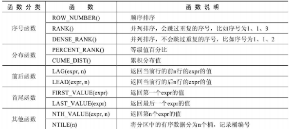

> 数据准备 在线 MySQL8.0 测试网页 https://dbfiddle.uk/?rdbms=MySQL_8.0&fiddle=36e2a6ab7d5067d67a769cb1519233ce

```mysql
CREATE TABLE goods (
    id INT PRIMARY KEY AUTO_INCREMENT,
    category_id INT,
    category VARCHAR ( 15 ),
    NAME VARCHAR ( 30 ),
    price DECIMAL ( 10, 2 ),
    stock INT,
    upper_time DATETIME 
);
INSERT INTO goods ( category_id, category, NAME, price, stock, upper_time )
VALUES
	( 1, '女装/女士精品', 'T恤', 39.90, 1000, '2020-11-10 00:00:00' ),
	( 1, '女装/女士精品', '连衣裙', 79.90, 2500, '2020-11-10 00:00:00' ),
	( 1, '女装/女士精品', '卫衣', 89.90, 1500, '2020-11-10 00:00:00' ),
	( 1, '女装/女士精品', '牛仔裤', 89.90, 3500, '2020-11-10 00:00:00' ),
	( 1, '女装/女士精品', '百褶裙', 29.90, 500, '2020-11-10 00:00:00' ),
	( 1, '女装/女士精品', '呢绒外套', 399.90, 1200, '2020-11-10 00:00:00' ),
	( 2, '户外运动', '自行车', 399.90, 1000, '2020-11-10 00:00:00' ),
	( 2, '户外运动', '山地自行车', 1399.90, 2500, '2020-11-10 00:00:00' ),
	( 2, '户外运动', '登山杖', 59.90, 1500, '2020-11-10 00:00:00' ),
	( 2, '户外运动', '骑行装备', 399.90, 3500, '2020-11-10 00:00:00' ),
	( 2, '户外运动', '运动外套', 799.90, 500, '2020-11-10 00:00:00' ),
	( 2, '户外运动', '滑板', 499.90, 1200, '2020-11-10 00:00:00' );
```

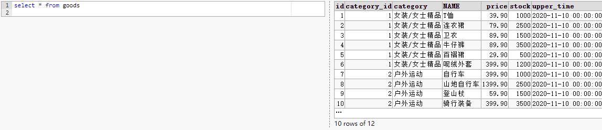

>ROW_NUMBER()
>
>ROW_NUMBER() 函数能够对数据中的序号进行顺序显示
>
>举例：查询 goods 数据表中每个商品分类下价格降序排列的各个商品信息

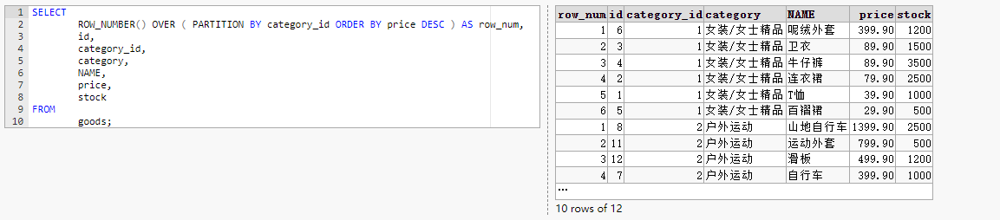

> RANK()
>
> 使用 RANK() 函数能够对序号进行并列排序，并且会跳过重复的序号，比如序号为 1、1、3
>
> 举例：使用 RANK() 函数获取 goods 数据表中各类别的价格从高到低排序的各商品信息

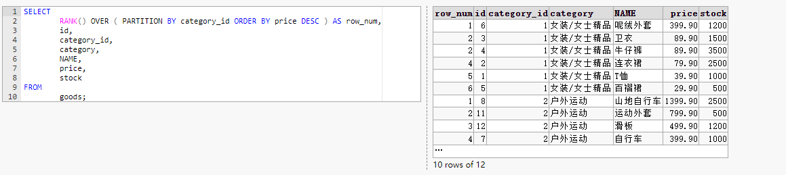

> DENSE_RANK()
>
> DENSE_RANK() 函数对序号进行并列排序，并且不会跳过重复的序号，比如序号为 1、1、2
>
> 举例：使用 DENSE_RANK() 函数获取 goods 数据表中各类别的价格从高到低排序的各商品信息

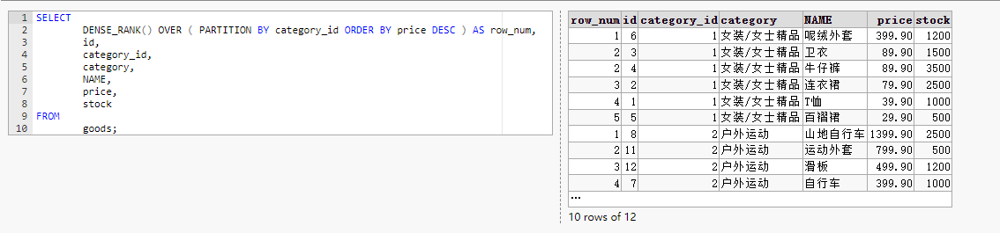

> PERCENT_RANK()
>
> PERCENT_RANK() 函数是等级值百分比函数。按照如下方式进行计算
>
> 其中，rank 的值为使用 RANK() 函数产生的序号，rows 的值为当前窗口的总记录数
>
> 举例：计算 goods 数据表中名称为“女装/女士精品”的类别下的商品的 PERCENT_RANK 值

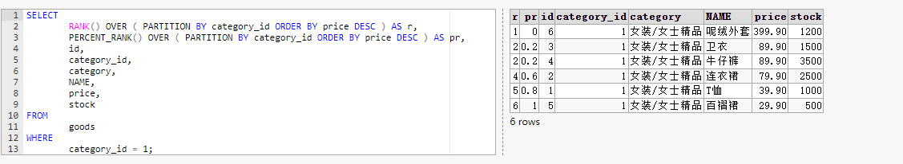

> CUME_DIST()
>
> CUME_DIST() 函数主要用于查询小于或等于某个值的比例
>
> 举例：查询 goods 数据表中小于或等于当前价格的比例

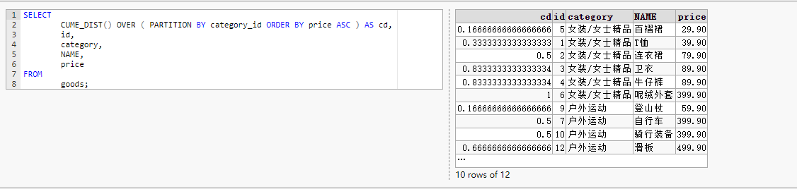

> LAG(expr，n)
>
> LAG(expr,n) 函数返回当前行的前 n 行的 expr 的值
>
> 举例：查询 goods 数据表中前一个商品价格与当前商品价格的差值

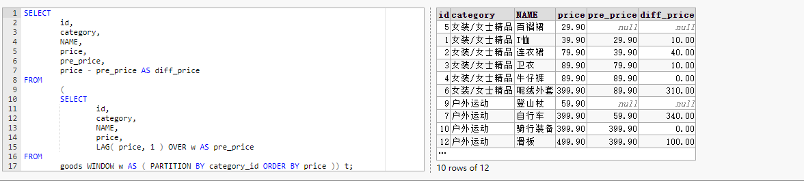

> LEAD(expr，n)
>
> LEAD(expr,n) 函数返回当前行的后 n 行的 expr 的值
>
> 举例：查询 goods 数据表中后一个商品价格与当前商品价格的差值


>FIRST_VALUE(expr)
>
>FIRST_VALUE(expr) 函数返回第一个 expr 的值
>
>举例：按照价格排序，查询第 1 个商品的价格信息

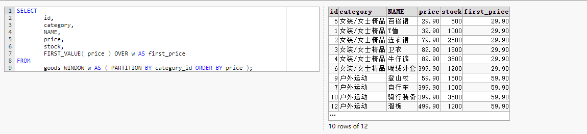

> LAST_VALUE(expr)
>
> LAST_VALUE(expr) 函数返回最后一个 expr 的值
>
> 举例：按照价格排序，查询最后一个商品的价格信息


> NTH_VALUE(expr,n)
>
> NTH_VALUE(expr,n) 函数返回第 n 个 expr 的值
>
> 举例：查询 goods 数据表中排名第 2 和第 3 的价格信息

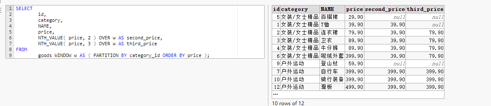

> NTHLE(n)
>
> NTILE(n) 函数将分区中的有序数据分为 n 个桶，记录桶编号
>
> 举例：将 goods 表中的商品按照价格分为 3 组

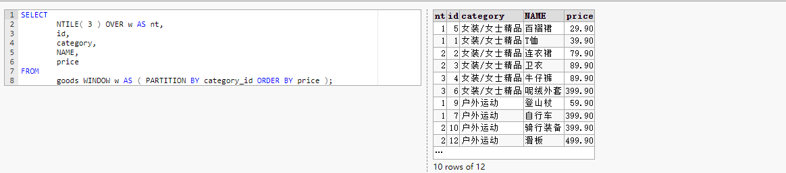

### 公用表表达式

>公用表 (CTE) 可以理解成一个可以复用的子查询
>
>以后再说吧 看也看不懂 累了

#### 普通公用表表达式

```mysql
WITH CTE名称 AS （子查询） SELECT|DELETE|UPDATE 语句;
```

#### 递归公用表表达式

```mysql
WITH RECURSIVE CTE名称 AS （子查询） SELECT|DELETE|UPDATE 语句;
```
