# MySQL 进阶篇

[MySQL 数据库教程天花板，mysql 安装到 mysql 高级，强！硬！](https://www.bilibili.com/video/BV1iq4y1u7vj/?spm_id_from=333.337.search-card.all.click&vd_source=65e8ed62ff65aeec2427f9b6c8523b9b)

---

## linux 安装 MySQL

### 安装

> 参照尚硅谷文档

### 字符集

> MySQL5.7 需要修改配置文件的字符集，MySQL8.0 不需要修改

```mysql
show variables like 'character%';
```

> 字符集比较

- utf8mb3：阉割过的 utf8 字符集，只使用 1～3 个字节表示字符
- utf8mb4：正宗的 utf8 字符集，使用 1～4 个字节表示字符

## MySQL 数据目录

> 参照尚硅谷文档

### MySQL 文件位置

- MySQL 数据库文件存放路径:/var/lib/MySQL
- MySQL 相关命令存放路径：/usr/bin
- MySQL 相关配置文件存放路径：/etc/my.cnf

### 默认数据库

- MySQL：系统自带的核心数据库，它存储了 MySQL 的用户账户和权限信息，一些存储过程、事件的定义信息，一些运行过程中产生的日志信息，一些帮助信息以及时区信息等
- information_schema：MySQL 服务器 维护的所有其他数据库的信息
- performance_schema：保存 MySQL 服务器运行过程中的一些状态信息
- sys：通过视图的形式把 information_schema 和 performance_schema 结合起来

### 表空间

> InnoDB 存储引擎

| 表结构         | table.frm MySQL8.0 合并为 table.ibd        | 描述表结构的文件      |
| -------------- | ------------------------------------------ | --------------------- |
| 表中数据和索引 | MySQL5.6.6 以前存放在系统表空间  ibdata1   | 大小为 12M 自扩展文件 |
|                | MySQL5.6.6 以后存放在独立表空间  table.ibd |                       |

> MyISAM 存储引擎模式

| 表结构         | table.frm                   | 描述表结构的文件              |
| -------------- | --------------------------- | ----------------------------- |
|                | table.xxx.sdi               | MySQL8.0 以后描述表结构的文件 |
| 表中数据和索引 | test.MYD 存储数据 (MYData)  | 表数据和表索引分开存放        |
|                | test.MYI 存储索引 (MYIndex) | 表数据和表索引分开存放        |

## 用户与权限管理

### 用户管理

#### 创建用户

```mysql
-- 系统表
SELECT HOST,USER FROM MySQL.USER;
CREATE USER 'zhongnan'@'localhost' IDENTIFIED BY '123456';
```

#### 修改用户

```mysql
UPDATE MySQL.user SET USER='zhongnan0517' WHERE USER='zhongnan';
FLUSH PRIVILEGES;
```

#### 删除用户

```mysql
DROP USER 'zhongnan'@'localhost';
```

#### 设置当前用户密码

```mysql
ALTER USER 'zhongnan'@'localhost' IDENTIFIED BY '654321';
```

#### 密码策略

>参照尚硅谷文档

### 权限管理

#### 权限列表

```mysql
SHOW PRIVILEGES;
```

#### 授予权限

```mysql
GRANT SELECT,INSERT,DELETE,UPDATE ON db1.* TO zhongnan@'%';
-- 全部权限
GRANT ALL PRIVILEGES ON *.* TO 'zhangsan'@'%';
```

#### 查看权限

```mysql
SHOW GRANTS;
-- 全局查看
SHOW GRANTS FOR 'lisi'@'%';
```

#### 收回权限

> 注意：MySQL8.0 的 root 用户没有 SYSTEM_USER 权限

```mysql
-- 收回全库全表的所有权限
GRANT system_user ON *.* TO 'root';
REVOKE ALL PRIVILEGES ON *.* FROM lisi@'%';
```

#### 权限表

> MySQL.user 表：记录用户账号和权限信息，user 表的字符按照功能分为四类：用户列、权限列、安全列和资源控制列

- 用户列：包含用户名、密码和访问方式
- 权限列：各种权限
- 安全列：加密、验证用户身份
- 资源控制列：限制用户使用的资源

> db 表：某个主机连接某个用户对某个数据库的操作权限

> tables_priv 表和 column_priv 表：分别表示对表设置操作权限和对列设置操作权限

> procs_priv 表：存储过程和存储函数设置权限

### 角色管理


#### 创建角色

```mysql
CREATE ROLE 'manager'@'%'
```

#### 给角色授权

```mysql
GRANT SELECT ON *.* TO 'manager'@'%'
```

#### 查看角色权限

```mysql
SHOW GRANTS FOR 'manager'
```

#### 回收角色权限

```mysql
REVOKE ALL PRIVILEGES ON *.* FROM manager@'%' 
```

#### 删除角色

```mysql
DROP ROLE 'manager';
```

#### 给用户授予角色

```mysql
GRANT 'manager' TO 'wangwu'@'%' 
-- 查看
SHOW GRANTS FOR 'wangwu'@'%'
```

#### 激活角色

```mysql
SET DEFAULT ROLE ALL TO 'wangwu'@'%'
-- 所有角色永久激活
SHOW VARIABLES LIKE 'activate_all_roles_on_login';
SET GLOBAL activate_all_roles_on_login = ON;
```

#### 撤销角色

```mysql
REVOKE manager FROM 'wangwu'@'%';
```

#### 设置强制角色

```mysql
SET PERSIST mandatory_roles = 'wangwu'@'%'
```

## 逻辑架构

### 入门


> 参照尚硅谷文档

- 连接层：TCP 三次握手、连接池
- 服务层：sql 接口、解析器、查询优化器、查询缓存组件 (MySQL8.0 移除，缓存命中率不高，要求 sql 语句完全一样)
- 引擎层：负责数据的存储提取，物理层面维护底层数据执行操作

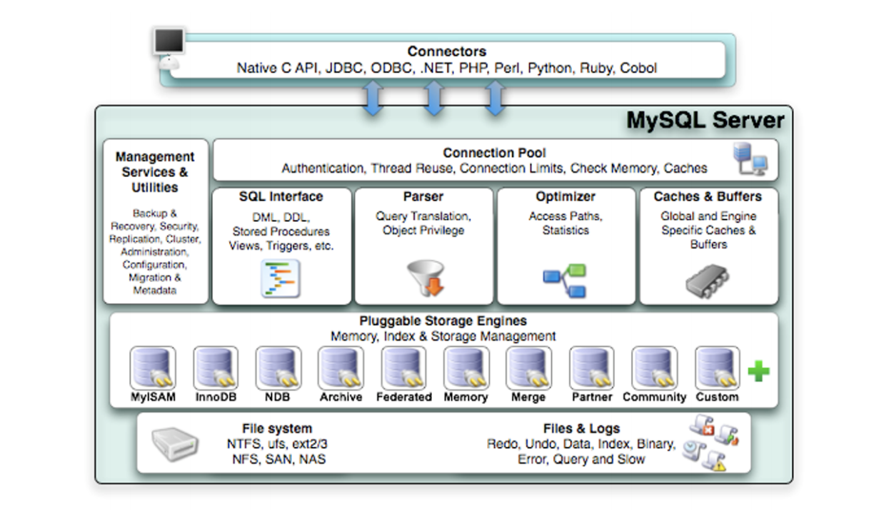

### sql 执行流程

>第一步：先查询缓存：缓存命中率不高，很鸡肋，MySQL8.0 已经放弃，

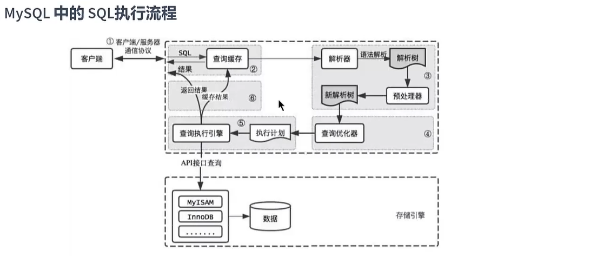

> 第二步：解析器：先词法分析，分析 sql 语句是什么，干什么，再语法分析，将 sql 语句分解程语法树

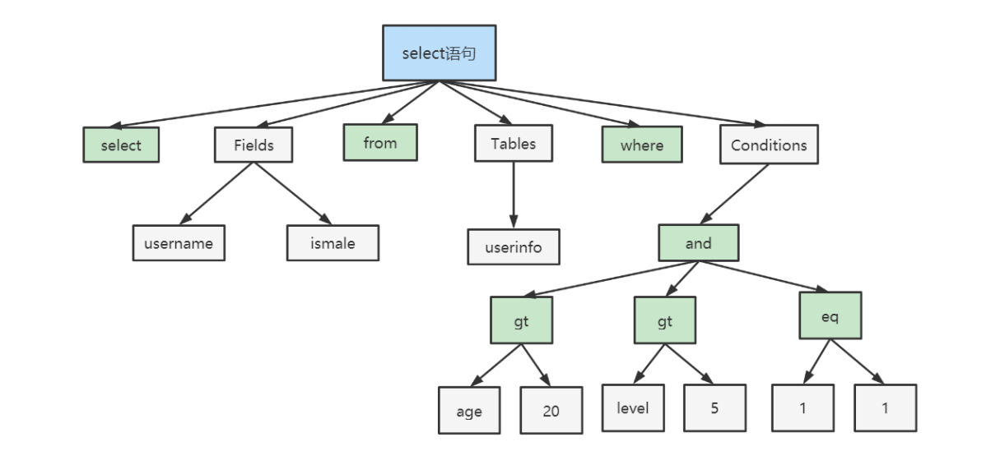

> 第三步：优化器：分析 sql 执行效率，比如是全表检索还是索引检索

> 第四步：执行器：生成执行计划，判断用户权限，执行 sql 返回结果

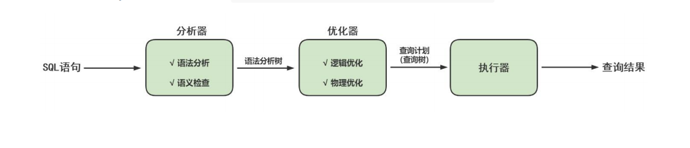

### msyql 的 sql 执行

> 参考尚硅谷文档和视频

> MySQL 的 sql 执行，MySQL8.0 没有开启缓存

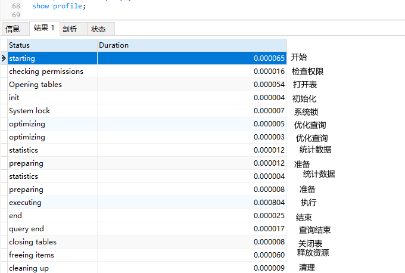

### oracle 的 sql 执行

> oracle 的 sql 执行
>
> 共享池检查有点类似于缓存，缓存的是执行计划，软解析可以绑定变量提高软解析的可能性，硬解析和 MySQL 的 sql 执行顺序一样

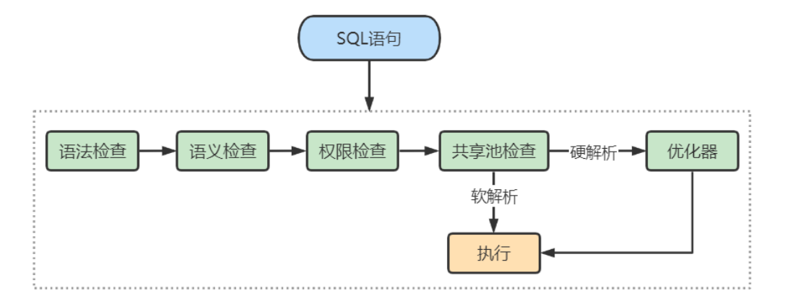

### 数据库缓存池

> 缓存池是将硬盘中的部分数据存放到内存中，上面的查询缓存是指将 sql 查询出来的结果集缓存在内存中

#### 缓存池

> 数据库将硬盘中的数据先缓存再内存中（数据库缓存池），再进行 sql 操作李，减少与硬盘的 IO 操作


#### 缓存原则

> 内存是有限的，通过`位置`*`频次`将热点数据优先加载

#### 预读特性

> 将每页数据的前后页数据也放到缓存中

#### 缓存池读取数据

> 修改操作时先修改缓冲池，再以一定的策略持久化到硬盘

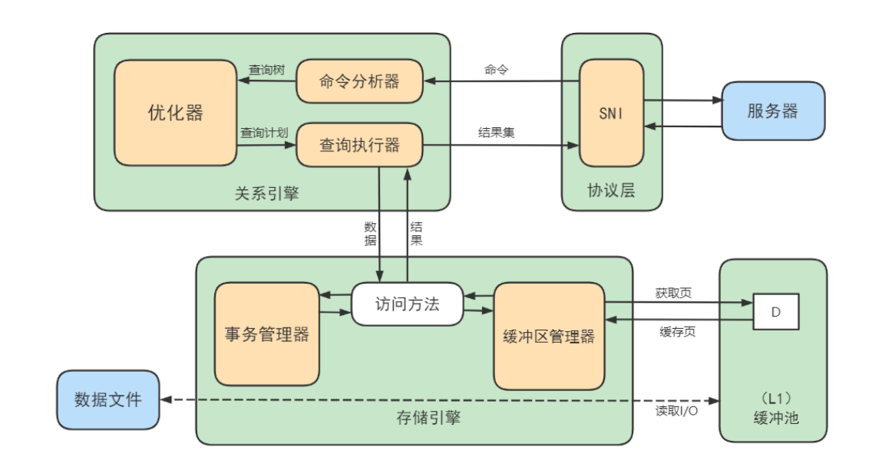

#### 修改缓冲池大小

```mysql
show variables like 'innodb_buffer_pool_size';
set global innodb_buffer_pool_size = 268435456;
```

#### 刷盘失败的情况

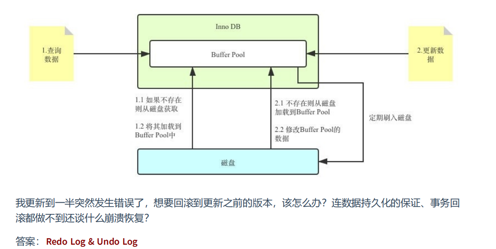

## 存储引擎

### 概念

> 存储引擎又称表处理器，接收上层传下来的执行计划，对表中的数据进行操作的部分称为存储引擎

### 查询存储引擎

```mysql
SHOW ENGINES;
-- 查询默认的存储引擎
SHOW VARIABLES LIKE '%storage_engine%'
SELECT @@default_storage_engine;
```

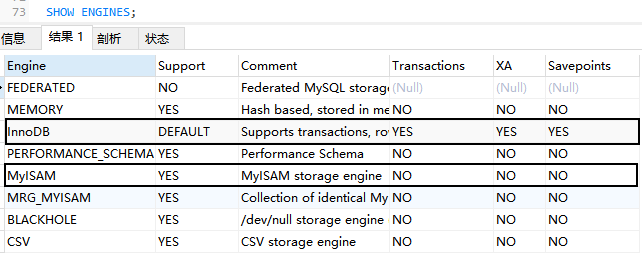

### 修改默认的存储引擎

```mysql
SET @@default_storage_engine = InnoDB; -- 默认就是InnoDB
```

### 创建表时指定存储引擎

```mysql
CREATE TABLE emp4 ( id INT ) ENGINE = INNODB;
SHOW CREATE TABLE emp4;
-- 修改表的存储引擎
ALTER TABLE emp4 ENGINE = MyISAM
```

### InnoDB 引擎

> InnoDB 引擎是支持事务的引擎，MySQL5.5 之后默认是 InnoDB 引擎，之前是 MyISAM 引擎
>
> 基本上所有的表都采用 InnoDB 引擎
>
> InnoDB 缓存索引还要缓存真实数据，对内存要求较高，而且内存大小对性能有决定性的影响
>
> 行锁

### MyISAM 引擎

>优势是访问的速度快，对事务完整性没有要求或者以 SELECT、INSERT 为主的以读为主的场景
>
>MyISAM 不支持是事务、行级锁、外键，数据奔溃后无法安全恢复
>
>MyISAM 只缓存索引，不缓存真实数据
>
>表锁

### 其他引擎

- Archive 引擎：用于数据存档：只支持插入和查询功能，适用于日志和数据采集等场景
- CSV 引擎：存储数据时，以逗号分隔各个数据项
- Memory 引擎：数据存放在内存中，速度快，数据易丢失，生命周期短
- Blackhole 引擎
- Federated 引擎
- Merge 引擎
- NDB 引擎

## 索引

> 索引是一种数据结构，好比一本新华字典，创建索引的目的就是减少磁盘 IO 的次数，加快查询效率

### 索引的优点

- 提交查询效率，减少 IO 操作
- 通过创建唯一索引保证数据唯一性
- 加速表和表之间的连接
- 减少查询中分组和排序的时间

### 索引的缺点

- 创建和维护索引需要耗费时间
- 索引需要占用磁盘空间
- 降低更新表的速度，因此更新表时最好先删除表中的索引，然后插入数据，再创建索引

### InnoDB 索引方案

> 索引是基于存储引擎的实现的，以 InnoDB 存储引擎为例

#### 在一个页中查找

> InnoDB 引擎存储数据的基本单位：页，一页是 16KB

- 以主键（有序）作为搜索条件：二分法
- 以其他列作为搜索条件：依次遍历（数据页中每一条记录之间通过单链表连接，在逻辑上是连续的）

#### 在很多页中查找

- 由于无法定位数据所在的页，需要从第一页沿着双向链表一直遍历，耗费时间（数据页与数据页通过双向链表连接，在逻辑上是连续的）

### 设计索引

#### 行格式

> 行格式：指的是在每条数据中还记录者其他信息

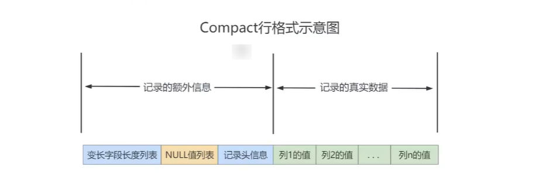

#### 数据页基本模型

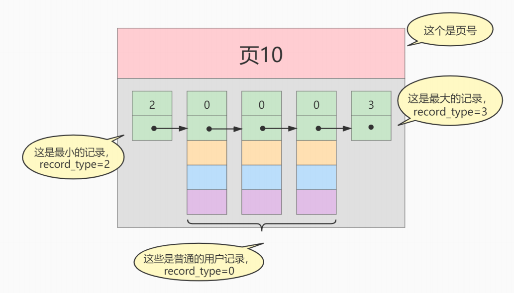

>数据页真实数据模型，数据之间以单向链表的形式存在

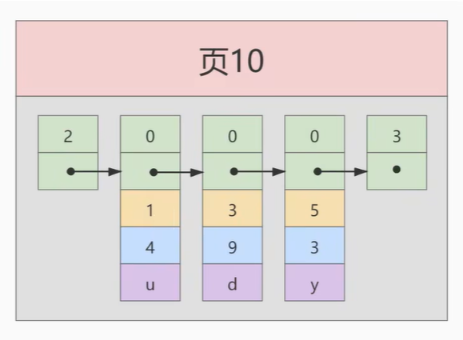

> 当数据页满了的时候建立新页存放数据，数据页之间以双向链表的形式存在

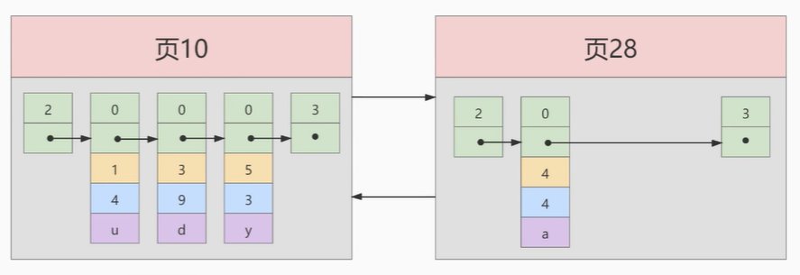

#### 页分裂

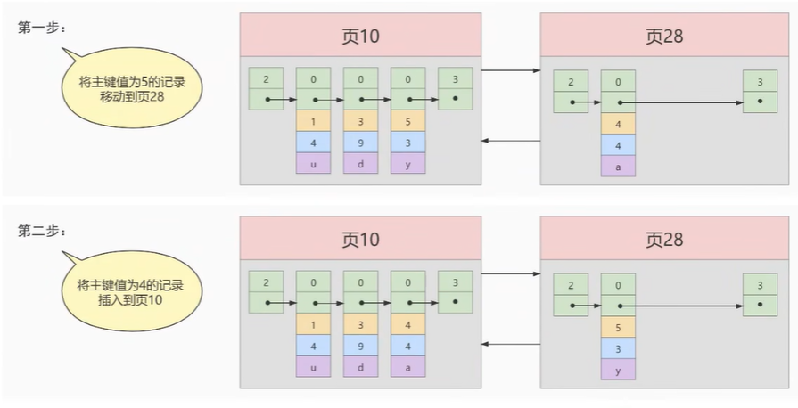

#### 目录项

> 给所有的页建立一个目录项（连续的存储空间）：key 表示最小的主键数，page_no 表示页号，这个目录项就是索引雏形


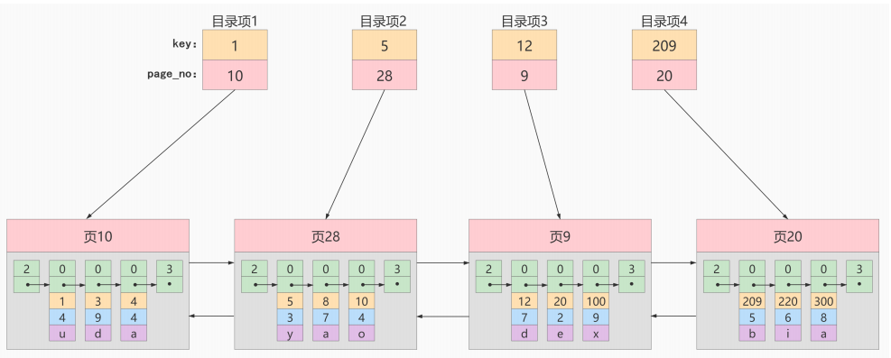

#### 目录项迭代

> 迭代一次：目录项记录的页：由于目录项需要连续的内存空间，加上目录项需要经常变动，成本较高，因此将目录项转变为链表形式，逻辑连续
>
> 0 表示普通数据、1 表示目录项数据、2 表示页最小值、3 表示页最大值

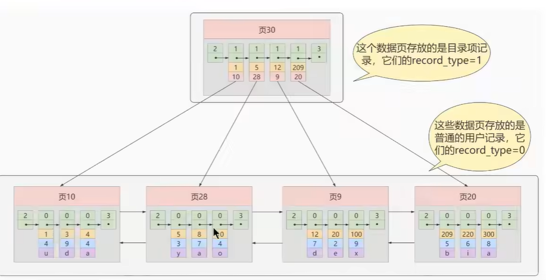

> 迭代两次：多个目录项记录的页

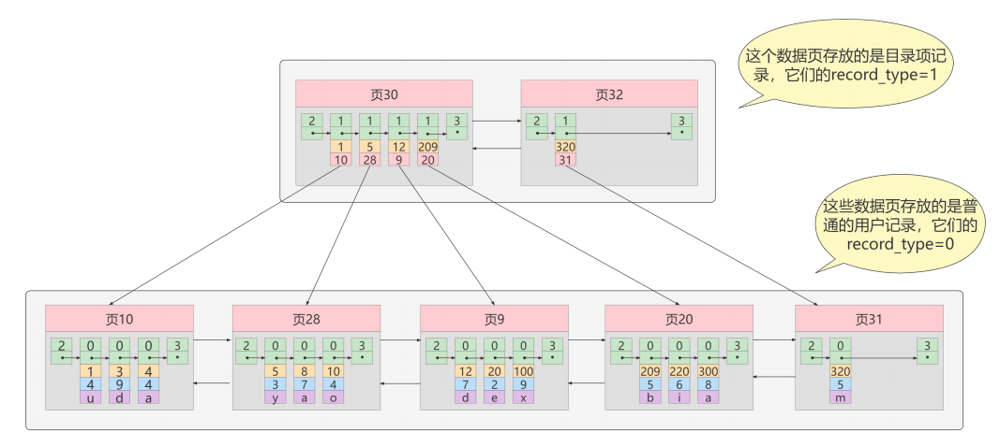

> 迭代三次：目录项记录页的目录页


### B+树

> 用到的 B+树都不会超过 4 层

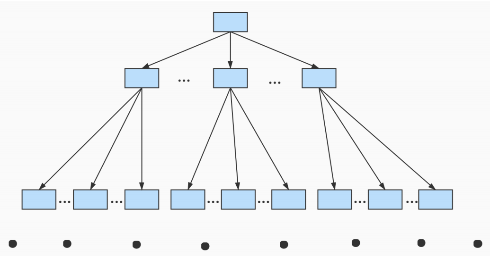

### 聚簇索引

> 按照`主键自增`和`（数据和索引不分离的）`的索引叫做聚簇索引，按照`主键自增`的`InnoDB引擎`的表`默认就是聚簇索引`
>
> InnoDB 引擎是数据和索引不分离的，MyISAM 引擎数据和索引是分成两个文件的

- 页内的记录是按照`主键`的大小顺序排成一个`单向链表`

- 各个存放`用户记录的页`也是根据页中用户记录的主键大小顺序排成一个`双向链表`

- 存放`目录项记录的页`分为不同的层次，在同一层次中的页也是根据页中目录项记录的主键大小顺序排成一个`双向链表`
- B+树的`叶子节点`存储的是完整的用户记录。所谓完整的用户记录，就是指这个记录中存储了所有列的值
- InnoDB 存储引擎会`自动创建聚簇索引`

> 优点

- `访问速度快`，索引和数据在同一个 B+树中
- 主键的排序`查找和范围`查找速度快
- 范围查找时，因为数据是紧密相连的，不需要从多个数据块中查找，可以`减少IO操作`

> 缺点

- 插入速度严重依赖于插入顺序，按照主键顺序插入是最快的，否则可能会出现页分裂，严重影响速度，因此`InnoDB引擎需要定义主键自增`
- 更新主键的代价很高，因此需要定义`主键不可更新`
- 二级索引访问需要两次索引查找

### 非聚簇索引（二级索引）

> 不以主键作为索引，以其他字段作为索引，以下是以 c2 的值的大小作为索引的 B+树

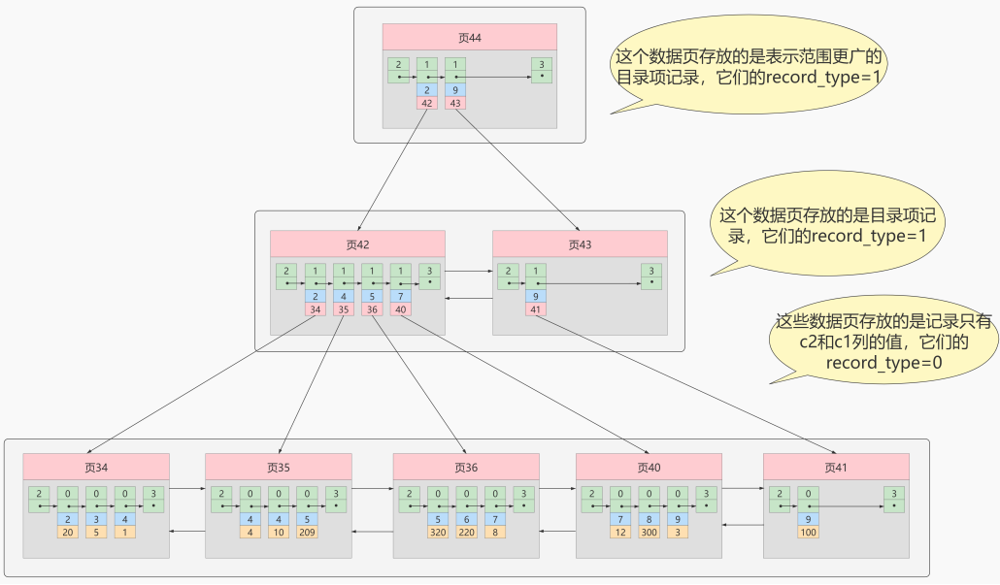

#### 回表的概念

> 非聚簇索引只保存作为索引的字段和该字段所对应的主键，当查到这个值之后再通过主键进行`聚簇索引`的方式再查一遍

### 非聚簇索引（联合索引）

> 以多个字段值的大小作为联合索引，本质上是二级索引

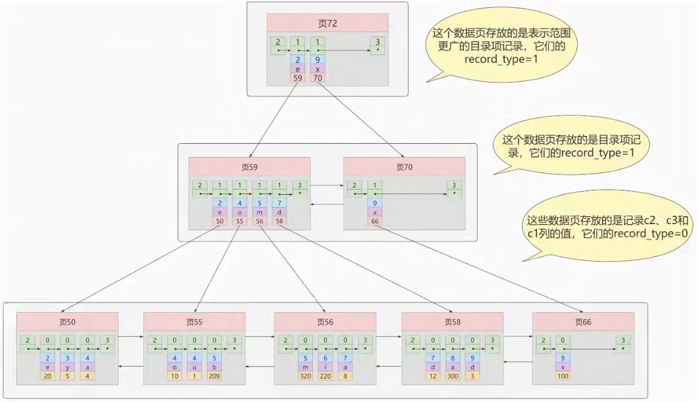

### 小结


### InnoDB 的 B+树索引的注意事项

- 根页面位置万年不动：如果数据超出了该页，则创建一个新页，将数据存储过去，该页变成目录项的页

- 内节点中目录项记录的唯一性：二级索引的目录项页记录需要保证唯一，即索引和主键作为联合索引

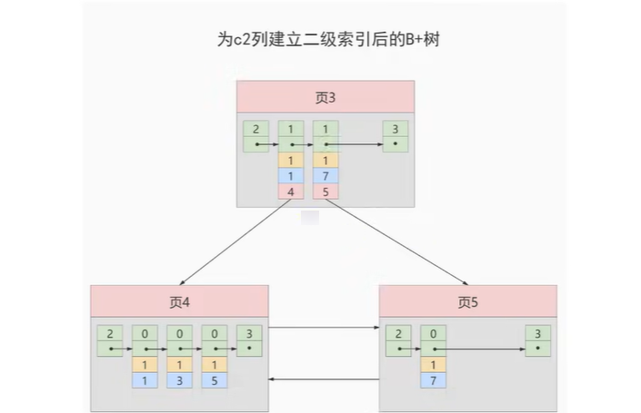

- 一个页面最少存储 2 条记录

### MyISAM 索引方案

> 叶子节点存放的是索引，索引和数据是分开的
>
> MyISAM 的索引都是非聚簇索引，也是有回表操作的，先从.myi 查找索引，再从.myd 查找数据

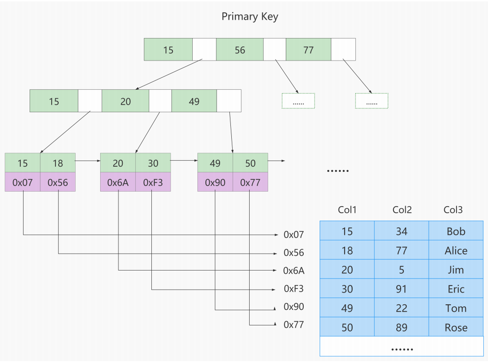

### 索引的代价

- 占用空间，一个页 16KB
- 增删改操作时，索引需要维护

### 选择 B+树的合理性

> 尽可能减少 IO 操作

> 查看尚硅谷教程

- 全表遍历：舍弃
- Hash:Memory 存储引擎默认的索引数据结构，InnoDB 采用`自适应Hash`，即将热点数据的地址到放到 hash 表中
- 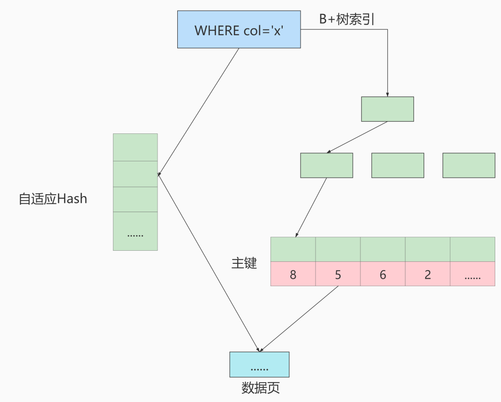

- 二叉搜索树：树的高度太高，IO 操作太多
- AVL 树：平衡二叉树->M 叉树
- B 树：多路平衡查找树，叶子节点和非叶子节点都需要存放数据
- 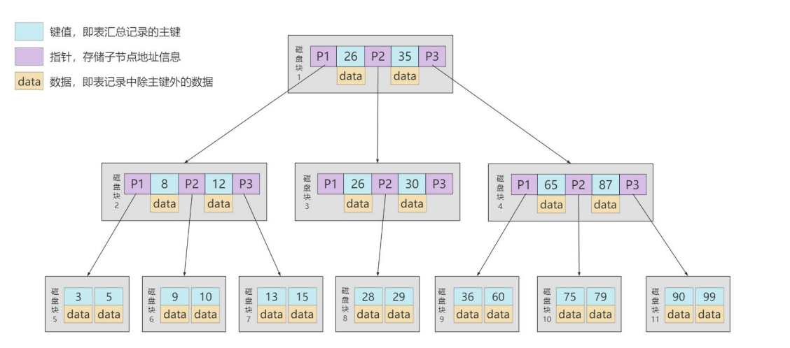

- B+树：查询效率更稳定、查询效率更高，非叶子节点不用存储数据，16KB，装载的目录更多


## InnoDB 存储结构

### 页

> InnoDB 存储引擎存储数据：页，每页占用内存 16KB


P 121


---


### 事务概述

- 开启事务 start transaction
- 回滚事务 rollback
- 提交事务 commit
- MySQL 事务默认提交方式：自动提交

#### 事务四大特性

- 原子性
- 一致性
- 持久性
- 隔离性

#### 事务隔离级别

- 脏读：一个事务读取到另一个事务未提交的数据
- 不可重复读：同一个事务两次读取到的数据不一致
- 幻读：事务 A 按照一定条件进行数据读取，期间事务 B 插入了相同搜索条件的新数据，事务 A 再次按照原先条件进行读取时，发现了事务 B 新插入的数据，称为幻读

1. 读未提交 
2. 读已提交：解决脏读
3. 可重复读：解决不可重复读
4. 序列化：解决幻读

### 数据库设计三范式

> 第一范式：任何一张表都必须有主键，每个字段具有原子性，字段不可分割

- 不满足第一范式，字段不具有原子性

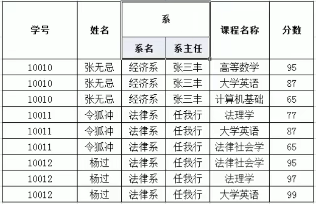

>第二范式：建立在第一范式基础上，要求所有非码完全依赖码，不要产生部分依赖

- 不满足第二范式
- 该表的码为学号 + 课程名称
- 姓名。系名。系主任部分依赖码

1. 问题 1:数据冗余;
2. 问题 2:添加系和系主任时不合法;
3. 问题 3:删除数据会将系的数据删除

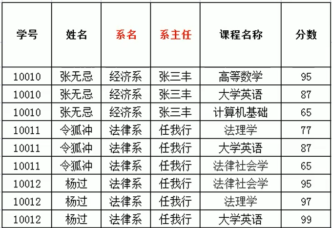

> 第三范式：建立在第二范式基础上，要求所有非主属性完全依赖主属性，不要产生传递依赖

- 不满足第三范式
- 通过学号可以确定系名，通过系名可以确定系主任，就说系主任传递依赖学号

1. 问题 1:添加系和系主任时不合法;
2. 问题 2:删除数据会将系的数据删除


#### 满足数据库三范式的表设计


- 函数依赖：例如`通过学号可以确定学生张三,就说张三依赖学生学号`
- 完全函数依赖：例如`通过学号和课程名称才能确定分数,就说成绩完全依赖学号和课程名称`
- 部分函数依赖：例如`学号和课程名称是函数组,确定姓名只需要依赖学号就行,就说姓名部分函数依赖学号和课程名称`
- 传递依赖：例如`通过学号可以确定系名,通过系名可以确定系主任,就说系主任传递依赖学号`
- 码：如果一个属性或一个属性组被其他属性完全依赖，则称这个属性或属性组为该表的码

### 表的设计

- 一对一：一个人一个身份证
- 一对多：一个部门对应多个员工 员工指向部门
- 多对多：用户和角色 建立中间表用户角色表

### 备份数据库

#### 命令行

> 备份:MySQLdump -uroot -p123456  db1> 保存路径
>
> 还原:source db1.sql

### DCL 语言

#### 用户表

```
use MySQL
--查询
select * from user
--创建
create user 'zhansan'@'localhost' IDENTIFIED by '123456'  //localhost表示只能重本机访问该数据库
create user 'lisi'@'%' IDENTIFIED by '123456'  //%表示可以从任意主机访问该数据库
--删除
drop user 'zhansan'@'localhost'
drop user 'lisi'@'%'
--修改
set PASSWORD for 'zhansan'@'localhost' = PASSWORD('123')
```

#### 权限

```
--查询权限
show grants for 'zhansan'@'localhost'
--授予权限
grant select,delete,update on 数据库.表名 to 'zhansan'@'localhost'
--授予所有权限
grant ALL on *.* to 'zhansan'@'localhost'
--撤销权限
revoke select on 数据库.表名 from  'zhansan'@'localhost'
```

