# MySQL34 道题目

## 复习

先复习一下 sql 的执行顺序

```mysql
(1)from -- 查询表
(2)on -- 连表条件
(3)join -- 连表
(4)where -- 过滤
(5)group by -- 分组
(6)sum,count,max,min,avg -- 聚合
(7)having -- 分组过滤
(8)select -- 以下相当于是对结果集进行处理
(9)distinct -- 去重
(10)order by -- 排序
(11)limit -- 分页
```

## 1、求每个部门最高薪水的人员名称

> 先按照部门编号分组，求每组的薪水最大值
>
> 和 emp 表连接，求每组最高薪水的人员名称

```sql
SELECT
	e.ename,
	temp.maxsal,
	temp.deptno 
FROM
	emp e
JOIN 
	( SELECT max( sal ) maxsal, deptno FROM emp GROUP BY deptno ) temp 
ON 
	e.sal = temp.maxsal AND e.deptno = temp.deptno;
```


## 2、求高于部门平均薪水的人员名称

>先求每个部门的平均薪水
>
>和 emp 表连接，求高于部门平均薪水的人员名称

```sql
SELECT
	e.ename,
	e.sal,
	temp.avgsal,
	temp.deptno 
FROM
	emp e
JOIN 
	( SELECT avg( sal ) avgsal, deptno FROM emp e GROUP BY deptno ) temp 
ON 
	e.deptno = temp.deptno AND e.sal > temp.avgsal;
```

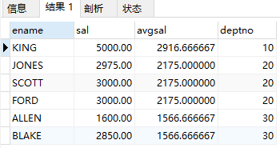

## 3.1、求每个部门【平均薪水等级】

>先求每一个人的薪水等级
>
>再按照部门编号分组求部门的平均薪水等级

```sql
SELECT
	avg( s.grade ) avggrade,
	e.deptno 
FROM
	emp e
JOIN 
	salgrade s 
ON 
	e.sal BETWEEN s.losal AND s.hisal 
GROUP BY
	e.deptno;
```

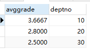

## 3.2、求每个部门的【平均薪水】的薪水等级

> 先求每个部门的平均薪水
>
> 再和薪水等级表连接求薪水等级

```sql
SELECT
	s.grade,
	temp.avgsal,
	temp.deptno 
FROM
	salgrade s
JOIN 
	( SELECT avg( sal ) avgsal, deptno FROM emp GROUP BY deptno ) temp 
ON 
	temp.avgsal BETWEEN s.losal AND s.hisal;
```


## 4.1、求工资最高值不使用 Max

>先将薪资按照降序进行排序；
>
>再使用 limit 进行截取

```sql
SELECT
	* 
FROM
	emp 
ORDER BY
	sal DESC 
LIMIT 
	0,1;
```

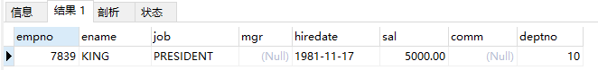

## 4.2、求工资最高值不使用 Max

> a 的最高工资永远不会小于 b 的最高工资，所以连表后是查询不到 a 的最高工资的，所以最高工资的人不会出现在连表的结果中。

```sql
SELECT
	* 
FROM
	emp e
WHERE
	e.sal 
NOT IN
	( SELECT DISTINCT a.sal FROM emp a JOIN emp b ON a.sal < b.sal );
```

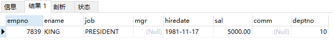

## 5、求平均薪水最高部门的部门编号

> 先找出每个部门的平均薪水
>
> 在按照薪水排序后分页取第一条
>
> 为什么 order by 可以使用 avgsal，观察 sql 的执行顺序，order by 是在 select 执行后执行

```sql
SELECT
	avg( sal ) avgsal,
	deptno 
FROM
	emp 
GROUP BY
	deptno 
ORDER BY
	avgsal DESC
LIMIT 
	0,1;
```

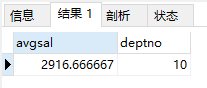

## 6、求平均薪水最高的部门的部门名称

> 先取得平均薪水最高的部门编号
>
> 再和 dept 表连接查询部门名称
>
> 还有一种做法是先直接和 dept 表连接，再筛选平均薪水最高的部门。看数据量的多少来决定是否先连表
>
> 数据量大就连表查询，数据量少子查询和连表查询都可以，连表查询对数据的会少一点

```sql
SELECT
	temp.avgsal,
	d.dname 
FROM
	dept d
JOIN 
	( SELECT avg( sal ) avgsal, deptno FROM emp GROUP BY deptno ORDER BY avgsal DESC LIMIT 0, 1 ) temp 
ON 
	d.deptno = temp.deptno;
```

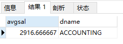

我的写法：连表查询，上面的是子查询加连表查询

```sql
select 
	avg(e.sal) avgsal,d.dname 
from 
	emp e
join 
	dept d 
on
	e.deptno=d.deptno 
group by 
	e.deptno 
order by 
	avgsal desc 
limit
	0,1;
```

## 7、求平均薪水的等级最低的部门的部门名称

>先求部门的平均薪水
>
>再求部门最低的平均薪水的等级
>
>再求部门名称

```sql
select d.dname from dept d
join (
    select * from salgrade s
    join (select avg(e.sal) avgsal,e.deptno from emp e group by e.deptno) temp
    on temp.avgsal between s.losal and s.hisal 
    order by temp.avgsal asc limit 0,1) temp2
on d.deptno = temp2.deptno;
```

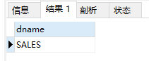

## 8、求比普通员工（不是领导）的最高薪水还要高的领导人名称

> 比普通员工最高薪水还要高的人一定是领导

```sql
select 
	ename 
from 
	emp 
where 
	sal > (select max(sal) maxsal from emp where empno not in (select distinct mgr from emp where mgr is not null));
```

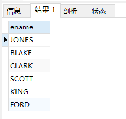

## 9、求薪水最高的前五名员工

>limit (当前页 -1）*每页页数，每页页数

```sql
select ename,sal from emp order by sal desc limit 0,5; 
```

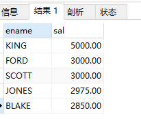

## 10、求薪水最高的第六到第十名员工

>limit (当前页 -1）*每页页数，每页页数

```sql
select ename,sal from emp order by sal desc limit 5,5;
```

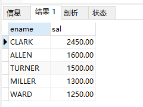

## 11、求最后入职的 5 名员工

```sql
select ename,hiredate from emp order by hiredate desc limit 0,5;
```

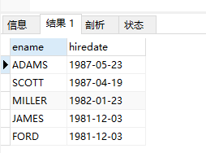

## 12、求每个薪水等级有多少个员工

> 先连表，再按照工资等级分组

```sql
select 
	s.grade,count(*) total 
from
    emp e 
join 
	salgrade s 
on 
	e.sal between s.losal and hisal 
group by 
	s.grade;
```

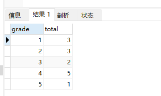

## 13、面试题

略

## 14、求所有员工及领导的姓名

>我的领导也是员工，所以我的领导编号去连接员工编号 相等的就是我的领导

```sql
select e.ename '员工',ee.ename '领导' from emp e left join emp ee on e.mgr = ee.empno;
```

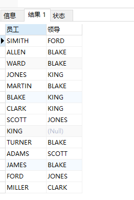


## 15、求受雇日期早于其直接上级的所有员工的编号，姓名，部门名称

>将 emp 表自连接，连接条件是 a 表的领导编号与 e 表的员工编号相等与员工的入职日期早于自己直接上级；
>
>继续连接 dept 表，连接条件是 a 表的员工编号与 d 表的员工编号相等
>
>左连接会导致左表一直是主表，无法起到过滤作用

```sql
SELECT
	e.deptno,
	e.ename,
	d.dname 
FROM
	emp e
JOIN 
	emp ee 
ON 
	e.mgr = ee.empno 
JOIN 
	dept d 
ON 
	e.deptno = d.deptno
where 
	e.hiredate < ee.hiredate;
```


## 16、求部门名称和部门员工信息，同时列出没有员工的部门

> 把 dept 表作为主表查询

```sql
select 
	d.*,e.* 
from 
	dept d 
left join 
	emp e
on 
	d.deptno = e.deptno
```

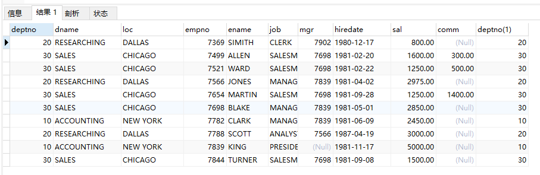

## 17、求至少有 5 个员工的所有部门

>先按照部门编号分组求出大于等于 5 个员工的部门
>
>再 dept 表连接一下获取部门名称

```sql
SELECT
	d.dname,
	temp.* 
FROM
	dept d
JOIN 
	( SELECT deptno, count(*) total FROM emp GROUP BY deptno HAVING count(*) >= 5 ) temp 
ON 
	d.deptno = temp.deptno;
```

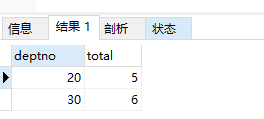

## 18、求薪资比 SMITH 多的所有员工信息

```sql
select ename,sal from emp where sal > (select sal from emp where ename = 'SIMITH');
```

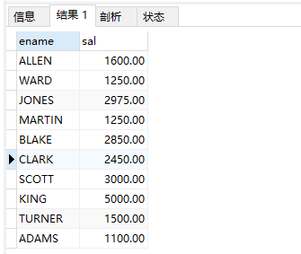

## 19、求所有 CLERK( 办事员) 的姓名及其部门名称，部门的人数

> 部门人数是指办事员所在部门的总人数

```sql
SELECT
	e.ename,
	temp2.* 
FROM
	emp e
JOIN (
	SELECT
		d.dname,
		temp.deptno,
		temp.total 
	FROM
		dept d
	JOIN ( SELECT deptno, count(*) total FROM emp GROUP BY deptno ) temp ON d.deptno = temp.deptno ) temp2 
ON 
	e.deptno = temp2.deptno 
WHERE
	job = 'CLERK';
```

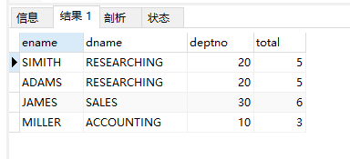

## 20、求列出最低薪资大于 1500 的各种工作及从事此工作的全部雇员人数

>先查询最低薪资大于 1500 的工作
>
>再关联子查询

```sql
SELECT
	job,
	count(*) total 
FROM
	emp 
WHERE
	job IN ( SELECT job FROM emp GROUP BY job HAVING min( sal )> 1500 ) 
GROUP BY
	job
```

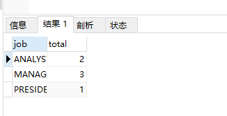

## 21、求在部门 SALES 销售部工作的员工的姓名，假定不知道销售部的部门编号

> 关联子查询

```sql
SELECT
	ename 
FROM
	emp e 
WHERE
	deptno = ( SELECT deptno FROM dept d WHERE d.dname = 'SALES' );
```

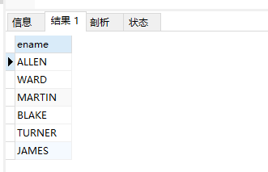

## 22、求薪资高于公司平均薪资的所有员工，所在部门，上级领导，雇员的工资等级

>先查询薪资高于公司平均薪资的员工 作为临时表 temp
>
>再左连接 emp 表查询上级领导的信息
>
>再内连接 dept 表查询部门的信息
>
>再内连接薪资等级表查询工资等级的信息

```sql
select temp.ename,d.dname,ee.ename as 领导,s.grade,temp.sal 
from (select * from emp e where e.sal>(select avg(sal) avgsal from emp)) temp 
left join emp ee on temp.mgr = ee.empno
join dept d on temp.deptno = d.deptno 
join salgrade s on temp.sal between s.losal and s.hisal
order by temp.sal
```

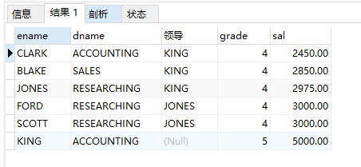

## 23、求与“SCOTT”从事相同工作的所有员工及部门名称

> 关联子查询

```sql
select 
	ename,job,dname 
from
	emp e 
join
	dept d 
on 
	e.deptno = d.deptno 
where 
	job = (select job from emp where ename = 'SCOTT')
and 
	e.ename <> 'SCOTT'
```


## 24、求部门不等于 30 的员工信息，要求是员工薪资在【员工部门等于 30 的薪资范围内】

> 题目很绕

```sql
select 
	ename,sal
from
	emp
where 
	sal in (select distinct sal from emp where deptno = 30)
and
	deptno <> 30;
```

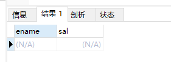

## 25、求薪资高于【在部门 30 工作的所有员工的薪资】的员工姓名、薪资、部门名称

> 关联子查询加连表

```sql
select 
	e.ename,e.sal,d.dname 
from 
	emp e 
join 
	dept d 
on 
	e.deptno = d.deptno 
where 
	e.sal >(select max(sal)  maxsal from emp where deptno = 30 )
```

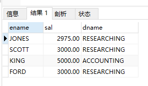

## 26、求每个部门工作的员工数量、平均工资和平均服务期限

> ifnull(存在的值，0) 和 timestampdiff(相隔的时间类型，前一个时间，后一个时间)

```sql
SELECT
	d.deptno,
	count( e.ename ),
	ifnull( avg( e.sal ), 0 ),
	ifnull( avg( TIMESTAMPDIFF( YEAR, hiredate, NOW())), 0 ) AS avgyear 
FROM
	emp e
RIGHT JOIN 
	dept d 
ON
	e.deptno = d.deptno 
GROUP BY
	d.deptno
```

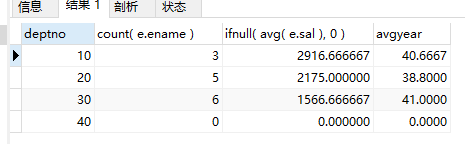

## 27、求所有员工的姓名、部门名称和工资

```sql
SELECT
	e.ename,
	d.dname,
	e.sal
FROM
	emp e
JOIN 
	dept d 
ON e.deptno = d.deptno
```

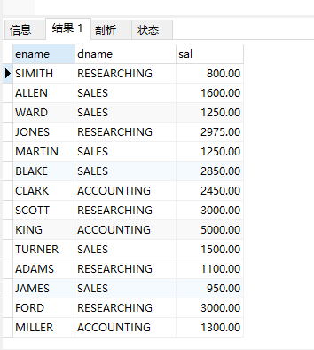

## 28、求所有部门的详细信息和人数

```sql
SELECT
	d.*,
	ifnull( temp.total, 0 ) "人数"
FROM
	dept d
LEFT JOIN 
	( SELECT deptno, count(*) total FROM emp e GROUP BY e.deptno ) temp 
ON 
	d.deptno = temp.deptno
```

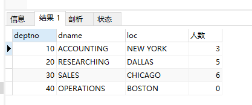

## 29、求各种工作的最低工资及从事此工作的雇员姓名

```sql
SELECT
	temp.*,
	ee.ename 
FROM
	( SELECT job, min( sal ) minsal FROM emp e GROUP BY job ) temp
JOIN 
	emp ee 
ON 
	temp.minsal = ee.sal 
AND 
	temp.job = ee.job
```

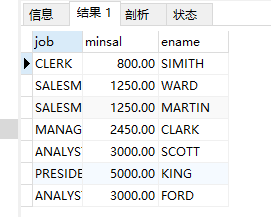

## 30、求各个部门的 MANAGER( 领导) 的最低薪金

```sql
SELECT
	ee.deptno,
	ifnull(min( ee.sal ),0) minsal
FROM
	emp e
LEFT JOIN 
	emp ee 
ON
	e.mgr = ee.empno 
GROUP BY
	ee.deptno
```

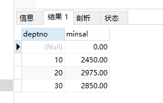

## 31、求所有员工的年工资，按年薪从低到高排序

> 年薪=工资 + 年终奖

```sql
SELECT
	ename,
	(sal + ifnull( comm, 0 )) yearsal 
FROM
	emp 
ORDER BY
	yearsal ASC
```

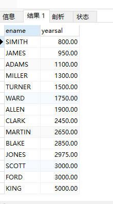

## 32、求员工领导的薪水超过 3000 的员工名称与领导

```sql
SELECT
	e.ename '员工',
	ee.ename '领导',
	ee.sal 
FROM
	emp e
LEFT JOIN 
	emp ee 
ON 
	e.mgr = ee.empno 
WHERE
	ee.sal > 3000
```


## 33、求部门名称中，带’S’字符的部门员工的工资合计、部门人数

> 多个字段分组
>
> select deptno,ename from emp group by deptno,ename，意思就是先按照部门编号分组，再按照部门中人员姓名分组

```sql
SELECT
	d.deptno,
	d.dname,
	d.loc,
	count( e.ename ),
	ifnull( sum( e.sal ), 0 ) AS allsal 
FROM
	emp e
	RIGHT JOIN dept d ON e.deptno = d.deptno 
WHERE
	d.dname LIKE '%S%' 
GROUP BY
	d.deptno,
	d.dname,
	d.loc;
```

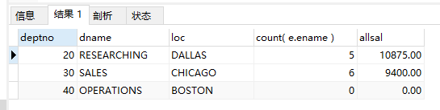

## 34、给任职日期超过 30 年的员工加薪 10 %

```sql
UPDATE emp 
SET sal = sal * 1.1 
WHERE
	TIMESTAMPDIFF(YEAR,hiredate,NOW()) > 40
```

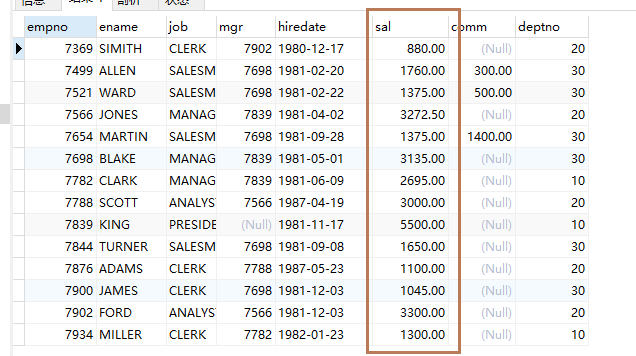
