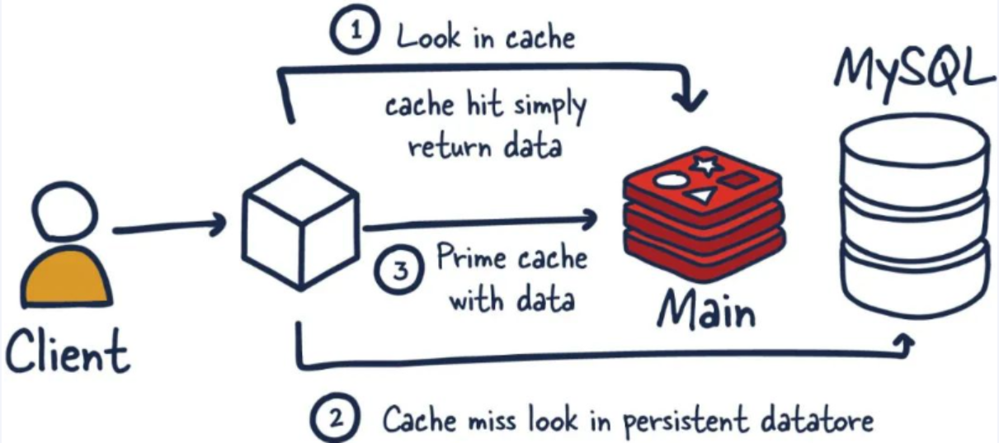
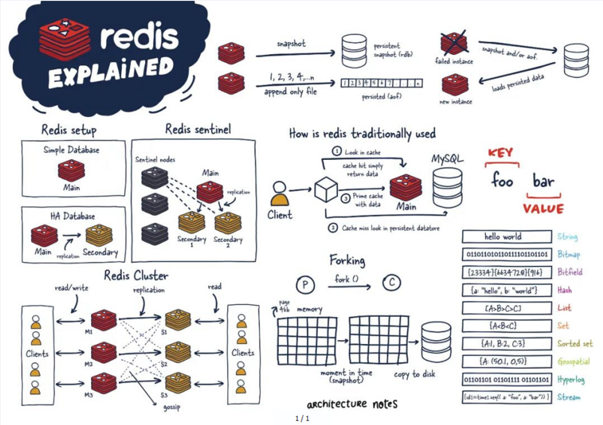
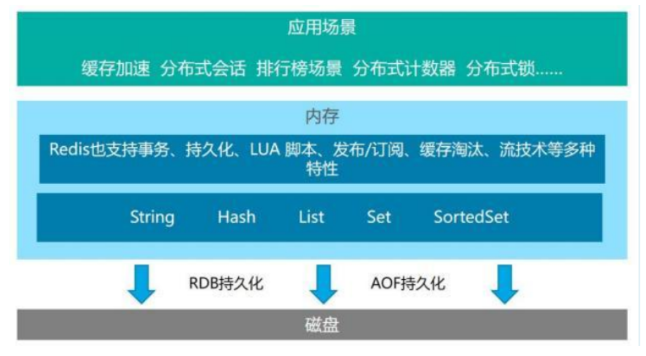
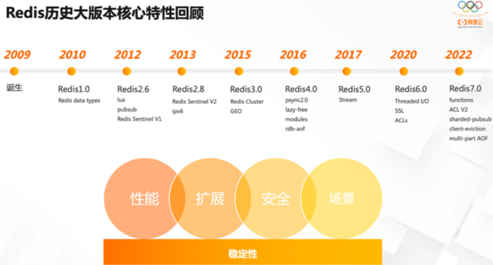

---

---
# Redis7 入门概述

## 是什么

- Redis:REmote Dictionary Server(远程字典服务器)
- 官网解释
  - Remote Dictionary Server(远程字典服务) 是完全开源的，使用 ANSIC 语言编写遵守 BSD 协议，是一个高性能的 Key-Value 数据库提供了丰富的数据结构，例如 String、Hash、List、Set、SortedSet 等等。数据是存在内存中的，同时 Redis 支持事务、持久化、LUA 脚本、发布/订阅、缓存淘汰、流技术等多种功能特性提供了主从模式、Redis Sentinel 和 Redis Cluster 集群架构方案
- 拜拜神
  - Redis 之父安特雷兹
    - Github https://github.com/antirez
    - 个人博客 http://antirez.com/latest/0

## 能干嘛

- 主流功能与应用

  - 分布式缓存，挡在 mysql 数据库之前的带刀护卫
    - 
    - Redis 是 key-value 数据库 (NoSQL 一种)，mysql 是关系数据库
    - Redis 数据操作主要在内存，而 mysql 主要存储在磁盘
    - Redis 在某一些场景使用中要明显优于 mysql，比如计数器、排行榜等方面
    - Redis 通常用于一些特定场景，需要与 Mysql 一起配合使用
    - 两者并不是相互替换和竞争关系，而是共用和配合使用
  - 内存存储和持久化 (RDB+AOF)redis 支持异步将内存中的数据写到硬盘上，同时不影响继续服务
  - 高可用架构搭配
    - 单机
    - 主从
    - 哨兵
    - 集群
  - 缓存穿透、击穿、雪崩
  - 分布式锁
  - 队列
    - Reids 提供 list 和 set 操作，这使得 Redis 能作为一个很好的消息队列平台来使用。
    - 我们常通过 Reids 的队列功能做购买限制。比如到节假日或者推广期间，进行一些活动
    - 对用户购买行为进行限制，限制今天只能购买几次商品或者一段时间内只能购买一次。比较适合适用。
  - 排行版 + 点赞
    - 在互联网应用中，有各种各样的排行榜，如电商网站的月度销量排行榜、社交 APP 的礼物排行榜、小程序的投票排行榜等等。Redis 提供的 zset 数据类型能够快速实现这些复杂的排行榜。
    - 比如小说网站对小说进行排名，根据排名，将排名靠前的小说推荐给用户
- 一图，总体功能慨述

  - 
- 优势

  - 性能极高-Redis能读的速度是110000次/秒，写的速度是81000次/秒
  - Redis 数据类型丰富，不仅仅支持简单的 key-value 类型的数据，同时还提供 list,set,Zset,hash 等数据结构的存储
  - Redis 支持数据的持久化，可以将内存中的数据保持在磁盘中，重启的时候可以再次加载进行使用
  - Redis 支持数据的备份，即 master-slave 模式的数据备份
- 小总结

  - 

## 去哪下

- 官网地址 
  - 英文
    - [https://redis.io/](https://redis.io/)
  - 中文
    - http://www.redis.cn/
    - https://www.redis.com.cn/documentation.html
- 下载安装包
  - https://redis.io/download/
  - Redis7
    - redis-7.0.0.tar.gz
  - Redis6
- 其它文档资料
  - Redis 源码地址
    - https://github.com/redis/redis
    - 中国大陆打开慢多刷几次或梯子试试
  - Redis 在线测试
    - https://try.redis.io/
  - Redis 命令参考
    - http://doc.redisfans.com/

## 怎么玩

- 多种数据类型基本操作和配置
- 持久化和复制，RDB/AOF
- 事务的控制
- 复制，集群等

## Redis 迭代演化和 Redis7 新特性浅谈

- 时间推移，版本升级
  - 老版视频 https://www.bilibili.com/video/BV1oW411u75R?p=1
  - Redis 之父安特雷兹的发言 http://antirez.com/news/132
- Redis 版本迭代推演介绍
  - 几个里程碑式的重要版本
    - 
  - 命名规则
    - Redis 从发布至今，已经有十余年的时光了，一直遵循着自己的命名规则
    - 版本号第二位如果是奇数，则为非稳定版本 如 2.7、2.9、3.1
    - 版本号第二位如果是偶数，则为稳定版本 如 2.6、2.8、3.0、3.2
    - 当前奇数版本就是下一个稳定版本的开发版本，如 2.9 版本是 3.0 版本的开发版本
    - 我们可以通过 redis.io 官网来下载自己感兴趣的版本进行源码阅读
    - 历史发布版本的源码：https://download.redis.io/releases/
- Redis7.O 新特性慨述
  - https://github.com/redis/redis/releases
  - 部分新特性总览
    - Redis Functions
    - Client-eviction
    - Multi-part AOF
    - ACL V2
    - 新增命令
    - listpack 替代 ziplist
    - 底层性能提升（和编码矣系不大）
- 本次将对 Redis7 的一部分新特性做说明 (not all)B
