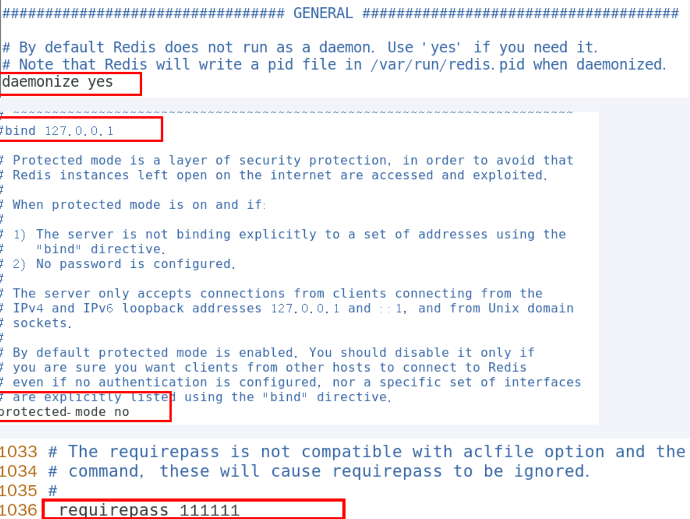

# Redis7 安装配置

## 自己购买云服务器

- 自己购买阿里云、青牛云、腾讯云或华为云服务器，自带 CentoOS 或者 Ubuntu 环境

## VMWare 本地虚拟机

- VMWare 虚拟机的安装
- 如何查看自己的 Linux 是 32 位还是 64 位
- `getconf LONG_BIT`

## Redis 的安装

- 由于企业里面做 Redis 开发，99% 都是 Linux 版的运用和安装，几乎不会涉及到 Windows 版
- Linux 版安装
  - Linux 环境安装 Redis 必须先具备 gcc 编译环境
    - 什么是 gcc
      - gcc 是 linux 下的一个编译程序，是 C 程序的编译工具
      - GCC(GNU Compiler Collection) 是 GNU(GNU's Not Unix) 计划提供的编译器家族，它能够支持 C, C++, Objective-C, Fortran, Java 和 Ada 等等程序设计语言前端，同时能够运行在 x86, x86-64, IA-64, PowerPC, SPARC 和 Alpha 等等几乎目前所有的硬件平台上。鉴于这些特征，以及 GCC 编译代码的高效性，使得 GCC 成为绝大多数自由软件开发编译的首选工具。虽然对于程序员们来说，编译器只是一个工具，除了开发和维护人员，很少有人关注编译器的发展，但是 GCC 的影响力是如此之大，它的性能提升甚至有望改善所有的自由软件的运行效率，同时它的内部结构的变化也体现出现代编译器发展的新特征
    - 查看
      - `gcc -v`
    - 安装
      - 安装 redis 之前需要具备 c++库环境
      - `yum -y install gcc-c++`
  - 版本选择
    - 查看自己 redis 版本的命令 `redis-server-v`
    - 目前建议都需要升级到 6.0.8 版本以上
    - 本次我们用 Redis7.0
  - Redis7 安装步骤
    - 下载获得 `redis-7.0.0.tar.gz` 后将它放入我们的 Linux 目录/opt
      - `wget https://download.redis.io/releases/redis-7.0.0.tar.gz`
    - /opt 目录下解压 redis
      - `tar -zxvf redis-7.0.0.tar.gz`
    - 进入目录
      - `cd redis-7.0.0`
    - 在 redis-7.0.0 目录下执行 make 命令
      - `make & make install`
    - 查看默认安装目录：`cd /usr/local/bin`
      - Linux 下的 `/usr/local` 类以我们 windows 系统的 `C:\Program Files`
    - 将默认的 redis.conf 拷贝到自己定义好的一个路径下，比如/myredis
      - `cd /opt/redis-7.0.0`
      - `mkdir /myredis`
      - `cp redis.conf /myredis`
    - 修改/myredis目录下redis.conf配置文件做初始化设置
      - redis.conf 配置文件，改完后确保生效，记得重启，记得重启
      - 默认 daemonize no 改为 daemonize yes
      - 默认 protected-mode yes 改为 protected-mode no
      - 默认 bind 127.0.0.1 改为 直接注释掉 (默认 bind 127.0.0.1 只能本机访问) 或改成本机 IP 地址，否则影响远程 IP 连接
      - 添加 redis 密码 改为 requirepass 你自己设置的密码
      - 
    - 后动服务
      - `/usr/local/bin` 目录下运行 redis-server，启用 /myredis 目录下的 redis.conf 文件
    - 连接服务
      - redis-cli 连接
        - `redis-server /myredis/redis.conf`
        - `redis-cli`
        - `acl users` 查看用户名
        - `auth default 111111`
        - `ping`
        - `redis-cli -a 111111`
    - Redis 端口为啥是 6379？
    - 永远的 helloworld
    - 关闭
      - 单实例关闭：`redis-cli -a 111111 shutdown`
      - 多实例关闭，指定端口矣闭：`redis-cli -p 6379 shutdown`
  - Redis7 卸载步骤
    - 考虑到已经有 redis，但不是 redis7，想卸载重装
    - 停止 redis-server 服务
      - `redis-cli shutdown`
    - 删除/usr/local/Iib目录下与redis相矣的文件
      - `ls -l /usr/local/bin/redis-*`
      - `rm -rf /usr/local/bin/redis-*`
- docker 版的 redis 安装配置参考
  - https://www.bilibili.com/video/BV1gr4y1U7CY?p=39&vdsource=f3f60f7acbef49d38b97c4d660d439fc

