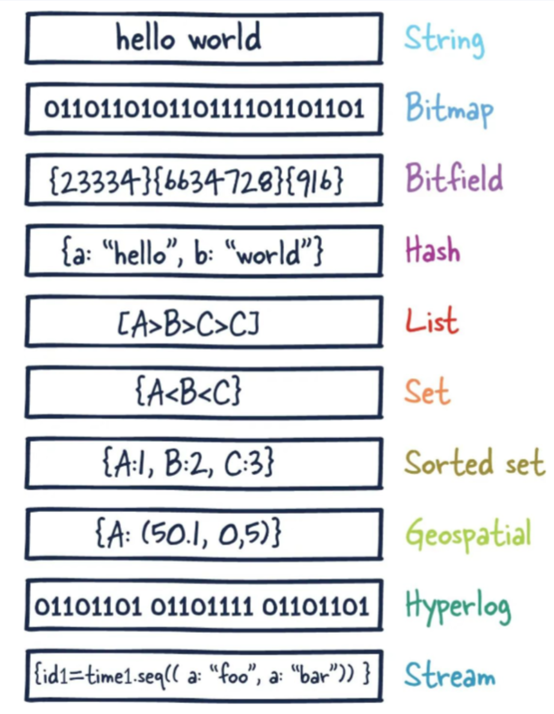
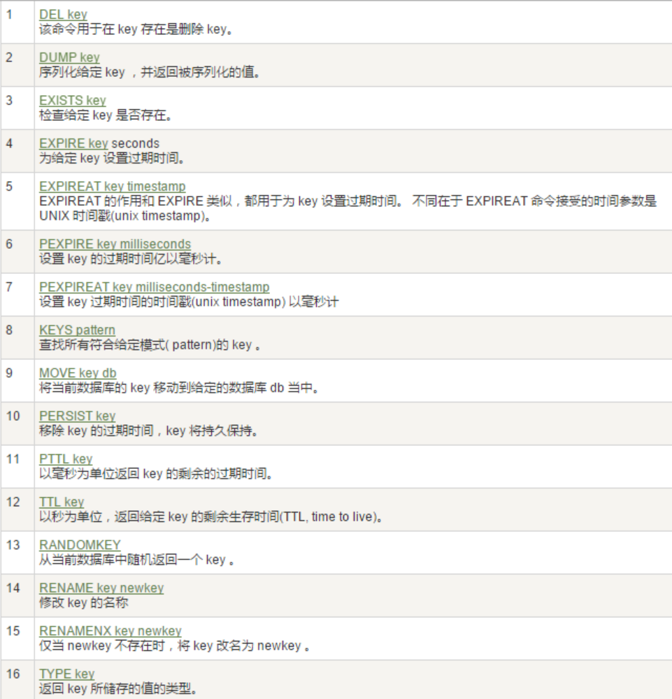
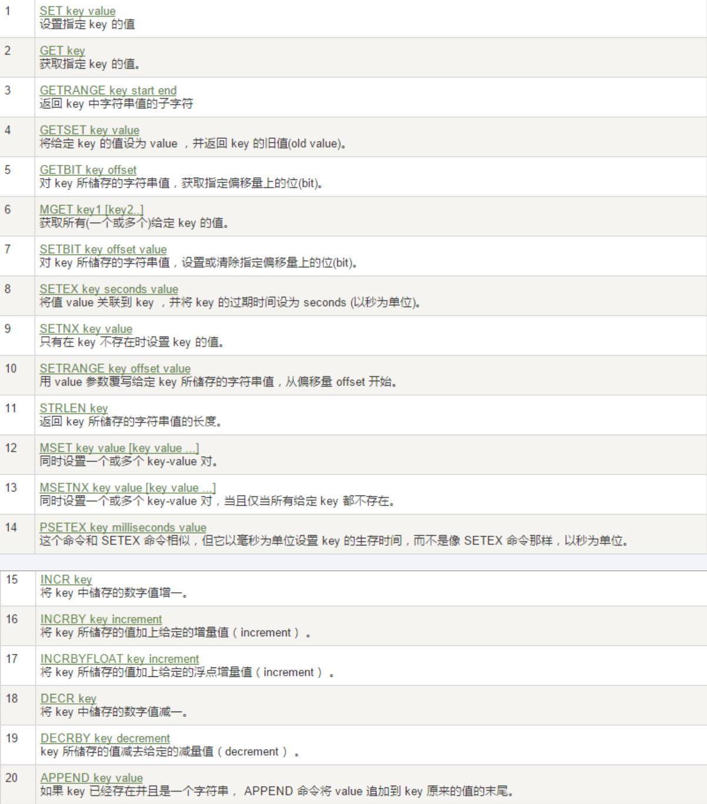
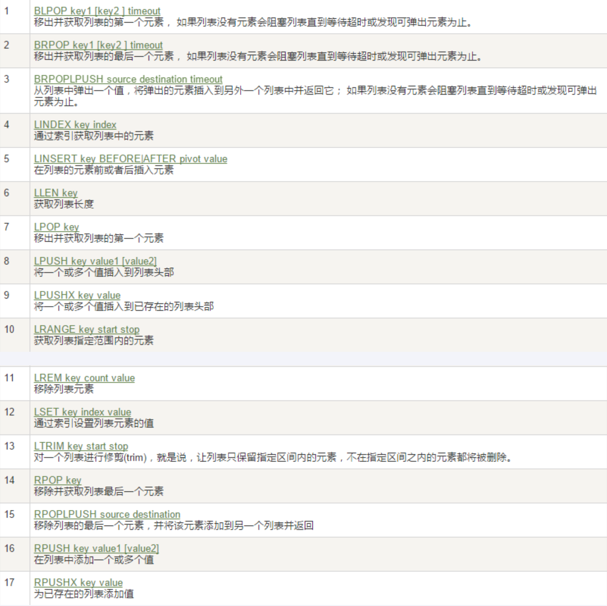
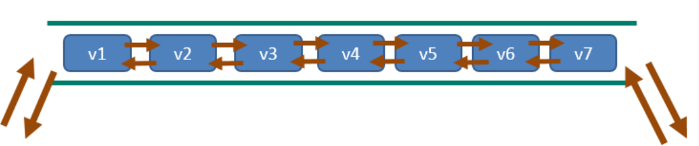
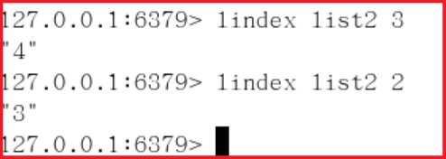
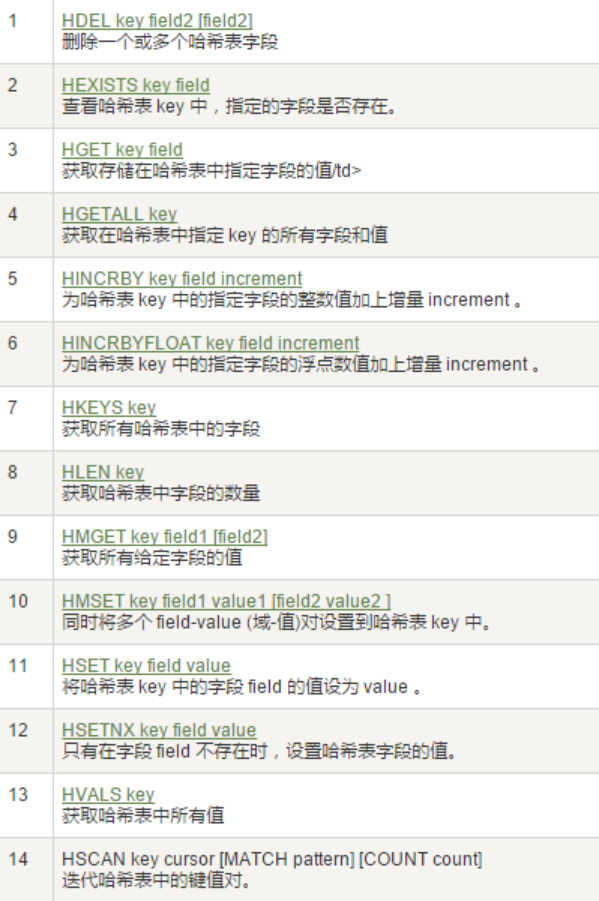

# Redis7 10 大数据类型

## which 10

- 

- > 这里说的数据类型是 vaue 的数据类型，key 的类型都是字符串

- redis 字符串（String

  - String（字符串）
  - string 是 redis 最基本的类型，一个 key 对应一个 value。
  - string 类型是二进制安全的，意思是 redis 的 string 可以包含任何数据，比如 jpg 图片或者序列化的对象
  - string 类型是 Redis 最基本的数据类型，一个 redis 中字符串 value 最多可以是 512M

- redis 列表 (List)

  - List（列表）
  - Redis 列表是简单的字符串列表，按照插入顺序排序。你可以添加一个元素到列表的头部（左边）或者尾部（右边）
  - 它的底层实际是个双端链表，最多可以包含 2^32 - 1 个元素 (4294967295, 每个列表超过 40 亿个元素)

- redis 哈希表（Hash)

  - Redis hash 是一个 string 类型的 field（字段）和 value（值）的映射表，hash 特别适合用于存储对象。
  - Redis 中每个 hash 可以存储 2^32 - 1 键值对（40 多亿）

- redis 集合 (Set)

  - Set（集合）
  - Redis 的 Set 是 String 类型的无序集合。集合成员是唯一的，这就意味着集合中不能出现重复的数据，集合对象的编码可以是 intset 或者 hashtable。
  - Redis 中 Set 集合是通过哈希表实现的，所以添加，删除，查找的复杂度都是 O(1)。
  - 集合中最大的成员数为 2^32 - 1 (4294967295, 每个集合可存储 40 多亿个成员)

- redis 有序集合（ZSet)

  - zset(sorted set：有序集合)
  - Redis zset 和 set 一样也是 string 类型元素的集合，且不允许重复的成员。
  - 不同的是每个元素都会关联一个 double 类型的分数，redis 正是通过分数来为集合中的成员进行从小到大的排序。
  - zset 的成员是唯一的，但分数 (score) 却可以重复。
  - zset 集合是通过哈希表实现的，所以添加，删除，查找的复杂度都是 O(1)。集合中最大的成员数为 2^32 - 1

- redis 地理空间（GEO)

  - Redis GEO 主要用于存储地理位置信息，并对存储的信息进行操作，包括
    - 添加地理位置的坐标
    - 获取地理位置的坐标
    - 计算两个位置之间的距离
    - 根据用户给定的经纬度坐标来获取指定范围内的地理位置集合

- redis 基数统计（HyperLogLog)

  - HyperLogLog 是用来做基数统计的算法，HyperLogLog 的优点是，在输入元素的数量或者体积非常非常大时，计算基数所需的空间总是固定且是很小的。
  - 在 Redis 里面，每个 HyperLogLog 键只需要花费 12 KB 内存，就可以计算接近 2^64 个不同元素的基数。这和计算基数时，元素越多耗费内存就越多的集合形成鲜明对比。
  - 但是，因为 HyperLogLog 只会根据输入元素来计算基数，而不会储存输入元素本身，所以 HyperLogLog 不能像集合那样，返回输入的各个元素。

- redis 位图 (bitmap)

  - 由 0 和 1 状态表现的二进制位的 bit 数组
  
- redis 位域 (bitfield)

  - 通过 bitfield 命令可以一次性操作多个比特位域 (指的是连续的多个比特位)，它会执行一系列操作并返回一个响应数组，这个数组中的元素对应参数列表中的相应操作的执行结果。
  - 说白了就是通过 bitfield 命令我们可以一次性对多个比特位域进行操作。

- redis 流（Stream)

  - Redis Stream 是 Redis 5.0 版本新增加的数据结构。

  - Redis Stream 主要用于消息队列（MQ，Message Queue），Redis 本身是有一个 Redis 发布订阅 (pub/sub) 来实现消息队列的功能，但它有个缺点就是消息无法持久化，如果出现网络断开、Redis 宕机等，消息就会被丢弃

  - 简单来说发布订阅 (pub/sub) 可以分发消息，但无法记录历史消息。

  - 而 Redis Stream 提供了消息的持久化和主备复制功能，可以让任何客户端访问任何时刻的数据，并且能记住每一个客户端的访问位置，还能保证消息不丢失

## 哪里去获得 redis？常见数据类型操作命令

- 官网英文
  - https://redis.io/commands/
- 中文
  - http://www.redis.cn/commands.html

## Redis 键 (key)

- ✨常用
  - 

- 案例

  - `keys *`
    - 查看当前库所有的 key
  - `exists key`
    - 判断某个 key 是否存在
  - `type key`
    - 查看你的 key 是什么类型
  - `del key`
    - 删除指定的 key 数据
  - `unlink key`
    - 非阻塞删除，仅仅将 keys 从 keyspace 元数据中删除，真正的删除会在后续异步中操作。
  - `ttl key`
    - 查看还有多少秒过期，-1 表示永不过期，-2 表示已过期
  - `expire key秒钟`
    - 为给定的 key 设置过期时间
    - 设置 Key 过期时间，默认 -1 表示永不过期，-2 表示已过期
    - Redis 的过期时间设置有四种形式：
      - EXPIRE 秒——设置指定的过期时间 (秒)，表示的是时间间隔。
      - PEXPIRE 毫秒——设置指定的过期时间，以毫秒为单位，表示的是时间间隔。
      - EXPIREAT 时间戳 - 秒——设置指定的 Key 过期的 Unix 时间，单位为秒，表示的是时间/时刻。
      - PEXPIREAT 时间戳 - 毫秒——设置指定的 Key 到期的 Unix 时间，以毫秒为单位，表示的是时间/时刻。
      - `expire key seconds [NX|XX|GT|LT]`

  - `move key dbindex【0-15】`
    - 将当前数据库的 key 移动到给定的数据库 db 当中
  - `select dbindex`
    - 切换数据库【0-15】，默认为 0
  - `dbsize`
    - 查看当前数据库 key 的数量
  - `flushdb`
    - 清空当前库
  - `flushall`
    - 通杀全部库

## 数据类型命令及落地运用

- 官网命令大全网址
  - 英文
    - [https://redis.io/commands/](https://redis.io/commands/)
  - 中文
    - [http://www.redis.cn/commands.html](http://www.redis.cn/commands.html)
  
- 备注
  - 命令不区分大小写，而 key 是区分大小写的
  - 永远的帮助命令，help@类型
    - help @string
    - help @list
    - help @hash
    - help @hyperloglog
  
- Redis 字符串 (String)

  - 常用
    - 官网地址：https://redis.io/docs/data-types/strings/
  - ✨命令
    - 
  - 案例
    - ✨最常用
      - `set key value` 设置指定 key 的值
        - `set key value [NX|XX] [GET] [EX seconds|PX milliseconds|EXAT unix-time-seconds|PXAT unix-time-milliseconds|KEEPTTL]`
          - `set key value nx`
            - 键不存在的时候设置键值
          - `set key value xx`
            - 键存在的时候设置键值
          - `set key value get`
            - 返回指定键原本的值，若键不存在时返回 nil
          - `set key value ex `
            - 以秒为单位设置过期时间
          - `set key value px`
            - 以毫秒为单位设置过期时间
          - `set key value exat`
            - 设置以秒为单位的 UNIX 时间戳所对应的时间为过期时间
          - `set key value pxat`
            - 设置以毫秒为单位的 UNIX 时间戳所对应的时间为过期时间
          - `set key value keepttl`
            - 保留设置前指定键的生存时间
      - `get key` 获取指定 key 的值。
    - 同时设置/获取多个键值
      - `mset`	
        - 同时设置一个或多个 key-value 对
      - `mget`
        - 获取所有 (一个或多个) 给定 key 的值
      - `msetnx`
        - 同时设置一个或多个 key-value 对，当且仅当所有给定 key 都不存在
    - 获取指定区间范围内的值
      - `getrange`
        - 获取指定区间范围内的值，类似 between......and 的关系
        - 从零到负一表示全部
      - `setrange`
        - 设置指定区间范围内的值，格式是 `setrange key值 具体值`
    - 数值增减
      - 一定要是数字才能进行加减
      - `INCR key`
        - 递增数字
      - `INCRBY key increment`
        - 增加指定的整数
      - `DECR key`
        - 递减数值
      - `DECRBY key decrement`
        - 减少指定的整数
    - 获取字符串长度和内容追加
      - `STRLEN key`
        - 获取字符串长度
      - `APPEND key value`
        - 内容追加
    - 分布式锁
      - `setex key ex value`
        - 设置带过期时间的 key
      - `setnx key value`
        - 只有在 key 不存在时设置 key 的值
    - getset(先 get 再 set)
      - getset:将给定 key 的值设为 value，并返回 key 的旧值 (old value)
      - 简单一句话，先 get 然后立即 set
    - 应用场景
      - 比如抖音无限点赞某个视频或者商品，点一下加一次
        - `INCR items:1`
      - 是否喜欢的文章
        - 阅读数：只要点击了 rest 地址，直接可以使用 incr key 命令增加一个数字 1，完成记录数字。
        - 

- Redis 列表 (List)

  - 常用
    - 
  - 单 key 多 value
  - 简单说明
    - 一个双端链表的结构，容量是 2 的 32 次方减 1 个元素，大概 40 多亿，主要功能有 push/pop等，一般用在栈、队列、消息队列等场景；
    - left、right 都可以插入添加；
    - 如果键不存在，创建新的链表；
    - 如果键已存在，新增内容；
    - 如果值全移除，对应的键也就消失了。
    - 它的底层实际是个**双向链表，对两端的操作性能很高，通过索引下标的操作中间的节点性能会较差。**
    - 
  - 案例
    - `lpush/rpush/lrange`
    - `lpop/rpop`
      - 
    - lindex，按照索引下标获得元素（从上到下）
      - 
    - llen 获取列表中元素的个数
    - lrem key 数字 N 给定值 V1 解释（删除 N 个值等于 V1 的元素）D
      - 
    - ltrim key 开始 index 结束 index，截取指定范围的值后再赋值给 key
    - rpoplpush 源列表目的列表 B
    - lset key index value b
    - linsert key before/after已有值插入的新值
    - 应用场景
      - 微信公众号订阅的消息

- Redis 哈希 (Hash)

  - ✨常用
    - 
  - KV 模式不变，但 V 是一个键值对
    - `Map<string,Map<object,Object>>`
  - 案例
    - hset/hget/hmset/hmget/hgetall/hdel
      - 
    - hlen
    - hexists key 在 key 里面的某个值的 key
    - hkeys/hvals
    - hincrby/hincrbyfloat
    - hsetnx
    - 应用场景

- Redis 集合 (Set)

  - 

- Redis 有序集合 Zset(sorted set)

  - 

- Redis 位图 (bitmap)

  - 

- Redis 基数统计 (HyperLogLog)

  - 

- Redis 地理空间 (GEO)

  - 简介
  - 原理
  - Redis 在 3.2 版本以后增加了地理位置的处理
  - 命令
  - 命令实操
  - 应用场景

- Redis 流 (Stream)

  - 是什么
  - 能干嘛
  - 底层结构和原理说明
  - 基本命令理论简介
  - 基本命令代码实操
  - 使用建议

- Redis 位域 (bitfield)

  - 了解即可
  - 是什么
    - https://redis.com.cn/commands/bitfield.html
  
  - 能干嘛
    - 位域修改
    - 溢出控制

  - 一句话
  - 命令基本语法
  - 案例
  
  
