# Redis7 持久化

> 官网地址：https://redis.io/docs/manual/persistence/

---

## RDB (Redis Data Base)

> RDB（Redis 数据库）：RDB 持久性以指定的时间间隔执行数据集的时间点快照。

### 是什么

- 在指定的时间间隔，执行数据集的时间点快照

  - 实现类似照片记录效果的方式，就是把某一时刻的数据和状态以文件的形式写到磁盘上，也就是快照。这样一来即使故障宕机，快照文件也不会丢失，数据的可靠性也就得到了保证

  - 这个快照文件就称为 RDB 文件 (dump.rdb)，其中，RDB 就是 Redis DataBase 的缩写

### 能干嘛

- 在指定的时间间隔内将内存中的数据集快照写入磁盘，也就是行话讲的 Snapshot 内存快照，它恢复时再将硬盘快照文件直接读回到内存里
- Redis 的数据都在内存中，保存备份时它执行的是全量快照，也就是说，把内存中的所有数据都记录到磁盘中，一锅端

- RDB 保存的是 dump.rdb 文件

### 案例演示

需求说明

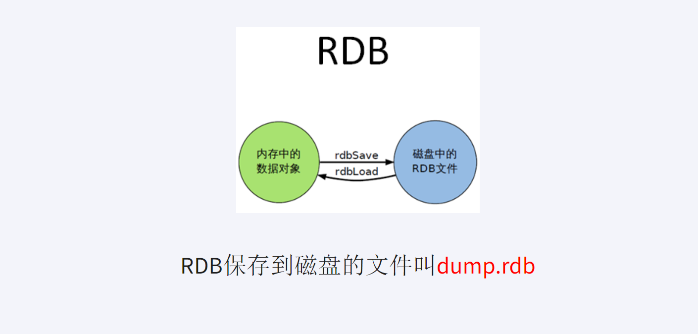

配置文件 (6VS7)

- redis 6.0.16
  - 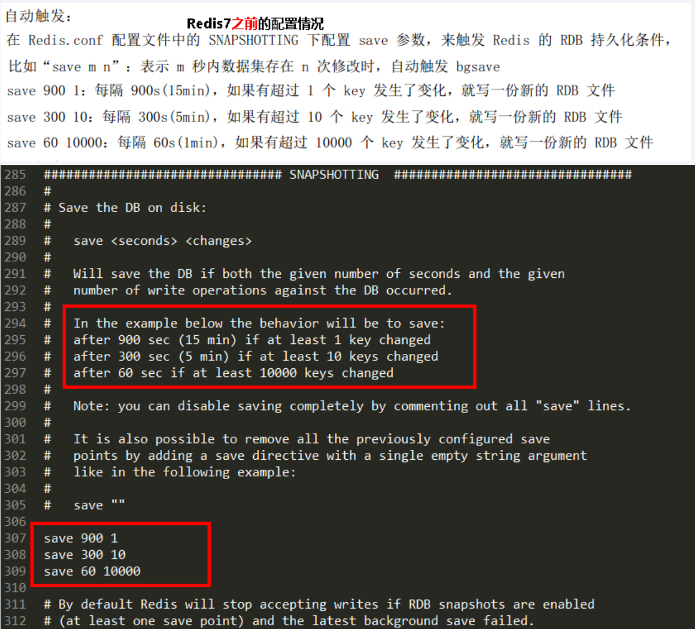
- Redis6.2 以及 Redis-7.0.0
  - 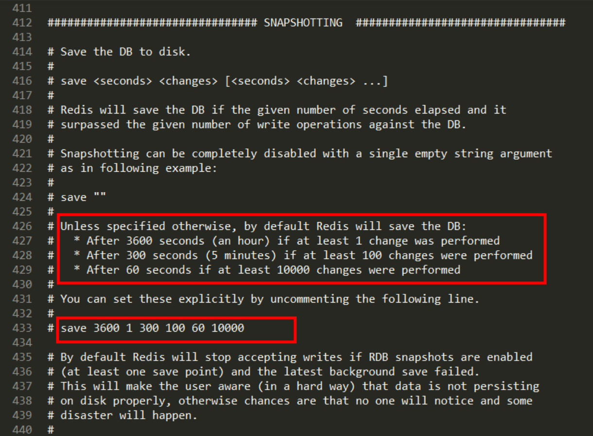

操作步骤

- 自动触发
  - Redis7 版本，按照 redis.conf 里配置的 `save<seconds><changes>`
    - 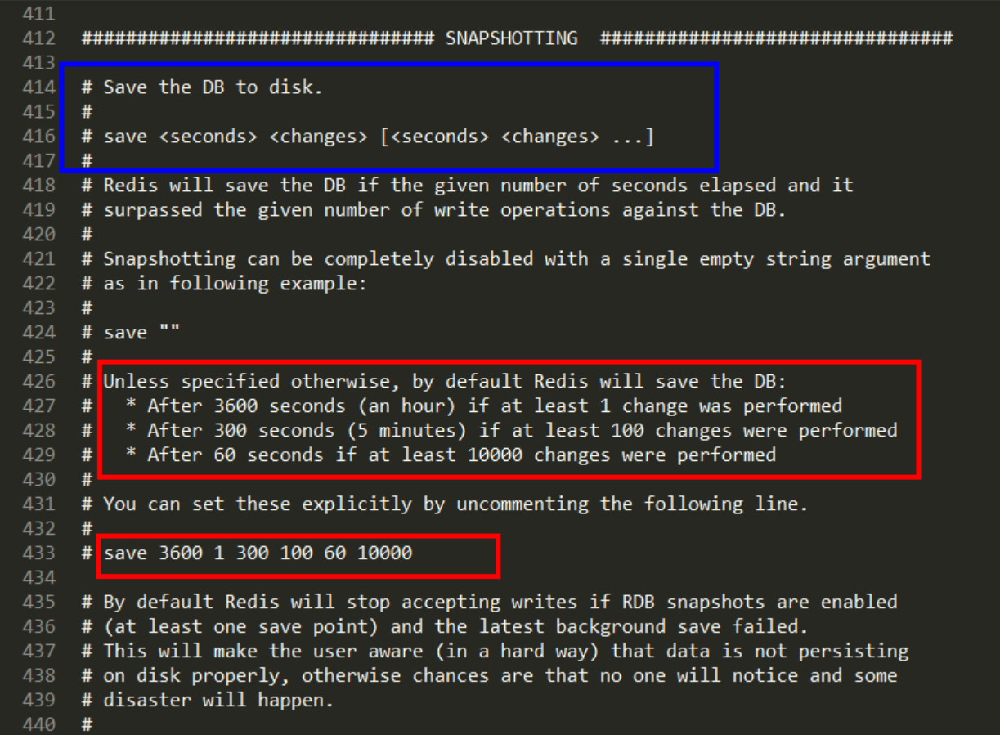
  - 本次案例 5 秒 2 次修改
    - 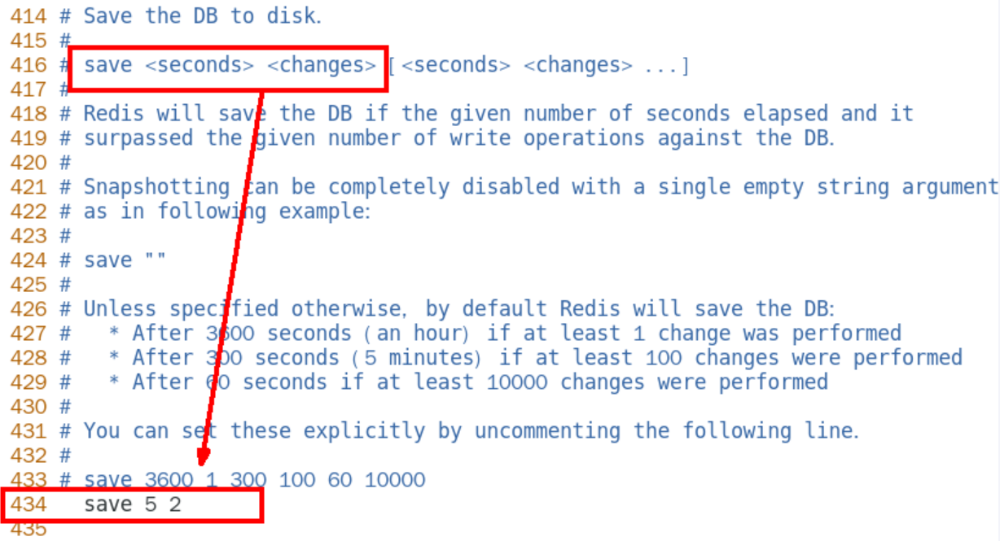
  - 修改 dump 文件保存路径
    - 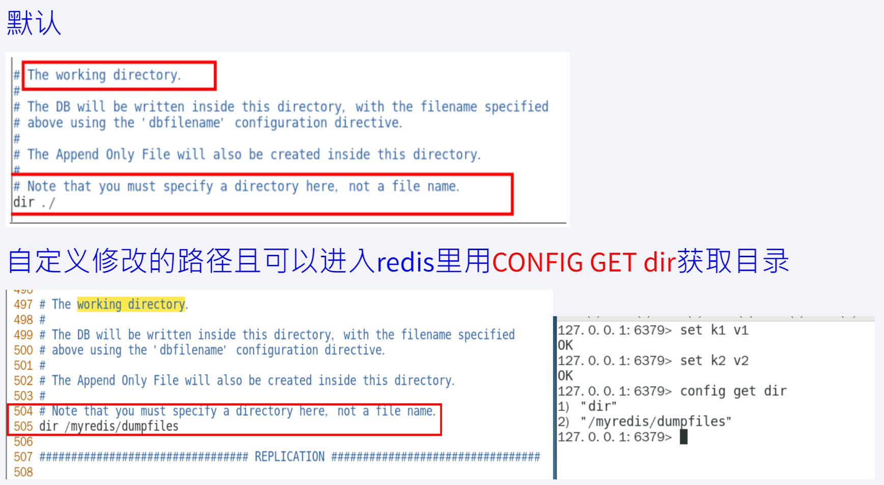
  - 修改 dump 文件名称
    - 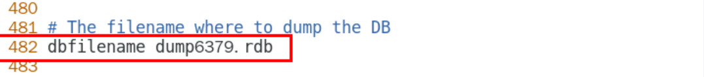
  - 触发备份
    - 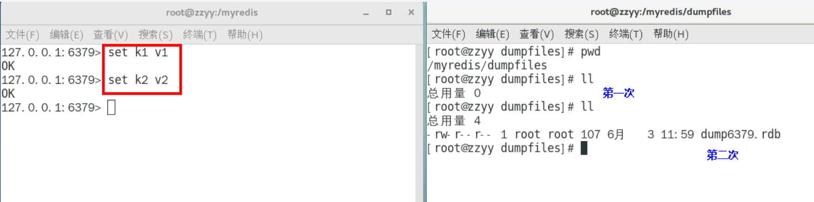
    - 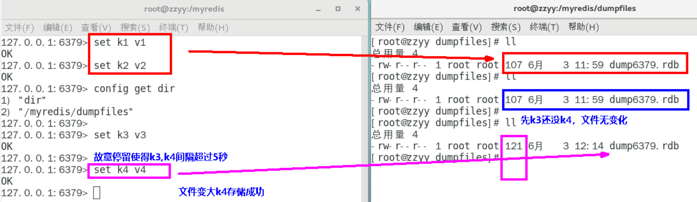
  - 如何恢复
    - 将备份文件 (dump.rdb) 移动到 redis 安装目录并后动服务即可
    - ⚠备份成功后故意用 flushdb 清空 redis·看看是否可以恢复数据
      - 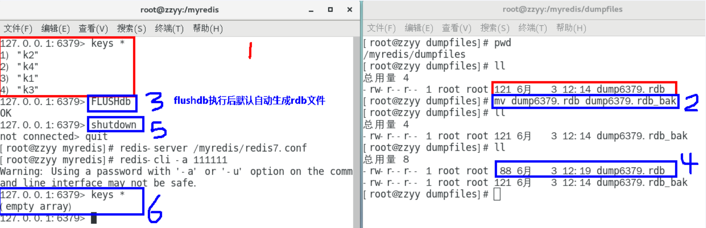
      - 执行flushall///flushdb命令也会产生dump.rdb文件·但里面是空的·无意义
    - ✔物理恢复，一定服务和备份分机隔离
      - 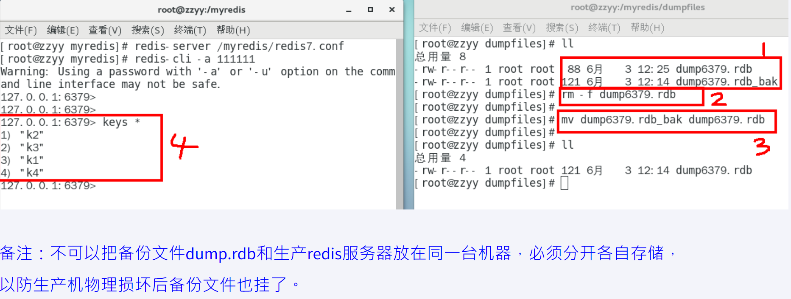

## 

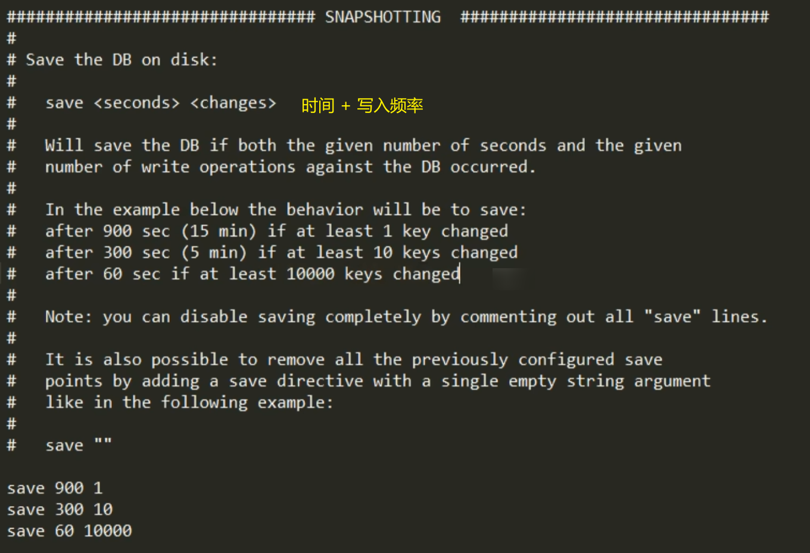

## redis 6.2-redis 7.0.0

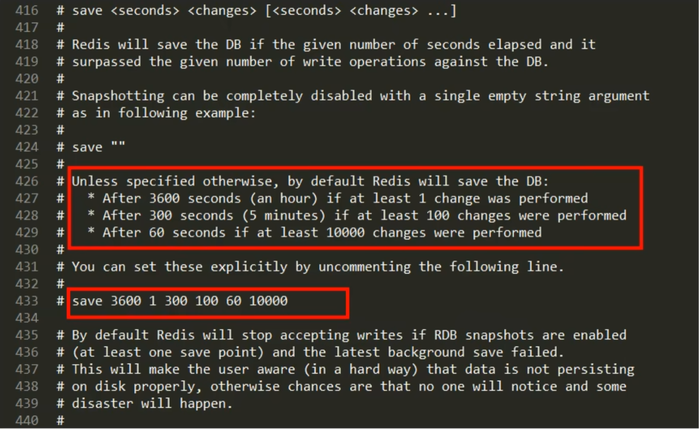

```
save 3600 1 300 100 60 100  // 3600秒 修改一次  100秒 修改60次  60秒 修改10000次 触发保存
```

## 修改配置文件

- 本次案例 5 秒 2 次修改
- 修改 dump 文件保存路径
- 修改 dump 文件名称

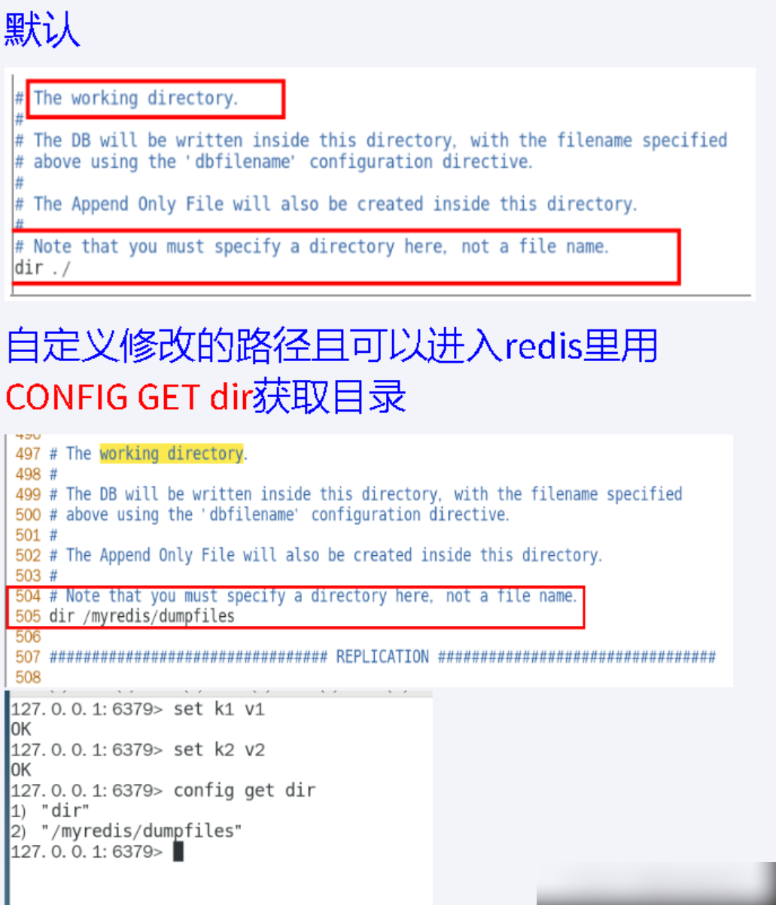
