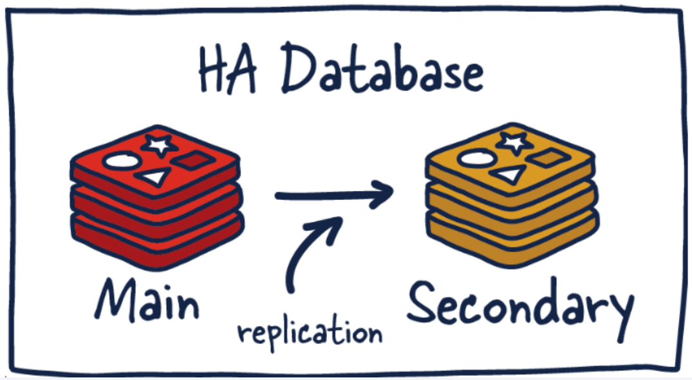

# Redis 复制 (replica)

## 是什么

- 官网地址
  - https://redis.io/docs/management/replication/
  - 
- 一句话
  - 就是主从复制，master 以写为主，Slave 以读为主
  - 当 master 数据变化的时候，自动将新的数据异步同步到其它 slave 数据库

## 能干嘛

- 读写分离
- 容灾恢复
- 数据备份
- 水平扩容支撑高并发

## 怎么玩

- 配从（库）不配主（库）
- 权限细节，重要
  - master 如果配置了 requirepass 参数，需要密码登陆
  - 那么 slave 就要配置 masterauth 来设置校验密码，否则的话 master 会拒绝 slave 的访问请求
- 基本操作命令
  - `info replication`
    - 可以查看复制节点的主从矣系和配置信息
  - `replicaof` 主库 IP 主库端口
    - 一般写入进 redis.conf 配置文件内
  - `slaveof` 主库 IP 主库端口
    - 每次与 master 断开之后，都需要重新连接，除非你配置进 redis.conf 文件
    - 在运行期间修改 slave 节点的信息，如果该数据库已经是某个主数据库的从数据库，那么会停止和原主数据库的同步矣系转而和新的主数据库同步，重新拜码头
  - `slaveof no one`
    - 使当前数据库停止与其他数据库的同步，转成主数据库，自立为王

## 案例演示

## 复制原理和工作流程

## 复制的缺点
