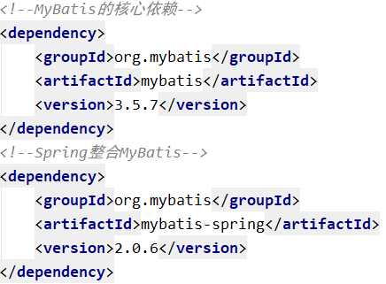
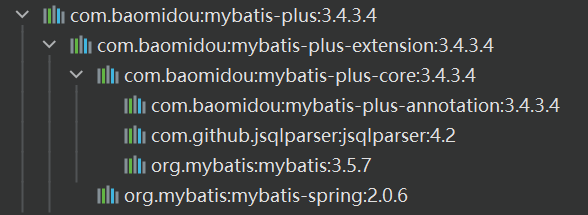
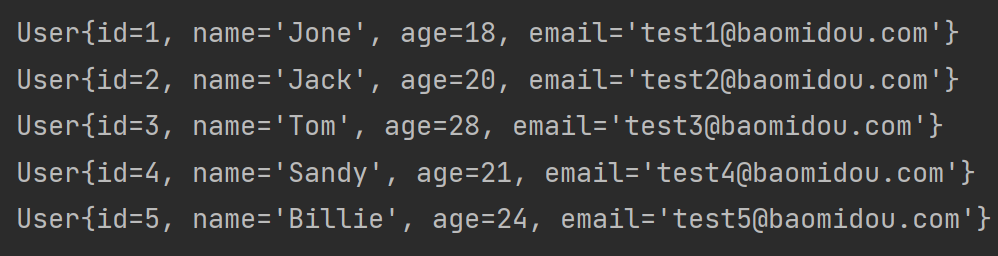
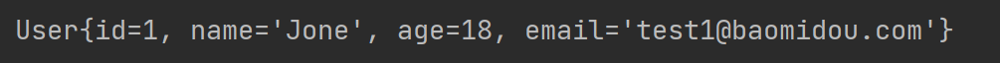

# MyBatis-plus 整合 Spring

✨该笔记不是完整的笔记，只是记录 MyBatis-plus 整合 SpringBoot 和 Spring 的不同之处

---

✨MyBatis-Plus 官方推荐使用 Spring Boot

在此我们以 Spring 整合 MyBatis 为基础，再加入 MyBatis-plus，以此来学习 MyBatis-Plus 相关内容

## 基础环境搭建

搭建一个可运行的 MyBatis-plus 整合 Spring Demo

### 开发环境

- IDE：idea 2020.3
- JDK：JDK8+
- 构建工具：maven 3.6.3
- MySQL 版本：MySQL 5.7
- Spring Boot：5.3.1
- MyBatis-Plus：3.5.1

### 创建数据库及表

#### 创建表

```sql
CREATE DATABASE `mybatis_plus` /*!40100 DEFAULT CHARACTER SET utf8mb4 */;
use `mybatis_plus`;
CREATE TABLE `user` (
`id` bigint(20) NOT NULL COMMENT '主键 ID',
`name` varchar(30) DEFAULT NULL COMMENT '姓名',
`age` int(11) DEFAULT NULL COMMENT '年龄',
`email` varchar(50) DEFAULT NULL COMMENT '邮箱',
PRIMARY KEY (`id`)
) ENGINE=InnoDB DEFAULT CHARSET=utf8;
```

#### 添加数据

```sql
INSERT INTO user (id, name, age, email) VALUES
(1, 'Jone', 18, 'test1@baomidou.com'),
(2, 'Jack', 20, 'test2@baomidou.com'),
(3, 'Tom', 28, 'test3@baomidou.com'),
(4, 'Sandy', 21, 'test4@baomidou.com'),
(5, 'Billie', 24, 'test5@baomidou.com');
```

### 创建 maven 工程

#### 依赖引入

```xml
<?xml version="1.0" encoding="UTF-8"?>
<project xmlns="http://maven.apache.org/POM/4.0.0"
         xmlns:xsi="http://www.w3.org/2001/XMLSchema-instance"
         xsi:schemaLocation="http://maven.apache.org/POM/4.0.0 http://maven.apache.org/xsd/maven-4.0.0.xsd">
    <modelVersion>4.0.0</modelVersion>

    <artifactId>10.mybatis-plus-spring</artifactId>
    <groupId>com.cj</groupId>
    <version>0.0.1-SNAPSHOT</version>

    <packaging>jar</packaging>

    <properties>
        <maven.compiler.source>8</maven.compiler.source>
        <maven.compiler.target>8</maven.compiler.target>
        <spring.version>5.3.1</spring.version>
    </properties>

    <dependencies>
        <dependency>
            <groupId>org.springframework</groupId>
            <artifactId>spring-context</artifactId>
            <version>${spring.version}</version>
        </dependency>
        <dependency>
            <groupId>org.springframework</groupId>
            <artifactId>spring-jdbc</artifactId>
            <version>${spring.version}</version>
        </dependency>
        <dependency>
            <groupId>org.springframework</groupId>
            <artifactId>spring-test</artifactId>
            <version>${spring.version}</version>
        </dependency>
        <!-- 连接池 -->
        <dependency>
            <groupId>com.alibaba</groupId>
            <artifactId>druid</artifactId>
            <version>1.2.8</version>
        </dependency>
        <!-- junit测试 -->
        <dependency>
            <groupId>junit</groupId>
            <artifactId>junit</artifactId>
            <version>4.12</version>
            <scope>test</scope>
        </dependency>
        <!-- MySQL驱动 -->
        <dependency>
            <groupId>mysql</groupId>
            <artifactId>mysql-connector-java</artifactId>
            <version>8.0.27</version>
        </dependency>
        <!-- 日志 -->
        <dependency>
            <groupId>org.slf4j</groupId>
            <artifactId>slf4j-api</artifactId>
            <version>1.7.30</version>
        </dependency>
        <dependency>
            <groupId>ch.qos.logback</groupId>
            <artifactId>logback-classic</artifactId>
            <version>1.2.3</version>
        </dependency>
        <!-- lombok用来简化实体类 -->
        <dependency>
            <groupId>org.projectlombok</groupId>
            <artifactId>lombok</artifactId>
            <version>1.16.16</version>
        </dependency>
        <!--MyBatis-Plus的核心依赖-->
        <dependency>
            <groupId>com.baomidou</groupId>
            <artifactId>mybatis-plus</artifactId>
            <version>3.4.3.4</version>
        </dependency>
    </dependencies>
</project>
```

#### ✨注意点

Spring 整合 MyBatis，需要 MyBatis 以及 Spring 整合 MyBatis 的依赖：



但是，在以上的依赖列表中，并没有 MyBatis 以及 Spring 整合 MyBatis 的依赖，因为当我们引入了 MyBatis-Plus 的依赖时，就可以间接的引入这些依赖



并且依赖和依赖之间的版本必须兼容，所以我们不能随便引入其他版本的依赖，以免发生冲突

在官网上有明确提示：


## MyBatis 整合 Spring

MyBatis-Plus 整合 Spring 和 MyBatis 整合 Spring 差不多，MyBatis-Plus 只是 MyBatis 的增强。我们先从 MyBatis 整合 Spring 开始引出 MyBatis-Plus 整合 Spring 

### 创建实体

```java
package com.cj.mybatisplus.entity;

/**
 * @title User
 * @date 2023/4/10 15:10
 * @author zhongnan
 * @description TODO
 */
public class User {
    private Long id;
    private String name;
    private Integer age;
    private String email;

    public User() {
    }

    public User(Long id, String name, Integer age, String email) {
        this.id = id;
        this.name = name;
        this.age = age;
        this.email = email;
    }

    public Long getId() {
        return id;
    }

    public void setId(Long id) {
        this.id = id;
    }

    public String getName() {
        return name;
    }

    public void setName(String name) {
        this.name = name;
    }

    public Integer getAge() {
        return age;
    }

    public void setAge(Integer age) {
        this.age = age;
    }

    public String getEmail() {
        return email;
    }

    public void setEmail(String email) {
        this.email = email;
    }

    @Override
    public String toString() {
        return "User{" +
                "id=" + id +
                ", name='" + name + '\'' +
                ", age=" + age +
                ", email='" + email + '\'' +
                '}';
    }
}
```

### 创建 MyBatis 的核心配置文件

```xml
<?xml version="1.0" encoding="UTF-8" ?>
<!DOCTYPE configuration
        PUBLIC "-//mybatis.org//DTD Config 3.0//EN"
        "http://mybatis.org/dtd/mybatis-3-config.dtd">
<configuration>


</configuration>
```

### 创建 mapper 接口和映射文件

#### mapper 接口

```java
public interface TestMapper {
    /**
    * 查询所有用户信息
    * @return
    */
    List<User> getAllUser();
}
```

#### mapper 映射文件

在 resources 下的 com/cj/mybatisplus/mapper 目录下创建 TestMapper.xml

```xml
<?xml version="1.0" encoding="UTF-8" ?>
<!DOCTYPE mapper
        PUBLIC "-//mybatis.org//DTD Mapper 3.0//EN"
        "http://mybatis.org/dtd/mybatis-3-mapper.dtd">
<mapper namespace="com.cj.mybatisplus.mapper.TestMapper">
    <!--SQL片段，记录基础字段-->
    <sql id="BaseColumns">id,name,age,email</sql>

    <!--List<User> getAllUser();-->
    <select id="getAllUser" resultType="User">
        select <include refid="BaseColumns"></include> from user
    </select>
</mapper>
```

#### 创建 jdbc.properties

```properties
jdbc.driver=com.mysql.cj.jdbc.Driver
jdbc.url=jdbc:mysql://193.111.30.163:3307/mybatis_plus?useUnicode=true&characterEncoding=utf-8&useSSL=false
jdbc.username=root
jdbc.password=jinmunan123456
```

#### 创建 Spring 的配置文件

在 resources 下创建 applicationContext.xml

```xml
<?xml version="1.0" encoding="UTF-8"?>
<beans xmlns="http://www.springframework.org/schema/beans"
       xmlns:xsi="http://www.w3.org/2001/XMLSchema-instance"
       xmlns:context="http://www.springframework.org/schema/context"
       xsi:schemaLocation="http://www.springframework.org/schema/beans
                    http://www.springframework.org/schema/beans/spring-beans.xsd
                    http://www.springframework.org/schema/context
                    https://www.springframework.org/schema/context/spring-context.xsd">

    <!-- 引入jdbc.properties -->
    <context:property-placeholder location="classpath:jdbc.properties"/>

    <!-- 配置Druid数据源 -->
    <bean id="dataSource" class="com.alibaba.druid.pool.DruidDataSource">
        <property name="driverClassName" value="${jdbc.driver}"/>
        <property name="url" value="${jdbc.url}"/>
        <property name="username" value="${jdbc.username}"/>
        <property name="password" value="${jdbc.password}"/>
    </bean>

    <!--mybatis-->
    <!-- 配置用于创建SqlSessionFactory的工厂bean -->
    <bean class="org.mybatis.spring.SqlSessionFactoryBean">
        <!-- 设置MyBatis配置文件的路径（可以不设置） -->
         <property name="configLocation" value="classpath:mybatis-config.xml"/>
        <!-- 设置数据源 -->
        <property name="dataSource" ref="dataSource"/>
        <!-- 设置类型别名所对应的包 -->
        <property name="typeAliasesPackage" value="com.cj.mybatisplus.entity"/>

        <!--设置映射文件的路径若映射文件所在路径和mapper接口所在路径一致，则不需要设置-->
        <!--<property name="mapperLocations" value="classpath:mapper/*.xml"/>-->
    </bean>


    <!--
        配置mapper接口的扫描配置
        由mybatis-spring提供，可以将指定包下所有的mapper接口创建动态代理
        并将这些动态代理作为IOC容器的bean管理
    -->
    <bean class="org.mybatis.spring.mapper.MapperScannerConfigurer">
        <property name="basePackage" value="com.cj.mybatisplus.mapper"/>
    </bean>
</beans>
```

#### 添加日志功能

在 resources 下创建 logback.xml

```xml
<?xml version="1.0" encoding="UTF-8"?>
<configuration debug="false">
    <!--定义日志文件的存储地址 logs为当前项目的logs目录 还可以设置为../logs -->
    <property name="LOG_HOME" value="logs" />
    <!--控制台日志， 控制台输出 -->
    <appender name="STDOUT" class="ch.qos.logback.core.ConsoleAppender">
        <encoder class="ch.qos.logback.classic.encoder.PatternLayoutEncoder">
            <!--格式化输出：%d表示日期，%thread表示线程名，%-5level：级别从左显示5个字符
            宽度,%msg：日志消息，%n是换行符-->
            <pattern>%d{yyyy-MM-dd HH:mm:ss.SSS} [%thread] %-5level %logger{50}
                - %msg%n</pattern>
        </encoder>
    </appender>
    <!--mybatis log configure-->
    <logger name="com.apache.ibatis" level="TRACE"/>
    <logger name="java.sql.Connection" level="DEBUG"/>
    <logger name="java.sql.Statement" level="DEBUG"/>
    <logger name="java.sql.PreparedStatement" level="DEBUG"/>
    <!-- 日志输出级别 -->
    <root level="warn">
        <appender-ref ref="STDOUT" />
    </root>
</configuration>
```

### 测试

#### 通过 IOC 容器

```java
public class MyBatisTest {
    @Test
    public void testMyBatis() {
        ApplicationContext ac = new ClassPathXmlApplicationContext("applicationContext.xml");
        TestMapper mapper = ac.getBean(TestMapper.class);
        mapper.getAllUser().forEach(user -> System.out.println(user));
    }
}
```

#### Spring 整合 junit

```java
//在 Spring 的环境中进行测试
@RunWith(SpringJUnit4ClassRunner.class)
//指定 Spring 的配置文件
@ContextConfiguration("classpath:applicationContext.xml")
public class MyBatisPlusTest {
    @Autowired
    private TestMapper testMapper;

    @Test
    public void testMyBatisBySpring() {
        testMapper.getAllUser().forEach(System.out::println);
    }
}
```



## MyBatis-Plus 整合 Spring 

### ✨加入 MyBatis-Plus

#### 修改 applicationContext.xml

加入 MyBatis-Plus 之前

```xml [3]
<!--mybatis-->
<!-- 配置用于创建SqlSessionFactory的工厂bean -->
<bean class="org.mybatis.spring.SqlSessionFactoryBean">
    <!-- 设置MyBatis配置文件的路径（可以不设置） -->
    <property name="configLocation" value="classpath:mybatis-config.xml"/>
    <!-- 设置数据源 -->
    <property name="dataSource" ref="dataSource"/>
    <!-- 设置类型别名所对应的包 -->
    <property name="typeAliasesPackage" value="com.cj.mybatisplus.entity"/>

    <!--设置映射文件的路径若映射文件所在路径和mapper接口所在路径一致，则不需要设置-->
    <!--<property name="mapperLocations" value="classpath:mapper/*.xml"/>-->
</bean>
```

加入 MyBatis-Plus 之后

✨就是修改 SqlSessionFactoryBean，修改为 MybatisSqlSessionFactoryBean

```xml [3]
<!--mybatis-plus-->
<!-- 此处使用的是MybatisSqlSessionFactoryBean -->
<bean class="com.baomidou.mybatisplus.extension.spring.MybatisSqlSessionFactoryBean">
    <!-- 设置MyBatis配置文件的路径（可以不设置） -->
    <property name="configLocation" value="classpath:mybatis-config.xml"/>
    <!-- 设置数据源 -->
    <property name="dataSource" ref="dataSource"/>
    <!-- 设置类型别名所对应的包 -->
    <property name="typeAliasesPackage" value="com.cj.mybatisplus.entity"/>

    <!--设置映射文件的路径若映射文件所在路径和mapper接口所在路径一致，则不需要设置-->
    <!--<property name="mapperLocations" value="classpath:mapper/*.xml"/>-->
</bean>
```

此处使用的是 MybatisSqlSessionFactoryBean

经观察，目前 bean 中配置的属性和 SqlSessionFactoryBean 一致

MybatisSqlSessionFactoryBean 是在 SqlSessionFactoryBean 的基础上进行了增强

即具有 SqlSessionFactoryBean 的基础功能，又具有 MyBatis-Plus 的扩展配置

#### 创建 mapper 接口

```java
public interface UserMapper extends BaseMapper<User> {
}
```

BaseMapper 是 MyBatis-Plus 提供的基础 mapper 接口，泛型为所操作的实体类型，其中包含 CRUD 的各个方法，我们的 mapper 继承了 BaseMapper 之后，就可以直接使用 BaseMapper 所提供的各种方法，而不需要编写映射文件以及 SQL 语句，大大的提高了开发效率

### 测试

```java
//在 Spring 的环境中进行测试
@RunWith(SpringJUnit4ClassRunner.class)
//指定 Spring 的配置文件
@ContextConfiguration("classpath:applicationContext.xml")
public class MyBatisPlusTest {
    
    @Autowired
    private UserMapper userMapper;

    @Test
    public void testMyBatisPlus() {
        //根据 id 查询用户信息
        System.out.println(userMapper.selectById(1));
    }
}
```



### 总结

在 Spring 整合 MyBatis 中加入了 MyBatis-Plus 后，我们就可以使用 MyBatis-Plus 所提供的 BaseMapper 实现 CRUD，并不需要编写映射文件以及 SQL 语句

但是若要自定义 SQL 语句，仍然可以编写映射文件而不造成任何影响

因为 MyBatis-Plus 只做增强，而不做改变

## 测试通用 Serivce

### IService

MyBatis-Plus 中有一个接口 IService 和其实现类 ServiceImpl，封装了常见的业务层逻辑

详情查看源码 IService 和 ServiceImpl

### 创建 Service 接口和实现类

```java
/**
 * UserService 继承 IService 模板提供的基础功能
 */
public interface UserService extends IService<User> {
}
```

```java
/**
 * ServiceImpl 实现了 IService，提供了 IService 中基础功能的实现
 * 若 ServiceImpl 无法满足业务需求，则可以使用自定的 UserService 定义方法，并在实现类中实现
 */
@Service
public class UserServiceImpl extends ServiceImpl<UserMapper, User> implements UserService {
}
```

### ✨扫描组件

```xml
<!--在applicationContext.xml中添加扫描组件的配置，扫描业务层组件，用于测试-->
<context:component-scan base-package="com.cj.mybatisplus.service.impl"/>
```

### 测试查询记录数

```java
/**
 * 测试记录数
 */
@Test
public void testGetCount(){
    long count = userService.count();
    System.out.println("总记录数："+count);
}

// 总记录数：5
```

## 常用注解

### 类名别名

#### @TableName

局部的只针对标志注解的那个类

#### ✨全局配置解决类型别名

```xml [11-22]
<!--mybatis-plus全局配置-->
<bean class="com.baomidou.mybatisplus.extension.spring.MybatisSqlSessionFactoryBean">
    <!-- 设置MyBatis配置文件的路径（可以不设置） -->
    <property name="configLocation" value="classpath:mybatis-config.xml"/>
    <!-- 设置数据源 -->
    <property name="dataSource" ref="dataSource"/>
    <!-- 设置类型别名所对应的包 -->
    <property name="typeAliasesPackage" value="com.cj.mybatisplus.entity"/>
    <!-- 设置MyBatis-Plus的全局配置 -->
    <property name="globalConfig" ref="globalConfig"/>
</bean>
<bean id="globalConfig" class="com.baomidou.mybatisplus.core.config.GlobalConfig">
    <property name="dbConfig">
        <bean class="com.baomidou.mybatisplus.core.config.GlobalConfig$DbConfig">
            <!-- 设置实体类所对应的表的前缀 -->
            <property name="tablePrefix" value="t_"/>
            <!-- 设置全局主键策略 -->
            <property name="idType" value="AUTO"/>
        </bean>
    </property>
</bean>
```

### 主键别名和策略

#### @TableId

标注注解的字段为主键

- value 属性 表明主键的字段名
- type 属性 表明主键的策略

#### ✨全局配置主键策略

```xml [18-19]
<!--mybatis-plus全局配置-->
<bean class="com.baomidou.mybatisplus.extension.spring.MybatisSqlSessionFactoryBean">
    <!-- 设置MyBatis配置文件的路径（可以不设置） -->
    <property name="configLocation" value="classpath:mybatis-config.xml"/>
    <!-- 设置数据源 -->
    <property name="dataSource" ref="dataSource"/>
    <!-- 设置类型别名所对应的包 -->
    <property name="typeAliasesPackage" value="com.cj.mybatisplus.entity"/>
    <!-- 设置MyBatis-Plus的全局配置 -->
    <property name="globalConfig" ref="globalConfig"/>
</bean>
<bean id="globalConfig" class="com.baomidou.mybatisplus.core.config.GlobalConfig">
    <property name="dbConfig">
        <bean class="com.baomidou.mybatisplus.core.config.GlobalConfig$DbConfig">
            <!-- 设置实体类所对应的表的前缀 -->
            <property name="tablePrefix" value="t_"/>
            <!-- 设置全局主键策略 -->
            <property name="idType" value="AUTO"/>
        </bean>
    </property>
</bean>
```

## 插件

### 分页插件

```xml [11-42]
<!--mybatis-plus全局配置-->
<bean class="com.baomidou.mybatisplus.extension.spring.MybatisSqlSessionFactoryBean">
    <!-- 设置MyBatis配置文件的路径（可以不设置） -->
    <property name="configLocation" value="classpath:mybatis-config.xml"/>
    <!-- 设置数据源 -->
    <property name="dataSource" ref="dataSource"/>
    <!-- 设置类型别名所对应的包 -->
    <property name="typeAliasesPackage" value="com.cj.mybatisplus.entity"/>
    <!-- 设置MyBatis-Plus的全局配置 -->
    <property name="globalConfig" ref="globalConfig"/>
    <!--配置插件-->
    <property name="plugins">
        <array>
            <ref bean="mybatisPlusInterceptor"/>
        </array>
    </property>
</bean>
<bean id="globalConfig" class="com.baomidou.mybatisplus.core.config.GlobalConfig">
    <property name="dbConfig">
        <bean class="com.baomidou.mybatisplus.core.config.GlobalConfig$DbConfig">
            <!-- 设置实体类所对应的表的前缀 -->
            <property name="tablePrefix" value="t_"/>
            <!-- 设置全局主键策略 -->
            <property name="idType" value="AUTO"/>
        </bean>
    </property>
</bean>
<!--配置MyBatis-Plus插件-->
<bean id="mybatisPlusInterceptor"
      class="com.baomidou.mybatisplus.extension.plugins.MybatisPlusInterceptor">
    <property name="interceptors">
        <list>
            <ref bean="paginationInnerInterceptor"/>
        </list>
    </property>
</bean>
<!--配置MyBatis-Plus分页插件的bean-->
<bean id="paginationInnerInterceptor"
      class="com.baomidou.mybatisplus.extension.plugins.inner.PaginationInnerInterceptor">
    <!--设置数据库类型-->
    <property name="dbType" value="MYSQL"/>
</bean>
```

### 乐观锁插件

```xml [7,17-20]
<!--配置MyBatis-Plus插件-->
<bean id="mybatisPlusInterceptor"
      class="com.baomidou.mybatisplus.extension.plugins.MybatisPlusInterceptor">
    <property name="interceptors">
        <list>
            <ref bean="paginationInnerInterceptor"/>
            <ref bean="optimisticLockerInnerInterceptor"/>
        </list>
    </property>
</bean>
<!--配置MyBatis-Plus分页插件的bean-->
<bean id="paginationInnerInterceptor"
      class="com.baomidou.mybatisplus.extension.plugins.inner.PaginationInnerInterceptor">
    <!--设置数据库类型-->
    <property name="dbType" value="MYSQL"/>
</bean>
<!--配置乐观锁插件-->
<bean id="optimisticLockerInnerInterceptor"
      class="com.baomidou.mybatisplus.extension.plugins.inner.OptimisticLockerInnerInterceptor">
</bean>
```

## 配置扫描通用枚举

```xml [17-18]
<!--mybatis-plus全局配置-->
<bean class="com.baomidou.mybatisplus.extension.spring.MybatisSqlSessionFactoryBean">
    <!-- 设置MyBatis配置文件的路径（可以不设置） -->
    <property name="configLocation" value="classpath:mybatis-config.xml"/>
    <!-- 设置数据源 -->
    <property name="dataSource" ref="dataSource"/>
    <!-- 设置类型别名所对应的包 -->
    <property name="typeAliasesPackage" value="com.cj.mybatisplus.entity"/>
    <!-- 设置MyBatis-Plus的全局配置 -->
    <property name="globalConfig" ref="globalConfig"/>
    <!--配置插件-->
    <property name="plugins">
        <array>
            <ref bean="mybatisPlusInterceptor"/>
        </array>
    </property>
    <!-- 配置扫描通用枚举 -->
    <property name="typeEnumsPackage" value="com.cj.mybatisplus.enums"/>
</bean>
```

