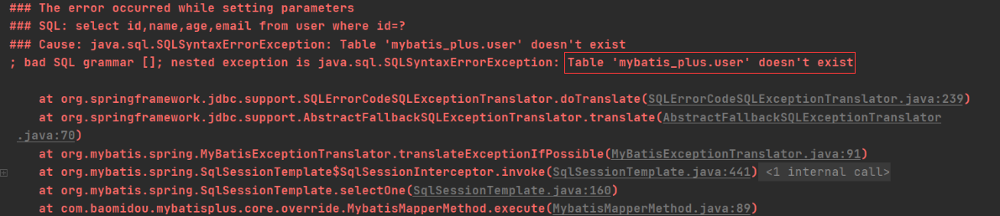
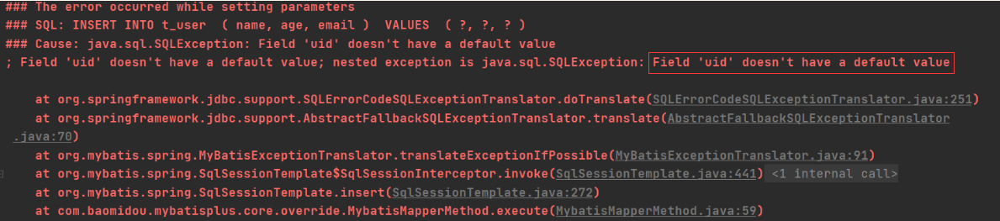
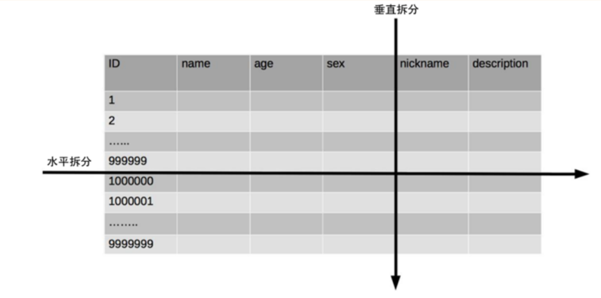
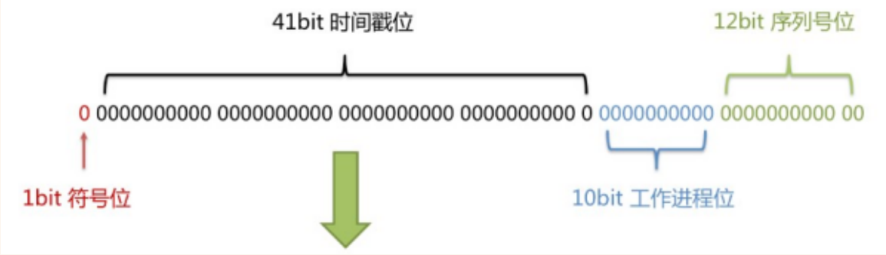
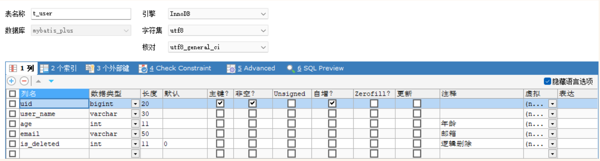

# MyBatis-Plus 常用注解

## @TableName

经过测试，在使用 MyBatis-Plus 实现基本的 CRUD 时，我们并没有指定要操作的表，只是在 Mapper 接口继承 BaseMapper 时，设置了`泛型User`，而操作的表为 user 表

由此得出结论，`MyBatis-Plus在确定操作的表`时，由`BaseMapper的泛型`决定，即`实体类型决定`，且默认操作的表名和实体类型的类名一致

### 问题

若实体类类型的类名和要操作的表的表名不一致，会出现什么问题？

我们将表 user 更名为 t_user，测试查询功能

程序抛出异常，Table 'mybatis_plus.user' doesn't exist，因为现在的表名为 t_user，而默认操作的表名和实体类型的类名一致，即 user 表



### 通过@TableName 解决问题

在实体类类型上添加@TableName("t_user")，标识实体类对应的表，即可成功执行 SQL 语句

```java
@TableName("t_user")
@Data
@AllArgsConstructor
@NoArgsConstructor
public class User {
    private Long id;
    private String name;
    private Integer age;
    private String email;
}
```

### 通过全局配置解决问题

在开发的过程中，我们经常遇到以上的问题，即实体类所对应的表都有固定的前缀，例如 t_或 tbl_

此时，可以使用 MyBatis-Plus 提供的全局配置，为实体类所对应的表名设置默认的前缀，那么就不需要在每个实体类上通过@TableName 标识实体类对应的表

```yaml
#mybatisplus 生成 sql 语句日志
mybatis-plus:
  configuration:
    log-impl: org.apache.ibatis.logging.stdout.StdOutImpl
  #mybatis-plus 全局配置
  global-config:
    db-config:
      table-prefix: tb_ #表名的全局配置
```

## @Tableld

经过测试，MyBatis-Plus 在实现 CRUD 时，会默认将 id 作为主键列，并在插入数据时，默认基于雪花算法的策略生成 id

### 问题

若实体类和表中表示主键的不是 id，而是其他字段，例如 uid，MyBatis-Plus 会自动识别 uid 为主键列吗？

我们实体类中的属性 id 改为 uid，将表中的字段 id 也改为 uid，测试添加功能

程序抛出异常，Field 'uid' doesn't have a default value，说明 MyBatis-Plus 没有将 uid 作为主键赋值



### 通过@TableId 解决问题

在实体类中 uid 属性上通过@TableId 将其标识为主键，即可成功执行 SQL 语句

```java
@Data
@AllArgsConstructor
@NoArgsConstructor
public class User {
    @TableId
    private Long uid;
    private String name;
    private Integer age;
    private String email;
}
```

### @TableId 的 value 属性

若实体类中主键对应的属性为 id，而表中表示主键的字段为 uid，此时若只在属性 id 上添加注解@TableId，则抛出异常 Unknown column 'id' in 'field list'，即 MyBatis-Plus 仍然会将 id 作为表的主键操作，而表中表示主键的是字段 uid

此时需要通过@TableId 注解的 value 属性，指定表中的主键字段，`@TableId("uid")`或`@TableId(value="uid")`

```java
@Data
@AllArgsConstructor
@NoArgsConstructor
public class User {
    @TableId(value = "uid")
    private Long id;
    private String name;
    private Integer age;
    private String email;
}
```

### @TableId 的 type 属性

type 属性用来定义主键策略

**常用的主键策略**

| **值**                   | **描述**                                                               |
| ------------------------ | ---------------------------------------------------------------------- |
| IdType.ASSIGN_ID（默认） | 基于雪花算法的策略生成数据 id，与数据库 id 是否设置自增无关            |
| IdType.AUTO              | 使用数据库的自增策略，注意，`该类型请确保数据库设置了id自增`，否则无效 |

**修改表为自动递增**

 ```sql
 ALTER TABLE t_user MODIFY uid BIGINT AUTO_INCREMENT
 ```

```java
@Data
@AllArgsConstructor
@NoArgsConstructor
public class User {
    // @TableId(value = "uid")
    @TableId(value = "uid", type = IdType.AUTO)
    private Long id;
    private String name;
    private Integer age;
    private String email;
}
```

### 配置全局主键策略

```yaml
#mybatisplus 生成 sql 语句日志
mybatis-plus:
  configuration:
    log-impl: org.apache.ibatis.logging.stdout.StdOutImpl
  #mybatis-plus 全局配置
  global-config:
    db-config:
      table-prefix: t_ #表名的全局配置
      # 配置 MyBatis-Plus 的主键策略
      id-type: auto
```

## 雪花算法

### 背景

需要选择合适的方案去应对数据规模的增长，以应对逐渐增长的访问压力和数据量。

数据库的扩展方式主要包括：业务分库、主从复制，数据库分表。

### 数据库分表

将不同业务数据分散存储到不同的数据库服务器，能够支撑百万甚至千万用户规模的业务，但如果业务继续发展，同一业务的单表数据也会达到单台数据库服务器的处理瓶颈。例如，淘宝的几亿用户数据，如果全部存放在一台数据库服务器的一张表中，肯定是无法满足性能要求的，此时就需要对单表数据进行拆分。

单表数据拆分有两种方式：垂直分表和水平分表。示意图如下：



### 垂直分表

垂直分表适合将表中某些不常用且占了大量空间的列拆分出去。

例如，前面示意图中的 nickname 和 description 字段，假设我们是一个婚恋网站，用户在筛选其他用户的时候，主要是用 age 和 sex 两个字段进行查询，而 nickname 和 description 两个字段主要用于展示，一般不会在业务查询中用到。description 本身又比较长，因此我们可以将这两个字段独立到另外一张表中，这样在查询 age 和 sex 时，就能带来一定的性能提升。

### 水平分表

水平分表适合表行数特别大的表，有的公司要求单表行数超过 5000 万就必须进行分表，这个数字可以作为参考，但并不是绝对标准，关键还是要看表的访问性能。对于一些比较复杂的表，可能超过 1000 万就要分表了；而对于一些简单的表，即使存储数据超过 1 亿行，也可以不分表。

但不管怎样，当看到表的数据量达到千万级别时，作为架构师就要警觉起来，因为这很可能是架构的性能瓶颈或者隐患。

水平分表相比垂直分表，会引入更多的复杂性，例如要求全局唯一的数据 id 该如何处理

### 分表方式

#### 主键自增

以最常见的用户 ID 为例，可以按照 1000000 的范围大小进行分段，1 ~ 999999 放到表 1 中，1000000 ~ 1999999 放到表 2 中，以此类推。

复杂点：分段大小的选取。分段太小会导致切分后子表数量过多，增加维护复杂度；分段太大可能会导致单表依然存在性能问题，一般建议分段大小在 100 万至 2000 万之间，具体需要根据业务选取合适的分段大小。

优点：可以随着数据的增加平滑地扩充新的表。例如，现在的用户是 100 万，如果增加到 1000 万，只需要增加新的表就可以了，原有的数据不需要动。

缺点：分布不均匀。假如按照 1000 万来进行分表，有可能某个分段实际存储的数据量只有 1 条，而另外一个分段实际存储的数据量有 1000 万条。

#### 取模

同样以用户 ID 为例，假如我们一开始就规划了 10 个数据库表，可以简单地用 user_id % 10 的值来表示数据所属的数据库表编号，ID 为 985 的用户放到编号为 5 的子表中，ID 为 10086 的用户放到编号为 6 的子中。

复杂点：初始表数量的确定。表数量太多维护比较麻烦，表数量太少又可能导致单表性能存在问题。

优点：表分布比较均匀。

缺点：扩充新的表很麻烦，所有数据都要重分布。

#### 雪花算法

雪花算法是由 Twitter 公布的分布式主键生成算法，它能够保证不同表的主键的不重复性，以及相同表的主键的有序性。

**核心思想**

长度共 64bit（一个 long 型）。

首先是一个符号位，1bit 标识，由于 long 基本类型在 Java 中是带符号的，最高位是符号位，正数是 0，负数是 1，所以 id 一般是正数，最高位是 0。

41bit 时间截 (毫秒级)，存储的是时间截的差值（当前时间截 - 开始时间截)，结果约等于 69.73 年。

10bit 作为机器的 ID（5 个 bit 是数据中心，5 个 bit 的机器 ID，可以部署在 1024 个节点）。

12bit 作为毫秒内的流水号（意味着每个节点在每毫秒可以产生 4096 个 ID）。



优点：整体上按照时间自增排序，并且整个分布式系统内不会产生 ID 碰撞，并且效率较高。

## @TableField

经过以上的测试，我们可以发现，MyBatis-Plus 在执行 SQL 语句时，要保证实体类中的属性名和表中的字段名一致

如果实体类中的属性名和字段名不一致的情况，会出现什么问题呢？

### 情况 1 不用加

若实体类中的属性使用的是驼峰命名风格，而表中的字段使用的是下划线命名风格

例如实体类属性 userName，表中字段 user_name

此时 MyBatis-Plus 会自动将下划线命名风格转化为驼峰命名风格

相当于在 MyBatis 中配置

### 情况 2 要加

若实体类中的属性和表中的字段不满足情况 1

例如实体类属性 name，表中字段 username

此时需要在实体类属性上使用`@TableField("username")`设置属性所对应的字段名

```java
@Data
@AllArgsConstructor
@NoArgsConstructor
public class User {
    // @TableId(value = "uid")
    @TableId(value = "uid")
    private Long id;
    @TableField(value = "user_name")
    private String name;
    private Integer age;
    private String email;
}
```

## @TableLogic

### 逻辑删除

- 物理删除：真实删除，将对应数据从数据库中删除，之后查询不到此条被删除的数据
- 逻辑删除：假删除，将对应数据中代表是否被删除字段的状态修改为“被删除状态”，之后在数据库 中仍旧能看到此条数据记录
- 使用场景：可以进行数据恢复

### 实现逻辑删除

step1：数据库中创建逻辑删除状态列，设置默认值为 0



step2：实体类中添加逻辑删除属性

```java
@Data
@AllArgsConstructor
@NoArgsConstructor
public class User {
    // @TableId(value = "uid")
    @TableId(value = "uid")
    private Long id;
    @TableField(value = "user_name")
    private String name;
    private Integer age;
    private String email;
    @TableLogic
    private Integer isDeleted;
}
```

step3:测试

```java
==>  Preparing: UPDATE t_user SET is_deleted=1 WHERE uid=? AND is_deleted=0
==> Parameters: 4(Long)
<==    Updates: 1
```

修改操作变成更新操作，逻辑删除的标志位是 is_deleted 等于 1

测试查询功能，被逻辑删除的数据默认不会被查询
