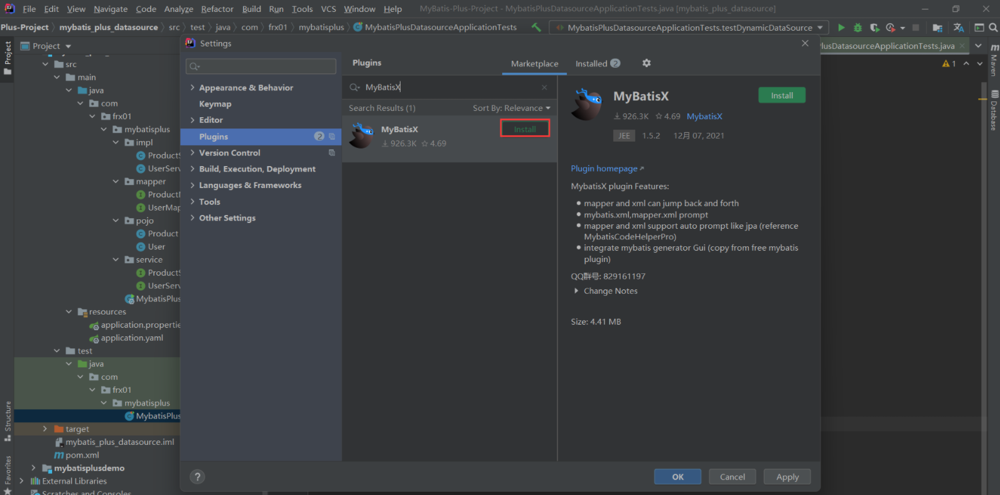
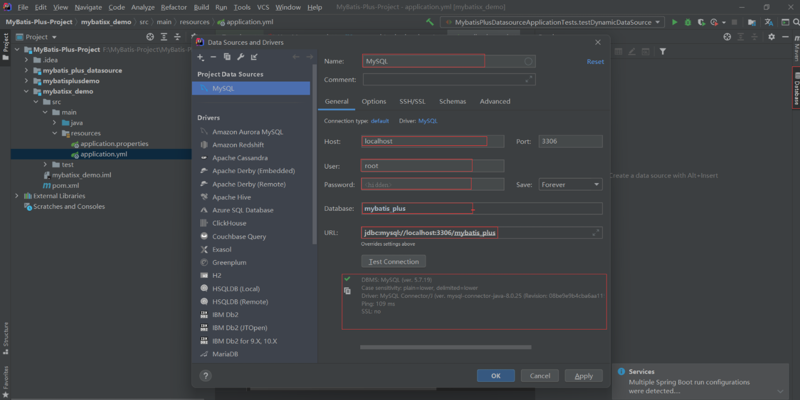
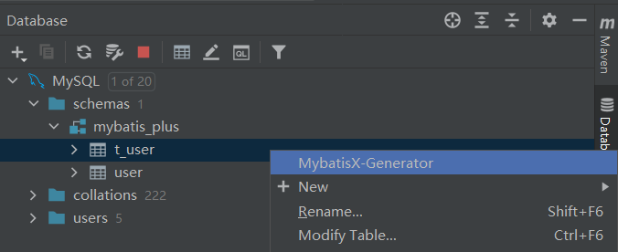
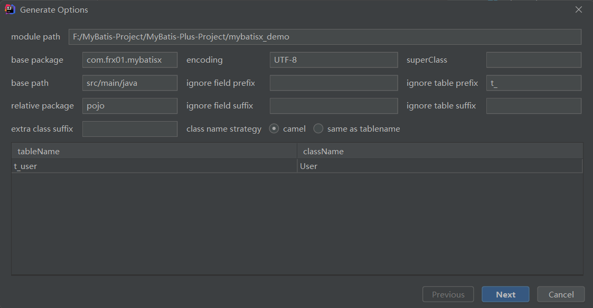
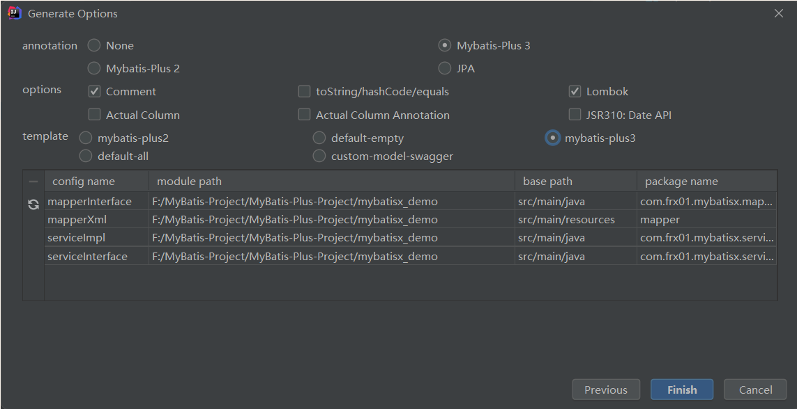
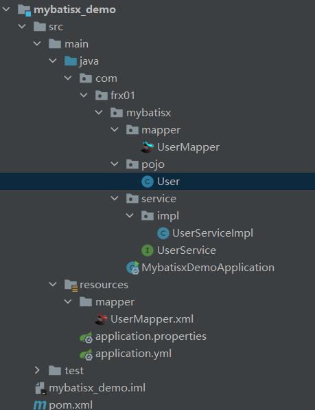
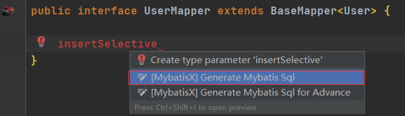

# MyBatisX 插件

MyBatis-Plus 为我们提供了强大的 mapper 和 service 模板，能够大大的提高开发效率

但是在真正开发过程中，MyBatis-Plus 并不能为我们解决所有问题，例如一些复杂的 SQL，多表联查，我们就需要自己去编写代码和 SQL 语句，我们该如何快速的解决这个问题呢，这个时候可以使用 MyBatisX 插件

MyBatisX 一款基于 IDEA 的快速开发插件，为效率而生。

## 安装 MyBatisX 插件

## 设置 Datasource

## 配置参数

## 使用结果

## 生成自定义功能

