# Nacos 简介

## 为什么叫 Nacos

前四个字母分别为 Naming 和 Configuration 的前两个字母，最后的 s 为 Service。

## 是什么

- 一个更易于构建云原生应用的动态服务发现、配置管理和服务管理平台。
- Nacos: Dynamic Naming and Configuration Service
- Nacos 就是注册中心＋配置中心的组合 -> Nacos = Eureka+Config+Bus

## 能干嘛

- 替代 Eureka 做服务注册中心

- 替代 Config 做服务配置中心

## 去哪下载

[Nacos 下载地址](https://github.com/alibaba/nacos/releases)

[官网中文文档](https://nacos.io/zh-cn/)

## 各注册中心比较

| 服务注册与发现框架 | CAP 模型 | 控制台管理 | 社区活跃度      |
| ------------------ | ------- | ---------- | --------------- |
| Eureka             | AP      | 支持       | 低 (2.x 版本闭源) |
| Zookeeper          | CP      | 不支持     | 中              |
| consul             | CP      | 支持       | 高              |
| Nacos              | AP      | 支持       | 高              |

# Nacos 安装

## 环境

- 本地 Java8+Maven 环境
- 从[Nacos 官网](https://github.com/alibaba/nacos/releases)下载 Nacos
- 解压安装包，直接运行 bin 目录下的**startup.cmd**
- 命令运行成功后直接访问 http://localhost:8848/nacos，默认账号密码都是 nacos

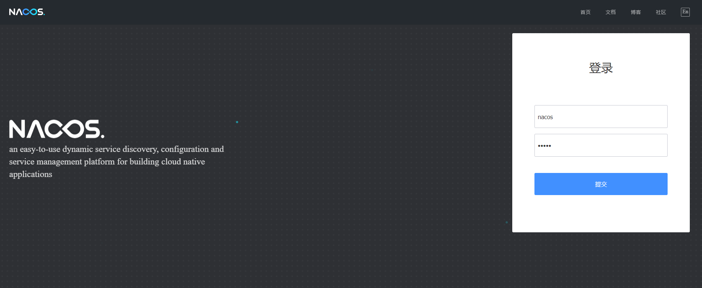

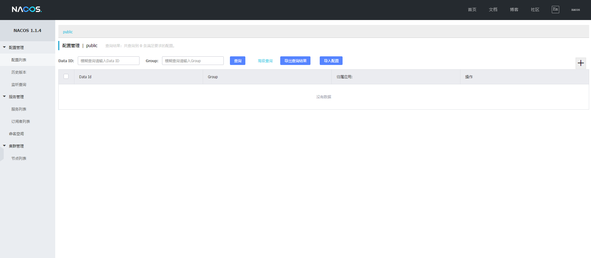

# Nacos 作为服务注册中心

## 搭建服务端

1. 新建`cloudalibaba-nacos-provider-payment9001`模块

2. 引入相关 POM 依赖

3. 将模块注册到 Nacos

   ```yaml
   spring:
     application:
       name: nacos-payment-provider
     cloud:
       nacos:
         discovery:
           server-addr: localhost:8848 # 配置 Nacos 地址
   ```

4. 配置主启动类

5. 编写业务类

6. 测试 [http://localhost:9001/payment/nacos/1](http://localhost:9001/payment/nacos/1)，返回结果`nacos registry, serverPort: 9001 id1`

7. 新建`cloudalibaba-nacos-provider-payment9002`模块做负载均衡测试

## 搭建客户端

1. 新建`cloudalibaba-nacos-consumer-order83`模块

2. 引入相关 POM 依赖

3. 为什么 nacos 支持负载均衡？因为 spring-cloud-starter-alibaba-nacos-discovery 内含 netflix-ribbon

4. 将模块注册到 Nacos

   ```yaml
   spring:
     application:
       name: nacos-consumer-order
     cloud:
       nacos:
         discovery:
           server-addr: localhost:8848 # 配置 Nacos 地址
   ```

5. 配置主启动类

6. 配置负载均衡

7. 编写业务类

8. 测试 [http://localhost:83/consumer/payment/nacos/1](http://localhost:83/consumer/payment/nacos/1)，交替返回结果`nacos registry, serverPort: 9001 id1`、`nacos registry, serverPort: 9002 id1`

## Nacos 服务注册中心对比提升

### Nacos 全景图

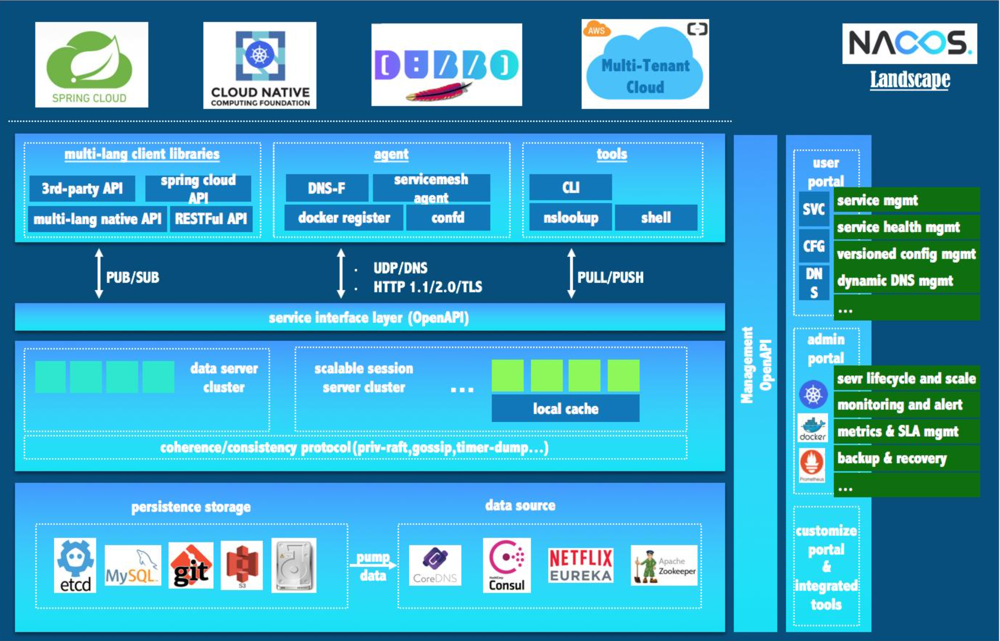

### Nacos 和 CAP

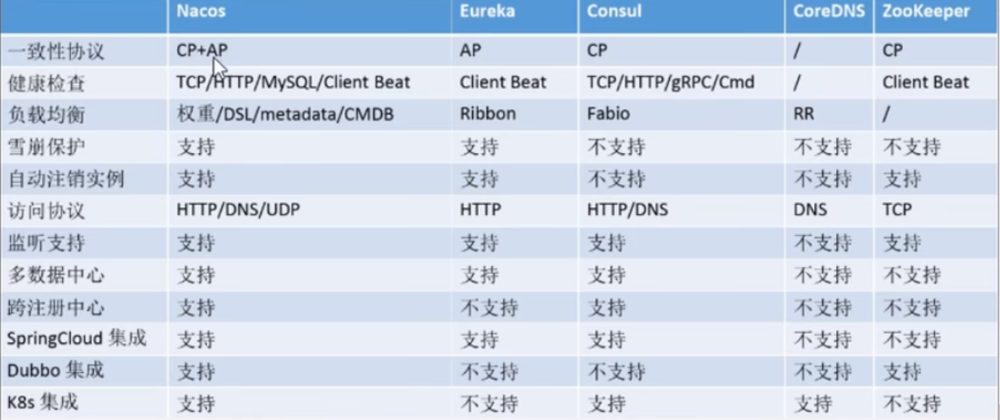

### Nacos 服务发现实例模型

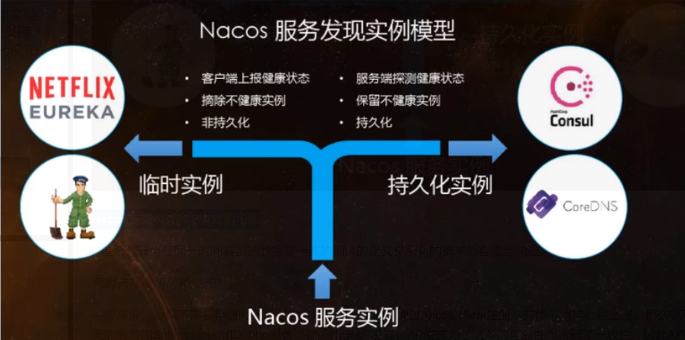

### Nacos 支持 AP 和 CP 模式的切换

C 是所有节点在同一时间看到的数据是一致的；而 A 的定义是所有的请求都会收到响应。

**何时选择使用何种模式？**

—般来说，如果不需要存储服务级别的信息且服务实例是通过 nacos-client 注册，并能够保持心跳上报，那么就可以选择 AP 模式。当前主流的服务如 Spring cloud 和 Dubbo 服务，都适用于 AP 模式，AP 模式为了服务的可能性而减弱了一致性，因此 AP 模式下只支持注册临时实例。

如果需要在服务级别编辑或者存储配置信息，那么 CP 是必须，K8S 服务和 DNS 服务则适用于 CP 模式。CP 模式下则支持注册持久化实例，此时则是以 Raft 协议为集群运行模式，该模式下注册实例之前必须先注册服务，如果服务不存在，则会返回错误。

切换命令：

```sh
curl -X PUT '$NACOS_SERVER:8848/nacos/v1/ns/operator/switches?entry=serverMode&value=CP
```

# Nacos 作为服务配置中心

## 搭建客户端

1. 新建`cloudalibaba-nacos-config-client3377`模块

2. 引入相关 POM 依赖

3. springboot 中配置文件的加载是存在优先级顺序的，bootstrap 优先级高于 application

4. bootstrap.yml

   ```yaml
   spring:
     application:
       name: nacos-config-client
     cloud:
       nacos:
         discovery:
           server-addr: localhost:8848 # Nacos 服务注册中心地址
         config:
           server-addr: localhost:8848 # Nacos 作为配置中心地址
           file-extension: yaml # 读指定 yaml 格式的配置
   ```

5. application.yml

   ```yaml
   spring:
     profiles:
       active: dev # 表示开发环境
       #active: test # 表示测试环境
   ```

6. 配置主启动类

7. 编写业务类

## DataID 配置

### 配置规则

[Nacos 官方文档](https://nacos.io/zh-cn/docs/quick-start-spring-cloud.html)

Nacos 中的 datald 的组成格式及与 SpringBoot 配置文件中的匹配规则如下：

```xml
${prefix}-${spring-profile.active}.${file-extension}
```

- prefix 默认为 spring.application.name 的值，也可以通过配置项 spring.cloud.nacos.config.prefix 来配置。
- spring.profile.active 即为当前环境对应的 profile，注意：当 spring.profile.active 为空时，对应的连接符 - 也将不存在，datald 的拼接格式变成${prefix}.${file-extension}
- file-exetension 为配置内容的数据格式，可以通过配置项 spring.cloud.nacos.config.file-extension 来配置。**目前只支持 properties 和 yaml 类型**。
- 通过 Spring Cloud 原生注解@RefreshScope 实现配置自动更新。

最后公式：

````xml
${spring.application.name)}-${spring.profiles.active}.${spring.cloud.nacos.config.file-extension}
````

### 在 Nacos 中添加配置

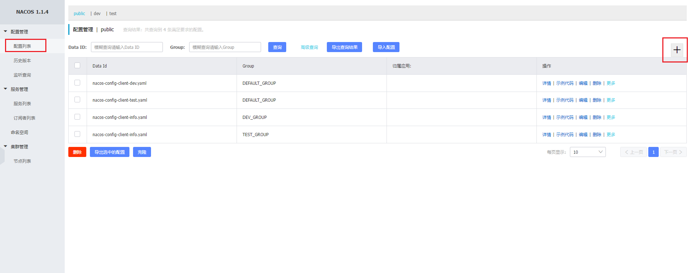

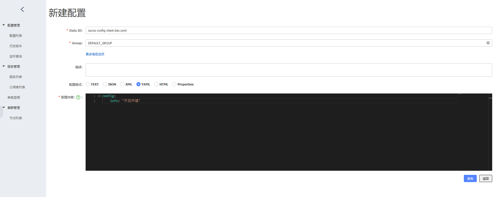

#### 特别注意

Data ID 的命名要注意"-"和"."，配置文件的":"是英文格式且保持一个空格。

### 在配置文件中添加配置

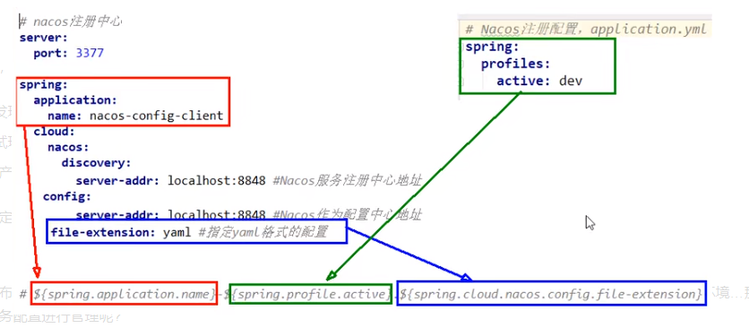

### 测试

- 启动前需要在 nacos 客户端 - 配置管理 - 配置管理栏目下有对应的 yaml 配置文件

- 运行 cloudalibaba-nacos-config-client3377 的主启动类
- 调用接口查看配置信息 [http://localhost:3377/config/info](http://localhost:3377/config/info)

### 自带动态刷新

修改下 Nacos 中的 yaml 配置文件，再次调用查看配置的接口，就会发现配置已经刷新。

## 命名空间、分组和 DataID 三者关系

### 问题

一个系统通常会准备 dev 开发环境、test 测试环境、prod 生产环境等环境，如何保证指定环境启动时服务能正确读取到 Nacos 上相应环境的配置文件呢？

一个大型分布式微服务系统会有很多微服务子项目，每个微服务项目又都会有相应的开发环境、测试环境、预发环境、正式环境…那怎么对这些微服务配置进行管理呢？

### Namespace、Group、Data lD 是什么

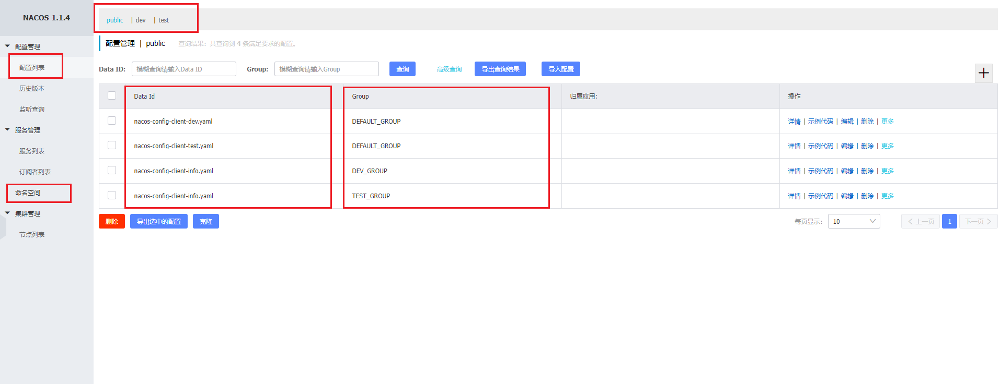

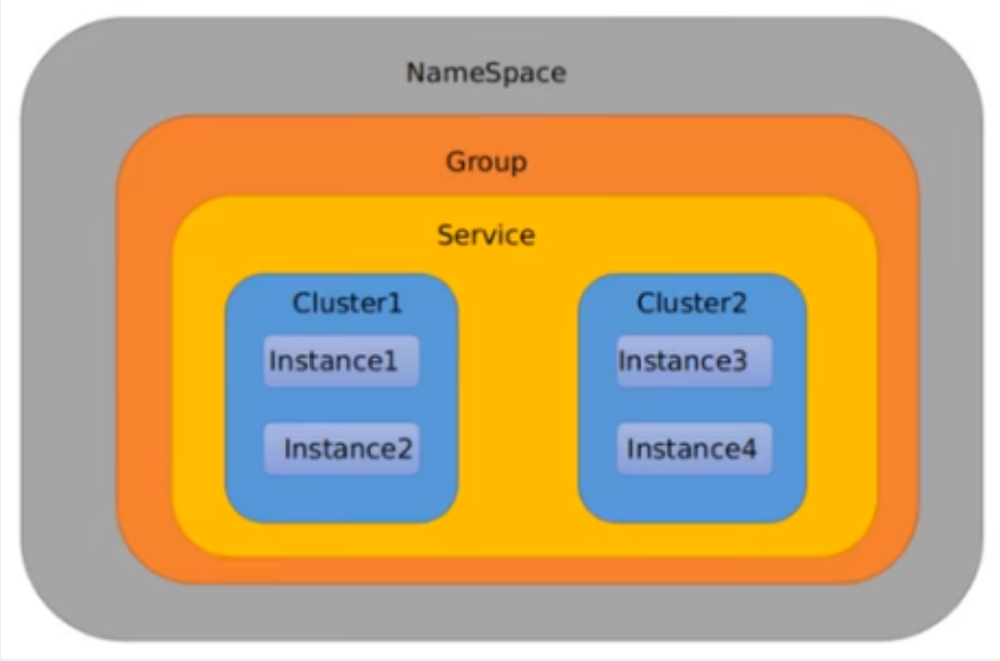

默认情况：Namespace=public，Group=DEFAULT_GROUP，默认 Cluster 是 DEFAULT

- Nacos 默认的 Namespace 是 public，Namespace 主要用来实现隔离。
- 比方说我们现在有三个环境：开发、测试、生产环境，我们就可以创建三个 Namespace，不同的 Namespace 之间是隔离的。
- Group 默认是 DEFAULT_GROUP，Group 可以把不同的微服务划分到同一个分组里面去
- Service 就是微服务：一个 Service 可以包含多个 Cluster (集群)，Nacos 默认 Cluster 是 DEFAULT，Cluster 是对指定微服务的一个虚拟划分。
- 比方说为了容灾，将 Service 微服务分别部署在了杭州机房和广州机房，这时就可以给杭州机房的 Service 微服务起一个集群名称 (HZ) ，给广州机房的 Service 微服务起一个集群名称 (GZ)，还可以尽量让同一个机房的微服务互相调用，以提升性能。
- 最后是 Instance，就是微服务的实例。

## Group 分组配置

### Nacos 配置

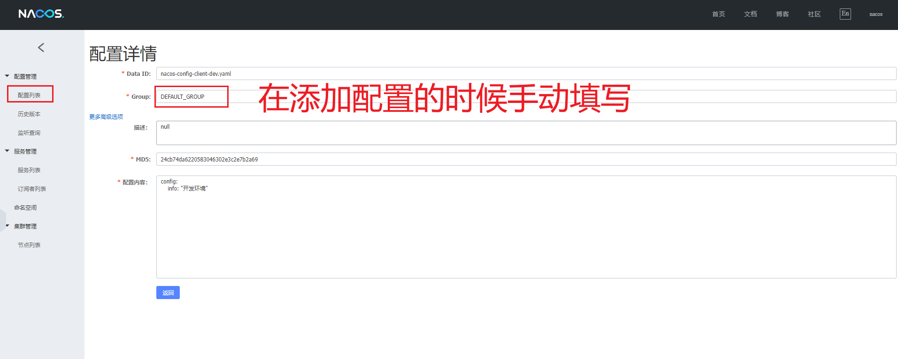

### yml 配置

```yaml
spring:
  application:
    name: nacos-config-client
  cloud:
    nacos:
      discovery:
        server-addr: localhost:8848 # Nacos 服务注册中心地址
      config:
        server-addr: localhost:8848 # Nacos 作为配置中心地址
        file-extension: yaml # 读指定 yaml 格式的配置
        # 指定分组类别
        group: TEST_GROUP
        # namespace: 02e22ead-3a6d-420b-999e-cbe5954c2966 # dev
        namespace: 116eab8f-d505-49ff-8498-a231ea865dea # test
```

## Namespace 空间配置

### Nacos 配置

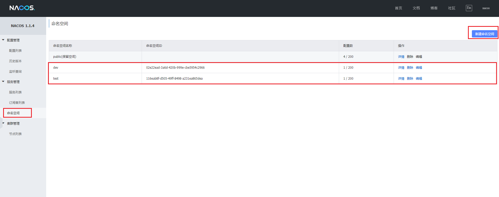

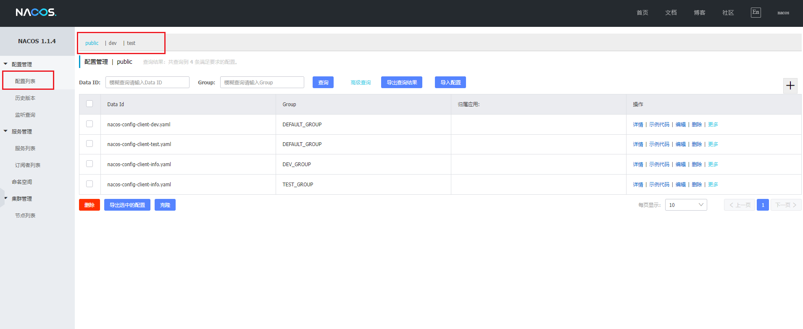

### yml 配置

```yaml
spring:
  application:
    name: nacos-config-client
  cloud:
    nacos:
      discovery:
        server-addr: localhost:8848 # Nacos 服务注册中心地址
      config:
        server-addr: localhost:8848 # Nacos 作为配置中心地址
        file-extension: yaml # 读指定 yaml 格式的配置
        group: TEST_GROUP
        # 指定 namespace 命名空间
        # namespace: 02e22ead-3a6d-420b-999e-cbe5954c2966 # dev
        namespace: 116eab8f-d505-49ff-8498-a231ea865dea # test
```

# Nacos 集群和持久化配置

