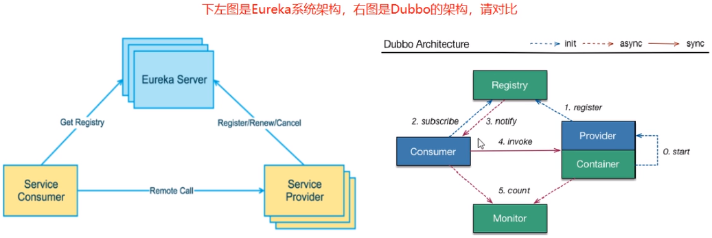
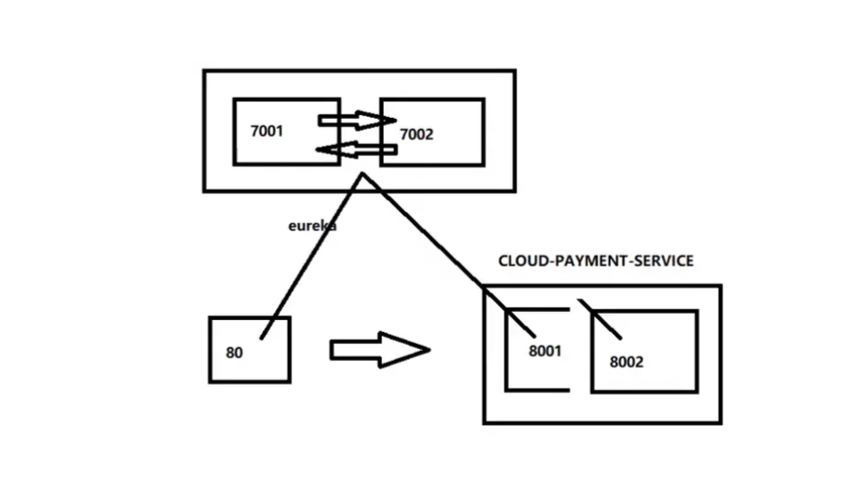
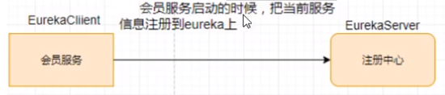

# Eureka 服务注册与发现

## 一、什么是服务治理

Spring Cloud 封装了 Netflix 公司开发的 Eureka 模块来实现服务治理。

在传统的 RPC 远程调用框架中，管理每个服务与服务之间依赖关系比较复杂，管理比较复杂，所以需要使用服务治理，管理服务于服务之间依赖关系，可以实现服务调用、负载均衡、容错等，实现服务发现与注册。

## 二、什么是服务注册与发现

Eureka 采用了 CS 的设计架构，Eureka Sever 作为服务注册功能的服务器，它是服务注册中心。而系统中的其他微服务，使用 Eureka 的客户端连接到 Eureka Server 并维持心跳连接。这样系统的维护人员就可以通过 Eureka Server 来监控系统中各个微服务是否正常运行。

在服务注册与发现中，有一个注册中心。当服务器启动的时候，会把当前自己服务器的信息比如服务地址通讯地址等以别名方式注册到注册中心上。另一方 (消费者服务提供者)，以该别名的方式去注册中心上获取到实际的服务通讯地址，然后再实现本地 RPC 调用 RPC 远程调用框架核心设计思想：在于注册中心，因为使用注册中心管理每个服务与服务之间的一个依赖关系 (服务治理概念)。在任何 RPC 远程框架中，都会有一个注册中心存放服务地址相关信息 (接口地址)。



## 三、Eureka 的两个组件

**Eureka Server 提供服务注册服务**

各个微服务节点通过配置启动后，会在 EurekaServer 中进行注册，这样 EurekaServer 中的服务注册表中将会存储所有可用服务节点的信息，服务节点的信息可以在界面中直观看到。

**EurekaClient 通过注册中心进行访问**

它是一个 Java 客户端，用于简化 Eureka Server 的交互，客户端同时也具备一个内置的、使用轮询 (round-robin) 负载算法的负载均衡器。在应用启动后，将会向 Eureka Server 发送心跳 (默认周期为 30 秒)。如果 Eureka Server 在多个心跳周期内没有接收到某个节点的心跳，EurekaServer 将会从服务注册表中把这个服务节点移除（默认 90 秒)。

## 四、支付服务和订单服务注册进 Eureka

### 1、大致流程

- 创建 Euraka 注册中心微服务`cloud-eureka-server7001`作为服务端
- 支付微服务`cloud-eureka-provider-payment8001`和订单微服务`cloud-eureka-consumer-order80`作为客户端注册进 Eureka 服务端微服务

### 2、大致步骤

- 引入依赖 POM.xml
- 修改 application.yml 配置文件
- 在启动类上添加相关注解
- 启动测试

## 五、Eureka 集群原理说明


**问题：微服务 RPC 远程服务调用最核心的是什么？**

高可用，试想你的注册中心只有一个 only one，万一它出故障了，会导致整个为服务环境不可用。

解决办法：搭建 Eureka 注册中心集群，互相注册，实现负载均衡 + 故障容错。

## 六、集群搭建说明

### 1、大致流程

- 搭建 2 台 Eureka 服务注册中心微服务`cloud-eureka-server7001`和`cloud-eureka-server7002`，相互注册，相互守望

- 搭建 2 台微服务提供者支付微服务`cloud-eureka-provider-payment8001`和`cloud-eureka-provider-payment8002`，注册进两台 Eureka 注册中心

- 搭建 1 台微服务消费者订单微服务`cloud-eureka-consumer-order80`，注册进两台 Eureka 注册中心，开启负载均衡

  ```java
  @Configuration
  public class ApplicationContextConfig {
      @Bean
      @LoadBalanced//使用@LoadBalanced 注解赋予 RestTemplate 负载均衡的能力
      public RestTemplate restTemplate(){
          return new RestTemplate();
      }
  }
  ```

- 订单微服务通过<mark>支付微服务在 eureka 注册的服务名称</mark>去调用支付微服务，交替返回 8001/8002 则搭建成功



## 七、Eureka 自我保护理论知识

**概述**

保护模式主要用于一组客户端和 Eureka Server 之间存在网络分区场景下的保护。一旦进入保护模式，Eureka Server 将会尝试保护其服务注册表中的信息，不再删除服务注册表中的数据，也就是不会注销任何微服务。

如果在 Eureka Server 的首页看到以下这段提示，则说明 Eureka 进入了保护模式：

```java
EMERGENCY! EUREKA MAY BE INCORRECTLY CLAIMING INSTANCES ARE UP WHEN THEY’RE NOT. RENEWALS ARE LESSER THANTHRESHOLD AND HENCE THE INSTANCES ARE NOT BEING EXPIRED JUSTTO BE SAFE
```

**导致原因**

一句话：某时刻某一个微服务不可用了，Eureka 不会立刻清理，依旧会对该微服务的信息进行保存。

属于 CAP 里面的 AP 分支。

**为什么会产生 Eureka 自我保护机制？**

为了 EurekaClient 可以正常运行，防止与 EurekaServer 网络不通情况下，EurekaServer 不会立刻将 EurekaClient 服务剔除。

**什么是自我保护模式？**

默认情况下，如果 EurekaServer 在一定时间内没有接收到某个微服务实例的心跳，EurekaServer 将会注销该实例 (默认 90 秒)。但是当网络分区故障发生 (延时、卡顿、拥挤) 时，微服务与 EurekaServer 之间无法正常通信，以上行为可能变得非常危险了——因为微服务本身其实是健康的，此时本不应该注销这个微服务。Eureka 通过“自我保护模式”来解决这个问题——当 EurekaServer 节点在短时间内丢失过多客户端时 (可能发生了网络分区故障)，那么这个节点就会进入自我保护模式。



**自我保护机制∶默认情况下 EurekaClient 定时向 EurekaServer 端发送心跳包。**

如果 Eureka 在 server 端在一定时间内 (默认 90 秒) 没有收到 EurekaClient 发送心跳包，便会直接从服务注册列表中剔除该服务，但是在短时间 ( 90 秒中) 内丢失了大量的服务实例心跳，这时候 Eurekaserver 会开启自我保护机制，不会剔除该服务（该现象可能出现在如果网络不通但是 EurekaClient 为出现宕机，此时如果换做别的注册中心如果一定时间内没有收到心跳会将剔除该服务，这样就出现了严重失误，因为客户端还能正常发送心跳，只是网络延迟问题，而保护机制是为了解决此问题而产生的)。

**在自我保护模式中，Eureka Server 会保护服务注册表中的信息，不再注销任何服务实例。**

它的设计哲学就是宁可保留错误的服务注册信息，也不盲目注销任何可能健康的服务实例。一句话讲解：好死不如赖活着。

综上，自我保护模式是一种应对网络异常的安全保护措施。它的架构哲学是宁可同时保留所有微服务（健康的微服务和不健康的微服务都会保留）也不盲目注销任何健康的微服务。使用自我保护模式，可以让 Eureka 集群更加的健壮、稳定。

## 八、actuator 微服务信息完善

### 1、依赖

```xml
<dependency>
    <groupId>org.springframework.boot</groupId>
    <artifactId>spring-boot-starter-web</artifactId>
</dependency>
<dependency>
    <groupId>org.springframework.boot</groupId>
    <artifactId>spring-boot-starter-actuator</artifactId>
</dependency>
```

### 2、修改 Eureka 显示名称和显示 IP

（也就是将 IP 地址，换成可读性高的名字）

```yml
eureka:
  instance:
    instance-id: payment8001 # 修改注册中心服务名称
    prefer-ip-address: true # 显示 IP 地址
```

## 九、服务发现 Discovery

对于注册进 eureka 里面的微服务，可以通过服务发现来获得该服务的信息。

```java
@Resource
private DiscoveryClient discoveryClient;
```

<mark>启动类添加开启注解</mark>

```java
@EnableDiscoveryClient // 服务发现
```

