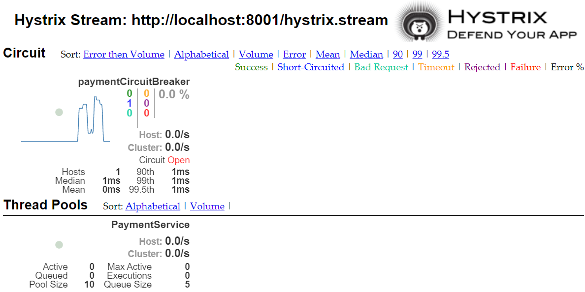
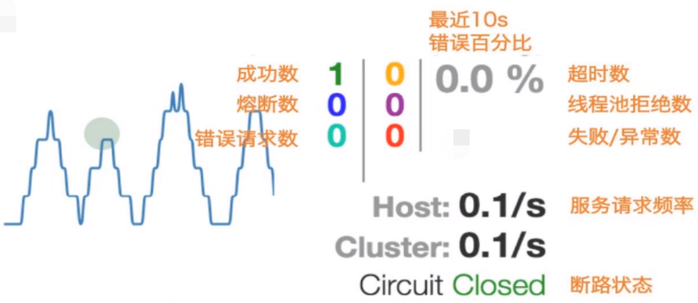

# Hystrix 介绍

## 1、服务雪崩

在微服务之间进行服务调用是由于某一个服务故障，导致级联服务故障的现象，称为雪崩效应。雪崩效应描述的是提供方不可用，导致消费方不可用并将不可用逐渐放大的过程。

如图，Service A 的流量波动很大，流量经常会突然性增加！那么在这种情况下，就算 Service A 能扛得住请求，Service B 和 Service C 未必能扛得住这突发的请求。此时，如果 Service C 因为抗不住请求，变得不可用。那么 Service B 的请求也会阻塞，慢慢耗尽 Service B 的线程资源，Service B 就会变得不可用。紧接着，Service A 也会不可用，这一过程如下图所示


## 2、Hystrix 概念

是一个用于处理分布式系统的延迟和容错的开源库，在分布式系统里，许多依赖不可避免的会调用失败，比如超时、异常等，Hystrix 能够保证在一个依赖出问题的情况下，不会导致整体服务失败，避免级联故障，以提高分布式系统的弹性。

"断路器”本身是一种开关装置，当某个服务单元发生故障之后，通过断路器的故障监控（类似熔断保险丝)，向调用方返回一个符合预期的、可处理的备选响应（FallBack)，而不是长时间的等待或者抛出调用方无法处理的异常，这样就保证了服务调用方的线程不会被长时间、不必要地占用，从而避免了故障在分布式系统中的蔓延，乃至雪崩。

## 3、Hystrix 的服务降级熔断限流

**服务降级**

服务器忙，请稍后再试，不让客户端等待并立刻返回一个友好提示，fallback。

哪些情况会出出现服务降级

- 程序运行导常
- 超时
- 服务熔断触发服务降级
- 线程池/信号量打满也会导致服务降级

**服务熔断**

类比保险丝达到最大服务访问后，直接拒绝访问，拉闸限电，然后调用服务降级的方法并返回友好提示。

服务的降级 -> 进而熔断 -> 恢复调用链路。

**服务限流**

秒杀高并发等操作，严禁一窝蜂的过来拥挤，大家排队，一秒钟 N 个，有序进行。

## 4、服务降级维度要求

超时导致服务器变慢 (转圈) - 超时不再等待

出错 (宕机或程序运行出错) - 出错要有兜底

解决：

- 对方服务 (8001) 超时了，调用者 (80) 不能一直卡死等待，必须有服务降级。
- 对方服务 (8001) 宕机了，调用者 (80) 不能一直卡死等待，必须有服务降级。
- 对方服务 (8001)OK，调用者 (80) 自己出故障或有自我要求 (自己的等待时间小于服务提供者)，自己处理降级。

## 5、Hystrix 服务降级

**设置自身调用超时时间的峰值，峰值内可以正常运行，超过了需要有兜底的方法处埋，作服务降级 fallback**。

参考：以客户端 80 为例，原始的做法，通过@HystrixCommand 配置了方法最长执行时间，超过最长执行时间则执行兜底方法。

```java
@GetMapping("hystrix/timeout/{id}")
@HystrixCommand(fallbackMethod = "paymentInfoTimeOutFallbackMethod",
                commandProperties = {
                    @HystrixProperty(name = "execution.isolation.thread.timeoutInMilliseconds", value = "1500")
                })
public String timeout(@PathVariable("id") Integer id) {
    // feign 客户端调用接口最大等待时间默认是 1 秒
    return paymentFeignHystrixService.paymentInfo_TimeOut(id);
}

// 兜底方法
public String paymentInfoTimeOutFallbackMethod(@PathVariable("id") Integer id) {
    return "超时访问:/(ㄒo ㄒ)/~~====/(ㄒo ㄒ)/~~";
}
```

**问题：兜底方法和接口混杂，不解耦。**

**优化：全局服务降级@DefaultProperties。**

参考：以客户端 80 为例，除了个别重要核心业务有专属降级处理，其它普通的可以通过@DefaultProperties(defaultFallback = “”) 统一跳转到统一处理结果页面。

```java
// 类注解
@DefaultProperties(defaultFallback = "payment_Global_FallBackMethod")
public class PaymentFeignHystrixController {
    // ...

    public String payment_Global_FallBackMethod() {
        return "全局兜底方法超时访问:/(ㄒo ㄒ)/~~====/(ㄒo ㄒ)/~~";
    }
}
```

**问题：还是没有和接口完全解耦。**

**优化：通过实现 feign 接口，完成服务降级，实现解耦。**

```java
@Slf4j
@Service
public class PaymentFallbackService implements PaymentFeignHystrixService {
    @Override
    public String paymentInfo_OK(Integer id) {
        return "------------fallback /(ㄒo ㄒ)/ ~~-------------";
    }

    @Override
    public String paymentInfo_TimeOut(Integer id) {
        return "------------fallback /(ㄒo ㄒ)/ 超时~~-------------";
    }
}
```

## 6、Hystrix 之服务熔断

**熔断机制概述**

熔断机制是应对雪崩效应的一种微服务链路保护机制。当扇出链路的某个微服务出错不可用或者响应时间太长时，会进行服务的降级，进而熔断该节点微服务的调用，快速返回错误的响应信息。当检测到该节点微服务调用响应正常后，恢复调用链路。

在 Spring Cloud 框架里，熔断机制通过 Hystrix 实现。Hystrix 会监控微服务间调用的状况，当失败的调用到一定阈值，缺省是 5 秒内 20 次调用失败，就会启动熔断机制。熔断机制的注解是@HystrixCommand。

**原理图**


- 熔断打开：请求不再进行调用当前服务，内部设置时钟一般为 MTTR(平均故障处理时间)，当打开时长达到所设时钟则进入半熔断状态。
- 熔断关闭：熔断关闭不会对服务进行熔断，正常状态。
- 熔断半开：部分请求根据规则调用当前服务，如果请求成功且符合规则则认为当前服务恢复正常，关闭熔断。

**完整流程图**


**服务熔断注解配置**

```java
@HystrixCommand(fallbackMethod = "paymentCircuitBreaker_fallback",commandProperties = {
    @HystrixProperty(name = "circuitBreaker.enabled",value = "true"),// 是否开启断路器
    @HystrixProperty(name = "circuitBreaker.requestVolumeThreshold",value = "10"),// 请求次数
    @HystrixProperty(name = "circuitBreaker.sleepWindowInMilliseconds",value = "10000"), // 时间窗口期
    @HystrixProperty(name = "circuitBreaker.errorThresholdPercentage",value = "60"),// 失败率达到多少后跳闸
})
```

**涉及到断路器的三个重要参数：**

- **快照时间窗**：断路器确定是否打开需要统计一些请求和错误数据，而统计的时间范围就是快照时间窗，默认为最近的 10 秒。
- **请求总数阀值**：在快照时间窗内，必须满足请求总数阀值才有资格熔断。默认为 20，意味着在 10 秒内，如果该 hystrix 命令的调用次数不足 20 次 7，即使所有的请求都超时或其他原因失败，断路器都不会打开。
- **错误百分比阀值**：当请求总数在快照时间窗内超过了阀值，比如发生了 30 次调用，如果在这 30 次调用中，有 15 次发生了超时异常，也就是超过 50% 的错误百分比，在默认设定 50% 阀值情况下，这时候就会将断路器打开。

**断路器开启或者关闭的条件**

- 到达以下阀值，断路器将会开启：
  - 当满足一定的阀值的时候（默认 10 秒内超过 20 个请求次数)
  - 当失败率达到一定的时候（默认 10 秒内超过 50% 的请求失败)
- 当开启的时候，所有请求都不会进行转发
- 一段时间之后（默认是 5 秒)，这个时候断路器是半开状态，会让其中一个请求进行转发。如果成功，断路器会关闭，若失败，继续开启。

**断路器打开之后**

- 再有请求调用的时候，将不会调用主逻辑，而是直接调用降级 fallback。通过断路器，实现了自动地发现错误并将降级逻辑切换为主逻辑，减少响应延迟的效果。
- 原来的主逻辑要如何恢复呢？

对于这一问题，hystrix 也为我们实现了自动恢复功能。

当断路器打开，对主逻辑进行熔断之后，hystrix 会启动一个休眠时间窗，在这个时间窗内，降级逻辑是临时的成为主逻辑，当休眠时间窗到期，断路器将进入半开状态，释放一次请求到原来的主逻辑上，如果此次请求正常返回，那么断路器将继续闭合，主逻辑恢复，如果这次请求依然有问题，断路器继续进入打开状态，休眠时间窗重新计时。

**All 配置**

```java
@HystrixCommand(fallbackMethod = "fallbackMethod", 
                groupKey = "strGroupCommand", 
                commandKey = "strCommand", 
                threadPoolKey = "strThreadPool",
                
                commandProperties = {
                    // 设置隔离策略，THREAD 表示线程池 SEMAPHORE：信号池隔离
                    @HystrixProperty(name = "execution.isolation.strategy", value = "THREAD"),
                    // 当隔离策略选择信号池隔离的时候，用来设置信号池的大小（最大并发数）
                    @HystrixProperty(name = "execution.isolation.semaphore.maxConcurrentRequests", value = "10"),
                    // 配置命令执行的超时时间
                    @HystrixProperty(name = "execution.isolation.thread.timeoutinMilliseconds", value = "10"),
                    // 是否启用超时时间
                    @HystrixProperty(name = "execution.timeout.enabled", value = "true"),
                    // 执行超时的时候是否中断
                    @HystrixProperty(name = "execution.isolation.thread.interruptOnTimeout", value = "true"),

                    // 执行被取消的时候是否中断
                    @HystrixProperty(name = "execution.isolation.thread.interruptOnCancel", value = "true"),
                    // 允许回调方法执行的最大并发数
                    @HystrixProperty(name = "fallback.isolation.semaphore.maxConcurrentRequests", value = "10"),
                    // 服务降级是否启用，是否执行回调函数
                    @HystrixProperty(name = "fallback.enabled", value = "true"),
                    // 是否启用断路器
                    @HystrixProperty(name = "circuitBreaker.enabled", value = "true"),
                    // 该属性用来设置在滚动时间窗中，断路器熔断的最小请求数。例如，默认该值为 20 的时候，如果滚动时间窗（默认 10 秒）内仅收到了 19 个请求，即使这 19 个请求都失败了，断路器也不会打开。
                    @HystrixProperty(name = "circuitBreaker.requestVolumeThreshold", value = "20"),

                    // 该属性用来设置在滚动时间窗中，表示在滚动时间窗中，在请求数量超过 circuitBreaker.requestVolumeThreshold 的情况下，如果错误请求数的百分比超过 50, 就把断路器设置为 "打开" 状态，否则就设置为 "关闭" 状态。
                    @HystrixProperty(name = "circuitBreaker.errorThresholdPercentage", value = "50"),
                    // 该属性用来设置当断路器打开之后的休眠时间窗。休眠时间窗结束之后，会将断路器置为 "半开" 状态，尝试熔断的请求命令，如果依然失败就将断路器继续设置为 "打开" 状态，如果成功就设置为 "关闭" 状态。
                    @HystrixProperty(name = "circuitBreaker.sleepWindowinMilliseconds", value = "5000"),
                    // 断路器强制打开
                    @HystrixProperty(name = "circuitBreaker.forceOpen", value = "false"),
                    // 断路器强制关闭
                    @HystrixProperty(name = "circuitBreaker.forceClosed", value = "false"),
                    // 滚动时间窗设置，该时间用于断路器判断健康度时需要收集信息的持续时间
                    @HystrixProperty(name = "metrics.rollingStats.timeinMilliseconds", value = "10000"),

                    // 该属性用来设置滚动时间窗统计指标信息时划分"桶"的数量，断路器在收集指标信息的时候会根据设置的时间窗长度拆分成多个 "桶" 来累计各度量值，每个"桶"记录了一段时间内的采集指标。
                    // 比如 10 秒内拆分成 10 个"桶"收集这样，所以 timeinMilliseconds 必须能被 numBuckets 整除。否则会抛异常
                    @HystrixProperty(name = "metrics.rollingStats.numBuckets", value = "10"),
                    // 该属性用来设置对命令执行的延迟是否使用百分位数来跟踪和计算。如果设置为 false, 那么所有的概要统计都将返回 -1。
                    @HystrixProperty(name = "metrics.rollingPercentile.enabled", value = "false"),
                    // 该属性用来设置百分位统计的滚动窗口的持续时间，单位为毫秒。
                    @HystrixProperty(name = "metrics.rollingPercentile.timeInMilliseconds", value = "60000"),
                    // 该属性用来设置百分位统计滚动窗口中使用“桶”的数量。
                    @HystrixProperty(name = "metrics.rollingPercentile.numBuckets", value = "60000"),
                    // 该属性用来设置在执行过程中每个“桶”中保留的最大执行次数。如果在滚动时间窗内发生超过该设定值的执行次数，
                    // 就从最初的位置开始重写。例如，将该值设置为 100, 滚动窗口为 10 秒，若在 10 秒内一个“桶”中发生了 500 次执行，
                    // 那么该“桶”中只保留 最后的 100 次执行的统计。另外，增加该值的大小将会增加内存量的消耗，并增加排序百分位数所需的计算时间。
                    @HystrixProperty(name = "metrics.rollingPercentile.bucketSize", value = "100"),

                    // 该属性用来设置采集影响断路器状态的健康快照（请求的成功、错误百分比）的间隔等待时间。
                    @HystrixProperty(name = "metrics.healthSnapshot.intervalinMilliseconds", value = "500"),
                    // 是否开启请求缓存
                    @HystrixProperty(name = "requestCache.enabled", value = "true"),
                    // HystrixCommand 的执行和事件是否打印日志到 HystrixRequestLog 中
                    @HystrixProperty(name = "requestLog.enabled", value = "true"),

                },
                threadPoolProperties = {
                    // 该参数用来设置执行命令线程池的核心线程数，该值也就是命令执行的最大并发量
                    @HystrixProperty(name = "coreSize", value = "10"),
                    // 该参数用来设置线程池的最大队列大小。当设置为 -1 时，线程池将使用 SynchronousQueue 实现的队列，否则将使用 LinkedBlockingQueue 实现的队列。
                    @HystrixProperty(name = "maxQueueSize", value = "-1"),
                    // 该参数用来为队列设置拒绝阈值。通过该参数，即使队列没有达到最大值也能拒绝请求。
                    // 该参数主要是对 LinkedBlockingQueue 队列的补充，因为 LinkedBlockingQueue 队列不能动态修改它的对象大小，而通过该属性就可以调整拒绝请求的队列大小了。
                    @HystrixProperty(name = "queueSizeRejectionThreshold", value = "5"),
                }
               )
public String doSomething() {
    ...
}
```

## 7、Hystrix 工作流程总结


1. 创建 HystrixCommand（用在依赖的服务返回单个操作结果的时候）或 HystrixObserableCommand（用在依赖的服务返回多个操作结果的时候）对象。
2. 命令执行。
3. 其中 HystrixCommand 实现了下面前两种执行方式
   - execute()：同步执行，从依赖的服务返回一个单一的结果对象或是在发生错误的时候抛出异常。
   - queue()：异步执行，直接返回一个 Future 对象，其中包含了服务执行结束时要返回的单一结果对象。
4. 而 HystrixObservableCommand 实现了后两种执行方式：
   - obseve()：返回 Observable 对象，它代表了操作的多个统
     果，它是一个 Hot Observable（不论“事件源”是否有“订阅者”，都会在创建后对事件进行发布，所以对于 Hot Observable 的每一个“订阅者”都有可能是从“事件源”的中途开始的，并可能只是看到了整个操作的局部过程）。
   - toObservable()：同样会返回 Observable 对象，也代表了操作的多个结果，但它返回的是一个 Cold Observable（没有“订间者”的时候并不会发布事件，而是进行等待，直到有“订阅者"之后才发布事件，所以对于 Cold Observable 的订阅者，它可以保证从一开始看到整个操作的全部过程）。
5. 若当前命令的请求缓存功能是被启用的，并且该命令缓存命中，那么缓存的结果会立即以 Observable 对象的形式返回。
6. 检查断路器是否为打开状态。如果断路器是打开的，那么 Hystrix 不会执行命令，而是转接到 fallback 处理逻辑 (第 8 步)；如果断路器是关闭的，检查是否有可用资源来执行命令 (第 5 步)。
7. 线程池/请求队列信号量是否占满。如果命令依赖服务的专有线程地和请求队列，或者信号量（不使用线程的时候）已经被占满，那么Hystrix也不会执行命令，而是转接到fallback处理理辑(第8步) 。
8. Hystrix 会根据我们编写的方法来决定采取什么样的方式去请求依赖服务。
   - HystrixCommand.run()：返回一个单一的结果，或者抛出异常。
   - HystrixObservableCommand.construct()：返回一个 Observable 对象来发射多个结果，或通过 onError 发送错误通知。
9. Hystix 会将“成功”、“失败”、“拒绝”、“超时”等信息报告给断路器，而断路器会维护一组计数器来统计这些数据。断路器会使用这些统计数据来决定是否要将断路器打开，来对某个依赖服务的请求进行"熔断/短路"。
10. 当命令执行失败的时候，Hystix 会进入 fallback 尝试回退处理，我们通常也称波操作为“服务降级”。而能够引起服务降级处理的情况有下面几种：
    - 第 4 步∶当前命令处于“熔断/短路”状态，断洛器是打开的时候。
    - 第 5 步∶当前命令的钱程池、请求队列或者信号量被占满的时候。
    - 第 6 步∶HystrixObsevableCommand.construct() 或 HytrixCommand.run() 抛出异常的时候。
11. 当 Hystrix 命令执行成功之后，它会将处理结果直接返回或是以 Observable 的形式返回。

## 8、Hystrix 可视化

**概述**

除了隔离依赖服务的调用以外，Hystrix 还提供了准实时的调用监控 (Hystrix Dashboard)，Hystrix 会持续地记录所有通过 Hystrix 发起的请求的执行信息，并以统计报表和图形的形式展示给用户，包括每秒执行多少请求多少成功，多少失败等。

Netflix 通过 hystrix-metrics-event-stream 项目实现了对以上指标的监控。Spring Cloud 也提供了 Hystrix Dashboard 的整合，对监控内容转化成可视化界面。



**如何看？**




# 
