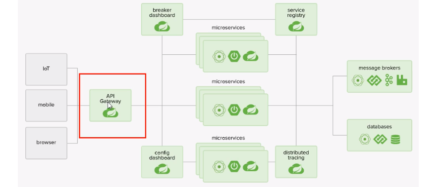
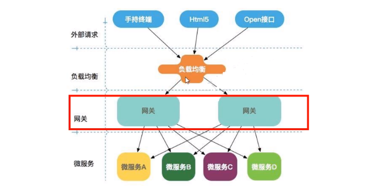
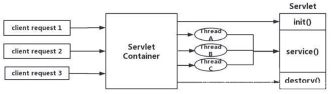
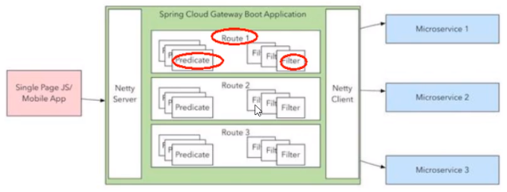

# 十、Gateway 网关



## 1、Gateway 介绍

Gateway 是在 Spring 生态系统之上构建的 API 网关服务，基于 Spring 5，Spring Boot 2 和 Project Reactor 等技术。

Gateway 旨在提供一种简单而有效的方式来对 API 进行路由，以及提供一些强大的过滤器功能，例如：熔断、限流、重试等。

SpringCloud Gateway 是 Spring Cloud 的一个全新项目，基于 Spring 5.0+Spring Boot 2.0 和 Project Reactor 等技术开发的网关，它旨在为微服务架构提供—种简单有效的统一的 API 路由管理方式。

SpringCloud Gateway 作为 Spring Cloud 生态系统中的网关，目标是替代 Zuul，在 Spring Cloud 2.0 以上版本中，没有对新版本的 Zul 2.0 以上最新高性能版本进行集成，仍然还是使用的 Zuul 1.x 非 Reactor 模式的老版本。而为了提升网关的性能，SpringCloud Gateway 是基于 WebFlux 框架实现的，而 WebFlux 框架底层则使用了高性能的 Reactor 模式通信框架 Netty。

Spring Cloud Gateway 的目标提供统一的路由方式且基于 Filter 链的方式提供了网关基本的功能，例如：安全，监控指标和限流。



## 2、GateWay 非阻塞异步模型

**SpringCloud Gateway 具有如下特性**

- 基于 Spring Framework 5，Project Reactor 和 Spring Boot 2.0 进行构建；

- 动态路由：能够匹配任何请求属性；
- 可以对路由指定 Predicate (断言) 和 Filter(过滤器)；
- 集成 Hystrix 的断路器功能；
- 集成 Spring Cloud 服务发现功能；
- 易于编写的 Predicate (断言) 和 Filter (过滤器)；
- 请求限流功能；
- 支持路径重写。

**SpringCloud Gateway 与 Zuul 的区别**

- 在 SpringCloud Finchley 正式版之前，Spring Cloud 推荐的网关是 Netflix 提供的 Zuul。
- Zuul 1.x，是一个基于阻塞 I/O 的 API Gateway。
- Zuul 1.x 基于 Servlet 2.5 使用阻塞架构它不支持任何长连接 (如 WebSocket)Zuul 的设计模式和 Nginx 较像，每次 I/О操作都是从工作线程中选择一个执行，请求线程被阻塞到工作线程完成，但是差别是 Nginx 用 C++实现，Zuul 用 Java 实现，而 JVM 本身会有第 - 次加载较慢的情况，使得 Zuul 的性能相对较差。
- Zuul 2.x 理念更先进，想基于 Netty 非阻塞和支持长连接，但 SpringCloud 目前还没有整合。Zuul .x 的性能较 Zuul 1.x 有较大提升。在性能方面，根据官方提供的基准测试，Spring Cloud Gateway 的 RPS(每秒请求数) 是 Zuul 的 1.6 倍。
- Spring Cloud Gateway 建立在 Spring Framework 5、Project Reactor 和 Spring Boot2 之上，使用非阻塞 API。
- Spring Cloud Gateway 还支持 WebSocket，并且与 Spring 紧密集成拥有更好的开发体验

**Zuul1.x 模型**

Springcloud 中所集成的 Zuul 版本，采用的是 Tomcat 容器，使用的是传统的 Serviet IO 处理模型。

Servlet 的生命周期？servlet 由 servlet container 进行生命周期管理。

- container 启动时构造 servlet 对象并调用 servlet init() 进行初始化；
- container 运行时接受请求，并为每个请求分配一个线程（一般从线程池中获取空闲线程）然后调用 service)；
- container 关闭时调用 servlet destory() 销毁 servlet。



上述模式的缺点：

Servlet 是一个简单的网络 IO 模型，当请求进入 Servlet container 时，Servlet container 就会为其绑定一个线程，在并发不高的场景下这种模型是适用的。但是一旦高并发 (如抽风用 Jmeter 压)，线程数量就会上涨，而线程资源代价是昂贵的（上线文切换，内存消耗大）严重影响请求的处理时间。在一些简单业务场景下，不希望为每个 request 分配一个线程，只需要 1 个或几个线程就能应对极大并发的请求，这种业务场景下 servlet 模型没有优势。

所以 Zuul 1.X 是基于 servlet 之上的一个阻塞式处理模型，即 Spring 实现了处理所有 request 请求的一个 servlet (DispatcherServlet) 并由该 servlet 阻塞式处理处理。所以 SpringCloud Zuul 无法摆脱 servlet 模型的弊端。

**Gateway 模型**

传统的 Web 框架，比如说：Struts2，SpringMVC 等都是基于 Servlet APl 与 Servlet 容器基础之上运行的。

但是在 Servlet3.1 之后有了异步非阻塞的支持。而 WebFlux 是一个典型非阻塞异步的框架，它的核心是基于 Reactor 的相关 API 实现的。相对于传统的 web 框架来说，它可以运行在诸如 Netty，Undertow 及支持 Servlet3.1 的容器上。非阻塞式 + 函数式编程 (Spring 5 必须让你使用 Java 8)。

Spring WebFlux 是 Spring 5.0 引入的新的响应式框架，区别于 Spring MVC，它不需要依赖 Servlet APl，它是完全异步非阻塞的，并且基于 Reactor 来实现响应式流规范。

## 3、Gateway 工作流程

**三大核心概念**

- Route(路由) - 路由是构建网关的基本模块，它由 ID，目标 URI，一系列的断言和过滤器组成，如断言为 true 则匹配该路由；
- Predicate(断言) - 参考的是 Java8 的 java.util.function.Predicate，开发人员可以匹配 HTTP 请求中的所有内容 (例如请求头或请求参数),如果请求与断言相匹配则进行路由；
- Filter(过滤) - 指的是 Spring 框架中 GatewayFilter 的实例，使用过滤器，可以在请求被路由前或者之后对请求进行修改。



web 请求，通过一些匹配条件，定位到真正的服务节点。并在这个转发过程的前后，进行一些精细化控制。

predicate 就是我们的匹配条件；而 fliter，就可以理解为一个无所不能的拦截器。有了这两个元素，再加上目标 uri，就可以实现一个具体的路由了

**Gateway 工作流程**


客户端向 Spring Cloud Gateway 发出请求。然后在 Gateway Handler Mapping 中找到与请求相匹配的路由，将其发送到 GatewayWeb Handler。

Handler 再通过指定的过滤器链来将请求发送到我们实际的服务执行业务逻辑，然后返回。

过滤器之间用虚线分开是因为过滤器可能会在发送代理请求之前 (“pre”) 或之后 (“post"）执行业务逻辑。

Filter 在“pre”类型的过滤器可以做参数校验、权限校验、流量监控、日志输出、协议转换等，在“post”类型的过滤器中可以做响应内容、响应头的修改，日志的输出，流量监控等有着非常重要的作用。

核心逻辑：路由转发 + 执行过滤器链。

## 4、Gateway 配置路由的两种方式

- **在配置文件 yml 中配置**
- 编码配置（了解）

## 5、GateWay 配置动态路由

默认情况下 Gateway 会根据注册中心注册的服务列表，以注册中心上微服务名为路径创建**动态路由进行转发，从而实现动态路由的功能**。

```yml
spring:
  application:
    name: cloud-gateway-gateway
  #############################新增网关配置###########################
  cloud:
    gateway:
      discovery:
        locator:
          enabled: true # 开启动态路由，以微服务名为路由
      routes:
        - id: cloud-hystrix-provider-payment     # 路由的 ID，不要重复就行
          uri: lb://cloud-hystrix-provider-payment       # lb 表示 gateway 开启负载均衡
          predicates:
            - Path=/**          # 断言，路径相匹配的进行路由
            - After=2017-01-20T17:42:47.789-07:00[America/Denver]   # 表示这个时间之后可以访问
            - Cookie=username,zhongnan
            - Header=X-Request-Id, \d+
```

## 6、GateWay 常用的 Predicate

Spring Cloud Gateway 将路由匹配作为 Spring WebFlux HandlerMapping 基础架构的一部分。

Spring Cloud Gateway 包括许多内置的 Route Predicate 工厂。所有这些 Predicate 都与 HTTP 请求的不同属性匹配。多个 RoutePredicate 工厂可以进行组合。

Spring Cloud Gateway 创建 Route 对象时，使用 RoutePredicateFactory 创建 Predicate 对象，Predicate 对象可以赋值给 Route。Spring Cloud Gateway 包含许多内置的 Route Predicate Factories。所有这些谓词都匹配 HTTP 请求的不同属性。多种谓词工厂可以组合，并通过逻辑 and。

- The After Route Predicate Factory	在什么时间之后可以访问
- The Before Route Predicate Factory   在什么时间之前可以访问
- The Between Route Predicate Factory    在什么时间之间可以访问
- The Cookie Route Predicate Factory    包含 cookie 才可以访问
- The Header Route Predicate Factory    包含请求头才可以访问
- The Host Route Predicate Factory    包含主机名才可以访问
- The Method Route Predicate Factory    包含请求方法才可以访问
- The Path Route Predicate Factory     包含路径才可以访问
- The Query Route Predicate Factory    包含队列才可以访问
- The RemoteAddr Route Predicate Factory    。。。
- The weight Route Predicate Factory    。。。

 ```yml
// 获取时间
import java.time.ZonedDateTime;
public class T2{
    public static void main(String[] args) {
        ZonedDateTime zbj = ZonedDateTime.now(); // 默认时区
        System.out.println(zbj);
       //2021-02-22T15:51:37.485+08:00[Asia/Shanghai]
    }
}
 ```

```java
# 带指定请求头的参数的CURL命令
curl http://localhost:9527/payment/getServerPort --cookie "username=zhongnan"
curl http://localhost:9527/payment/getServerPort -H "X-Request-Id:123"
```

## 7、GateWay 的 Filter

路由过滤器可用于修改进入的 HTTP 请求和返回的 HTTP 响应，路由过滤器只能指定路由进行使用。Spring Cloud Gateway 内置了多种路由过滤器，他们都由 GatewayFilter 的工厂类来产生。

Spring Cloud Gateway 的 Filter:

**生命周期：**

- pre

- post

**种类（具体看官方文档）：**

- GatewayFilter - 有 31 种

- GlobalFilter - 有 10 种

**自定义全局 GlobalFilter：**

- GlobalFilter

- Ordered

**能干什么：**

- 全局日志记录
- 统一网关鉴权
- …

主要还是自定义全局过滤器使用的比较多

```java
@Component
@Slf4j
public class MyLogGateWayFilter implements GlobalFilter, Ordered {

    @Override
    public Mono<Void> filter(ServerWebExchange exchange, GatewayFilterChain chain) {
        log.info("***********come in MyLogGateWayFilter:  " + new Date());

        String uname = exchange.getRequest().getQueryParams().getFirst("uname");

        if (uname == null) {
            log.info("*******用户名为 null，非法用户，o(╥﹏╥)o");
            exchange.getResponse().setStatusCode(HttpStatus.NOT_ACCEPTABLE);
            return exchange.getResponse().setComplete();
        }

        return chain.filter(exchange);
    }

    @Override
    public int getOrder() {
        return 0;
    }
}
```

# 
