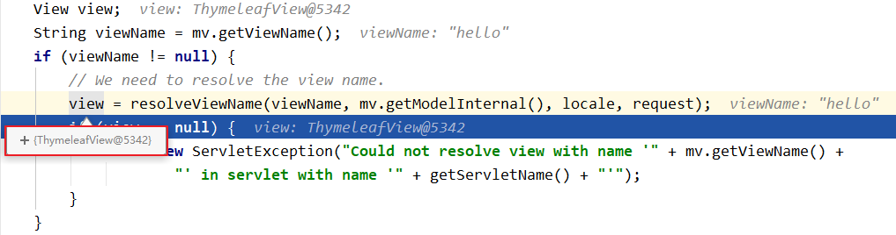
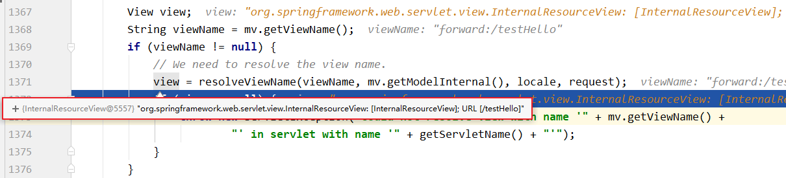
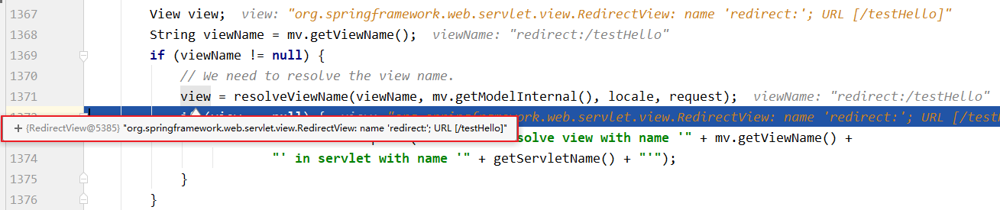

# SpringMVC 视图

SpringMVC 中的视图是 view 接口，视图的作用是用来渲染数据，将模型 model 中的数据展示给用户，SpringMVC 视图的种类很多，默认有转发视图：InternalResourceView 和重定向 RedirectView，当工程引入 jstl 的依赖，转发视图就会自动转化为 JstlView 如果使用的视图技术为 Thymeleaf，在 springMVC 的配置文件中配置了 Thymeleaf 的视图解析器，由此视图解析器解析之后所得的是 ThymeleafView

| 大类      | 视图类型                       | 说明                                                                          |
| --------- | ------------------------------ | ----------------------------------------------------------------------------- |
| URL 视图  | InternalResourceView           | 将 JSP 或其他资源封装成一个视图，是 InternalResourceView 默认使用的视图实现类 |
| URL 视图  | JstlView                       | 如果 JSP 文件中使用了 JSTL 国际化标签的功能，则需要使用该视图类               |
| 文档视图  | AbstractExcelView              | Excel 文档视图的抽象类，该视图类基于 POI 构造 Excel 文档                      |
| 文档视图  | AbstractPdfView                | PDF 文档视图的抽象类，该视图类基于 IText 构造的 PDF 文档                      |
| 报表视图  | ConfigurationJasperReportsView | 几个使用了 JasperReports 报表技术的视图                                       |
| 报表视图  | JasperReportsCsvView           | 几个使用了 JasperReports 报表技术的视图                                       |
| 报表视图  | JasperReportsMultiFormatView   | 几个使用了 JasperReports 报表技术的视图                                       |
| 报表视图  | JasperReportsHtmlView          | 几个使用了 JasperReports 报表技术的视图                                       |
| 报表视图  | JasperReportsPdfView           | 几个使用了 JasperReports 报表技术的视图                                       |
| 报表视图  | JasperReportsXlsView           | 几个使用了 JasperReports 报表技术的视图                                       |
| JSON 视图 | MappingJacksonJsonView         | 将模型数据通过 Jackson 开源框架的 ObjectMapper 以及 JSON 方式输出             |

## ThymeleafView

当控制器方法中所设置的视图名称没有任何前缀时，此时的视图名称会被 SpringMVC 配置文件中所配置的视图解析器解析，视图名称拼接视图前缀和视图后缀所得到的最终路径，会通过转发的方式实现跳转

```java
@RequestMapping("/testHello")
public String testHello(){
    return "hello";
}
```



## 转发视图

SpringMVC 中默认的转发视图是 InternalResourceView

SpringMVC 中创建转发视图的情况：

当控制器方法中所设置的视图名称以 "forward:" 为前缀时，创建 InternalResourceView 视图，此时的视图名称不会被 SpringMVC 配置文件中所配置的视图解析器解析，而是会将前缀 "forward:" 去掉，剩余部分作为最终路径通过转发的方式实现跳转

例如 "forward:/"，"forward:/employee"

```java
@RequestMapping("/testForward")
public String testForward(){
    return "forward:/testHello";
}
```



## 重定向视图

SpringMVC 中默认的重定向视图是 RedirectView

当控制器方法中所设置的视图名称以 "redirect:" 为前缀时，创建 RedirectView 视图，此时的视图名称不会被 SpringMVC 配置文件中所配置的视图解析器解析，而是会将前缀 "redirect:" 去掉，剩余部分作为最终路径通过重定向的方式实现跳转

例如 "redirect:/"，"redirect:/employee"

```java
@RequestMapping("/testRedirect")
public String testRedirect(){
    return "redirect:/testHello";
}
```



重定向视图在解析时，会先将 redirect: 前缀去掉，然后会判断剩余部分是否以 / 开头，若是则会自动拼接上下文路径

## 视图控制器 view-controller

当控制器方法中，仅仅用来实现页面跳转，即只需要设置视图名称时，可以将处理器方法使用 view-controller 标签进行表示

```xml
<!--
	path：设置处理的请求地址
	view-name：设置请求地址所对应的视图名称
-->
<mvc:view-controller path="/testView" view-name="success"></mvc:view-controller>

// 相当于
@RequestMapping("/testView")
public String index(){
  return "success";
}
```

当 SpringMVC 中设置任何一个 view-controller 时，其他控制器中的请求映射将全部失效，此时需要在 SpringMVC 的核心配置文件中设置开启 mvc 注解驱动的标签：

```xml
<mvc:annotation-driven />
```

