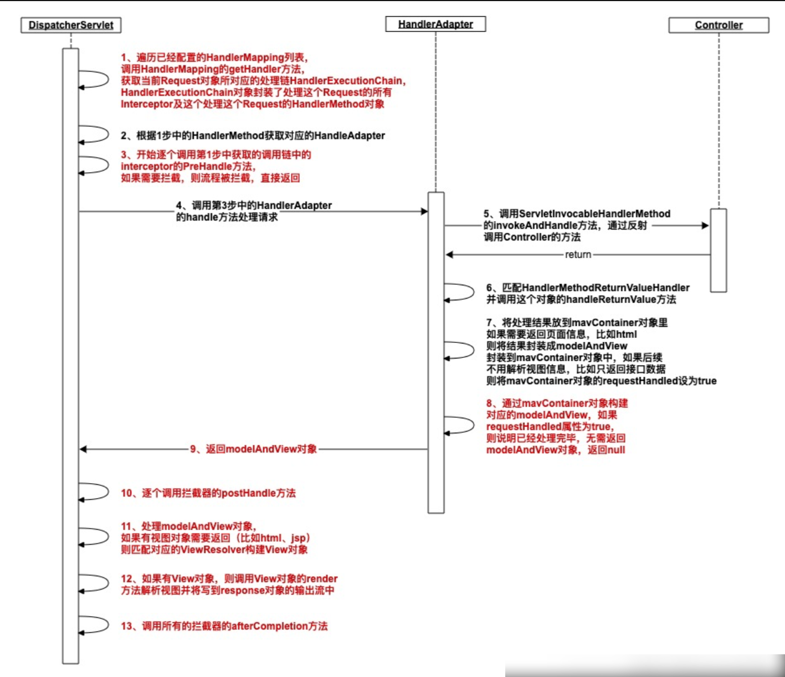
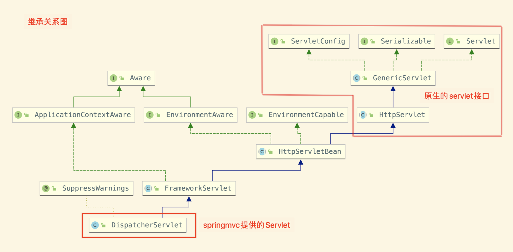
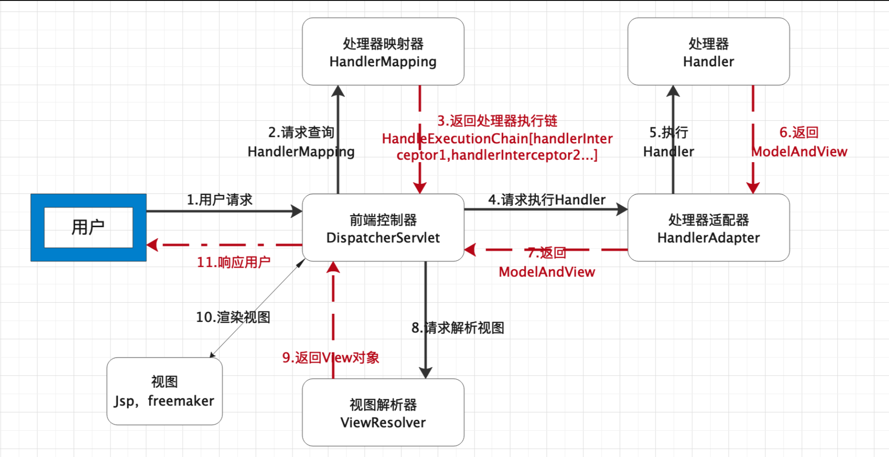
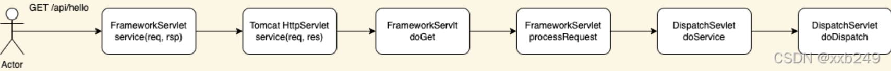
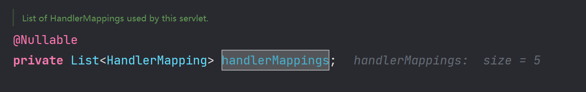
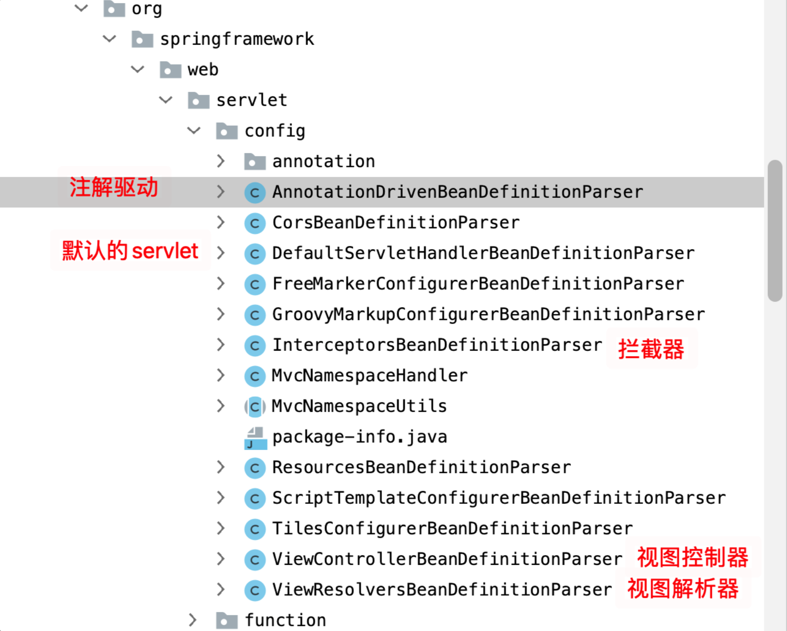
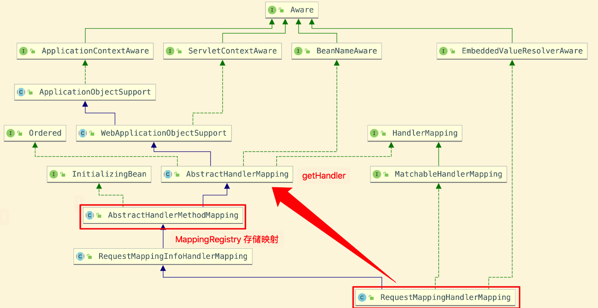
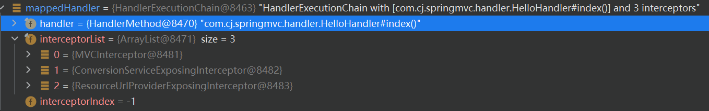
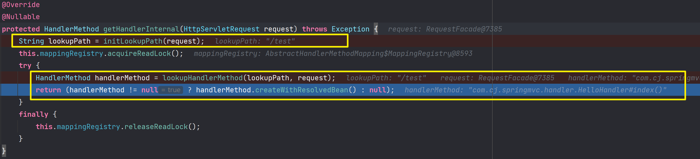

# SpringMVC 执行流程



## SpringMVC 常用组件

DispatcherServlet：前端控制器，不需要工程师开发，由框架提供

- 作用：统一处理请求和响应，整个流程控制的中心，由它调用其它组件处理用户的请求

HandlerMapping：处理器映射器，不需要工程师开发，由框架提供

- 作用：根据请求的 url、method 等信息查找 Handler，即控制器方法

Handler：处理器，需要工程师开发

- 作用：在 DispatcherServlet 的控制下 Handler 对具体的用户请求进行处理

HandlerAdapter：处理器适配器，不需要工程师开发，由框架提供

- 作用：通过 HandlerAdapter 对处理器（控制器方法）进行执行

ViewResolver：视图解析器，不需要工程师开发，由框架提供

- 作用：进行视图解析，得到相应的视图，例如：ThymeleafView、InternalResourceView、

RedirectView

- View：视图

作用：将模型数据通过页面展示给用户

## DispatcherServlet 初始化过程

DispatcherServlet 是在 Spring 容器启动时被创建的。而 Spring 容器是在应用程序启动时被创建的，所以如果应用程序部署在 Tomcat 上，那么 DispatcherServlet 就会在 Tomcat 启动时被创建。

DispatcherServlet 本质上是一个 Servlet，所以天然的遵循 Servlet 的生命周期。所以宏观上是 Servlet 生命周期来进行调度。



### HttpServletBean#init 

DispatcherServlet 前端控制器 xml 配置

```xml
<!-- servlet -->
<servlet>
    <servlet-name>DispatcherServlet</servlet-name>
    <servlet-class>org.springframework.web.servlet.DispatcherServlet</servlet-class>
    <init-param>
        <param-name>contextConfigLocation</param-name>
        <param-value>classpath:springmvc04.xml</param-value>
    </init-param>
    <load-on-startup>1</load-on-startup>
</servlet>
<servlet-mapping>
    <servlet-name>DispatcherServlet</servlet-name>
    <url-pattern>/</url-pattern>
</servlet-mapping>
```

如果是 xml 配置就解析，如果是注解配置就跳过

```java
@Override
public final void init() throws ServletException {
 
    // Set bean properties from init parameters.
    // 解析 web.xml 中 init-param 标签，存储到 PropertyValues
    PropertyValues pvs = new ServletConfigPropertyValues(getServletConfig(), this.requiredProperties);
    if (!pvs.isEmpty()) {//通过 xml 方式配置 springmvc，会进入这个 if。如果是注解方式则不进入
        try {
            //这里的 this 指向的 DispatcherServlet，下面的代码是给 DispatcherServlet 中 contextLocation 属性赋值
            BeanWrapper bw = PropertyAccessorFactory.forBeanPropertyAccess(this);
            ResourceLoader resourceLoader = new ServletContextResourceLoader(getServletContext());
            bw.registerCustomEditor(Resource.class, new ResourceEditor(resourceLoader, getEnvironment()));
            initBeanWrapper(bw);
            bw.setPropertyValues(pvs, true); //赋值操作
        }
        catch (BeansException ex) {
            if (logger.isErrorEnabled()) {
                logger.error("Failed to set bean properties on servlet '" + getServletName() + "'", ex);
            }
            throw ex;
        }
    }
 
    // Let subclasses do whatever initialization they like.
    initServletBean(); //子类实现
}
```
基于 xml 方式配置 springmvc，会进入 if 分支。PropertyValues 是一个键值对，内容就是 xml 配置 init-param 标签，key=contextConfigLocation，value=classpath:springmvc04.xml。

这段代码就是保存 springmvc 配置的，了解到这种程度即可。

### FrameworkServlet#initServletBean

这个方法大部分都是日志检查，最核心方法就是 initWebApplicationContext，初始化 IOC 容器。initFrameworkServlet 目前是空方法

```java
protected final void initServletBean() throws ServletException {
    getServletContext().log("Initializing Spring " + getClass().getSimpleName() + " '" + getServletName() + "'");
    if (logger.isInfoEnabled()) {
        logger.info("Initializing Servlet '" + getServletName() + "'");
    }
    long startTime = System.currentTimeMillis();

    try {
        //初始化 IOC 容器 ApplicationContext
        this.webApplicationContext = initWebApplicationContext();
        initFrameworkServlet(); // 这方法是空
    }
    catch (ServletException | RuntimeException ex) {
        logger.error("Context initialization failed", ex);
        throw ex;
    }

    if (logger.isDebugEnabled()) {
        String value = this.enableLoggingRequestDetails ?
                "shown which may lead to unsafe logging of potentially sensitive data" :
                "masked to prevent unsafe logging of potentially sensitive data";
        logger.debug("enableLoggingRequestDetails='" + this.enableLoggingRequestDetails +
                "': request parameters and headers will be " + value);
    }

    if (logger.isInfoEnabled()) {
        logger.info("Completed initialization in " + (System.currentTimeMillis() - startTime) + " ms");
    }
}
```

### FrameworkServlet#initWebApplicationContext

```java
protected WebApplicationContext initWebApplicationContext() {
	WebApplicationContext rootContext =
			WebApplicationContextUtils.getWebApplicationContext(getServletContext());
	WebApplicationContext wac = null;
    //如果是注解方式的 springmvc 进入 if 分支，xml 方式不进入
	if (this.webApplicationContext != null) {
		// A context instance was injected at construction time -> use it
		wac = this.webApplicationContext;
		if (wac instanceof ConfigurableWebApplicationContext) {
			ConfigurableWebApplicationContext cwac = (ConfigurableWebApplicationContext) wac;
			if (!cwac.isActive()) {
				// The context has not yet been refreshed -> provide services such as
				// setting the parent context, setting the application context id, etc
				if (cwac.getParent() == null) {
					// The context instance was injected without an explicit parent -> set
					// the root application context (if any; may be null) as the parent
					cwac.setParent(rootContext);
				}
				configureAndRefreshWebApplicationContext(cwac);
			}
		}
	}
	if (wac == null) {
		// No context instance was injected at construction time -> see if one
		// has been registered in the servlet context. If one exists, it is assumed
		// that the parent context (if any) has already been set and that the
		// user has performed any initialization such as setting the context id
		wac = findWebApplicationContext();
	}
	if (wac == null) {
		// No context instance is defined for this servlet -> create a local one
		wac = createWebApplicationContext(rootContext); //这里创建 ioc 容器
	}
    
    //spring 异步事件，在创建 ioc 容器时会产生一个异步事件，去刷新 ioc 容器
    //这里简单起见，假设没有接收到事件，刷新操作会在当前线程完成
	if (!this.refreshEventReceived) {
		// Either the context is not a ConfigurableApplicationContext with refresh
		// support or the context injected at construction time had already been
		// refreshed -> trigger initial onRefresh manually here.
		synchronized (this.onRefreshMonitor) {
			onRefresh(wac);
		}
	}
 
    //到这里只需要设置属性即可
	if (this.publishContext) {
		// Publish the context as a servlet context attribute.
		String attrName = getServletContextAttributeName();
		getServletContext().setAttribute(attrName, wac);
	}
 
	return wac;
}
```

这里有几点说明：

1）spring 异步事件，是单独的，不去深究，这里假设 ioc 容器 ApplicationContext 创建之后，刷新操作可以看成是在当前线程中完成

2）attrName 比较长，通过断点查看到其值是，`org.springframework.web.servlet.FrameworkServlet.CONTEXT.DispatcherServlet`，是我们在 xml 配置文件中指定 servlet-name 属性

### FrameworkServlet#createWebApplicationContext

创建容器

```java
protected WebApplicationContext createWebApplicationContext(@Nullable ApplicationContext parent) {
    Class<?> contextClass = getContextClass();
    if (!ConfigurableWebApplicationContext.class.isAssignableFrom(contextClass)) {
        throw new ApplicationContextException(
                "Fatal initialization error in servlet with name '" + getServletName() +
                "': custom WebApplicationContext class [" + contextClass.getName() +
                "] is not of type ConfigurableWebApplicationContext");
    }
    ConfigurableWebApplicationContext wac =
            (ConfigurableWebApplicationContext) BeanUtils.instantiateClass(contextClass);

    wac.setEnvironment(getEnvironment());
    wac.setParent(parent);
    String configLocation = getContextConfigLocation();
    if (configLocation != null) {
        wac.setConfigLocation(configLocation);
    }
    configureAndRefreshWebApplicationContext(wac);

    return wac;
}
```

### DispatcherServlet#onRefresh

初始化各种解析器


```java
/**
 * This implementation calls {@link #initStrategies}.
 */
@Override
protected void onRefresh(ApplicationContext context) {
	initStrategies(context);
}
 
/**
 * Initialize the strategy objects that this servlet uses.
 * <p>May be overridden in subclasses in order to initialize further strategy objects.
 */
protected void initStrategies(ApplicationContext context) {
	initMultipartResolver(context); //初始化文件上传解析器
	initLocaleResolver(context); //初始化本地域解析器
	initThemeResolver(context); 
	initHandlerMappings(context); //初始化处理器映射
	initHandlerAdapters(context);
	initHandlerExceptionResolvers(context); //异常解析器
	initRequestToViewNameTranslator(context); 
	initViewResolvers(context); //视图解析器
	initFlashMapManager(context);
}
```

## DispatcherServlet 调用组件处理请求



具体方法处理流程图：



### doDispatch 方法

 该方法是核心处理方法，里面主要做如下处理：


```java
@SuppressWarnings("deprecation")
protected void doDispatch(HttpServletRequest request, HttpServletResponse response) throws Exception {
    HttpServletRequest processedRequest = request;
    HandlerExecutionChain mappedHandler = null;
    boolean multipartRequestParsed = false;
 
    WebAsyncManager asyncManager = WebAsyncUtils.getAsyncManager(request);
 
    try {
        ModelAndView mv = null;
        Exception dispatchException = null;
 
        try {
            processedRequest = checkMultipart(request); //检查是否为 multipart 请求
            multipartRequestParsed = (processedRequest != request);
 
            // Determine handler for the current request. 获取处理器映射器
            // HandlerExecutionChain 返回了这个对象，包含 controller 类方法和一些拦截器等等
            mappedHandler = getHandler(processedRequest);
            if (mappedHandler == null) {//没有找到映射器处理器 则报 404 not found
                noHandlerFound(processedRequest, response);
                return;
            }
 
            // Determine handler adapter for the current request. 获取处理器适配器 
            // 通常是 RequestMappingHandlerAdapter
            HandlerAdapter ha = getHandlerAdapter(mappedHandler.getHandler());
 
            // Process last-modified header, if supported by the handler.
            String method = request.getMethod();
            boolean isGet = HttpMethod.GET.matches(method);
            if (isGet || HttpMethod.HEAD.matches(method)) { //判断是否为 GET、HEAD 请求
                long lastModified = ha.getLastModified(request, mappedHandler.getHandler());
                if (new ServletWebRequest(request, response).checkNotModified(lastModified) && isGet) {
                    return;
                }
            }
            //拦截器中 preHandle 方法
            if (!mappedHandler.applyPreHandle(processedRequest, response)) {
                return;
            }
 
            // Actually invoke the handler.
            // 处理器适配器 执行真正处理方法，在内部创建 ModelAndView 对象
            // 可能调用到 AbstractHandlerMethodAdapter 中的 handle 方法
            mv = ha.handle(processedRequest, response, mappedHandler.getHandler());
 
            if (asyncManager.isConcurrentHandlingStarted()) {
                return;
            }
 
            applyDefaultViewName(processedRequest, mv);//设置 ModelAndView 中视图名称
            mappedHandler.applyPostHandle(processedRequest, response, mv);//拦截器中 postHandle 方法
        }
        catch (Exception ex) {
            dispatchException = ex;
        }
        catch (Throwable err) {
            // As of 4.3, we're processing Errors thrown from handler methods as well,
            // making them available for @ExceptionHandler methods and other scenarios.
            dispatchException = new NestedServletException("Handler dispatch failed", err);
        }
        processDispatchResult(processedRequest, response, mappedHandler, mv, dispatchException); //渲染视图
    }
    catch (Exception ex) {
        triggerAfterCompletion(processedRequest, response, mappedHandler, ex);
    }
    catch (Throwable err) {
        triggerAfterCompletion(processedRequest, response, mappedHandler,
                new NestedServletException("Handler processing failed", err));
    }
    finally {
        if (asyncManager.isConcurrentHandlingStarted()) {
            // Instead of postHandle and afterCompletion
            if (mappedHandler != null) {
                mappedHandler.applyAfterConcurrentHandlingStarted(processedRequest, response);
            }
        }
        else {
            // Clean up any resources used by a multipart request.
            if (multipartRequestParsed) {
                cleanupMultipart(processedRequest);
            }
        }
    }
}
```

## DispatcherServlet 获取处理器映射器

当一个请求发送到服务器后，springmvc 是如何找到相应的处理器来处理呢？

### 注册 HandlerMapping

#### HandlerMapping 初始化

要先了解处理器映射器是如何注册到 springmvc 后，在分析查找流程就比较轻松了。springmvc 是在 DispatcherServlet 中定义一个 map 保存 HandlerMapping，具体如下：



```java
/**
 * Initialize the HandlerMappings used by this class.
 * <p>If no HandlerMapping beans are defined in the BeanFactory for this namespace,
 * we default to BeanNameUrlHandlerMapping.
 * 初始化 处理器映射器，如果没有找不到则使用的默认的 BeanNameUrlHandlerMapping
 */
private void initHandlerMappings(ApplicationContext context) {
	this.handlerMappings = null;

	if (this.detectAllHandlerMappings) {//默认进入该分支
		// Find all HandlerMappings in the ApplicationContext, including ancestor contexts.
		// 在 ioc 容器中查找类型为 HandlerMapping 的 bean
		/**
		 * 可以获取到 bean 满足以下条件之一即可：
		 * 1）使用注解方式
		 * 2）使用配置文件方式，并且配置了 annotation-driven 标签
		 */
		Map<String, HandlerMapping> matchingBeans =
				BeanFactoryUtils.beansOfTypeIncludingAncestors(context, HandlerMapping.class, true, false);
		if (!matchingBeans.isEmpty()) {
			this.handlerMappings = new ArrayList<>(matchingBeans.values());
			// We keep HandlerMappings in sorted order.
			AnnotationAwareOrderComparator.sort(this.handlerMappings);
		}
	}
	else {
		try {
			HandlerMapping hm = context.getBean(HANDLER_MAPPING_BEAN_NAME, HandlerMapping.class);
			this.handlerMappings = Collections.singletonList(hm);
		}
		catch (NoSuchBeanDefinitionException ex) {
			// Ignore, we'll add a default HandlerMapping later.
		}
	}

	// Ensure we have at least one HandlerMapping, by registering
	// a default HandlerMapping if no other mappings are found.
	/**
	 * 如果配置文件中没有配置<mvc:annotation-drivern/>则进入该 if 分支
	 * 默认情况下，在 DispatcherServlet.properties 文件中配置三个处理器映射器分别是
	 * BeanNameUrlHandlerMapping
	 * RequestMappingHandlerMapping
	 * RouterFunctionMapping
	 */
	if (this.handlerMappings == null) {//使用的默认的 BeanNameUrlHandlerMapping
		this.handlerMappings = getDefaultStrategies(context, HandlerMapping.class);
	}
	for (HandlerMapping mapping : this.handlerMappings) {
		if (mapping.usesPathPatterns()) {
			this.parseRequestPath = true;
			break;
		}
	}
}
```

#### 注入 HandlerMapping

现在重点是 springmvc 是将哪些对象注入到 spring ioc 容器以及如何注入的？这里我们想一下 spring 管理的方式：xml 方式和注解方式。那么 springmvc 当然也可以通过这两种方式注入

##### xml 配置方式

通过上面的代码分析，如果在配置文件中没有配置 mvc:annotation-driven，就 HandlerMapping 不会有 bean 对象注入到 ioc 容器中，最后就会使用默认的 HandlerMapping，具体处理在在方法 getDefaultStrategies 中，这里不再展开说明了。

接下来我们着重介绍 springmvc 配置文件中配置 mvc:annotation-driven 的场景。springmvc 处理 xml 解析都在这个包：org.springframework.web.servlet.config，如下图：



这个标签解析处理是在 AnnotationDrivenBeanDefinitionParser.java，具体解析方法 parse，该方法内容太长，这里只把主要代码进行罗列：

```java
@Override
@Nullable
public BeanDefinition parse(Element element, ParserContext context) {
	Object source = context.extractSource(element);
	XmlReaderContext readerContext = context.getReaderContext();

	CompositeComponentDefinition compDefinition = new CompositeComponentDefinition(element.getTagName(), source);
	context.pushContainingComponent(compDefinition);

	RuntimeBeanReference contentNegotiationManager = getContentNegotiationManager(element, source, context);

	// 创建处理器映射器，RequestMappingHandlerMapping
	RootBeanDefinition handlerMappingDef = new RootBeanDefinition(RequestMappingHandlerMapping.class);
	handlerMappingDef.setSource(source);
	handlerMappingDef.setRole(BeanDefinition.ROLE_INFRASTRUCTURE);
	handlerMappingDef.getPropertyValues().add("order", 0);
	handlerMappingDef.getPropertyValues().add("contentNegotiationManager", contentNegotiationManager);

	if (element.hasAttribute("enable-matrix-variables")) {
		boolean enableMatrixVariables = Boolean.parseBoolean(element.getAttribute("enable-matrix-variables"));
		handlerMappingDef.getPropertyValues().add("removeSemicolonContent", !enableMatrixVariables);
	}

	configurePathMatchingProperties(handlerMappingDef, element, context);
	readerContext.getRegistry().registerBeanDefinition(HANDLER_MAPPING_BEAN_NAME, handlerMappingDef);
    
    ...
    //创建处理器适配器，RequestMappingHandlerAdapter
	RootBeanDefinition handlerAdapterDef = new RootBeanDefinition(RequestMappingHandlerAdapter.class);
	handlerAdapterDef.setSource(source);
	handlerAdapterDef.setRole(BeanDefinition.ROLE_INFRASTRUCTURE);
	handlerAdapterDef.getPropertyValues().add("contentNegotiationManager", contentNegotiationManager);
	handlerAdapterDef.getPropertyValues().add("webBindingInitializer", bindingDef);
	handlerAdapterDef.getPropertyValues().add("messageConverters", messageConverters);
	addRequestBodyAdvice(handlerAdapterDef);
	addResponseBodyAdvice(handlerAdapterDef);

	if (element.hasAttribute("ignore-default-model-on-redirect")) {
		Boolean ignoreDefaultModel = Boolean.valueOf(element.getAttribute("ignore-default-model-on-redirect"));
		handlerAdapterDef.getPropertyValues().add("ignoreDefaultModelOnRedirect", ignoreDefaultModel);
	}
	if (argumentResolvers != null) {
		handlerAdapterDef.getPropertyValues().add("customArgumentResolvers", argumentResolvers);
	}
	if (returnValueHandlers != null) {
		handlerAdapterDef.getPropertyValues().add("customReturnValueHandlers", returnValueHandlers);
	}
	if (asyncTimeout != null) {
		handlerAdapterDef.getPropertyValues().add("asyncRequestTimeout", asyncTimeout);
	}
	if (asyncExecutor != null) {
		handlerAdapterDef.getPropertyValues().add("taskExecutor", asyncExecutor);
	}

	handlerAdapterDef.getPropertyValues().add("callableInterceptors", callableInterceptors);
	handlerAdapterDef.getPropertyValues().add("deferredResultInterceptors", deferredResultInterceptors);
	readerContext.getRegistry().registerBeanDefinition(HANDLER_ADAPTER_BEAN_NAME, handlerAdapterDef);
	
	//创建异常相关解析器 ...

	context.registerComponent(new BeanComponentDefinition(handlerMappingDef, HANDLER_MAPPING_BEAN_NAME));
	context.registerComponent(new BeanComponentDefinition(handlerAdapterDef, HANDLER_ADAPTER_BEAN_NAME));
	context.registerComponent(new BeanComponentDefinition(uriContributorDef, uriContributorName));
	context.registerComponent(new BeanComponentDefinition(mappedInterceptorDef, mappedInterceptorName));
	context.registerComponent(new BeanComponentDefinition(methodExceptionResolver, methodExResolverName));
	context.registerComponent(new BeanComponentDefinition(statusExceptionResolver, statusExResolverName));
	context.registerComponent(new BeanComponentDefinition(defaultExceptionResolver, defaultExResolverName));

	// Ensure BeanNameUrlHandlerMapping (SPR-8289) and default HandlerAdapters are not "turned off"
	MvcNamespaceUtils.registerDefaultComponents(context, source);

	context.popAndRegisterContainingComponent();

	return null;
}
```

因此我们可以得出：通过解析 annotation-driven，springmvc 会把相关处理器，适配器，异常解析器等注入 spring ioc 容器中

##### 注解方式@EnableWebMvc

通过@EnableWebMvc 注解定义可以知道，入口类是在 DelegatingWebMvcConfiguration，通过简单阅读源码，可以很清晰知道在父类，是通过 @Bean 的方式注入到 spring ioc 容器中，具体代码：

```java
@Bean
@SuppressWarnings("deprecation")
public RequestMappingHandlerMapping requestMappingHandlerMapping(
		@Qualifier("mvcContentNegotiationManager") ContentNegotiationManager contentNegotiationManager,
		@Qualifier("mvcConversionService") FormattingConversionService conversionService,
		@Qualifier("mvcResourceUrlProvider") ResourceUrlProvider resourceUrlProvider) {
	//创建 RequestHandlerMapping
	RequestMappingHandlerMapping mapping = createRequestMappingHandlerMapping();
	mapping.setOrder(0);
	mapping.setInterceptors(getInterceptors(conversionService, resourceUrlProvider));
	mapping.setContentNegotiationManager(contentNegotiationManager);
	mapping.setCorsConfigurations(getCorsConfigurations());

	PathMatchConfigurer pathConfig = getPathMatchConfigurer();
	if (pathConfig.getPatternParser() != null) {
		mapping.setPatternParser(pathConfig.getPatternParser());
	}
	else {
		mapping.setUrlPathHelper(pathConfig.getUrlPathHelperOrDefault());
		mapping.setPathMatcher(pathConfig.getPathMatcherOrDefault());

		Boolean useSuffixPatternMatch = pathConfig.isUseSuffixPatternMatch();
		if (useSuffixPatternMatch != null) {
			mapping.setUseSuffixPatternMatch(useSuffixPatternMatch);
		}
		Boolean useRegisteredSuffixPatternMatch = pathConfig.isUseRegisteredSuffixPatternMatch();
		if (useRegisteredSuffixPatternMatch != null) {
			mapping.setUseRegisteredSuffixPatternMatch(useRegisteredSuffixPatternMatch);
		}
	}
	Boolean useTrailingSlashMatch = pathConfig.isUseTrailingSlashMatch();
	if (useTrailingSlashMatch != null) {
		mapping.setUseTrailingSlashMatch(useTrailingSlashMatch);
	}
	if (pathConfig.getPathPrefixes() != null) {
		mapping.setPathPrefixes(pathConfig.getPathPrefixes());
	}
	return mapping;
}
```

```java
@Bean
public RequestMappingHandlerAdapter requestMappingHandlerAdapter(
		@Qualifier("mvcContentNegotiationManager") ContentNegotiationManager contentNegotiationManager,
		@Qualifier("mvcConversionService") FormattingConversionService conversionService,
		@Qualifier("mvcValidator") Validator validator) {
	//创建 RequestMappingHandlerAdapter
	RequestMappingHandlerAdapter adapter = createRequestMappingHandlerAdapter();
	adapter.setContentNegotiationManager(contentNegotiationManager);
	adapter.setMessageConverters(getMessageConverters());
	adapter.setWebBindingInitializer(getConfigurableWebBindingInitializer(conversionService, validator));
	adapter.setCustomArgumentResolvers(getArgumentResolvers());
	adapter.setCustomReturnValueHandlers(getReturnValueHandlers());

	if (jackson2Present) {
		adapter.setRequestBodyAdvice(Collections.singletonList(new JsonViewRequestBodyAdvice()));
		adapter.setResponseBodyAdvice(Collections.singletonList(new JsonViewResponseBodyAdvice()));
	}

	AsyncSupportConfigurer configurer = getAsyncSupportConfigurer();
	if (configurer.getTaskExecutor() != null) {
		adapter.setTaskExecutor(configurer.getTaskExecutor());
	}
	if (configurer.getTimeout() != null) {
		adapter.setAsyncRequestTimeout(configurer.getTimeout());
	}
	adapter.setCallableInterceptors(configurer.getCallableInterceptors());
	adapter.setDeferredResultInterceptors(configurer.getDeferredResultInterceptors());
	return adapter;
}
```

### 查找处理器映射器

#### 业务自定义请求

查找处理器映射器的方法

```java
protected HandlerExecutionChain getHandler(HttpServletRequest request) throws Exception {
	if (this.handlerMappings != null) {
		for (HandlerMapping mapping : this.handlerMappings) {// 这里 handlerMappings 是在 initHandlerMappings 中赋值的
			HandlerExecutionChain handler = mapping.getHandler(request);
			if (handler != null) {
				return handler;
			}
		}
	}
	return null;
}

```

我们定义 Controller 通常使用 @RequestMapping 进行标注，最终匹配的处理器类是 RequestMappingHandlerMapping，该类类图是：



匹配规则比较复杂，而且意义不是很大，简单说一下。我们在定义 RequestMapping 的时指定的 value 可以是：

```java
@RequestMapping("/hello/wolrd")
@RequestMapping("/hello/${1}")
@RequestMapping("/hello/*")
```



> 这里对请求方法和 Controller 进行了匹配



## 参考资料

[SpringMVC 处理器适配器详解](https://blog.csdn.net/fageweiketang/article/details/81087852)

[Spring MVC 控制器中 Handler 的四种实现方式](https://developer.aliyun.com/article/910934)

[SpringMVC 实现 Controller 的三种方式总结](https://www.finclip.com/news/f/26804.html)

> 因为注解用的久了，导致其他实现 Handler 的方式网址了，导致 HandlerMapping 和 HandlerAdapter 的概念一直搞不清，
>
> 其实就是因为有这么多种实现 Handler 的方式，才需要相应的 HandlerMapping 才能找到，在需要相应的 HandlerAdapter 才能执行
