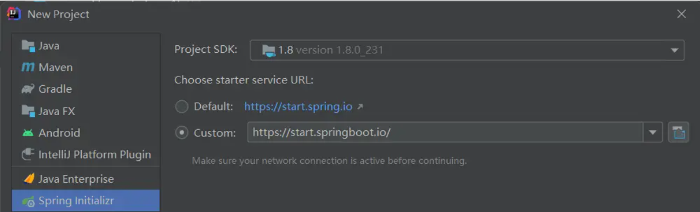
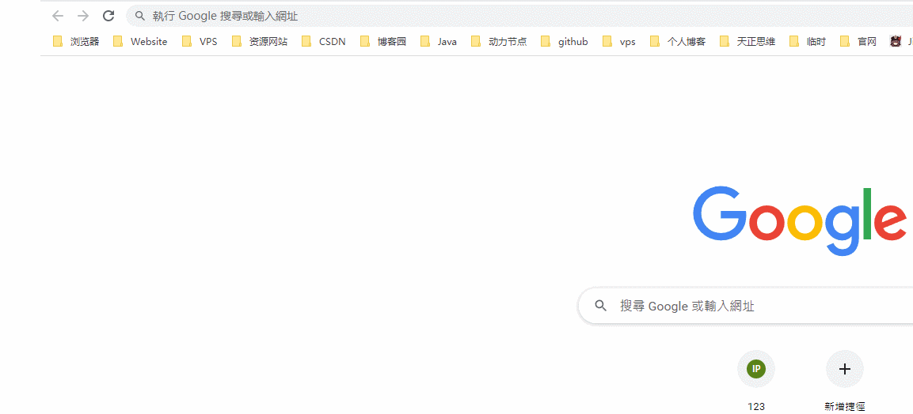
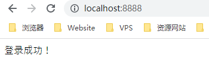

# SpringSecurity 入门案例

## 简介

中大型的项目使用 SpringSecurity 来做安全框架。小项目使用 Shiro 比较多，因为相比 SpringSecurity，shiro 上手更容易。一般 Web 应用需要进行认证和授权。

认证（Authentication）：验证当前访问系统的是不是本系统的用户，并且确认具体是哪个用户。

授权（Authoritarian）：经过认证后判断当前用户是否有权限进行某个操作。

## 创建 SpringBoot 工程



## 引入依赖

```xml
<?xml version="1.0" encoding="UTF-8"?>
<project xmlns="http://maven.apache.org/POM/4.0.0" xmlns:xsi="http://www.w3.org/2001/XMLSchema-instance"
         xsi:schemaLocation="http://maven.apache.org/POM/4.0.0 https://maven.apache.org/xsd/maven-4.0.0.xsd">
    <modelVersion>4.0.0</modelVersion>
    <groupId>com.cj.springsecurity</groupId>
    <artifactId>01.springsecurity-helloworld</artifactId>
    <version>0.0.1-SNAPSHOT</version>

    <parent>
        <groupId>org.springframework.boot</groupId>
        <artifactId>spring-boot-starter-parent</artifactId>
        <version>2.2.2.RELEASE</version>
        <relativePath/>
    </parent>

    <dependencies>
        <dependency>
            <groupId>org.springframework.boot</groupId>
            <artifactId>spring-boot-starter-web</artifactId>
        </dependency>
        <dependency>
            <groupId>org.springframework.boot</groupId>
            <artifactId>spring-boot-starter-security</artifactId>
        </dependency>
        <dependency>
            <groupId>org.springframework.boot</groupId>
            <artifactId>spring-boot-starter-thymeleaf</artifactId>
        </dependency>
    </dependencies>

    <build>
        <plugins>
            <plugin>
                <groupId>org.springframework.boot</groupId>
                <artifactId>spring-boot-maven-plugin</artifactId>
            </plugin>
        </plugins>
    </build>

</project>
```

## 编写 Controller

```java
package com.cj.springsecurity.controller;

import org.springframework.stereotype.Controller;
import org.springframework.web.bind.annotation.GetMapping;

@Controller
public class HomeController {

    @GetMapping("/")
    public String home(){
        return "home";
    }
}
```

## 编写配置文件

```properties
spring:
  application:
    name: 01.springsecurity-helloworld
  security:
    user:
      name: admin
      password: admin
  thymeleaf:
    cache: false
server:
  port: 8888
```

## 启动测试



> 访问我们发现，弹出来了一个登录框

+ SpringSecurity 默认用户名为 user
+ 默认密码打印在控制台`Using generated security password: 81fb0fc1-9d23-48b4-b170-ecdc8670bb11`
+ 通过配置文件将账号密码修改为 admin，admin
+ 点击登录，访问成功


