# IoC 概念和原理

## 什么是 IoC？

IoC 是 Inversion of Control 的简写，译为“控制反转”，它不是一门技术，而是一种设计思想，是一个重要的面向对象编程法则，能够指导我们如何设计出松耦合、更优良的程序。

Spring 通过 IoC 容器来管理所有 Java 对象的实例化和初始化，控制对象与对象之间的依赖关系。我们将由 IoC 容器管理的 Java 对象称为 Spring Bean，它与使用关键字 new 创建的 Java 对象没有任何区别。

IoC 容器是 Spring 框架中最重要的核心组件之一，它贯穿了 Spring 从诞生到成长的整个过程。

## 什么是控制反转？

- 控制反转是一种思想 
- 控制反转是为了降低程序耦合度，提高程序扩展力
- 控制反转，反转的是什么？
  - 将对象的创建权利交出去，交给第三方容器负责

  - 将对象和对象之间关系的维护权交出去，交给第三方容器负责


- 控制反转这种思想如何实现呢？
  - DI（Dependency Injection）：依赖注入

## 什么是依赖注入？

DI（Dependency Injection）：依赖注入，依赖注入实现了控制反转的思想。

依赖注入：

- 指 Spring 创建对象的过程中，将对象依赖属性通过配置进行注入

依赖注入常见的实现方式包括两种：

- 第一种：set 注入
- 第二种：构造注入

所以结论是：IOC 就是一种控制反转的思想，而 DI 是对 IoC 的一种具体实现。

Bean 管理说的是：Bean 对象的创建，以及 Bean 对象中属性的赋值（或者叫做 Bean 对象之间关系的维护）。

## IoC 底层实现原理

xml 解析、工厂模式、反射

### 画图讲解 IoC 底层原理

#### 通过 DOM 对 XML 解析

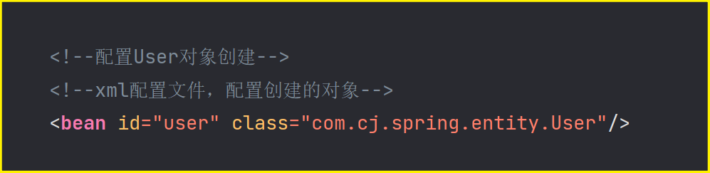

#### 工厂模式和反射创建对象

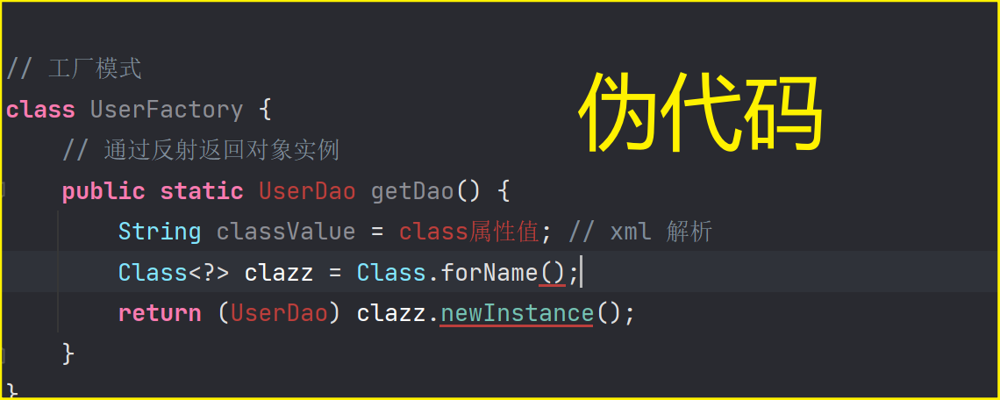

## IoC 容器在 Spring 的实现

Spring 的 IoC 容器就是 IoC 思想的一个落地的产品实现。IoC 容器中管理的组件也叫做 bean。在创建 bean 之前，首先需要创建 IoC 容器。Spring 提供了 IoC 容器的两种实现方式：

**BeanFactory**：IoC 容器基本实现，是 Spring 内部的使用接口，不提供开发人员进行使用，加载配置文件时候不会创建对象，在获取对象（使用）才去创建对象

**ApplicationContext**：BeanFactory 接口的子接口，提供更多更强大的功能，一般由开发人员进行使用，加载配置文件时候就会把在配置文件对象进行创建

### ApplicationContext 的主要实现类


| 类型名                          | 简介                                                                                                                          |
| ------------------------------- | ----------------------------------------------------------------------------------------------------------------------------- |
| ClassPathXmlApplicationContext  | 通过读取类路径下的 XML 格式的配置文件创建 IoC 容器对象                                                                        |
| FileSystemXmlApplicationContext | 通过文件系统路径读取 XML 格式的配置文件创建 IoC 容器对象                                                                      |
| ConfigurableApplicationContext  | ApplicationContext 的子接口，包含一些扩展方法 refresh() 和 close() ，让 ApplicationContext 具有启动、关闭和刷新上下文的能力。 |
| WebApplicationContext           | 专门为 Web 应用准备，基于 Web 环境创建 IoC 容器对象，并将对象引入存入 ServletContext 域中。                                   |

## IoC Bean 管理概念

### 什么是 Bean 管理

Bean 管理指的是两个操作

Spring 创建对象

Spirng 注入属性

### Bean 管理有两种方式

基于 xml 配置文件方式实现

基于注解方式实现

## 基于 xml 方式的 Bean 管理

### xml 方式创建对象

```xml
<!--配置User对象创建-->
<!--xml配置文件，配置创建的对象-->
<bean id="user" class="com.cj.spring.ioc.entity.User"/>
```

在 spring 配置文件中，使用 bean 标签，标签里面添加对应属性，就可以实现对象创建

在 bean 标签有很多属性，介绍常用的属性

- id 属性：唯一标识
- class 属性：类全路径（包类路径）

创建对象时候，默认也是执行无参数构造方法完成对象创建

### xml 方式注入属性

DI: 依赖注入，就是注入属性

#### 第一种注入方式：使用 set 方法进行注入

创建类，定义属性和对应的 set 方法

```java {6-12}
public class Book {
    //创建属性
    private String bookName;
    private String bookAuthor;

    public void setBookName(String bookName) {
        this.bookName = bookName;
    }

    public void setBookAuthor(String bookAuthor) {
        this.bookAuthor = bookAuthor;
    }

    public String getBookName() {
        return bookName;
    }

    public String getBookAuthor() {
        return bookAuthor;
    }
}
```

在 spring 配置文件配置对象创建，配置属性注入

```xml
<!--在 spring 配置文件配置对象创建，配置属性注入-->
<bean id="book" class="com.cj.spring.ioc.entity.Book">
    <!--
        使用 property 完成属性注入
        name：类里面属性名称
        value：向属性注入的值
    -->
    <property name="bookName" value="易筋经"/>
    <property name="bookAuthor" value="达摩老祖"/>
</bean>
```

运行结果：

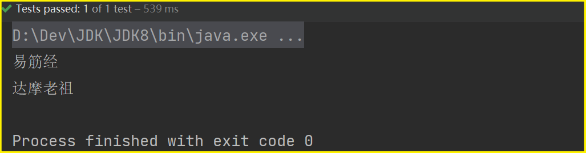

#### 第二种注入方式：使用有参数构造进行注入

创建类，定义属性，创建属性对应有参数构造方法

```java
public class Orders {
    // 属性
    private String OrdersName;
    private String address;

    // 有参数构造
    public Orders(String ordersName, String address) {
        OrdersName = ordersName;
        this.address = address;
    }

    @Override
    public String toString() {
        return "Orders{" +
                "OrdersName='" + OrdersName + '\'' +
                ", address='" + address + '\'' +
                '}';
    }
}
```

在 spring 配置文件中进行配置

```xml
<!--有参数构造注入属性-->
<bean id="orders" class="com.cj.spring.ioc.entity.Orders">
    <constructor-arg name="ordersName" value="电脑"/>
    <constructor-arg name="address" value="China"/>
</bean>
```

运行结果：

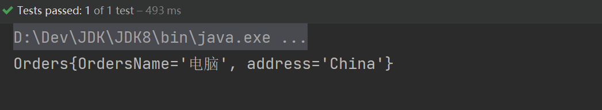

#### p 名称空间注入（了解）

使用 p 名称空间注入，可以简化基于 xml 配置方式

第一步 添加 p 名称空间在配置文件中

```xml {4}
<?xml version="1.0" encoding="UTF-8"?>
<beans xmlns="http://www.springframework.org/schema/beans"
       xmlns:xsi="http://www.w3.org/2001/XMLSchema-instance"
       xmlns:p="http://www.springframework.org/schema/p"
       xsi:schemaLocation="
        http://www.springframework.org/schema/beans
        https://www.springframework.org/schema/beans/spring-beans.xsd">
```

第二步 进行属性注入，在 bean 标签里面进行操作

```xml
<!-- P命名空间 set 方法注入属性-->
<bean id="book2" class="com.cj.spring.ioc.entity.Book"
      p:bookName="九阳神功"
      p:bookAuthor="无名氏"/>
```

运行结果：

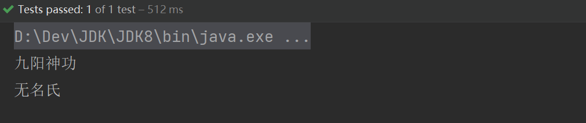

### xml 方式注入特殊类型属性

#### 注入 null 值和属性值包含特殊符号

```xml
<!--注入 null 值 和 属性值包含特殊符号-->
<bean id="book3" class="com.cj.spring.ioc.entity.Book">
    <!--属性值包含特殊符号-->
    <property name="bookName">
        <value><![CDATA[<<南京>>]]></value>
    </property>
    <!--null 值-->
    <property name="bookAuthor">
        <null/>
    </property>
</bean>
```

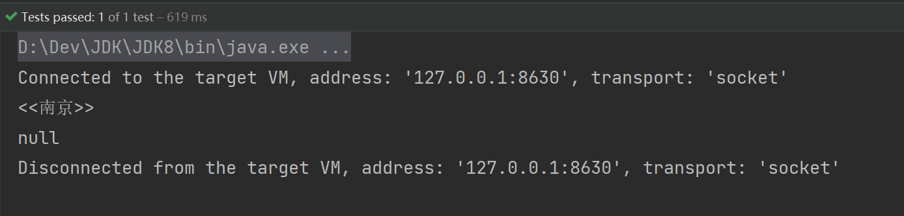

#### 注入外部 bean

> 将外部的 bean 对象作为属性注入到另一个 bean 对象中去

创建三个类 UserService、UserDao 和 UserDaoImpl

在 UserService 调用 UserDaoImpl 里面的方法

```java
public class UserService {
    //创建 UserDao 类型属性，生成 set 方法
    private UserDao userDao;

    public void setUserDao(UserDao userDao) {
        this.userDao = userDao;
    }

    public void add() {
        System.out.println("service add...............");
        userDao.update();
    }
}
```

```java
public interface UserDao {
    public void update();
}
```

```java
public class UserDaoImpl implements UserDao {
    @Override
    public void update() {
        System.out.println("service update...............");
    }
}
```

在 spring 配置文件中进行配置

先创建 userDaoImpl，再创建 userService，使用 set 注入到 userService 

```xml
<!-- 先创建 userDaoImpl 实现类,再创建 userService 使用set 注入到userService-->
<bean id="userDaoImpl" class="com.cj.spring.ioc.dao.impl.UserDaoImpl"/>
<!-- service 和 dao 对象创建-->
<bean id="userService" class="com.cj.spring.ioc.service.UserService">
    <!--
        注入 userDao 对象
        name 属性：类里面属性名称
        ref 属性：创建 userDao 对象 bean 标签 id 值
    -->
    <property name="userDao" ref="userDaoImpl"/>
</bean>
</beans>
```

运行结果：

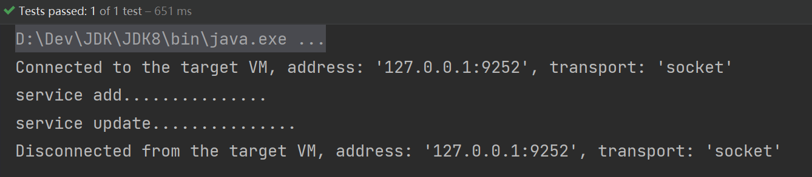

#### 注入内部 bean

> 在 bean 对象的内部注入一个 bean 对象作为外部 bean 的属性

一对多关系：一个部门有多个员工

创建两个类 Dept 和 Emp

```java
public class Dept {
    private String deptName;

    public void setDeptName(String deptName) {
        this.deptName = deptName;
    }

    @Override
    public String toString() {
        return "Dept{" +
                "deptName='" + deptName + '\'' +
                '}';
    }
}
```

```java
public class Emp {
    private String empName;
    private String gender;
    //员工属于某一个部门，使用对象形式表示
    private Dept dept;

    public void setEmpName(String empName) {
        this.empName = empName;
    }

    public void setGender(String gender) {
        this.gender = gender;
    }

    public void setDept(Dept dept) {
        this.dept = dept;
    }

    @Override
    public String toString() {
        return "Emp{" +
                "empName='" + empName + '\'' +
                ", gender='" + gender + '\'' +
                ", dept=" + dept +
                '}';
    }
}
```

在 spring 配置文件中进行配置

```xml
<!--注入内部 bean-->
<bean id="emp" class="com.cj.spring.ioc.entity.Emp">
    <!--设置两个普通属性-->
    <property name="empName" value="lucy"/>
    <property name="gender" value="女"/>
    <!--设置对象类型属性-->
    <property name="dept">
        <bean id="dept" class="com.cj.spring.ioc.entity.Dept">
            <property name="deptName" value="安保部"/>
        </bean>
    </property>
</bean>
```

运行结果：

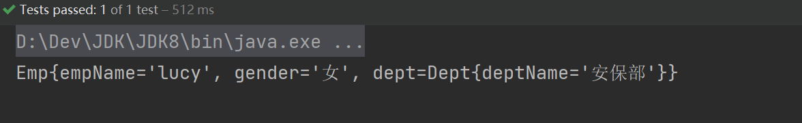

#### 级联赋值

>级联赋值类似于注入外部 bean，通过 ref 引用外部的 bean 对象作为属性

第一种写法：创建外部 bean 的同时给外部 bean 属性赋值再引用

在 spring 配置文件中进行配置

```xml
<!--级联赋值 第一种写法-->
<bean id="dept1" class="com.cj.spring.ioc.entity.Dept">
    <property name="deptName" value="财务部"/>
</bean>
<bean id="emp1" class="com.cj.spring.ioc.entity.Emp">
    <!--设置两个普通属性-->
    <property name="empName" value="lucy"/>
    <property name="gender" value="女"/>
    <!--级联赋值-->
    <property name="dept" ref="dept1"/>
</bean>
```

第二种写法：创建外部 bean 就直接引用，再对引用的外部 bean 属性进行赋值

需要修改 Emp 类

```java {23-25}
package com.cj.spring.ioc.entity;

/**
 * @title Emp
 * @date 2023/4/11 17:42
 * @author zhongnan
 * @description TODO
 */
public class Emp {
    private String empName;
    private String gender;
    //员工属于某一个部门，使用对象形式表示
    private Dept dept;

    public void setEmpName(String empName) {
        this.empName = empName;
    }

    public void setGender(String gender) {
        this.gender = gender;
    }

    public void setDept(Dept dept) {
        this.dept = dept;
    }

    public Dept getDept() {
        return dept;
    }

    @Override
    public String toString() {
        return "Emp{" +
                "empName='" + empName + '\'' +
                ", gender='" + gender + '\'' +
                ", dept=" + dept +
                '}';
    }
}

```

在 spring 配置文件中进行配置

```java
<!--级联赋值 第二种写法-->
<bean id="dept2" class="com.cj.spring.ioc.entity.Dept">
    <property name="deptName" value="财务部"/>
</bean>
<bean id="emp2" class="com.cj.spring.ioc.entity.Emp">
    <!--设置两个普通属性-->
    <property name="empName" value="lucy"/>
    <property name="gender" value="女"/>
    <!--级联赋值-->
    <property name="dept" ref="dept2"/>
    <!-- 需要先获取 dept 才能复制，所以需要添加 getDept() 方法-->
    <property name="dept.deptName" value="技术部"/>
</bean>
```

运行结果：

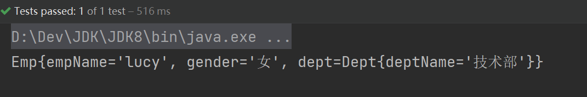

### xml 方式注入集合属性

#### 注入各种集合属性

- 注入数组类型属性
- 注入 List 集合类型属性
- 注入 Map 集合类型属性
- 注入 Set 集合类型属性

创建类，定义数组、list、map、set 类型属性，生成对应 set 方法

```java
public class Student {
    //1 数组类型属性
    private String[] courses;
    //2 list 集合类型属性
    private List<String> list;
    //3 map 集合类型属性
    private Map<String, String> maps;
    //4 set 集合类型属性
    private Set<String> sets;

    public void setSets(Set<String> sets) {
        this.sets = sets;
    }

    public void setCourses(String[] courses) {
        this.courses = courses;
    }

    public void setList(List<String> list) {
        this.list = list;
    }

    public void setMaps(Map<String, String> maps) {
        this.maps = maps;
    }

    @Override
    public String toString() {
        return "Student{" +
                "courses=" + Arrays.toString(courses) +
                ", list=" + list +
                ", maps=" + maps +
                ", sets=" + sets +
                '}';
    }
}
```

在 spring 配置文件中进行配置

```xml
<!--集合类型属性注入-->
<bean id="student" class="com.cj.spring.ioc.entity.Student">
    <!--数组类型属性注入-->
    <property name="courses">
        <array>
            <value>java 课程</value>
            <value>数据库课程</value>
        </array>
    </property>
    <!--list 类型属性注入-->
    <property name="list">
        <list>
            <value>张三</value>
            <value>小三</value>
        </list>
    </property>
    <!--map 类型属性注入-->
    <property name="maps">
        <map>
            <entry key="JAVA" value="java"/>
            <entry key="PHP" value="php"/>
        </map>
    </property>
    <!--set 类型属性注入-->
    <property name="sets">
        <set>
            <value>MySQL</value>
            <value>Redis</value>
            <value>Redis</value>
        </set>
    </property>
</bean>
```

运行结果：

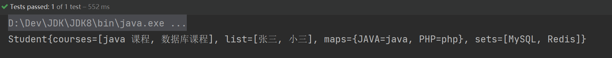

#### 在集合属性中注入对象

修改 Student 类

```java {10-15}
public class Student {
    //1 数组类型属性
    private String[] courses;
    //2 list 集合类型属性
    private List<String> list;
    //3 map 集合类型属性
    private Map<String, String> maps;
    //4 set 集合类型属性
    private Set<String> sets;
    //5、学生所学多门课程
    private List<Course> courseList;

    public void setCourses(String[] courses) {
        this.courses = courses;
    }

    public void setList(List<String> list) {
        this.list = list;
    }

    public void setMaps(Map<String, String> maps) {
        this.maps = maps;
    }

    public void setSets(Set<String> sets) {
        this.sets = sets;
    }

    public void setCourseList(List<Course> courseList) {
        this.courseList = courseList;
    }

    @Override
    public String toString() {
        return "Student{" +
                "courses=" + Arrays.toString(courses) +
                ", list=" + list +
                ", maps=" + maps +
                ", sets=" + sets +
                ", courseList=" + courseList +
                '}';
    }
}
```

新增 Course 类

```java
public class Course {
    private String courseName;

    public void setCourseName(String courseName) {
        this.courseName = courseName;
    }

    @Override
    public String toString() {
        return "Course{" +
                "courseName='" + courseName + '\'' +
                '}';
    }
}
```

在 spring 配置文件中进行配置

```java
<!--创建多个 course 对象-->
<bean id="course1" class="com.cj.spring.ioc.entity.Course">
    <property name="courseName" value="Spring5 框架"/>
</bean>
<bean id="course2" class="com.cj.spring.ioc.entity.Course">
    <property name="courseName" value="MyBatis 框架"/>
</bean>

<!--集合类型属性注入-->
<bean id="student1" class="com.cj.spring.ioc.entity.Student">
    <!--注入 list 集合类型，值是对象-->
    <property name="courseList">
        <list>
            <ref bean="course1"/>
            <ref bean="course2"/>
        </list>
    </property>
</bean>
```

运行结果：

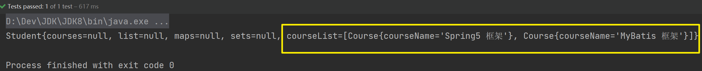

#### util 名称空间注入（了解）

> 和 p 名称空间注入一样，了解即可，不用深入研究

添加 util 名称空间在配置文件中

```xml {5,9-10}
<?xml version="1.0" encoding="UTF-8"?>
<beans xmlns="http://www.springframework.org/schema/beans"
       xmlns:xsi="http://www.w3.org/2001/XMLSchema-instance"
       xmlns:p="http://www.springframework.org/schema/p"
       xmlns:util="http://www.springframework.org/schema/util"
       xsi:schemaLocation="
        http://www.springframework.org/schema/beans
        https://www.springframework.org/schema/beans/spring-beans.xsd
        http://www.springframework.org/schema/util
        http://www.springframework.org/schema/util/spring-util.xsd">
```

在 spring 配置文件中进行配置

```xml
<!-- 提取 list 集合类型属性注入(和P命名空间一样了解即可)-->
<util:list id="list">
    <value>易筋经</value>
    <value>九阴真经</value>
    <value>九阳神功</value>
</util:list>
<!-- 提取 list 集合类型属性注入使用-->
<bean id="student2" class="com.cj.spring.ioc.entity.Student">
    <property name="list" ref="list"/>
</bean>
```

运行结果：

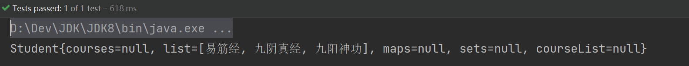

## FactoryBean

Spring 有两种类型 bean，一种普通 bean，另外一种工厂 bean（FactoryBean）

- 普通 bean：在配置文件中定义 bean 类型就是返回类型
- 工厂 bean：在配置文件定义 bean 类型可以和返回类型不一样

第一步：创建类，让这个类作为工厂 bean，实现接口 FactoryBean

第二步：实现接口里面的方法，在实现的方法中定义返回的 bean 类型

```java
public class MyBean implements FactoryBean<Dept> {

    @Override
    public Dept getObject() throws Exception {
        Dept dept = new Dept();
        dept.setDeptName("财务部");
        return dept;
    }

    @Override
    public Class<?> getObjectType() {
        return null;
    }

    @Override
    public boolean isSingleton() {
        return FactoryBean.super.isSingleton();
    }
}
```

在 spring 配置文件中进行配置

```xml
<!--FactoryBean-->
<bean id="myBean" class="com.cj.spring.ioc.entity.MyBean"/>
```

测试方法：

```java
    @Test
    public void test12() {
        /*加载配置文件*/
        ApplicationContext context = new ClassPathXmlApplicationContext("bean.xml");
        Dept dept = context.getBean("myBean", Dept.class);
        System.out.println(dept);
    }
```

运行结果：

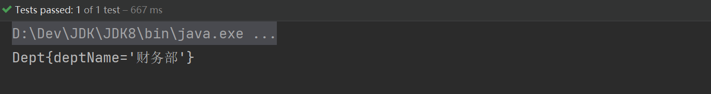

## bean 作用域

### 在 Spring 里面，设置创建 bean 实例是单实例还是多实例？

在 Spring 里面，默认情况下，bean 是单实例对象

```java
// bean 作用域
@Test
public void test13() {
    /*加载配置文件*/
    ApplicationContext context = new ClassPathXmlApplicationContext("bean.xml");
    Book book1 = context.getBean("book", Book.class);
    Book book2 = context.getBean("book", Book.class);
    System.out.println(book1);
    System.out.println(book2);
}
```

运行结果：

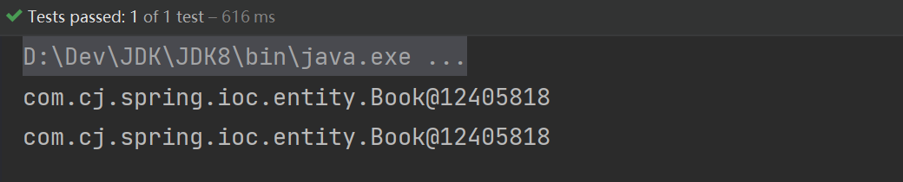

### 如何设置单实例还是多实例？

在 spring 配置文件 bean 标签里面有属性（scope）用于设置单实例还是多实例

- 默认值，singleton，表示是单实例对象
- prototype，表示是多实例对象

在 spring 配置文件中进行配置

```xml
<!--多实例对象-->
<bean id="book1" class="com.cj.spring.ioc.entity.Book" scope="prototype"/>
```

```java
// 多例
@Test
public void test14() {
    /*加载配置文件*/
    ApplicationContext context = new ClassPathXmlApplicationContext("bean.xml");
    Book book1 = context.getBean("book1", Book.class);
    Book book2 = context.getBean("book1", Book.class);
    System.out.println(book1);
    System.out.println(book2);
}
```

运行结果：

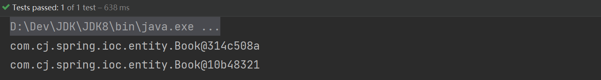

### singleton 和 prototype 区别？

1. singleton 单实例，prototype 多实例

2. 设置 scope 值是 singleton 时候，加载 spring 配置文件时候就会创建单实例对象

   设置 scope 值是 prototype 时候，不是在加载 spring 配置文件时候创建对象，在调用 getBean 方法时候创建多实例对象

## bean 生命周期

### 生命周期

从对象创建到对象销毁的过程

### bean 生命周期

- 通过构造器创建 bean 实例（无参构造）
- 为 bean 的属性设置值和对其他 bean 引用（调用 set 方法）
- 调用 bean 的初始化的方法（需要进行配置初始化的方法）
- bean 可以使用了（对象获取到了）
- 当容器关闭时候，调用 bean 的销毁的方法（需要进行配置销毁的方法）

### 演示 bean 生命周期

创建类

```java
public class LifeCycle {
    //无参数构造
    public LifeCycle() {
        System.out.println("第一步 执行无参数构造创建 bean 实例");
    }

    private String name;

    public void setName(String name) {
        this.name = name;
        System.out.println("第二步 调用 set 方法设置属性值");
    }

    //创建执行的初始化的方法
    public void initMethod() {
        System.out.println("第三步 执行初始化的方法");
    }

    //创建执行的销毁的方法
    public void destroyMethod() {
        System.out.println("第五步 执行销毁的方法");
    }
}
```

在 spring 配置文件中进行配置

```xml
<!--生命周期-->
<bean id="lifeCycle" class="com.cj.spring.ioc.entity.LifeCycle" scope="singleton"
      init-method="initMethod"
      destroy-method="destroyMethod">
    <property name="name" value="生命周期"/>
</bean>
```

测试方法：

```java
// 生命周期
@Test
public void test15() {
    /*加载配置文件*/
    ClassPathXmlApplicationContext context = new ClassPathXmlApplicationContext("bean.xml");
    LifeCycle lifeCycle = context.getBean("lifeCycle", LifeCycle.class);
    System.out.println("第四步：获取实例对象");
    System.out.println(lifeCycle);
    context.close();
}
```

运行结果：

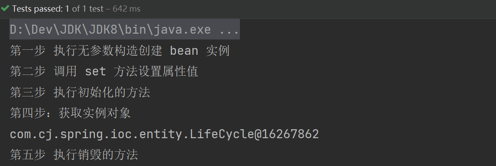

### bean 的后置处理器

> 注意点：会为当前 Spring 容器中所有的 bean 都添加 bean 的后置处理器，也就是说容器中有多少个 bean，bean 的后置处理器就会执行几次

如果添加了 bean 的后置处理器，bean 生命周期就有七步，需要 bean 实体类去实现 BeanPostProcessor bean 的后置处理器的接口

- 通过构造器创建 bean 实例（无参构造）
- 为 bean 的属性设置值和对其他 bean 引用（调用 set 方法）
- 把 bean 实例传递 bean 后置处理器的方法 postProcessBeforeInitialization 
- 调用 bean 的初始化的方法（需要进行配置初始化的方法）
- 把 bean 实例传递 bean 后置处理器的方法 postProcessAfterInitializationbean 
- 可以使用了（对象获取到了）
- 当容器关闭时候，调用 bean 的销毁的方法（需要进行配置销毁的方法）

演示添加后置处理器效果

```java
public class MyBeanPost implements BeanPostProcessor {
    @Override
    public Object postProcessBeforeInitialization(Object bean, String beanName) throws BeansException {
        System.out.println("初始化之前执行的后置处理器");
        return BeanPostProcessor.super.postProcessBeforeInitialization(bean, beanName);
    }

    @Override
    public Object postProcessAfterInitialization(Object bean, String beanName) throws BeansException {
        System.out.println("初始化之后执行的后置处理器");
        return BeanPostProcessor.super.postProcessAfterInitialization(bean, beanName);
    }
}
```

在 spring 配置文件中进行配置

```java
<!-- bean的后置处理器 会为当前容器中的所有bean都添加bean的后置处理器-->
<bean id="meBeanPost" class="com.cj.spring.ioc.entity.MyBeanPost"/>
```

测试方法：

```java
// bean 的后置处理
@Test
public void test16() {
    /*加载配置文件*/
    ClassPathXmlApplicationContext context = new ClassPathXmlApplicationContext("bean.xml");
    LifeCycle lifeCycle = context.getBean("lifeCycle", LifeCycle.class);
    System.out.println("第四步：获取实例对象");
    System.out.println(lifeCycle);
    context.close();
}
```

运行结果：

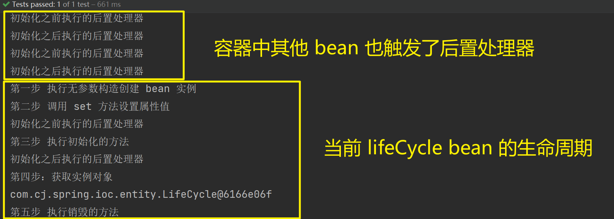

## xml 自动装配

### 什么是自动装配？

根据指定装配规则（属性名称或者属性类型），Spring 自动将匹配的属性值进行注入

### 演示自动装配过程

#### 根据属性名称自动注入

```xml
<bean id="emp3" class="com.cj.spring.ioc.entity.Emp" autowire="byName">
    <!--
        对外部 bean 就可以不用引用了，通过 Emp 中 dept 这个属性名称
        自动在 spring 容器中找到 dept 这个 bean 并且自动注入
    -->
    <!--<property name="dept" ref="dept3"/>-->
</bean>
<bean id="dept" class="com.cj.spring.ioc.entity.Dept"/>
```

#### 根据属性类型自动注入

```xml
<!-- 根据属性类型注入 -->
<bean id="emp4" class="com.cj.spring.ioc.entity.Emp" autowire="byType">
    <!--
       对外部 bean 就可以不用引用了，通过 Emp 中 dept 这个属性的类型
       自动在 spring 容器中找到 dept 这个类型的 bean 并且自动注入
       注意：spring 容器如果存在同类型的 bean 就会报错
   -->
    <!--<property name="dept" ref="dept4"/>-->
</bean>
<bean id="dept" class="com.cj.spring.ioc.entity.Dept"/>
```

## xml 引入外部属性文件

### 配置数据库信息

引入德鲁伊连接池依赖 jar 包

```xml
<!--druid-->
<dependency>
    <groupId>com.alibaba</groupId>
    <artifactId>druid</artifactId>
    <version>1.2.8</version>
</dependency>
```

#### 直接配置数据库连接池

```xml
<!--直接配置连接池-->
<bean id="dataSource" class="com.alibaba.druid.pool.DruidDataSource">
    <property name="driverClassName" value="com.mysql.jdbc.Driver"/>
    <property name="url" value="jdbc:mysql://localhost:3306/userDb"/>
    <property name="username" value="root"/>
    <property name="password" value="root"/>
</bean>
```

#### 引入外部属性文件配置数据库连接池

创建外部属性文件，jdbc.properties 文件，写数据库信息

```properties
driverClassName=com.cj.mysql.jdbc.Driver
url=jdbc:mysql://127.0.0.1:3306/db1
username=root
password=123456
initialSize=5
maxActive=10
maxWait=3000
```

把外部 properties 属性文件引入到 spring 配置文件中，需要先引入 context 名称 kong

```xml {6,11-12}
<?xml version="1.0" encoding="UTF-8"?>
<beans xmlns="http://www.springframework.org/schema/beans"
       xmlns:xsi="http://www.w3.org/2001/XMLSchema-instance"
       xmlns:p="http://www.springframework.org/schema/p"
       xmlns:util="http://www.springframework.org/schema/util"
       xmlns:context="http://www.springframework.org/schema/context"
       xsi:schemaLocation="http://www.springframework.org/schema/beans
        https://www.springframework.org/schema/beans/spring-beans.xsd
        http://www.springframework.org/schema/util
        http://www.springframework.org/schema/util/spring-util.xsd 
        http://www.springframework.org/schema/context 
        https://www.springframework.org/schema/context/spring-context.xsd">
```

在 spring 配置文件使用标签引入外部属性文件

```xml
<!--引入外部属性文件-->
<context:property-placeholder location="classpath:jdbc.properties"/>
<!--配置连接池-->
<bean id="dataSource" class="com.alibaba.druid.pool.DruidDataSource">
    <property name="driverClassName" value="${driverClassName}"/>
    <property name="url" value="${url}"/>
    <property name="username" value="${username}"/>
    <property name="password" value="${password}"/>
</bean>
```

## 基于注解方式的 Bean 管理

### 什么是注解？

- 注解是代码特殊标记，格式：@注解名称 (属性名称=属性值，属性名称=属性值..)
- 使用注解，注解作用在类上面，方法上面，属性上面
- 使用注解目的：简化 xml 配置

### ✨Spring 针对 Bean 管理中创建对象提供注解

1. @Component(value = "xxx") == `<bean id="xxx" class="com.cj.pojo.xxx">`
2. @Service(value = "xxx") == `<bean id="xxx" class="com.cj.service.xxx">`
3. @Controller(value = "xxx") == `<bean id="xxx" class="com.cj.controller.xxx">`
4. @Repository(value = "xxx") == `<bean id="xxx" class="com.cj.dao.xxx">`

以上四个注解实际功能一样，只是为了分层 (service,controller,dao)

注解中的 value 值可以省略，默认是类名首字母小写，相当于原先 Bean 标签中的 id 值

### ✨Spring 针对 Bean 管理中注入属性提供注解

1. @Autowired：根据**属性类型**进行自动装配
2. @Qualifier：根据**属性名称**进行注入，需要和上面@Autowired 一起使用
3. @Resource：可以根据**属性类型**注入，也可以根据**属性名称**注入
4. @Value：注入普通类型属性

### 基于注解方式实现对象创建

#### 第一步：引入依赖

- org.springframework:spring-aop:5.3.17

因为之前引入的 org.springframework:spring-context:5.3.17  包含了 aop 这个包，因此此处略过

#### 第二步：开启组件扫描

```xml
<!-- 开启组件扫描器 -->
<context:component-scan base-package="com.cj.spring.ioc.*"/>
```

#### 第三步：创建类，在类上面添加创建对象注解

```java
@Component(value = "users") // <bean id="users" class="com.cj.spring.ioc.entity.Users">
public class Users {
    public void add() {
        System.out.println("service add.......");
    }
}
```

#### 第四步：组件扫描器细节配置

- use-default-filters="false" 表示现在不使用默认 filter，自己配置 filter    
- context:include-filter，设置扫描哪些内容，这里是只扫描带 @Controller 注解类
- context:exclude-filter：设置不扫描哪些内容，这里是不扫描带 @Controller 注解类

```xml
<!-- 组件扫描细节配置 -->
<!--
     use-default-filters="false" 表示现在不使用默认 filter，自己配置 filter
     context:include-filter ，设置扫描哪些内容 这里是只扫描带 @Controller 注解类
-->
<context:component-scan base-package="com.cj" use-default-filters="false">
    <context:include-filter type="annotation"
                            expression="org.springframework.stereotype.Controller"/>
</context:component-scan>

<!--
 下面配置扫描包所有内容 
 context:exclude-filter： 设置哪些内容不进行扫描 这里是只扫描带 @Controller 注解类
-->
<context:component-scan base-package="com.cj">
    <context:exclude-filter type="annotation"
                            expression="org.springframework.stereotype.Controller"/>
</context:component-scan>
```

#### 第五步：基于注解方式实现属性注入

```java
@Service
public class UsersService {

    @Autowired
    //不需要添加 set 方法
    private UsersDao usersDao;

    public void add() {
        System.out.println("service add...............");
        System.out.println(usersDao);
        usersDao.update();
    }
}
```

#### 第六步：编写测试类

```java
// 注解方式
@Test
public void test17() {
    /*加载配置文件*/
    ApplicationContext context = new ClassPathXmlApplicationContext("bean.xml");
    UsersService usersService = context.getBean(UsersService.class);
    usersService.add();
}
```

运行结果：

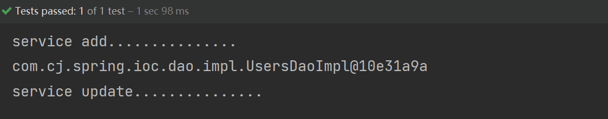

## ✨完全注解开发

通过 java 注解方式和配置类完全代替 applicationContext.xml 配置文件

1. @Configuration：注册为 spring 配置类
2. @ComponentScan：组件扫描器
3. @Bean：使用在方法上，方法的返回值被 spring 容器管理
4. @PropertySource：加载配置文件
5. @Import：导入其他配置类

```java
@Configuration // 作为配置类，代替 xml 配置文件
@ComponentScan(basePackages = "com.cj.spring.*")
@PropertySource("classpath:jdbc.properties") // 这是加载配置文件的注解
@EnableAspectJAutoProxy(proxyTargetClass = true)// 开启 AspectJ 注解配置
public class SpringConfig {

    @Value("${driverClassName}")
    private String driver;
    @Value("${url}")
    private String url;
    @Value("${username}")
    private String username;
    @Value("${password}")
    private String password;

    @Bean("dataSource")  // Spring 会将当前方法的返回值以指定名称（dataSource）存储到 Spring 容器中
    public DataSource getDataSource() throws PropertyVetoException {
        System.out.println(driver + url + username + password);
        DruidDataSource dataSource = new DruidDataSource();
        dataSource.setDriverClassName(driver);
        dataSource.setUrl(url);
        dataSource.setUsername(username);
        dataSource.setPassword(password);
        return dataSource;
    }
    
}
```
