# AOP 概念和原理

## 前置知识--代理模式

### 静态代理

静态代理实现原理：被代理类和代理类都实现接口，代理类对方法重写并增强，代理类传入被代理类并调用增强方法

```java
//定义一个接口
interface Person {
    void doWork();
}

//定义一个被代理类
class Student implements Person {
    @Override
    public void doWork() {
        System.out.println("学生学习");
    }
}

//再定义一个被代理类
class Driver implements Person {

    @Override
    public void doWork() {
        System.out.println("司机开车");
    }
}

//定义一个代理类
class StaticProxy implements Person {
    private Person person = null;

    public StaticProxy(Person person) {
        this.person = person;
    }

    // 增强方法
    @Override
    public void doWork() {
        System.out.println("执行方法前");
        person.doWork();
        System.out.println("执行方法后");
    }
}

//测试静态代理
public class StaticProxyTest {
    public static void main(String[] args) {
        StaticProxy student = new StaticProxy(new Student());
        student.doWork();
        StaticProxy driver = new StaticProxy(new Driver());
        driver.doWork();
    }
}
```

运行结果：

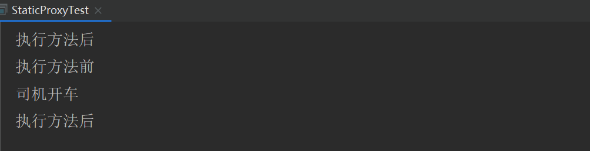

缺点：静态代理确实实现了解耦，但是由于代码都写死了，完全不具备任何的灵活性。就拿日志功能来说，将来其他地方也需要附加日志，那还得再声明更多个静态代理类，那就产生了大量重复的代码，日志功能还是分散的，没有统一管理。

### JDK 动态代理

- 利用反射机制，创建代理类对象，并动态的指定要功能增强的类
- 必须要有接口，因为 Java 不支持多继承

#### 原理图

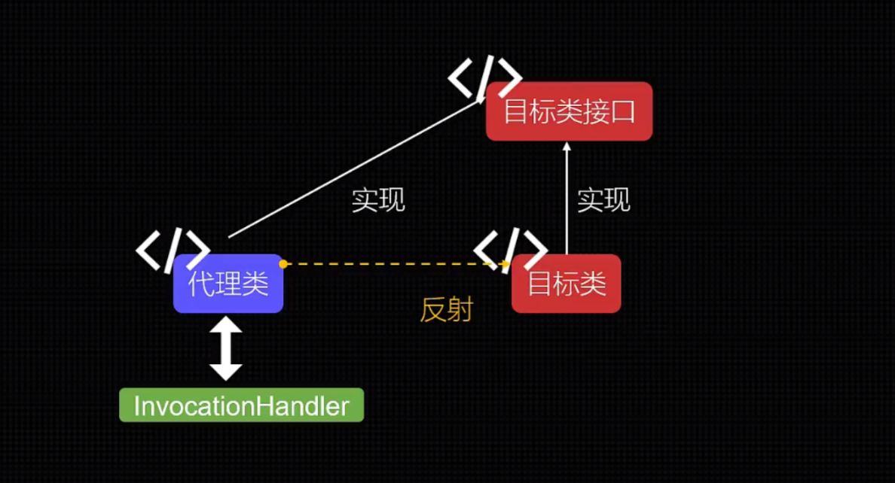

#### 代码实现

```java
//定义一个接口
interface Person {
    void doWork();
}

//定义一个被代理类
class Student implements Person {
    @Override
    public void doWork() {
        System.out.println("学生学习");
    }
}

//再定义一个被代理类
class Driver implements Person {
    @Override
    public void doWork() {
        System.out.println("司机开车");
    }
}

/**
 * 实现动态代理解决的问题
 * 1.如何根据加载到内存中的被代理类，动态的创建一个代理类及其对象
 * 2.当通过代理类的对象调用方法时，如何动态的去调用被代理类中的同名方法
 */
//定义一个代理类
class JDKProxy {
    //调用此方法返回一个代理类对象
    public static Object getProxyInstance(Object obj) { //传入一个被代理类对象
        MyInvocationHandler handler = new MyInvocationHandler(obj);
        return Proxy.newProxyInstance(
                obj.getClass().getClassLoader(),
                obj.getClass().getInterfaces(),
                handler
        );
    }
}

//定义一个调用处理程序
class MyInvocationHandler implements InvocationHandler {
    private Object object;//需要被代理类的对象赋值

    public MyInvocationHandler(Object object) {
        this.object = object;
    }

    //当通过代理类的对象，调用被代理类方法时会自动调用 invoke() 方法
    //将被代理类要执行的方法声明再 invoke() 中
    @Override
    public Object invoke(Object proxy, Method method, Object[] args) throws Throwable {
        System.out.println("执行方法前" + new Date().getTime());
        Object returnVal = method.invoke(object, args); // 代理类对象调用的方法
        System.out.println("执行方法后" + new Date().getTime());
        return returnVal;
    }
}

//测试 JDK 动态代理
public class JDKProxyTest {
    public static void main(String[] args) {
        // 打印反编译文件到根目录
        System.getProperties().put("sun.misc.ProxyGenerator.saveGeneratedFiles", "true");

        // 实现类对象
        Student student = new Student();

        // 方式一：封装方法
        // 代理类的对象
        Person proxyInstance = (Person) JDKProxy.getProxyInstance(student);
        proxyInstance.doWork();

        //方式二：不封装方法
        Person person = (Person) Proxy.newProxyInstance(
                student.getClass().getClassLoader(),
                student.getClass().getInterfaces(),
                new MyInvocationHandler(student));
        person.doWork();
    }
}
```

运行结果：

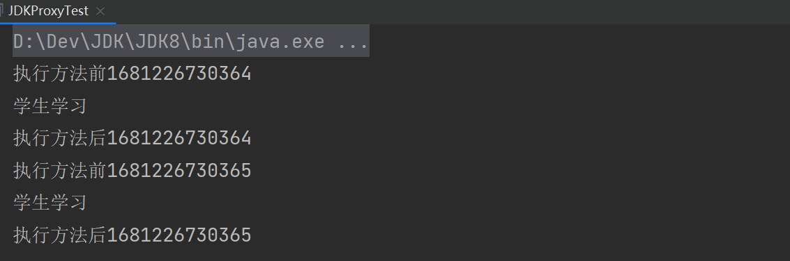

JDK 动态代理的缺陷：java 是单继承，因为 JDK 动态代理已经继承了 Proxy 类，因此无法再继承

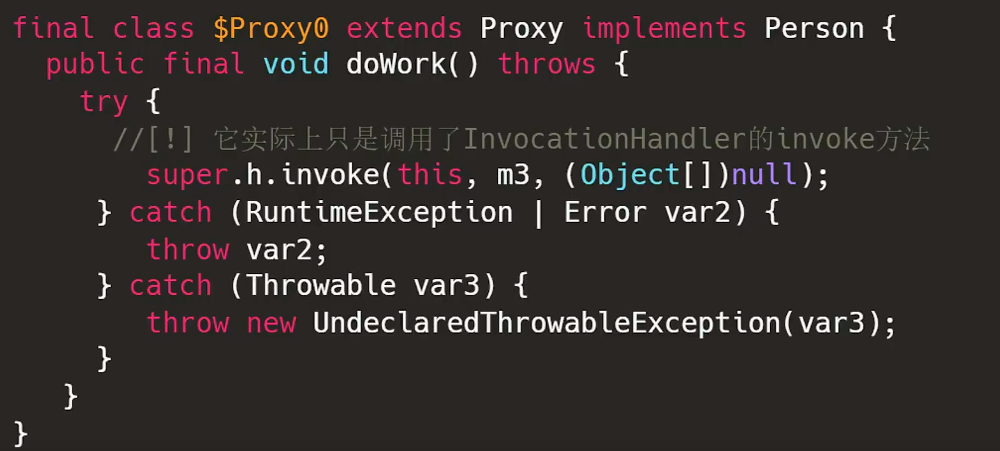

### CGLIB 动态代理

CGLIB 原理：动态生成一个被代理类的子类，子类重写被代理的类的所有不是 final 的方法。在子类中采用方法拦截的技术拦截所有父类方法的调用，顺势织入横切逻辑。它比使用 java 反射的 JDK 动态代理要快。

CGLIB 底层：使用字节码处理框架 ASM，来转换字节码并生成新的类。不鼓励直接使用 ASM，因为它要求你必须对 JVM 内部结构包括 class 文件的格式和指令集都很熟悉。

CGLIB 缺点：对于 final 方法，无法进行代理。

#### 原理图

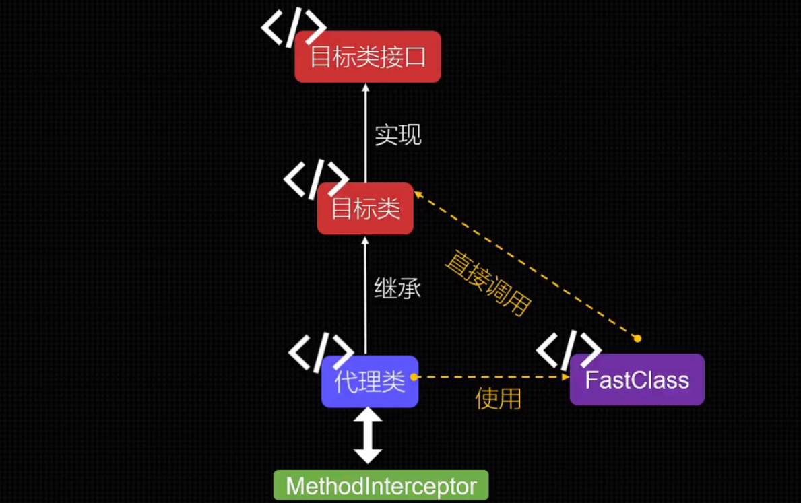

#### 代码实现

```java
// 定义一个被代理类的父类
class Vehicle {
    public void driver() {
        System.out.println("驾驶");
    }
}

// 定义一个被代理类
class Car extends Vehicle {

    @Override
    public void driver() {
        System.out.println("汽车驾驶");
    }

    public void playMusic() {
        System.out.println("播放音乐");
    }
}

// 回调处理函数
class MyMethod implements MethodInterceptor {
    //MethodProxy 作为桥梁连接 fast class
    @Override
    public Object intercept(Object o, Method method, Object[] objects, MethodProxy methodProxy) throws Throwable {
        System.out.println("方法执行前");
        // 执行目标方法
        Object object = methodProxy.invokeSuper(o, objects);
        System.out.println("方法执行后");
        return object;
    }
}

public class CglibProxyTest {
    public static Object createProxy(Class targetClass, MethodInterceptor m) {
        // 定义一个代理类
        Enhancer enhancer = new Enhancer();// 增强剂
        enhancer.setSuperclass(targetClass);// 设置超类
        enhancer.setCallback(m);// 设置回调
        return enhancer.create();
    }

    public static void main(String[] args) {
        System.setProperty(DebuggingClassWriter.DEBUG_LOCATION_PROPERTY, "E:\\IDEA-WorkSpace\\DevFrames\\Spring\\03.spring-aop\\src\\main\\java\\com\\cj\\spring\\aop\\proxy\\cglibproxy");
        Car car = (Car) createProxy(Car.class, new MyMethod());
        car.playMusic();
    }
}
```

运行结果：

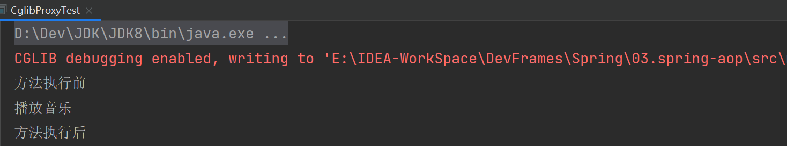

#### 代理类创建流程源码分析

##### 流程分析

> 执行 enhancer.create() 方法后会返回一个增强的代理对象，流程如下图所示
>
> 原理如下：通过 Enhancer 这个类包装了被代理类和回调函数，中途通过 ASM 字节码技术对被代理类重写和增强，生成被代理类的子类（也就是代理类），然后将回调函数通过 invoke 反射将自定义的回调函数添加到 CGLIB$THREAD_CALLBACKS 本地线程中，再通过静态工具类生成代理类的实例对象，同时代理类中的静态代码块也会执行，生成一个个的 MethodProxy 对象

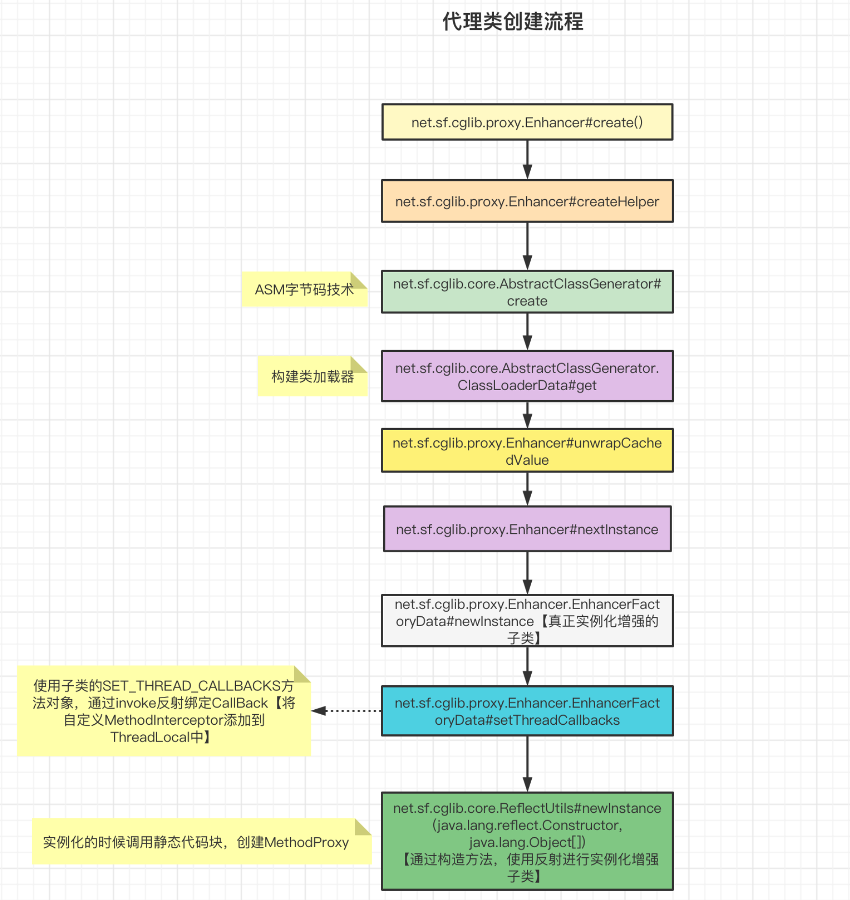

##### Car$$EnhancerByCGLIB$$a88edc05 源码（代理类）

> 从这个类中我们可以看出，通过继承被代理类生成一个子类（也就是代理），通过反射获取代理类中所有非 final 的方法，并对所有方法进行重写，相当于注入了一个拦截器，由这个拦截器执行目标方法和前后置通知

```java
//
// Source code recreated from a .class file by IntelliJ IDEA
// (powered by FernFlower decompiler)
//

package com.cj.spring.aop.proxy.cglibproxy;

import java.lang.reflect.Method;
import org.springframework.cglib.core.ReflectUtils;
import org.springframework.cglib.core.Signature;
import org.springframework.cglib.proxy.Callback;
import org.springframework.cglib.proxy.Factory;
import org.springframework.cglib.proxy.MethodInterceptor;
import org.springframework.cglib.proxy.MethodProxy;

// 实现 net.sf.cglib.proxy.Factory 的目的是提供一些创建代理对象实例的工厂方法，
// 这些方法会比反射 (clazz.newInstance()) 创建对象快
public class Car$$EnhancerByCGLIB$$a88edc05 extends Car implements Factory {
    private boolean CGLIB$BOUND;
    public static Object CGLIB$FACTORY_DATA;
    private static final ThreadLocal CGLIB$THREAD_CALLBACKS;
    private static final Callback[] CGLIB$STATIC_CALLBACKS;
    private MethodInterceptor CGLIB$CALLBACK_0;
    private static Object CGLIB$CALLBACK_FILTER;
    // 播放音乐的方法对象
    private static final Method CGLIB$playMusic$0$Method;
    // 播放音乐的方法代理对象
    private static final MethodProxy CGLIB$playMusic$0$Proxy;
    private static final Object[] CGLIB$emptyArgs;
    private static final Method CGLIB$driver$1$Method;
    private static final MethodProxy CGLIB$driver$1$Proxy;
    // 以下是对 Object 的方法也进行了创建（equals、toString、hashCode、clone）
    private static final Method CGLIB$equals$2$Method;
    private static final MethodProxy CGLIB$equals$2$Proxy;
    private static final Method CGLIB$toString$3$Method;
    private static final MethodProxy CGLIB$toString$3$Proxy;
    private static final Method CGLIB$hashCode$4$Method;
    private static final MethodProxy CGLIB$hashCode$4$Proxy;
    private static final Method CGLIB$clone$5$Method;
    private static final MethodProxy CGLIB$clone$5$Proxy;

    // 生成 Car 的代理对象，并且为每一个非 final 的方法都创建一个方法代理对象
    static void CGLIB$STATICHOOK1() {
        CGLIB$THREAD_CALLBACKS = new ThreadLocal();
        CGLIB$emptyArgs = new Object[0];
        // 生成 Car 的代理对象
        Class var0 = Class.forName("com.cj.spring.aop.proxy.cglibproxy.Car$$EnhancerByCGLIB$$a88edc05");
        Class var1;
        // 通过反射获取 Object 类的 Method 对象
        Method[] var10000 = ReflectUtils.findMethods(new String[]{"equals", "(Ljava/lang/Object;)Z", "toString", "()Ljava/lang/String;", "hashCode", "()I", "clone", "()Ljava/lang/Object;"}, (var1 = Class.forName("java.lang.Object")).getDeclaredMethods());
        CGLIB$equals$2$Method = var10000[0];
        // 创建代理对象方法
        CGLIB$equals$2$Proxy = MethodProxy.create(var1, var0, "(Ljava/lang/Object;)Z", "equals", "CGLIB$equals$2");
        CGLIB$toString$3$Method = var10000[1];
        CGLIB$toString$3$Proxy = MethodProxy.create(var1, var0, "()Ljava/lang/String;", "toString", "CGLIB$toString$3");
        CGLIB$hashCode$4$Method = var10000[2];
        CGLIB$hashCode$4$Proxy = MethodProxy.create(var1, var0, "()I", "hashCode", "CGLIB$hashCode$4");
        CGLIB$clone$5$Method = var10000[3];
        CGLIB$clone$5$Proxy = MethodProxy.create(var1, var0, "()Ljava/lang/Object;", "clone", "CGLIB$clone$5");
        var10000 = ReflectUtils.findMethods(new String[]{"playMusic", "()V", "driver", "()V"}, (var1 = Class.forName("com.cj.spring.aop.proxy.cglibproxy.Car")).getDeclaredMethods());
        CGLIB$playMusic$0$Method = var10000[0];
        CGLIB$playMusic$0$Proxy = MethodProxy.create(var1, var0, "()V", "playMusic", "CGLIB$playMusic$0");
        CGLIB$driver$1$Method = var10000[1];
        CGLIB$driver$1$Proxy = MethodProxy.create(var1, var0, "()V", "driver", "CGLIB$driver$1");
    }

    final void CGLIB$playMusic$0() {
        super.playMusic();
    }

    // 重写 Car 类的 playMusic 方法，
    // 添加 CallBack 回调
    //【即执行 MethodInterceptor 的 intercept 方法，即我们自定义的 CglibMethodInterceptor 的 intercept 方法】
    public final void playMusic() {
        MethodInterceptor var10000 = this.CGLIB$CALLBACK_0;
        if (var10000 == null) {
            CGLIB$BIND_CALLBACKS(this);
            var10000 = this.CGLIB$CALLBACK_0;
        }

        if (var10000 != null) {
            // 执行 intercept 方法
            // intercept(Object o, Method method, Object[] objects, MethodProxy methodProxy)
            // this 指的就是 Car$$EnhancerByCGLIB$$a88edc05 代理对象
            // CGLIB$playMusic$0$Method 就是 Car 中的非 final 的方法
            // GLIB$emptyArgs 就是方法参数
            // CGLIB$playMusic$0$Proxy 就是代理方法，
             // 反射也可以调用目标方法
        	  // method.invoke()
        	  // 反射的代理类方法也可以调用目标方法，速度会比反射快
        	  //methodProxy.invokeSuper(o, objects);
            var10000.intercept(this, CGLIB$playMusic$0$Method, CGLIB$emptyArgs, CGLIB$playMusic$0$Proxy);
        } else {
            super.playMusic();
        }
    }

    final void CGLIB$driver$1() {
        super.driver();
    }

    public final void driver() {
        MethodInterceptor var10000 = this.CGLIB$CALLBACK_0;
        if (var10000 == null) {
            CGLIB$BIND_CALLBACKS(this);
            var10000 = this.CGLIB$CALLBACK_0;
        }

        if (var10000 != null) {
            var10000.intercept(this, CGLIB$driver$1$Method, CGLIB$emptyArgs, CGLIB$driver$1$Proxy);
        } else {
            super.driver();
        }
    }

    final boolean CGLIB$equals$2(Object var1) {
        return super.equals(var1);
    }

    public final boolean equals(Object var1) {
        MethodInterceptor var10000 = this.CGLIB$CALLBACK_0;
        if (var10000 == null) {
            CGLIB$BIND_CALLBACKS(this);
            var10000 = this.CGLIB$CALLBACK_0;
        }

        if (var10000 != null) {
            Object var2 = var10000.intercept(this, CGLIB$equals$2$Method, new Object[]{var1}, CGLIB$equals$2$Proxy);
            return var2 == null ? false : (Boolean)var2;
        } else {
            return super.equals(var1);
        }
    }

    final String CGLIB$toString$3() {
        return super.toString();
    }

    public final String toString() {
        MethodInterceptor var10000 = this.CGLIB$CALLBACK_0;
        if (var10000 == null) {
            CGLIB$BIND_CALLBACKS(this);
            var10000 = this.CGLIB$CALLBACK_0;
        }

        return var10000 != null ? (String)var10000.intercept(this, CGLIB$toString$3$Method, CGLIB$emptyArgs, CGLIB$toString$3$Proxy) : super.toString();
    }

    final int CGLIB$hashCode$4() {
        return super.hashCode();
    }

    public final int hashCode() {
        MethodInterceptor var10000 = this.CGLIB$CALLBACK_0;
        if (var10000 == null) {
            CGLIB$BIND_CALLBACKS(this);
            var10000 = this.CGLIB$CALLBACK_0;
        }

        if (var10000 != null) {
            Object var1 = var10000.intercept(this, CGLIB$hashCode$4$Method, CGLIB$emptyArgs, CGLIB$hashCode$4$Proxy);
            return var1 == null ? 0 : ((Number)var1).intValue();
        } else {
            return super.hashCode();
        }
    }

    final Object CGLIB$clone$5() throws CloneNotSupportedException {
        return super.clone();
    }

    protected final Object clone() throws CloneNotSupportedException {
        MethodInterceptor var10000 = this.CGLIB$CALLBACK_0;
        if (var10000 == null) {
            CGLIB$BIND_CALLBACKS(this);
            var10000 = this.CGLIB$CALLBACK_0;
        }

        return var10000 != null ? var10000.intercept(this, CGLIB$clone$5$Method, CGLIB$emptyArgs, CGLIB$clone$5$Proxy) : super.clone();
    }

    public static MethodProxy CGLIB$findMethodProxy(Signature var0) {
        String var10000 = var0.toString();
        switch(var10000.hashCode()) {
        case -1366347187:
            if (var10000.equals("driver()V")) {
                return CGLIB$driver$1$Proxy;
            }
            break;
        case -508378822:
            if (var10000.equals("clone()Ljava/lang/Object;")) {
                return CGLIB$clone$5$Proxy;
            }
            break;
        case 143014532:
            if (var10000.equals("playMusic()V")) {
                return CGLIB$playMusic$0$Proxy;
            }
            break;
        case 1826985398:
            if (var10000.equals("equals(Ljava/lang/Object;)Z")) {
                return CGLIB$equals$2$Proxy;
            }
            break;
        case 1913648695:
            if (var10000.equals("toString()Ljava/lang/String;")) {
                return CGLIB$toString$3$Proxy;
            }
            break;
        case 1984935277:
            if (var10000.equals("hashCode()I")) {
                return CGLIB$hashCode$4$Proxy;
            }
        }

        return null;
    }

    // 以下是构造器等等，绑定回调函数
    public Car$$EnhancerByCGLIB$$a88edc05() {
        CGLIB$BIND_CALLBACKS(this);
    }

    // 代理对象初始化的时候会调用这个方法 CGLIB$SET_THREAD_CALLBACKS
    // 会为回调函数这个变量进行赋值
    public static void CGLIB$SET_THREAD_CALLBACKS(Callback[] var0) {
        CGLIB$THREAD_CALLBACKS.set(var0);
    }

    public static void CGLIB$SET_STATIC_CALLBACKS(Callback[] var0) {
        CGLIB$STATIC_CALLBACKS = var0;
    }

    // 绑定回调函数
    private static final void CGLIB$BIND_CALLBACKS(Object var0) {
        Car$$EnhancerByCGLIB$$a88edc05 var1 = (Car$$EnhancerByCGLIB$$a88edc05)var0;
        if (!var1.CGLIB$BOUND) {
            var1.CGLIB$BOUND = true;
            Object var10000 = CGLIB$THREAD_CALLBACKS.get();
            if (var10000 == null) {
                var10000 = CGLIB$STATIC_CALLBACKS;
                if (var10000 == null) {
                    return;
                }
            }

            var1.CGLIB$CALLBACK_0 = (MethodInterceptor)((Callback[])var10000)[0];
        }

    }

    // 创建实例
    public Object newInstance(Callback[] var1) {
        CGLIB$SET_THREAD_CALLBACKS(var1);
        Car$$EnhancerByCGLIB$$a88edc05 var10000 = new Car$$EnhancerByCGLIB$$a88edc05();
        CGLIB$SET_THREAD_CALLBACKS((Callback[])null);
        return var10000;
    }

    // 创建实例
    public Object newInstance(Callback var1) {
        CGLIB$SET_THREAD_CALLBACKS(new Callback[]{var1});
        Car$$EnhancerByCGLIB$$a88edc05 var10000 = new Car$$EnhancerByCGLIB$$a88edc05();
        CGLIB$SET_THREAD_CALLBACKS((Callback[])null);
        return var10000;
    }

    // 创建实例
    public Object newInstance(Class[] var1, Object[] var2, Callback[] var3) {
        CGLIB$SET_THREAD_CALLBACKS(var3);
        Car$$EnhancerByCGLIB$$a88edc05 var10000 = new Car$$EnhancerByCGLIB$$a88edc05;
        switch(var1.length) {
        case 0:
            var10000.<init>();
            CGLIB$SET_THREAD_CALLBACKS((Callback[])null);
            return var10000;
        default:
            throw new IllegalArgumentException("Constructor not found");
        }
    }

    // 以下是 get、set 方法
    public Callback getCallback(int var1) {
        CGLIB$BIND_CALLBACKS(this);
        MethodInterceptor var10000;
        switch(var1) {
        case 0:
            var10000 = this.CGLIB$CALLBACK_0;
            break;
        default:
            var10000 = null;
        }

        return var10000;
    }

    public void setCallback(int var1, Callback var2) {
        switch(var1) {
        case 0:
            this.CGLIB$CALLBACK_0 = (MethodInterceptor)var2;
        default:
        }
    }

    public Callback[] getCallbacks() {
        CGLIB$BIND_CALLBACKS(this);
        return new Callback[]{this.CGLIB$CALLBACK_0};
    }

    public void setCallbacks(Callback[] var1) {
        this.CGLIB$CALLBACK_0 = (MethodInterceptor)var1[0];
    }

    static {
        CGLIB$STATICHOOK1();
    }
}
```

##### EnhancerFactoryData.newInstance() 源码

> 该类是正则实例化增强的子类

```java
// 最终会将回调函数绑定到本地线程，通过反射生成实例化增强的子类
public Object newInstance(Class[] argumentTypes, Object[] arguments, Callback[] callbacks) {
    this.setThreadCallbacks(callbacks);

    Object var4;
    try {
        if (this.primaryConstructorArgTypes == argumentTypes || Arrays.equals(this.primaryConstructorArgTypes, argumentTypes)) {
            var4 = ReflectUtils.newInstance(this.primaryConstructor, arguments);
            return var4;
        }

        var4 = ReflectUtils.newInstance(this.generatedClass, argumentTypes, arguments);
    } finally {
        this.setThreadCallbacks((Callback[])null);
    }

    return var4;
}
```

##### ReflectUtils.newInstance() 源码

>承接上面的代码，通过工具创建代理类的实例对象

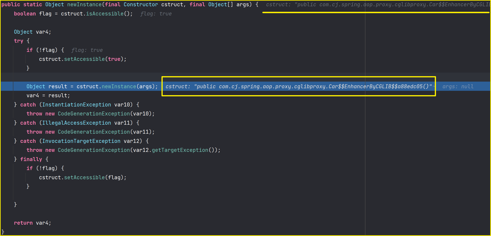

##### MethodProxy 源码

>MethodProxy 封装了被代理 Car 类的方法签名【sig1】，对应代理类方法的签名【sig2】以及代理类的一些创建信息【原始类和代理类的名称、类生成策略等等】

```java
public class MethodProxy 
    // MethodProxy 的成员变量
    private Signature sig1;
    private Signature sig2;
    private MethodProxy.CreateInfo createInfo;
    private final Object initLock = new Object();
    private volatile MethodProxy.FastClassInfo fastClassInfo;
```

##### MethodProxy.create() 源码

```java
/**
 * @param c1 被代理类
 * @param c2 代理类
 * @param desc 方法描述【"()Ljava/lang/String;"】
 * @param name1 方法 1 名称【"playMusic"】
 * @param name2 方法 2 名称【"CGLIB$playMusic$0"】
 */
public static MethodProxy create(Class c1, Class c2, String desc, String name1, String name2) {
    MethodProxy proxy = new MethodProxy();
    // 构建方法签名
    proxy.sig1 = new Signature(name1, desc);
    proxy.sig2 = new Signature(name2, desc);
    proxy.createInfo = new CreateInfo(c1, c2);
    return proxy;
}
```

##### CreateInfo 源码

> CreateInfo 是 MethodProxy 的一个内部类，主要保存代理类的一些创建信息。

```java
private static class CreateInfo {
    // 对应原始类
    Class c1;
    // 对应代理类
    Class c2;
    // 代理类命名策略
    NamingPolicy namingPolicy;
    // 代理类生成策略
    GeneratorStrategy strategy;
    boolean attemptLoad;

    public CreateInfo(Class c1, Class c2) {
        this.c1 = c1;
        this.c2 = c2;
        AbstractClassGenerator fromEnhancer = AbstractClassGenerator.getCurrent();
        if (fromEnhancer != null) {
            this.namingPolicy = fromEnhancer.getNamingPolicy();
            this.strategy = fromEnhancer.getStrategy();
            this.attemptLoad = fromEnhancer.getAttemptLoad();
        }

    }
}
```

#### 动态代理调用流程源码分析

##### 流程分析

参考[https://segmentfault.com/a/1190000041619989](https://segmentfault.com/a/1190000041619989)

> 当我们调用 car.playMusic() 方法时，其实就是调用代理类中的 playMusic() 方法，其实就是调用对应的拦截器中的方法，即 MyMethod 中的 intercept() 方法
>
> 接下来，在 MyMethod 的 intercept() 方法中调用的 `methodProxy.invokeSuper(object, args) `时，最终就会执行父类 Car 的 playMusic() 方法
>
> 在 init() 方法，主要是在处理 FastClass，FastClass 是什么？FastClass 是代理对象方法到被代理对象方法的映射

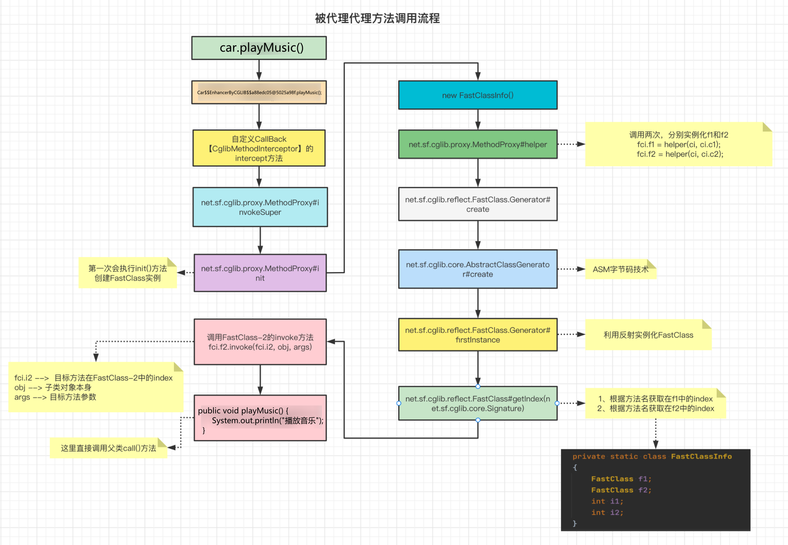

##### MethodProxy.invokeSuper() 源码

> 执行调用父类的原始方法

```java
public Object invokeSuper(Object obj, Object[] args) throws Throwable {
    try {
        // 初始化辅助数据
        init();
        FastClassInfo fci = fastClassInfo;
        return fci.f2.invoke(fci.i2, obj, args);
    } catch (InvocationTargetException e) {
        throw e.getTargetException();
    }
}
```

##### init 源码

> init() 方法只会在第一次被调用的时候去执行 FastClass 创建等操作
>
> init() 方法其实就是创建了两个 FastClass，然后建立 FastClass 到代理对象关于目标方法的索引。

```java
private void init() {
    if (this.fastClassInfo == null) {
        synchronized(this.initLock) {
            if (this.fastClassInfo == null) {
                // 获取代理类的创建信息
                MethodProxy.CreateInfo ci = this.createInfo;
                // 新建 FastClassInfo 对象
                MethodProxy.FastClassInfo fci = new MethodProxy.FastClassInfo();
                // 生成 FastClass f1，并赋值给 FastClassInfo 的成员属性，f1 是通过被代理类生成的
                fci.f1 = helper(ci, ci.c1); 
                // 生成 FastClass f2，并赋值给 FastClassInfo 的成员属性，f2 是通过代理类生成的
                fci.f2 = helper(ci, ci.c2);
                // 根据方法签名，获取被代理类中对应 playMusic 方法在 f1 中的索引
                fci.i1 = fci.f1.getIndex(this.sig1);
                // 根据方法签名，获取代理类中对应 playMusic 方法在 f2 中的索引
                fci.i2 = fci.f2.getIndex(this.sig2);
                this.fastClassInfo = fci;
                this.createInfo = null;
            }
        }
    }
}

/* 
 * FastClassInfo 也是 MethodProxy 的一个内部类
*/
private static class FastClassInfo
{
    // 对应前置准备中的 f1
    FastClass f1;
    // 对应前置准备中的 f2
    FastClass f2;
    int i1;
    int i2;
}
```

##### FastClass 源码（f1）

```java
//
// Source code recreated from a .class file by IntelliJ IDEA
// (powered by FernFlower decompiler)
//

package com.cj.spring.aop.proxy.cglibproxy;

import java.lang.reflect.InvocationTargetException;
import org.springframework.cglib.core.Signature;
import org.springframework.cglib.reflect.FastClass;

public class Car$$FastClassByCGLIB$$de28bc66 extends FastClass {
    public Car$$FastClassByCGLIB$$de28bc66(Class var1) {
        super(var1);
    }

    public int getIndex(Signature var1) {
        String var10000 = var1.toString();
        switch(var10000.hashCode()) {
        case -1366347187:
            if (var10000.equals("driver()V")) {
                return 1;
            }
            break;
        case 143014532:
            if (var10000.equals("playMusic()V")) {
                return 0;
            }
            break;
        case 1826985398:
            if (var10000.equals("equals(Ljava/lang/Object;)Z")) {
                return 2;
            }
            break;
        case 1913648695:
            if (var10000.equals("toString()Ljava/lang/String;")) {
                return 3;
            }
            break;
        case 1984935277:
            if (var10000.equals("hashCode()I")) {
                return 4;
            }
        }

        return -1;
    }

    public int getIndex(String var1, Class[] var2) {
        switch(var1.hashCode()) {
        case -1894100143:
            if (var1.equals("playMusic")) {
                switch(var2.length) {
                case 0:
                    return 0;
                }
            }
            break;
        case -1776922004:
            if (var1.equals("toString")) {
                switch(var2.length) {
                case 0:
                    return 3;
                }
            }
            break;
        case -1323526104:
            if (var1.equals("driver")) {
                switch(var2.length) {
                case 0:
                    return 1;
                }
            }
            break;
        case -1295482945:
            if (var1.equals("equals")) {
                switch(var2.length) {
                case 1:
                    if (var2[0].getName().equals("java.lang.Object")) {
                        return 2;
                    }
                }
            }
            break;
        case 147696667:
            if (var1.equals("hashCode")) {
                switch(var2.length) {
                case 0:
                    return 4;
                }
            }
        }

        return -1;
    }

    public int getIndex(Class[] var1) {
        switch(var1.length) {
        case 0:
            return 0;
        default:
            return -1;
        }
    }

    public Object invoke(int var1, Object var2, Object[] var3) throws InvocationTargetException {
        Car var10000 = (Car)var2;
        int var10001 = var1;

        try {
            switch(var10001) {
            case 0:
                var10000.playMusic();
                return null;
            case 1:
                var10000.driver();
                return null;
            case 2:
                return new Boolean(var10000.equals(var3[0]));
            case 3:
                return var10000.toString();
            case 4:
                return new Integer(var10000.hashCode());
            }
        } catch (Throwable var4) {
            throw new InvocationTargetException(var4);
        }

        throw new IllegalArgumentException("Cannot find matching method/constructor");
    }

    public Object newInstance(int var1, Object[] var2) throws InvocationTargetException {
        Car var10000 = new Car;
        Car var10001 = var10000;
        int var10002 = var1;

        try {
            switch(var10002) {
            case 0:
                var10001.<init>();
                return var10000;
            }
        } catch (Throwable var3) {
            throw new InvocationTargetException(var3);
        }

        throw new IllegalArgumentException("Cannot find matching method/constructor");
    }

    public int getMaxIndex() {
        return 4;
    }
}
```

##### FastClass 源码（f2）

```java
//
// Source code recreated from a .class file by IntelliJ IDEA
// (powered by FernFlower decompiler)
//

package com.cj.spring.aop.proxy.cglibproxy;

import com.cj.spring.aop.proxy.cglibproxy.Car..EnhancerByCGLIB..a88edc05;
import java.lang.reflect.InvocationTargetException;
import org.springframework.cglib.core.Signature;
import org.springframework.cglib.proxy.Callback;
import org.springframework.cglib.reflect.FastClass;

public class Car$$EnhancerByCGLIB$$a88edc05$$FastClassByCGLIB$$7ea297c8 extends FastClass {
    public Car$$EnhancerByCGLIB$$a88edc05$$FastClassByCGLIB$$7ea297c8(Class var1) {
        super(var1);
    }

    public int getIndex(Signature var1) {
        String var10000 = var1.toString();
        switch(var10000.hashCode()) {
        case -1870561232:
            if (var10000.equals("CGLIB$findMethodProxy(Lorg/springframework/cglib/core/Signature;)Lorg/springframework/cglib/proxy/MethodProxy;")) {
                return 8;
            }
            break;
        case -1745842178:
            if (var10000.equals("setCallbacks([Lorg/springframework/cglib/proxy/Callback;)V")) {
                return 14;
            }
            break;
        case -1687876611:
            if (var10000.equals("CGLIB$driver$1()V")) {
                return 12;
            }
            break;
        case -1641413109:
            if (var10000.equals("newInstance([Lorg/springframework/cglib/proxy/Callback;)Ljava/lang/Object;")) {
                return 20;
            }
            break;
        case -1457535688:
            if (var10000.equals("CGLIB$STATICHOOK1()V")) {
                return 6;
            }
            break;
        case -1411812934:
            if (var10000.equals("CGLIB$hashCode$4()I")) {
                return 13;
            }
            break;
        case -1366347187:
            if (var10000.equals("driver()V")) {
                return 15;
            }
            break;
        case -1034266769:
            if (var10000.equals("CGLIB$SET_STATIC_CALLBACKS([Lorg/springframework/cglib/proxy/Callback;)V")) {
                return 3;
            }
            break;
        case -1025895669:
            if (var10000.equals("CGLIB$SET_THREAD_CALLBACKS([Lorg/springframework/cglib/proxy/Callback;)V")) {
                return 2;
            }
            break;
        case -988317324:
            if (var10000.equals("newInstance([Ljava/lang/Class;[Ljava/lang/Object;[Lorg/springframework/cglib/proxy/Callback;)Ljava/lang/Object;")) {
                return 21;
            }
            break;
        case -813851077:
            if (var10000.equals("CGLIB$playMusic$0()V")) {
                return 7;
            }
            break;
        case -508378822:
            if (var10000.equals("clone()Ljava/lang/Object;")) {
                return 19;
            }
            break;
        case 143014532:
            if (var10000.equals("playMusic()V")) {
                return 1;
            }
            break;
        case 374345669:
            if (var10000.equals("CGLIB$equals$2(Ljava/lang/Object;)Z")) {
                return 11;
            }
            break;
        case 610042816:
            if (var10000.equals("newInstance(Lorg/springframework/cglib/proxy/Callback;)Ljava/lang/Object;")) {
                return 22;
            }
            break;
        case 1132856532:
            if (var10000.equals("getCallbacks()[Lorg/springframework/cglib/proxy/Callback;")) {
                return 5;
            }
            break;
        case 1246779367:
            if (var10000.equals("setCallback(ILorg/springframework/cglib/proxy/Callback;)V")) {
                return 0;
            }
            break;
        case 1364367423:
            if (var10000.equals("getCallback(I)Lorg/springframework/cglib/proxy/Callback;")) {
                return 4;
            }
            break;
        case 1517819849:
            if (var10000.equals("CGLIB$toString$3()Ljava/lang/String;")) {
                return 10;
            }
            break;
        case 1826985398:
            if (var10000.equals("equals(Ljava/lang/Object;)Z")) {
                return 16;
            }
            break;
        case 1913648695:
            if (var10000.equals("toString()Ljava/lang/String;")) {
                return 17;
            }
            break;
        case 1984935277:
            if (var10000.equals("hashCode()I")) {
                return 18;
            }
            break;
        case 2011844968:
            if (var10000.equals("CGLIB$clone$5()Ljava/lang/Object;")) {
                return 9;
            }
        }

        return -1;
    }

    public int getIndex(String var1, Class[] var2) {
        switch(var1.hashCode()) {
        case -2048826630:
            if (var1.equals("CGLIB$playMusic$0")) {
                switch(var2.length) {
                case 0:
                    return 7;
                }
            }
            break;
        case -1894100143:
            if (var1.equals("playMusic")) {
                switch(var2.length) {
                case 0:
                    return 1;
                }
            }
            break;
        case -1776922004:
            if (var1.equals("toString")) {
                switch(var2.length) {
                case 0:
                    return 17;
                }
            }
            break;
        case -1323526104:
            if (var1.equals("driver")) {
                switch(var2.length) {
                case 0:
                    return 15;
                }
            }
            break;
        case -1304650632:
            if (var1.equals("CGLIB$driver$1")) {
                switch(var2.length) {
                case 0:
                    return 12;
                }
            }
            break;
        case -1295482945:
            if (var1.equals("equals")) {
                switch(var2.length) {
                case 1:
                    if (var2[0].getName().equals("java.lang.Object")) {
                        return 16;
                    }
                }
            }
            break;
        case -1053468136:
            if (var1.equals("getCallbacks")) {
                switch(var2.length) {
                case 0:
                    return 5;
                }
            }
            break;
        case -124978608:
            if (var1.equals("CGLIB$equals$2")) {
                switch(var2.length) {
                case 1:
                    if (var2[0].getName().equals("java.lang.Object")) {
                        return 11;
                    }
                }
            }
            break;
        case -60403779:
            if (var1.equals("CGLIB$SET_STATIC_CALLBACKS")) {
                switch(var2.length) {
                case 1:
                    if (var2[0].getName().equals("[Lorg.springframework.cglib.proxy.Callback;")) {
                        return 3;
                    }
                }
            }
            break;
        case -29025554:
            if (var1.equals("CGLIB$hashCode$4")) {
                switch(var2.length) {
                case 0:
                    return 13;
                }
            }
            break;
        case 85179481:
            if (var1.equals("CGLIB$SET_THREAD_CALLBACKS")) {
                switch(var2.length) {
                case 1:
                    if (var2[0].getName().equals("[Lorg.springframework.cglib.proxy.Callback;")) {
                        return 2;
                    }
                }
            }
            break;
        case 94756189:
            if (var1.equals("clone")) {
                switch(var2.length) {
                case 0:
                    return 19;
                }
            }
            break;
        case 147696667:
            if (var1.equals("hashCode")) {
                switch(var2.length) {
                case 0:
                    return 18;
                }
            }
            break;
        case 161998109:
            if (var1.equals("CGLIB$STATICHOOK1")) {
                switch(var2.length) {
                case 0:
                    return 6;
                }
            }
            break;
        case 495524492:
            if (var1.equals("setCallbacks")) {
                switch(var2.length) {
                case 1:
                    if (var2[0].getName().equals("[Lorg.springframework.cglib.proxy.Callback;")) {
                        return 14;
                    }
                }
            }
            break;
        case 1154623345:
            if (var1.equals("CGLIB$findMethodProxy")) {
                switch(var2.length) {
                case 1:
                    if (var2[0].getName().equals("org.springframework.cglib.core.Signature")) {
                        return 8;
                    }
                }
            }
            break;
        case 1543336190:
            if (var1.equals("CGLIB$toString$3")) {
                switch(var2.length) {
                case 0:
                    return 10;
                }
            }
            break;
        case 1811874389:
            if (var1.equals("newInstance")) {
                switch(var2.length) {
                case 1:
                    String var10001 = var2[0].getName();
                    switch(var10001.hashCode()) {
                    case -1997738671:
                        if (var10001.equals("[Lorg.springframework.cglib.proxy.Callback;")) {
                            return 20;
                        }
                        break;
                    case 1364160985:
                        if (var10001.equals("org.springframework.cglib.proxy.Callback")) {
                            return 22;
                        }
                    }
                case 2:
                default:
                    break;
                case 3:
                    if (var2[0].getName().equals("[Ljava.lang.Class;") && var2[1].getName().equals("[Ljava.lang.Object;") && var2[2].getName().equals("[Lorg.springframework.cglib.proxy.Callback;")) {
                        return 21;
                    }
                }
            }
            break;
        case 1817099975:
            if (var1.equals("setCallback")) {
                switch(var2.length) {
                case 2:
                    if (var2[0].getName().equals("int") && var2[1].getName().equals("org.springframework.cglib.proxy.Callback")) {
                        return 0;
                    }
                }
            }
            break;
        case 1905679803:
            if (var1.equals("getCallback")) {
                switch(var2.length) {
                case 1:
                    if (var2[0].getName().equals("int")) {
                        return 4;
                    }
                }
            }
            break;
        case 1951977611:
            if (var1.equals("CGLIB$clone$5")) {
                switch(var2.length) {
                case 0:
                    return 9;
                }
            }
        }

        return -1;
    }

    public int getIndex(Class[] var1) {
        switch(var1.length) {
        case 0:
            return 0;
        default:
            return -1;
        }
    }

    public Object invoke(int var1, Object var2, Object[] var3) throws InvocationTargetException {
        a88edc05 var10000 = (a88edc05)var2;
        int var10001 = var1;

        try {
            switch(var10001) {
            case 0:
                var10000.setCallback(((Number)var3[0]).intValue(), (Callback)var3[1]);
                return null;
            case 1:
                var10000.playMusic();
                return null;
            case 2:
                a88edc05.CGLIB$SET_THREAD_CALLBACKS((Callback[])var3[0]);
                return null;
            case 3:
                a88edc05.CGLIB$SET_STATIC_CALLBACKS((Callback[])var3[0]);
                return null;
            case 4:
                return var10000.getCallback(((Number)var3[0]).intValue());
            case 5:
                return var10000.getCallbacks();
            case 6:
                a88edc05.CGLIB$STATICHOOK1();
                return null;
            case 7:
                var10000.CGLIB$playMusic$0();
                return null;
            case 8:
                return a88edc05.CGLIB$findMethodProxy((Signature)var3[0]);
            case 9:
                return var10000.CGLIB$clone$5();
            case 10:
                return var10000.CGLIB$toString$3();
            case 11:
                return new Boolean(var10000.CGLIB$equals$2(var3[0]));
            case 12:
                var10000.CGLIB$driver$1();
                return null;
            case 13:
                return new Integer(var10000.CGLIB$hashCode$4());
            case 14:
                var10000.setCallbacks((Callback[])var3[0]);
                return null;
            case 15:
                var10000.driver();
                return null;
            case 16:
                return new Boolean(var10000.equals(var3[0]));
            case 17:
                return var10000.toString();
            case 18:
                return new Integer(var10000.hashCode());
            case 19:
                return var10000.clone();
            case 20:
                return var10000.newInstance((Callback[])var3[0]);
            case 21:
                return var10000.newInstance((Class[])var3[0], (Object[])var3[1], (Callback[])var3[2]);
            case 22:
                return var10000.newInstance((Callback)var3[0]);
            }
        } catch (Throwable var4) {
            throw new InvocationTargetException(var4);
        }

        throw new IllegalArgumentException("Cannot find matching method/constructor");
    }

    public Object newInstance(int var1, Object[] var2) throws InvocationTargetException {
        a88edc05 var10000 = new a88edc05;
        a88edc05 var10001 = var10000;
        int var10002 = var1;

        try {
            switch(var10002) {
            case 0:
                var10001.<init>();
                return var10000;
            }
        } catch (Throwable var3) {
            throw new InvocationTargetException(var3);
        }

        throw new IllegalArgumentException("Cannot find matching method/constructor");
    }

    public int getMaxIndex() {
        return 22;
    }
}
```

##### fci.f2.invoke(fci.i2,obj,args) 源码（执行方法）

```java {6}
public Object invokeSuper(Object obj, Object[] args) throws Throwable {
    try {
        // 初始化辅助数据
        init();
        FastClassInfo fci = fastClassInfo;
        // 执行父类被代理方法
        return fci.f2.invoke(fci.i2, obj, args); //debug fci.i2 = 21
    } catch (InvocationTargetException e) {
        throw e.getTargetException();
    }
}
```

> 执行了 var10000.CGLIB$playMusic$0(); 方法，也就是父类的被代理类的方法

```java {57-59}
public Object invoke(int var1, Object var2, Object[] var3) throws InvocationTargetException {
    a88edc05 var10000 = (a88edc05)var2;
    int var10001 = var1;

    try {
        switch(var10001) {
        case 0:
            return new Boolean(var10000.equals(var3[0]));
        case 1:
            return var10000.toString();
        case 2:
            return new Integer(var10000.hashCode());
        case 3:
            return var10000.clone();
        case 4:
            return var10000.newInstance((Class[])var3[0], (Object[])var3[1], (Callback[])var3[2]);
        case 5:
            return var10000.newInstance((Callback[])var3[0]);
        case 6:
            return var10000.newInstance((Callback)var3[0]);
        case 7:
            return var10000.getCallback(((Number)var3[0]).intValue());
        case 8:
            return var10000.getCallbacks();
        case 9:
            var10000.playMusic();
            return null;
        case 10:
            var10000.setCallback(((Number)var3[0]).intValue(), (Callback)var3[1]);
            return null;
        case 11:
            var10000.setCallbacks((Callback[])var3[0]);
            return null;
        case 12:
            var10000.driver();
            return null;
        case 13:
            a88edc05.CGLIB$SET_STATIC_CALLBACKS((Callback[])var3[0]);
            return null;
        case 14:
            a88edc05.CGLIB$SET_THREAD_CALLBACKS((Callback[])var3[0]);
            return null;
        case 15:
            return var10000.CGLIB$toString$3();
        case 16:
            return new Integer(var10000.CGLIB$hashCode$4());
        case 17:
            return var10000.CGLIB$clone$5();
        case 18:
            var10000.CGLIB$driver$1();
            return null;
        case 19:
            return new Boolean(var10000.CGLIB$equals$2(var3[0]));
        case 20:
            a88edc05.CGLIB$STATICHOOK1();
            return null;
        case 21:
            var10000.CGLIB$playMusic$0();
            return null;
        case 22:
            return a88edc05.CGLIB$findMethodProxy((Signature)var3[0]);
        }
    } catch (Throwable var4) {
        throw new InvocationTargetException(var4);
    }

    throw new IllegalArgumentException("Cannot find matching method/constructor");
}
```

```java
// 就会在代理类中调用父类的方法
final void CGLIB$playMusic$0() {
    super.playMusic();
}
```

## 什么是 AOP？

### AOP 概述

AOP（Aspect Oriented Programming）是一种设计思想，是软件设计领域中的面向切面编程，它是面向对象编程的一种补充和完善，它以通过预编译方式和运行期动态代理方式实现，在不修改源代码的情况下，给程序动态统一添加额外功能的一种技术。利用 AOP 可以对业务逻辑的各个部分进行隔离，从而使得业务逻辑各部分之间的耦合度降低，提高程序的可重用性，同时提高了开发的效率。

### AOP 相关术语

#### 通知（Advice）

就是你想要增强的功能，也就是上面说的安全，事物，日志等

- 前置通知：在被代理的目标方法前执行
- 返回通知：在被代理的目标方法成功结束后执行
- 异常通知：在被代理的目标方法异常结束后执行
- 后置通知：在被代理的目标方法最终结束后执行
- 环绕通知：使用 try...catch...finally 结构围绕整个被代理的目标方法，包括上面四种通知对应的所有位置

#### 连接点（JoinPoint）

Spring 允许你使用通知的地方

#### 切入点（Pointcut）

实际去使用通知的地方

#### 切面（Aspect）

将通知设置到切入点的过程，称为切面，即方法增强的过程，是一个动作

#### 目标（target）

被代理的对象

#### 代理（proxy）

代理对象

#### 织入（weaving）

把切面应用到目标对象来创建新的代理对象的过程

### AOP 作用

- 简化代码：把方法中固定位置的重复的代码**抽取**出来，让被抽取的方法更专注于自己的核心功能，提高内聚性。

- 代码增强：把特定的功能封装到切面类中，看哪里有需要，就往上套，被**套用**了切面逻辑的方法就被切面给增强了。

## AOP 实现原理

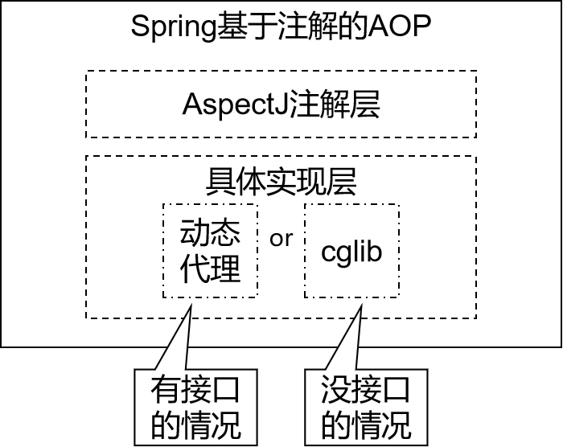


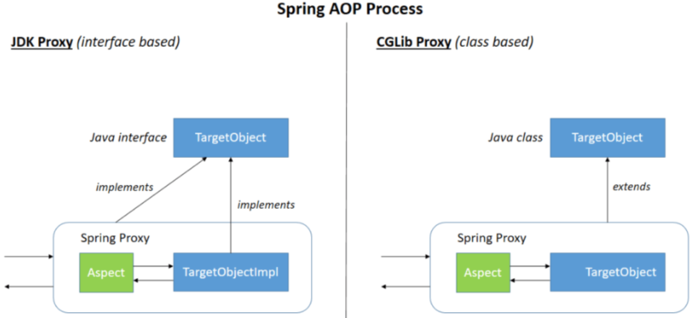

- 动态代理分为 JDK 动态代理和 cglib 动态代理
- 当目标类有接口的情况使用 JDK 动态代理和 cglib 动态代理，没有接口时只能使用 cglib 动态代理
- JDK 动态代理动态生成的代理类会在 com.sun.proxy 包下，类名为$proxy1，和目标类实现相同的接口
- cglib 动态代理动态生成的代理类会和目标在在相同的包下，会继承目标类
- 动态代理（InvocationHandler）：JDK 原生的实现方式，需要被代理的目标类必须实现接口。因为这个技术要求**代理对象和目标对象实现同样的接口**
- cglib：通过**继承被代理的目标类**实现代理，所以不需要目标类实现接口。
- AspectJ：是 AOP 思想的一种实现。本质上是静态代理，**将代理逻辑“织入”被代理的目标类编译得到的字节码文件**，所以最终效果是动态的。weaver 就是织入器。Spring 只是借用了 AspectJ 中的注解。

## 基于注解的 AOP

### 添加依赖

```xml
<?xml version="1.0" encoding="UTF-8"?>
<project xmlns="http://maven.apache.org/POM/4.0.0"
         xmlns:xsi="http://www.w3.org/2001/XMLSchema-instance"
         xsi:schemaLocation="http://maven.apache.org/POM/4.0.0 http://maven.apache.org/xsd/maven-4.0.0.xsd">
    <parent>
        <artifactId>Spring</artifactId>
        <groupId>com.cj</groupId>
        <version>1.0-SNAPSHOT</version>
    </parent>
    <modelVersion>4.0.0</modelVersion>

    <artifactId>03.spring-aop</artifactId>

    <properties>
        <maven.compiler.source>8</maven.compiler.source>
        <maven.compiler.target>8</maven.compiler.target>
    </properties>

    <dependencies>
        <dependency>
            <groupId>org.springframework</groupId>
            <artifactId>spring-context</artifactId>
            <version>5.3.17</version>
        </dependency>
        <dependency>
            <groupId>org.springframework</groupId>
            <artifactId>spring-aspects</artifactId>
            <version>5.3.17</version>
        </dependency>
        <!--spring对junit的支持相关依赖-->
        <dependency>
            <groupId>org.springframework</groupId>
            <artifactId>spring-test</artifactId>
            <version>5.3.17</version>
        </dependency>
        <!--junit5测试-->
        <dependency>
            <groupId>org.junit.jupiter</groupId>
            <artifactId>junit-jupiter-api</artifactId>
            <version>5.9.0</version>
        </dependency>
        <dependency>
            <groupId>junit</groupId>
            <artifactId>junit</artifactId>
            <version>4.13.2</version>
            <scope>test</scope>
        </dependency>
        <!--druid-->
        <dependency>
            <groupId>com.alibaba</groupId>
            <artifactId>druid</artifactId>
            <version>1.2.8</version>
        </dependency>
        <!--log4j2的依赖-->
        <dependency>
            <groupId>org.apache.logging.log4j</groupId>
            <artifactId>log4j-core</artifactId>
            <version>2.19.0</version>
        </dependency>
        <dependency>
            <groupId>org.apache.logging.log4j</groupId>
            <artifactId>log4j-slf4j2-impl</artifactId>
            <version>2.19.0</version>
        </dependency>
    </dependencies>

</project>
```

### 配置类

```java
@Configuration // 作为配置类，代替 xml 配置文件
@ComponentScan(basePackages = "com.cj.spring.*")
@EnableAspectJAutoProxy(proxyTargetClass = true)// 开启 AspectJ 注解配置
public class SpringConfig {
}
```

### 被代理类

```java
//被代理类
@Component
public class UserTarget {
    public void add() {
        System.out.println("add......");
    }
}
```

### 代理类

```java
package com.cj.spring.aop.aspectj;

import org.aspectj.lang.ProceedingJoinPoint;
import org.aspectj.lang.annotation.*;
import org.springframework.stereotype.Component;

/**
 * @title UserProxy
 * @date 2023/4/12 14:59
 * @author zhongnan
 * @description TODO
 */
//代理类
@Component
@Aspect //生成代理对象 @Aspect 表示这个类是一个切面类
public class UserProxy {

    //提取公共切入点方法
    @Pointcut("execution(* com.cj.spring.aop.aspectj.UserTarget.add(..))")
    public void common() {
    }

    //前置通知，想让它后执行
    @Before("common()")
    public void before() {
        System.out.println("-------------前置通知-------------");
    }

    //返回通知
    @AfterReturning("common()")
    public void afterReturning() {
        System.out.println("-------------返回通知-------------");
    }

    //异常通知
    @AfterThrowing("common()")
    public void afterThrowing() {
        System.out.println("------------异常通知-------------");
    }

    //后置通知
    @After("common()")
    public void after() {
        System.out.println("-------------后置通知-------------");
    }

    //环绕通知
    @Around("common()")
    public void around(ProceedingJoinPoint proceedingJoinPoint) throws Throwable {
        try {
            System.out.println("------------环绕通知之前-------------");
            proceedingJoinPoint.proceed();
            System.out.println("------------环绕通知之后-------------");
        } catch (Throwable e) {
            e.printStackTrace();
            System.out.println("------------环绕通知异常-------------");
        } finally {
            System.out.println("------------环绕通知结束-------------");
        }
    }
}
```

### 测试类

```java
// junit5
@ExtendWith(SpringExtension.class)
@ContextConfiguration(classes = SpringConfig.class)
public class UserTest {
    @Autowired
    private UserTarget userTarget;

    @Test
    public void test01() {
        userTarget.add();
    }
}
```

运行结果：

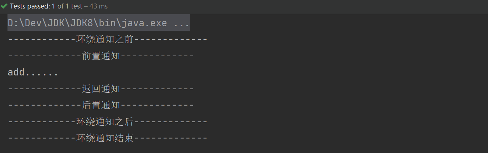

## 各种通知（Advice）

### 各种通知注解

- 前置通知：使用 @Before 注解标识，在被代理的目标方法前执行
- 返回通知：使用 @AfterReturning 注解标识，在被代理的目标方法成功结束后执行
- 异常通知：使用 @AfterThrowing 注解标识，在被代理的目标方法异常结束后执行
- 后置通知：使用 @After 注解标识，在被代理的目标方法最终结束后执行
- 环绕通知：使用 @Around 注解标识，使用 try...catch...finally 结构围绕整个被代理的目标方法，包括上面四种通知对应的所有位置

### 各种通知执行顺序

- Spring 版本 5.3.x 以前：
  - 前置通知
  - 目标操作
  - 后置通知
  - 返回通知或异常通知
- Spring 版本 5.3.x 以后：
  - 前置通知
  - 目标操作
  - 返回通知或异常通知
  - 后置通知

## 切入点表达式语法

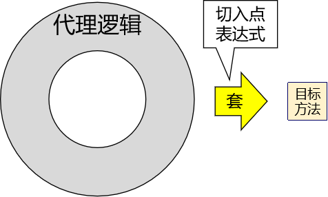


### 语法细节

```java
execution([权限表达式][返回类型][类全路径][方法名称]([参数列表]))
execution(* com.cj.spring.aop.dao.BookDao.*(..)) // 对类下所有方法增强
execution(* com.cj.spring.aop.dao.*.*(..)) // 对包下所有方法增强
execution(* com.cj.spring.aop.aspectj.UserTarget.add(..))// 对 add() 方法增强
```

#### 固定格式

`execution`

#### 权限修饰符和返回值

用*号代替“权限修饰符”和“返回值”,表示支持所有的权限和返回值。

如果想要明确指定一个返回值类型，那么必须同时写明权限修饰符

- 例如：`execution(public int *..*Service.*(.., int))`正确
- 例如：`execution(* int *..*Service.*(.., int))`错误

#### 包名部分

一个“*”号只能代表包的层次结构中的一层，表示这一层是任意的。

- 例如：*.Hello 匹配 com.Hello，不匹配 com.cj.Hello

使用“*..”表示包名任意、包的层次深度任意

#### 类名部分

类名部分整体用*号代替，表示类名任意

可以使用*号代替类名的一部分

- 例如：*Service 匹配所有名称以 Service 结尾的类或接口

#### 方法名部分

可以使用*号表示方法名任意

可以使用*号代替方法名的一部分
- 例如：*Operation 匹配所有方法名以 Operation 结尾的方法

#### 方法参数列表部分

使用 (..) 表示参数列表任意

使用 (int,..) 表示参数列表以一个 int 类型的参数开头

基本数据类型和对应的包装类型是不一样的
- 切入点表达式中使用 int 和实际方法中 Integer 是不匹配的


### 重用切入点表达式

```java
//代理类
@Component
@Aspect //生成代理对象 @Aspect 表示这个类是一个切面类
public class UserProxy {

    //重用切入点表达式
    @Pointcut("execution(* com.cj.spring.aop.aspectj.UserTarget.add(..))")
    public void common() {
    }

    @Before("common()")
    public void before() {
        System.out.println("-------------前置通知-------------");
    }
}
```

## 切面的优先级

相同目标方法上同时存在多个切面时，切面的优先级控制切面的**内外嵌套**顺序。

- 优先级高的切面：外面
- 优先级低的切面：里面

### @Order() 注解

使用 @Order 注解可以控制切面的优先级：

- @Order(较小的数)：优先级高
- @Order(较大的数)：优先级低


## 基于 XML 的 AOP

### 配置文件

```xml
<?xml version="1.0" encoding="UTF-8"?>
<beans xmlns="http://www.springframework.org/schema/beans"
       xmlns:xsi="http://www.w3.org/2001/XMLSchema-instance"
       xmlns:aop="http://www.springframework.org/schema/aop"
       xmlns:context="http://www.springframework.org/schema/context"
       xsi:schemaLocation="http://www.springframework.org/schema/beans
                            http://www.springframework.org/schema/beans/spring-beans-3.0.xsd
                            http://www.springframework.org/schema/aop
                            http://www.springframework.org/schema/aop/spring-aop-3.0.xsd
                            http://www.springframework.org/schema/context
                            http://www.springframework.org/schema/context/spring-context-3.0.xsd">

    <!--注解扫描器-->
    <context:component-scan base-package="com.cj.spring"/>

    <!--开启Aspect-->
    <aop:aspectj-autoproxy />

    <aop:config>
        <!--切面-->
        <aop:aspect ref="userProxy4xml">
            <!--切入点-->
            <aop:pointcut id="p" expression="execution(* com.cj.spring.aop.xml.UserTarget4xml.del(..))"/>
            <!--增强作用在具体的方法上-->
            <aop:before method="before4xml" pointcut-ref="p"/>
            <aop:after method="afterReturning4xml" pointcut-ref="p"/>
            <aop:after-returning method="afterThrowing4xml" pointcut-ref="p"/>
            <aop:after-throwing method="after4xml" pointcut-ref="p"/>
            <aop:around method="around4xml" pointcut-ref="p"/>
        </aop:aspect>

    </aop:config>


</beans>
```

### 被代理类

```java
@Component
public class UserTarget4xml {
    public void del() {
        System.out.println("......del......");
    }
}
```

### 代理类

```java
@Component
public class UserProxy4xml {
    public void before4xml() {
        System.out.println("前置通知 4xml");
    }

    public void afterReturning4xml() {
        System.out.println("返回通知 4xml");
    }

    public void afterThrowing4xml() {
        System.out.println("异常通知 4xml");
    }

    public void after4xml() {
        System.out.println("后置通知 4xml");
    }

    public void around4xml(ProceedingJoinPoint proceedingJoinPoint) {
        try {
            System.out.println("------------环绕通知之前-------------");
            proceedingJoinPoint.proceed();
            System.out.println("------------环绕通知之后-------------");
        } catch (Throwable e) {
            e.printStackTrace();
        } finally {
            System.out.println("------------环绕通知结束-------------");
        }
    }
}
```

### 测试类

```java
// junit5
@ExtendWith(SpringExtension.class)
@ContextConfiguration("classpath:bean.xml")
public class User4XmlTest {
    @Autowired
    private UserTarget4xml userTarget4xml;

    @Test
    public void test01() {
        userTarget4xml.del();
    }
}
```

运行结果：

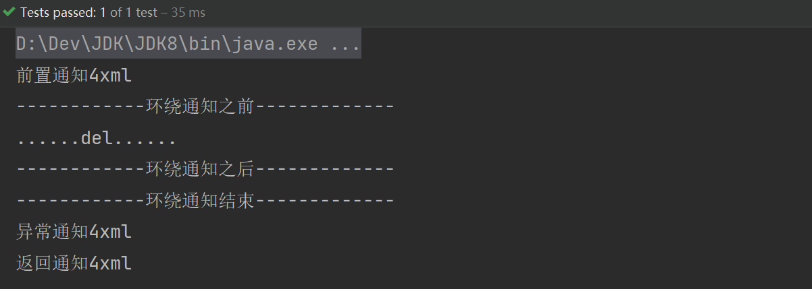

## 推荐阅读

[AOP 避坑指南](https://www.liaoxuefeng.com/wiki/1252599548343744/1339039378571298)
