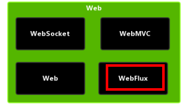
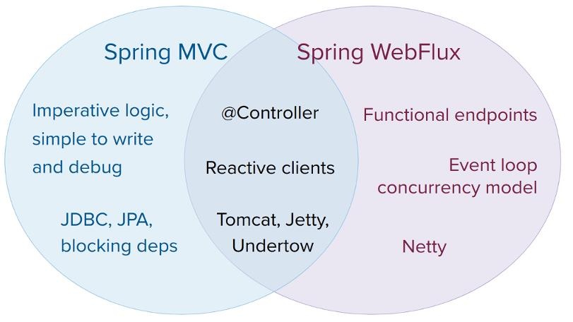

# Spring5 新功能介绍

## Spring Webflux 介绍

1. SpringWebflux 是 Spring5 添加新的模块，用于 web 开发的，功能和 SpringMVC 类似的，Webflux 使用当前一种比较流行响应式编程出现的框架。

   

2. 使用传统 web 框架，比如 SpringMVC，这些基于 Servlet 容器，Webflux 是一种异步非阻塞的框架，异步非阻塞的框架在 Servlet3.1 以后才支持，核心是基于 Reactor 的相关 API 实现的。

3. 什么是异步非阻塞
   + **异步和同步**针对调用者，调用者发送请求，如果等着对方回应之后才去做其他事情就是同步，如果发送请求之后不等着对方回应就去做其他事情就是异步。
   + **阻塞和非阻塞**针对被调用者，被调用者收到请求之后，做完了请求任务才给出反馈，收到请求之后马上给出反馈然后再去做事情就是非阻塞。

4. Webflux 特点：
   - 非阻塞式：在有限资源下，提高系统吞吐量和伸缩性，以 Reactor 为基础实现响应式编程
   - 函数式编程：Spring5 框架基于 java8，Webflux 使用 Java8 函数式编程方式实现路由请求

5. 与 SpringMVC 比较

   

+ 两个框架都可以使用注解方式，都运行在 Tomet 等容器中
+ SpringMVC 采用命令式编程，Webflux 采用异步响应式编程

## 响应式编程（Java 实现）

### 什么是响应式编程

响应式编程是一种面向数据流和变化传播的编程范式。这意味着可以在编程语言中很方便地表达静态或动态的数据流，而相关的计算模型会自动将变化的值通过数据流进行传播。电子表格程序就是响应式编程的一个例子。单元格可以包含字面值或类似 "=B1+C1" 的公式，而包含公式的单元格的值会依据其他单元格的值的变化而变化。

### Java8 及其之前版本

提供的观察者模式两个类 Observer 和 Observable

```java
public class ObserverDemo extends Observable {
    public static void main(String[] args) {
        ObserverDemo observerDemo = new ObserverDemo();
        // 添加观察者
        observerDemo.addObserver((o,arg)->{
            System.out.println("发生了变化");
        });
        // 添加观察者
        observerDemo.addObserver((o,arg)->{
            System.out.println("收到被观察者通知，准备改变");
        });
        observerDemo.setChanged();//数据变化
        observerDemo.notifyObservers();//通知
    }
}
```

```java
被观察者通知，发生改变
发生变化
```

## Spring5 其他新功能

[Spring 5.x 新特性](https://juejin.cn/post/6844903776675954695)
