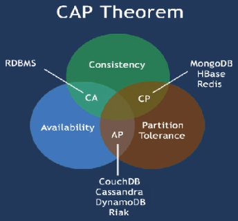
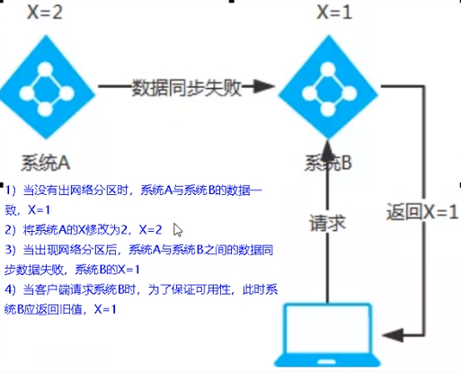
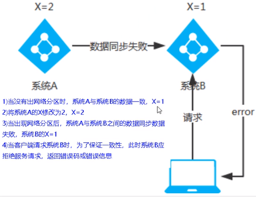

# Consul 服务注册与发现

## 1、Consul 简介

Consul 是一套开源的分布式服务发现和配置管理系统，由 HashiCorp 公司用 Go 语言开发。

提供了微服务系统中的服务治理、配置中心、控制总线等功能。这些功能中的每一个都可以根据需要单独使用，也可以一起使用以构建全方位的服务网格，总之 Consul 提供了一种完整的服务网格解决方案。

它具有很多优点。包括：基于 raft 协议，比较简洁；支持健康检查，同时支持 HTTP 和 DNS 协议支持跨数据中心的 WAN 集群提供图形界面跨平台，支持 Linux、Mac、Windows。

**能干吗？**

- 服务发现 - 提供 HTTP 和 DNS 两种发现方式。
- 健康监测 - 支持多种方式，HTTP、TCP、Docker、Shell 脚本定制化
- KV 存储 - Key、Value 的存储方式
- 多数据中心 - Consul 支持多数据中心
- 可视化 Web 界面

## 2、服务注册进 Consul

```yml
spring:
  application:
    name: cloud-consul-provider-payment
  # consul 注册中心地址
  cloud:
    consul:
      host: localhost
      port: 8500
      discovery:
        service-name: ${spring.application.name}
```

# 五、三个注册中心异同点

## 1、异同点

| 组件名    | 语言 CAP | 服务健康检查 | 对外暴露接口 | Spring Cloud 集成 |
| --------- | ------- | ------------ | ------------ | ---------------- |
| Eureka    | Java    | AP           | 可配支持     | HTTP             |
| Consul    | Go      | CP           | 支持         | HTTP/DNS         |
| Zookeeper | Java    | CP           | 支持客户端   | 已集成           |

## 2、CAP 理论

C：Consistency (强一致性)

A：Availability (可用性)

P：Partition tolerance（分区容错性)



最多只能同时较好的满足两个。

CAP 理论的核心是：一个分布式系统不可能同时很好的满足一致性，可用性和分区容错性这三个需求。

因此，根据 CAP 原理将 NoSQL 数据库分成了满足 CA 原则、满足 CP 原则和满足 AP 原则三大类：

- CA - 单点集群，满足—致性，可用性的系统，通常在可扩展性上不太强大。
- CP - 满足一致性，分区容忍必的系统，通常性能不是特别高。
- AP - 满足可用性，分区容忍性的系统，通常可能对一致性要求低一些。

**AP 架构（Eureka）**

当网络分区出现后，为了保证可用性，系统 B 可以返回旧值，保证系统的可用性。

结论：违背了一致性 C 的要求，只满足可用性和分区容错，即 AP



**CP 架构（ZooKeeper/Consul）**

当网络分区出现后，为了保证一致性，就必须拒接请求，否则无法保证一致性。

结论：违背了可用性 A 的要求，只满足一致性和分区容错，即 CP。



CP 与 AP 对立同一的矛盾关系。


CAP 理论的一个例子。开学了，你和同桌互对寒假作业答案，对到一半同桌去了厕所，恰好老师进来要收作业，你决定：AP【交就交吧，有错也无所谓了，交作业要紧】；CP【等同桌回来，把答案对完再交，满分要紧】

# 
