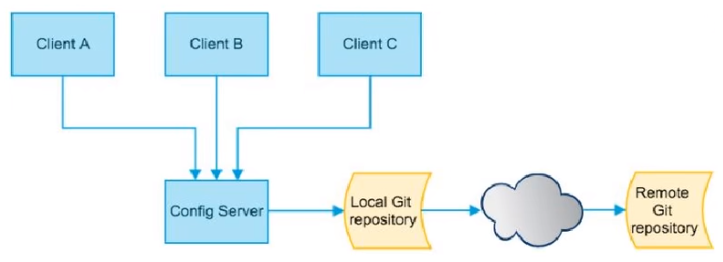

# Config 分布式配置中心介绍

## 1、分布式系统面临的配置问题

微服务意味着要将单体应用中的业务拆分成一个个子服务，每个服务的粒度相对较小，因此系统中会出现大量的服务。由于每个服务都需要必要的配置信息才能运行，所以一套集中式的、动态的配置管理设施是必不可少的。

SpringCloud 提供了 ConfigServer 来解决这个问题，我们每一个微服务自己带着一个 application.yml，上百个配置文件的管理.……



SpringCloud Config 为微服务架构中的微服务提供集中化的外部配置支持，配置服务器为各个不同微服务应用的所有环境提供了一个中心化的外部配置。

## 2、如何配置 Config

SpringCloud Config 分为服务端和客户端两部分。

- 服务端也称为分布式配置中心，它是一个独立的微服务应用，用来连接配置服务器并为客户端提供获取配置信息，加密/解密信息等访问接口。
- 客户端则是通过指定的配置中心来管理应用资源，以及与业务相关的配置内容，并在启动的时候从配置中心获取和加载配置信息配置服务器默认采用 git 来存储配置信息，这样就有助于对环境配置进行版本管理，并且可以通过 git 客户端工具来方便的管理和访问配置内容。

## 3、Config 功能

- 集中管理配置文件
- 不同环境不同配置，动态化的配置更新，分环境部署比如 dev/test/prod/beta/release
- 运行期间动态调整配置，不再需要在每个服务部署的机器上编写配置文件，服务会向配置中心统一拉取配置自己的信息
- 当配置发生变动时，服务不需要重启即可感知到配置的变化并应用新的配置
- 将配置信息以 REST 接口的形式暴露 - post/crul访问刷新即可…

**与 GitHub 整合配置**

由于 SpringCloud Config 默认使用 Git 来存储配置文件 (也有其它方式，比如支持 SVN 和本地文件)，但最推荐的还是 Git，而且使用的是 http/https 访问的形式。

## 4、**配置读取规则**

/{label}/{application}-{profile}.yml（推荐）

master 分支

- http://config-3344.com:3344/master/config-dev.yml
- http://config-3344.com:3344/master/config-test.yml
- http://config-3344.com:3344/master/config-prod.yml

dev 分支

- http://config-3344.com:3344/dev/config-dev.yml
- http://config-3344.com:3344/dev/config-test.yml
- http://config-3344.com:3344/dev/config-prod.yml

## 5, bootstrap.yml

applicaiton.yml 是用户级的资源配置项

bootstrap.yml 是系统级的，优先级更加高

Spring Cloud 会创建一个 Bootstrap Context，作为 Spring 应用的 Application Context 的父上下文。

初始化的时候，BootstrapContext 负责从外部源加载配置属性并解析配置。这两个上下文共享一个从外部获取的 Environment。

Bootstrap 属性有高优先级，默认情况下，它们不会被本地配置覆盖。Bootstrap context 和 Application Context 有着不同的约定，所以新增了一个 bootstrap.yml 文件，保证 Bootstrap Context 和 Application Context 配置的分离。

要将 Client 模块下的 application.yml 文件改为 bootstrap.yml，这是很关键的，因为 bootstrap.yml 是比 application.yml 先加载的。bootstrap.yml 优先级高于 application.yml。

## 6、分布式配置的动态刷新问题

- inux 运维修改 GitHub 上的配置文件内容做调整
- 刷新 3344，发现 ConfigServer 配置中心立刻响应
- 刷新 3355，发现 ConfigClient 客户端没有任何响应
- 3355 没有变化除非自己重启或者重新加载
- 难到每次运维修改配置文件，客户端都需要重启

## 7、Config 动态刷新之手动版

```curl
curl -X POST "http://localhost:3355/actuator/refresh"
```

# 

