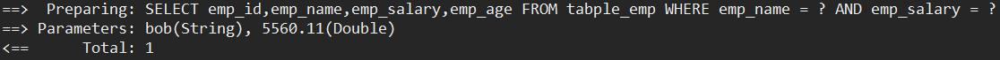
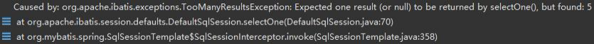
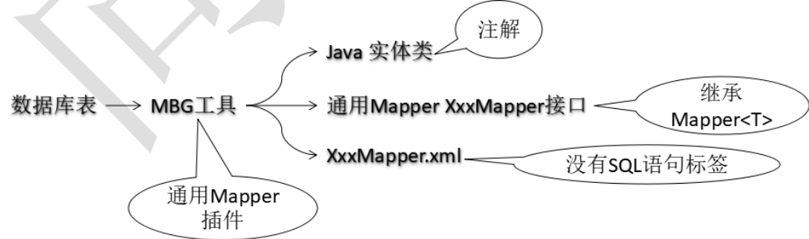
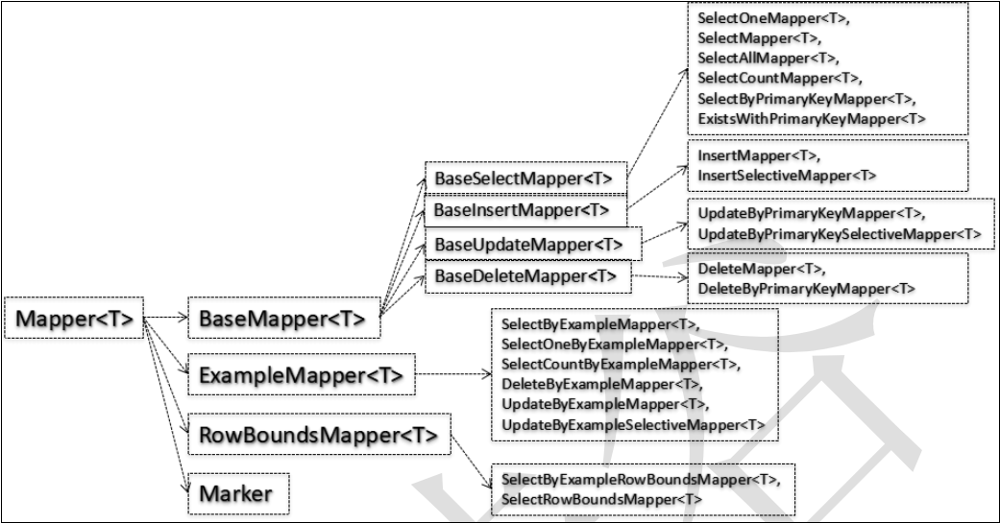

# 通用 Mapper

## 引入

### 作用

替我们生成常用增删改查操作的 SQL 语句。

### 代码官方发布地址

[https://gitee.com/free](https://gitee.com/free)

[https://gitee.com/free/Mapper/wikis/1.1-java?parent=1.integration](https://gitee.com/free/Mapper/wikis/1.1-java?parent=1.integration)

## 快速入门

### 创建测试数据

#### sql 语句

```sql
CREATE TABLE `table_emp` (
    `emp_id` int NOT NULL AUTO_INCREMENT ,
    `emp_name` varchar(500) NULL ,
    `emp_salary` double(15,5) NULL , 
    `emp_age` int NULL ,
    PRIMARY KEY (`emp_id`)
);

INSERT INTO `table_emp` (`emp_name`, `emp_salary`, `emp_age`) VALUES ('tom', '1254.37', '27');
INSERT INTO `table_emp` (`emp_name`, `emp_salary`, `emp_age`) VALUES ('jerry', '6635.42', '38');
INSERT INTO `table_emp` (`emp_name`, `emp_salary`, `emp_age`) VALUES ('bob', '5560.11', '40');
INSERT INTO `table_emp` (`emp_name`, `emp_salary`, `emp_age`) VALUES ('kate', '2209.11', '22');
INSERT INTO `table_emp` (`emp_name`, `emp_salary`, `emp_age`) VALUES ('justin', '4203.15', '30');
```

#### Java 实体类

考虑到基本数据类型在 Java 类中都有默认值，会导致 MyBatis 在执行相关操作时很难判断当前字段是否为 null，所以在 MyBatis 环境下使用 Java 实体类时尽量不要使用基本数据类型，都使用对应的包装类型。

```java
@Repository
@Data
@AllArgsConstructor
@NoArgsConstructor
public class Employee {
    private Integer id;
    private String empName;
    private Double empSalary;
    private Integer empAge;
}
```

### 搭建 MyBatis+Spring 开发环境

 [11.MyBatis-plus 整合 Spring.md](..\02.MyBatis-Plus\11.MyBatis-plus 整合 Spring.md) 

### 集成 Mapper

加入 Maven 依赖信息

```xml
<dependency>
    <groupId>tk.mybatis</groupId>
    <artifactId>mapper</artifactId>
    <version>4.0.0-beta3</version>
</dependency>
```

修改 Spring 配置文件

```xml
<!-- 整合通用Mapper所需要做的配置修改： -->
<!-- 原始全类名：org.mybatis.spring.mapper.MapperScannerConfigurer -->
<!-- 通用Mapper使用：tk.mybatis.spring.mapper.MapperScannerConfigurer -->
<bean class="tk.mybatis.spring.mapper.MapperScannerConfigurer">
    <property name="basePackage" value="com.cj.tkmapper.mapper"/>
</bean>
```

### Mapper 接口

```java
/**
 * 具体操作数据库的 mapper 接口
 * 需要继承通用 Mapper 提供的核心接口：Mapper<Employee>
 */
public interface EmployeeMapper extends Mapper<Employee> {

}
```

## 常用注解

### @Table 注解

作用：建立实体类和数据库表之间的对应关系。

默认规则：实体类类名首字母小写作为表名。`Employee 类映射 employee 表`。

用法：在@Table 注解的 name 属性中指定目标数据库表的表名

```java
@Table(name = "table_emp")
public class Employee {
    private Integer id;
    private String empName;
    private Double empSalary;
    private Integer empAge;
}
```

### @Column 注解

作用：建立实体类字段和数据库表字段之间的对应关系。

默认规则：

- 实体类字段：驼峰式命名
- 数据库表字段：使用"_"区分各个单词

用法：在@Column 注解的 name 属性中指定目标字段的字段名

```java
@Column(name = "emp_id")
private Integer id; //表中是 emp_id
```

### @Id 注解

通用 Mapper 在执行 xxxByPrimaryKey(key) 方法时，有两种情况。

情况 1：没有使用 @Id 注解明确指定主键字段

```sql
SELECT emp_id,emp_name,emp_salary_apple,emp_age FROM table_emp WHERE emp_id = ? AND emp_name = ? AND emp_salary_apple = ? AND emp_age = ?
```

之所以会生成上面这样的 WHERE 子句是因为通用 Mapper 将实体类中的所有字段都拿来放在一起作为联合主键。

情况 2：使用@Id 主键明确标记和数据库表中主键字段对应的实体类字段。

```java
@Id
private Integer id;//emp_id
```

### @GeneratedValue 注解

作用：让通用 Mapper 在执行 insert 操作之后将数据库自动生成的主键值回写到实体类对象中。

自增主键用法：

```java
@Id
@GeneratedValue(strategy = GenerationType.IDENTITY) //策略
private Integer id;//emp_id
```

序列主键用法：(Oracle)

```java
@Id
@GeneratedValue(
    strategy = GenerationType.IDENTITY,
    generator = "select SEQ_ID.nextval from dual") //策略
private Integer id;//emp_id
```

应用场景：购物车结账

- 增加商品销量... 
- 减少商品库存... 
- 生成订单数据→封装到 Order 对象中→保存 Order 对象→数据库自动生成主键值→回写到实体类对象 Order 中
- 生成一系列订单详情数据→`List<OrderItem>`→在每一个 OrderItem 中设置 Order 对象的主键值作为外键→批量保存 `List<OrderItem>` ……

### @Transient 注解

用于标记不与数据库表字段对应的实体类字段。

```java
@Transient
private String otherThings; //非数据库表中字段
```

## 常用方法

### **selectOne** **方法**

通用 Mapper 替我们自动生成的 SQL 语句情况



实体类封装查询条件生成 WHERE 子句的规则

- 使用非空的值生成 WHERE 子句

- 在条件表达式中使用"="进行比较

要求必须返回一个实体类结果，如果有多个，则会抛出异常



### xxxByPrimaryKey 方法

需要使用 @Id 主键明确标记和数据库表主键字段对应的实体类字段，否则通用 Mapper 会将所有实体类字段作为联合主键。

### xxxSelective 方法

非主键字段如果为 null 值，则不加入到 SQL 语句中。

## QBC 查询

### 概念

Query By Criteria

Criteria 是 Criterion 的复数形式。意思是：规则、标准、准则。在 SQL 语句中相当于查询条件。

QBC 查询是将查询条件通过 Java 对象进行模块化封装。

### 示例代码

```java
/**
 * qbc 条件查询
 */
@Test
public void selectByExample() {
    //创建 Example 对象
    //select * from xxx where (emp_salary>? and emp_age<?) or (emp_salary<? and emp_age>?)
    Example example = new Example(Employee.class);
    //******************************************
    //设置排序信息
    example.orderBy("empName").asc().orderBy("empSalary").desc();
    //设置去重
    example.setDistinct(true);
    //设置 select 字段
    example.selectProperties("empName", "empSalary");
    Example.Criteria criteria1 = example.createCriteria();
    Example.Criteria criteria2 = example.createCriteria();
    criteria1.andGreaterThan("empSalary", 3000.00) //大于
            .andEqualTo("empAge", 25); //等于
    criteria2.andGreaterThan("empSalary", 5000.00) //大于
            .andGreaterThan("empAge", 29);
    //or 组装两个查询条件，很奇怪
    example.or(criteria2);
    //执行查询
    List<Employee> employeeList = employeeService.getEmpListByExample(example);
    employeeList.forEach(System.out::println);
}
```

## 逆向工程

### 原生 MyBatis 逆向工程和通用 Mapper 逆向工程对比



## 自定义 `Mapper<T>` 接口



### 用途

让我们可以根据开发的实际需要对 `Mapper<T>` 接口进行定制。

### 创建自定义 `Mapper<T>`接口

```java
public interface MyMapper<T> extends SelectAllMapper<T>, SelectByExampleMapper<T> {
    
}
```

```java
public interface EmployeeMapper extends MyMapper<Employee> {
    
}
```

### 配置 MapperScannerConfigurer 注册 `MyMapper<T>`

```xml
<bean class="tk.mybatis.spring.mapper.MapperScannerConfigurer">
    <property name="basePackage" value="com.cj.mapper"/>
    <!--配置自定义mapper-->
    <property name="properties">
        <value>mapper=com.cj.mapper.MyMapper</value>
    </property>
</bean>
```

## 二级缓存

### MyBatis 配置文件开启二级缓存功能

```xml
<settings>
	<setting name="cacheEnabled" value="true"/>
</settings>
```

### 在 XxxMapper 接口上使用 @CacheNamespace 注解

```java
@CacheNamespace
public interface EmployeeMapper extends MyMapper<Employee> {
    
}
```
